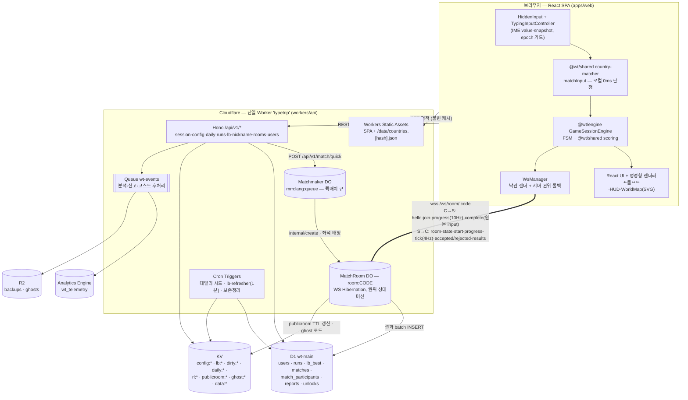
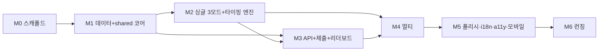

# 00. 마스터 개요 & 로드맵

> 프로젝트 코드네임: **WORLD TYPING** / 문서 버전: v1.0 (2026-07-21) / 담당: 리드 아키텍트
> 이 문서는 docs/01~06 전체를 통제하는 **최상위 마스터 문서**다. 하위 문서와 본 문서가 상충하면 **본 문서(특히 §11의 확정 결정 표)가 항상 우선**한다. 하위 문서 간 상충은 §11에서 전부 해소했으며, 구현 에이전트는 코드에서 임의 해석하지 말고 §11을 따른다.

---

## 0. 문서의 지위와 권위 순서

1. **docs/00 (본 문서)** — 스코프 계약, 모순 해소, 로드맵. 전 문서에 우선.
2. 도메인 담당 문서 — 각 영역의 권위: 게임 규칙·점수 = 01, 데이터·매칭 = 02, 클라이언트·IME = 03, 인프라·REST API·세션 = 04, 멀티 WS 프로토콜 = 05, 랭킹·안티치트 운영·프라이버시·성장 = 06.
3. 담당 밖 문서가 타 영역을 언급한 내용(예: 04의 리더보드 스키마)은 **참고 정보**이며, 담당 문서(06)와 다르면 담당 문서가 이긴다. 그 판정 결과는 §11에 명문화되어 있다.

---

## 1. 이그제큐티브 요약 / 제품 비전 / 타깃 / 성공 지표

### 1.1 이그제큐티브 요약

- **무엇을**: METRO TYPING(서울 지하철역 타이핑 게임)의 검증된 재미 구조 — 익숙한 고유명사의 나열, "완주"라는 명확한 목표, 타수/정확도라는 자랑 가능한 숫자, 링크 하나로 즉시 실행 — 를 계승해 소재를 "세계 지도 위의 국가 이름"으로 바꾼 웹 브라우저 타이핑 레이스 게임을 만든다.
- **왜**: 국가 이름은 한국어/영어 양측 시장에서 동일 콘텐츠로 성립하는 전 세계 공통 상식이며(글로벌 확장성), "타자 연습 + 세계지리"라는 교육적 알리바이로 공유 맥락이 넓고, "프랑스 → 키리바시"라는 난이도 곡선이 콘텐츠에 내장되어 있다.
- **어떻게**: 프론트는 React SPA + 프레임워크 밖에서 도는 자체 타이핑 엔진(한글 IME 자모 프리픽스 판정), 백엔드는 Cloudflare 전면(Workers + Hono, Durable Objects + WebSocket Hibernation, D1, KV). 클라이언트와 서버가 `packages/shared`의 **동일한 매칭·점수 코드를 번들**하므로 판정 불일치가 구조적으로 불가능하다.
- **언제**: M0~M6 7단계 로드맵, 총 개략 10.5주(에이전트 병렬 시 ~7주). v1은 싱글 3모드 + 데일리 + 멀티 실시간 레이스 + 랭킹 전체를 한 번에 런칭한다.
- **비용**: 10,000 DAU 기준 월 ~$15 (Workers Paid 포함, 04 §9). 100k DAU까지 아키텍처 변경 없이 요금만 선형 증가.

### 1.2 제품 비전 (한 문장)

**"지하철 노선도 대신 세계 지도를 타이핑으로 완주하는, 3분짜리 바이럴 웹 타이핑 레이스."**

### 1.3 타깃 유저 (01 §1.2 요약)

| 세그먼트 | 설명 | 핵심 대응 기능 |
|---|---|---|
| P0 코어 (15~29세 SNS 유저) | 릴스/Threads/X에서 타이핑 챌린지 접함 | 결과 카드 공유, 랭킹, 멀티 레이스 |
| P1 타자 연습층 | 한컴타자·monkeytype 기존 유저 | 티어 모드, 데일리, CPM 기록 추적 |
| P2 지리 퀴즈층 | Seterra/GeoGuessr 팬 | 지도 하이라이트, 세계일주, 업적 |
| P3 라이트 유입 | 링크 타고 온 1회성 방문자 | 로그인 없는 즉시 플레이, 최단 경로 3클릭·15초 내 첫 타이핑(§11-D36) |

기기: 데스크톱 1차, 모바일 2차(단 SNS 유입 특성상 모바일 트래픽 60%+ 가정, 플랫폼 분리 랭킹). 계정: 비로그인 100% 플레이 가능(플레이 한정 — 랭킹 등재·멀티는 Google 로그인 필수, §11-D68).

### 1.4 성공 지표

**노스스타: WCR (Weekly Completed Runs) — 주간 완주 판 수** (06 §5.4).

| 구분 | 지표 | 목표 (런칭 분기) |
|---|---|---|
| 퍼널 | 방문→첫 시작 / 시작→완주 / 완주→공유 클릭 | 70% / 55% / 8% |
| 리텐션 | D1 / D7 / 데일리 참여율(DAU 대비) | 25% / 12% / 35% |
| 바이럴 | K-factor 근사 (공유발 신규 visit ÷ WAU) | 0.15+ |
| 멀티 | 매치 성사율 / 평균 매칭 대기 | 90%+ / <12s |
| 무결성 | flagged+rejected 비율 | <0.5% |
| 기술 SLO | API 가용성 / 제출 p95 / LB 첫 페이지 p95 / 멀티 tick E2E p95 | 99.9% / <250ms / <100ms / <400ms |
| 클라 성능 | 입력 반영 지연 p95 / entry JS / LCP(모바일) | <16ms / <170KB gzip / <2.5s |

---

## 2. 게임 이름 확정

> **[확정] 런칭명: 타입트립 (TypeTrip)** — 01 §1.4의 1순위안을 그대로 확정한다.

- **한글 태그라인**: "타이핑으로 떠나는 세계일주"
- **영문 태그라인**: "Type your way around the world."
- 코드네임 `WORLD TYPING`은 저장소·문서에서 유지한다. 사용자 노출 문자열(타이틀, OG, 공유 텍스트)만 TypeTrip을 쓴다.
- 도메인: **typetrip.gg 1순위**(대안: typetrip.kr, typetrip.app). 04·06 문서의 `worldtyping.gg`는 전부 **플레이스홀더**다. 코드에서는 오리진을 하드코딩하지 않고 환경 변수 `PUBLIC_ORIGIN`으로 추상화한다(§7) — 도메인 최종 확정(M0 중 상표/도메인 조사, §11 오픈 퀘스천 Q1)이 늦어져도 구현이 블로킹되지 않는다.
- npm 스코프는 `@wt/*`로 통일한다(03의 `@wt/data`와 05의 `@worldtyping/data` 표기 불일치 → `@wt/*` 확정).

---

## 3. v1 기능 목록 (스코프 계약)

### 3.1 포함

| 기둥 | 기능 | 사양 출처 |
|---|---|---|
| 싱글 (a) 대륙별 | 6개 노선(asia 47 / europe 45 / africa 54 / north-america 23 / south-america 12 / oceania 14 = **un195**), 고정 순서, 타임어택 | 01 §3.1, 02 §5 |
| 싱글 (b) 티어별 | T1~T5 서바이벌(라이프 3, 국가당 제한시간 01 §7.2), 1런 20개국, **일일 고정 시드**(전 유저 동일 세트, §11-D5) | 01 §3.2, 02 §4 |
| 싱글 (c) 세계일주 | **50개국** 마라톤(§11-D2), 체크포인트 10개국 간격(10/20/30/40 + 종착), 라이프 3 + 이어하기 1회 | 02 §6, 01 §3.3 |
| 데일리 챌린지 | 매일 KST 00:00, 10개국(T1×3+T2×3+T3×2+T4×1+T5×1), 라이프 1, 1일 1회 등재, 이모지 그리드 공유, 스트릭 | 01 §9.1, 06 §2 |
| 멀티 | 실시간 레이스 2~8인, 15개국(T1×6+T2×5+T3×4), 퀵매치+코드 방+공개 방 목록, 하드캡 180s, 리매치, 고스트 봇, 재접속(grace 15s) | 05 전체 |
| 랭킹 | `lb_best` 기반, 기간(일간/주간/전체) × 모드 × lang(ko/en) × platform(desktop/mobile), 지역 필터(geo), 멀티 MMR 보드(alltime만, §11-D15), keyset 페이지네이션, 내 순위/백분위 | 06 §1 |
| 신원/프로필 | 익명 디바이스 신원(HMAC 파생 저장, §11-D10), 닉네임(2~12자, 모더레이션), 여권 커버 12종, 스탬프, 업적 24종, 고스트 모드(자기 기록 대결) | 06 §4, 01 §9 |
| 무결성 | runToken 서명, 서버 재계산, 물리 한계 검사, 입력 리듬 통계, shadow-ban, 신고 플로우 | 04 §6, 06 §3 |
| 공유/성장 | 결과 카드(클라 캡처 + 서버 OG `/r/:shareId`), 방 초대 링크, 데일리 텍스트 공유, UTM 계측 | 06 §9 |
| 플랫폼 | ko/en (UI+입력 통합 전환, §11-D6), PWA 오프라인 싱글, 접근성(wcag2aa), 모바일 소프트 키보드 대응 | 03 §7·§8 |
| 운영 | 텔레메트리(AE), 알림/헬스체크, D1 백업, 런북, privacy 페이지 + 열람/삭제 API | 06 §5·§6·§8 |

### 3.2 명시적 제외 (백로그)

퀴즈 모드(국기/지도만 보고 맞히기), 음절 타일 모바일 대안 입력, 수도 확장 팩, **시즌제/배틀패스(스키마의 `s:{seasonId}` periodKey만 예약, v1 UI·운영 미노출 — §11-D15)**, 언어별 티어 분리, 관전 전용 링크, 수익화·광고 전체(06 §7), 소셜 로그인(04 §5.4 스키마 대비만), 어드민 대시보드(읽기 전용 쿼리 세트로 대체), PI 밴드 매칭, 세션 리플레이 도구, extended 세트(TW/XK/EH) 출제.

---

## 4. 시스템 아키텍처



**핵심 데이터 흐름 3계약**:

1. **타이핑 핫패스는 전부 로컬**: keystroke → `country-matcher`(자모 프리픽스) → 엔진 → 명령형 DOM 갱신. React state·네트워크는 이 경로에 개입하지 않는다(03 §4.5 불변식). 입력 반영 지연 p95 < 16ms.
2. **싱글 = 제출 시 서버 재계산**: `/runs/start`가 서명 runToken(+서버 확정 세트)을 발급 → 플레이 → `/runs/submit`에서 04 §6.2 검증 파이프라인(리플레이/시간 봉투/세트/매칭 재실행/물리 한계/재계산) 통과분만 `lb_best` UPSERT → KV dirty 마킹 → 1분 Cron이 top100 캐시 갱신.
3. **멀티 = DO 100% 권위**: 클라는 `complete{idx, input 원문}`만 보내고 점수·시각·순위를 절대 보내지 않는다. MatchRoom이 동일 `matchInput`을 재실행해 승인/거부하고, 250ms `progress-tick`으로 전파. 최종 순위·PI는 `results` 페이로드만이 진실.

---

## 5. 기술 스택

| 레이어 | 선택 | 이유 (요약, 상세는 담당 문서) |
|---|---|---|
| 빌드 | Vite ^5 + `vite-plugin-pwa` | HMR, manualChunks로 코드 스플리팅 예산 제어 (03 §1) |
| UI | React 18 + TypeScript 5 strict | 비핫패스 UI(전체 코드 70%)의 생산성. 핫패스는 프레임워크 밖 명령형 |
| 상태 | Zustand ^4 (4분할 스토어) | React 외부 일반 객체 → 프레임워크 독립 엔진과 자연 결합, 고빈도 값은 스토어 금지 |
| 스타일 | Tailwind CSS ^3.4 + CSS 변수 토큰 | 대륙 6색·등급색 토큰 일원화, 런타임 CSS-in-JS 금지 |
| 지도 | d3-geo + topojson-client + 자체 SVG 래퍼(~200줄) | path `d` 1회 사전계산·동결, 리렌더 0 계약. react-simple-maps 기각 (03 §1.2) |
| 타이핑 엔진 | 자체 `@wt/engine` + `@wt/shared/country-matcher` | 클라·서버 단일 판정 코드. es-hangul은 테스트 오라클로만 |
| i18n | i18next + react-i18next | 02 §9 평면 카탈로그 호환 (§11-D20) |
| SPA 호스팅 | **Workers Static Assets** (Pages 아님) | API와 단일 배포 단위·버전 원자성, CORS 소멸, DO 1급 시민 (04 §1.1) |
| API | Workers + Hono v4 + zod `.strict()` | 경량, DO/WS 라우팅 자연 결합 |
| 실시간 | Durable Objects + WebSocket Hibernation | 방당 1 DO = 단일 스레드 권위 서버, 유휴 과금 제거 |
| DB | D1 (SQLite) | runs 원장 + lb_best materialized + matches. 리더보드 읽기는 KV 뒤 |
| 캐시/설정 | KV (단일 네임스페이스, 키 프리픽스 운용) | config 핫스왑, lb top100, 데일리 시드, 레이트리밋, 데이터 핫스왑 |
| 비동기/저장 | Queues(`wt-events`) / R2 / Cron / Analytics Engine | 분석·신고·고스트 후처리 / 백업·고스트 blob / 시드·집계·정리 / 텔레메트리 |
| 테스트 | Vitest(+vitest-pool-workers) / Playwright(CDP IME) / k6 | §10 |
| CI/CD | GitHub Actions + wrangler (preview → staging → prod 수동 게이트) | 04 §8.1 |

---

## 6. 모노레포 구조 (pnpm workspaces)

> **핵심 원칙**: `packages/shared`가 **정답 매칭(country-matcher)·점수(scoring)·프로토콜·타입**의 단일 원천이며, **apps/web(브라우저)과 workers/api(Worker + DO)가 같은 코드를 그대로 번들**한다. "클라 판정 ≠ 서버 판정" 버그는 이 구조에서 발생할 수 없다. shared에는 React/DOM 의존을 eslint 규칙으로 금지한다.

```
worldtyping/                          # 저장소 루트 (제품명 TypeTrip)
├─ pnpm-workspace.yaml
├─ package.json                       # 루트 스크립트: build:data, typecheck, test, build
├─ docs/                              # 00~07 계획 문서 (§12)
├─ apps/
│  └─ web/                            # React SPA (내부 구조는 03 §9 그대로)
│     ├─ index.html                   # 테마 FOUC 스니펫, 폰트 preload
│     ├─ vite.config.ts               # manualChunks, PWA, size-limit
│     ├─ public/data/                 # build:data 산출물 (countries.json, countries-110m.json, manifest.json)
│     └─ src/
│        ├─ app/                      # router.tsx, AppShell, bootLoader
│        ├─ pages/                    # Home/ModeSelect/TrackSelect/Game/Rank/Passport/Privacy + multi/
│        ├─ features/                 # typing/ map/ hud/ result/ multiplayer/ leaderboard/ passport/
│        ├─ stores/                   # settings, session, multiplayer, leaderboard, meta
│        ├─ net/                      # ws-manager, api-client, telemetry, swr
│        ├─ audio/  styles/  lib/
├─ workers/
│  └─ api/                            # ★ 단일 Cloudflare Worker (04 문서의 "apps/worker" = 여기, §11-D19)
│     ├─ wrangler.toml                # §7
│     ├─ migrations/                  # D1: 0001_users_runs / 0002_leaderboard / 0003_matches / 0004_moderation
│     └─ src/
│        ├─ index.ts                  # Hono app + queue() + scheduled()
│        ├─ routes/                   # session, config, daily, runs, lb, nickname, rooms, users, report
│        ├─ do/                       # MatchRoom.ts, Matchmaker.ts, room-state.ts (05 문서)
│        ├─ cron/                     # daily-seed, lb-refresher, retention(+kpi)
│        ├─ og/                       # render.ts (workers-og), og-maps.json
│        └─ mw/                       # auth, ratelimit, security-headers, cors(dev/staging 한정)
├─ packages/
│  ├─ shared/                         # ★★ 클라·서버 공유 단일 원천 (의존성 0, DOM/React 금지)
│  │  └─ src/
│  │     ├─ types/                    # Country, GameMode, RunStats, BoardKey, ApiError, verdict …
│  │     ├─ country-matcher/          # normalize.ts, hangul.ts(toJamoSeq), match.ts(matchInput/matchInputDetail)
│  │     │                            #   ← 02 §3의 "packages/data/src/{normalize,hangul,match}"를 여기로 이관 (§11-D19)
│  │     ├─ scoring/                  # score.ts(01 §6.2 FinalScore), grade.ts(PI 컷), time-limit.ts(01 §7.2)
│  │     ├─ protocol/                 # messages.ts(05 §4.2 전문), seeding.ts(mulberry32/buildRaceSet), constants.ts
│  │     └─ auth/                     # token.ts — wt1 HMAC 서명/검증, base64url (04 §5)
│  ├─ data/                           # 콘텐츠 데이터 (02 문서 관할, 빌드타임에 shared 의존)
│  │  ├─ overrides/                   # names.ko / aliases / capitals.ko / recognition / tiers / content-sets
│  │  ├─ content/                     # routes.ts — 대륙 6노선 + ROUTE_WORLD_TOUR(50)
│  │  └─ src/generated/               # countries.ts — Workers 번들용 상수 (빌드 산출)
│  ├─ engine/                         # 클라 게임 엔진 (프레임워크 독립, 03 §5)
│  │  └─ src/                         # session.ts, input-controller.ts, accountant.ts, rules/*, replay.ts
│  ├─ i18n/                           # ko.json, en.json (키 집합 동일성 CI 검사)
│  └─ moderation/                     # badwords.{ko,en}.txt, allowwords.en.txt, filter.ts (toJamoSeq 재사용)
├─ tooling/
│  ├─ scripts/                        # build-data.ts (02 §10), seed-capitals-ko.ts (1회성)
│  ├─ ops/                            # runbook.md, queries/*.sql, scripts/rescore.ts, loadtest/(k6)
│  └─ ci/                             # size-limit 설정, a11y 대비 정적 검사
├─ e2e/                               # Playwright 스펙, helpers/ime.ts(CDP), mock-do-server.ts
└─ .github/workflows/                 # ci.yml, deploy.yml, backup.yml(schedule: d1 export→R2)
```

**의존 방향 규칙** (eslint `import/no-restricted-paths`):
`shared` ← `data`(빌드타임) · `engine` · `apps/web` · `workers/api` / `engine` ← `apps/web`만 / `data/generated` ← `workers/api`(서버 상수) · `apps/web`(정적 fetch는 public/data 경유) / `packages/*` → `apps|workers` 참조 금지 / `features/*` 상호 직접 참조 금지.

---

## 7. 환경 / 설정 / 시크릿

### 7.1 환경 3종 (wrangler env)

| 환경 | Worker 이름 | 도메인 | 배포 트리거 |
|---|---|---|---|
| dev | `typetrip` (local) | `localhost:5173` + `wrangler dev` | 수동 |
| staging | `typetrip-staging` | `staging.{PUBLIC_ORIGIN}` | main 머지 자동 |
| prod | `typetrip-prod` | `{PUBLIC_ORIGIN}` (+www→apex 301) | GitHub Release 발행(수동 승인 게이트) |

배포 순서 불변식: **D1 migrations apply → wrangler deploy** (신 코드가 구 스키마를 만나는 창 제거). 마이그레이션 파일은 append-only.

### 7.2 바인딩

| 바인딩 | 리소스 | 용도 |
|---|---|---|
| `ASSETS` | Static Assets (`apps/web/dist`) | SPA + 데이터. `run_worker_first = ["/api/*","/ws/*","/r/*","/og/*"]`, SPA fallback |
| `DB` | D1 `wt-main-{env}` | users/runs/lb_best/matches/match_participants/reports/admin_audit/user_unlocks/daily_challenges/shares/kpi_daily |
| `KV` | KV `wt-kv-{env}` (**단일 네임스페이스, 프리픽스 운용** — 06의 LB_CACHE는 `lb:` 프리픽스로 통합) | 아래 7.4 |
| `BUCKET` | R2 `wt-{env}` | D1 논리 백업(35일), 고스트 리플레이 blob |
| `EVENTS` | Queue `wt-events-{env}` (§11-D16: 04의 score-postprocess 명칭 폐기) | AE 적재, 신고 처리, 고스트 저장 |
| `AE` | Analytics Engine `wt_telemetry` | 06 §5.2 이벤트 스키마 |
| `MATCH_ROOM` / `MATCHMAKER` | DO (SQLite-backed, `new_sqlite_classes`) | 05 문서 |
| `RL` | Rate Limiting binding | `runs/submit` 1차 방어 (KV 쓰기 절감, 04 §9.3) |

### 7.3 시크릿 (`wrangler secret put --env`, 코드/toml 기재 절대 금지)

| 시크릿 | 용도 | 로테이션 |
|---|---|---|
| `SESSION_HMAC_SECRET` | 세션 토큰 `wt1.*` 서명 + playerId 파생 | 분기 1회, 구/신 2키 7일 병행 검증 |
| `RUN_HMAC_SECRET` | runToken·WS 티켓 서명 (키 용도 격리) | 동일 |
| `DAILY_SALT` | 데일리/티어 시드 사전 계산 유출 방지 (§11-D21) | 유출 시에만 |
| `SENTRY_DSN` | 서버 예외 수집 (toucan-js) | — |
| `TURNSTILE_SECRET` | 예약 (봇 세션 대량 생성 관측 시 활성) | — |

클라이언트에는 시크릿이 존재하지 않는다. 클라 빌드 변수는 `VITE_PUBLIC_ORIGIN` 하나.

### 7.4 KV 키 카탈로그 (원격 설정 = 무배포 운영의 핵심)

| 키 | 내용 | 갱신 주체 |
|---|---|---|
| `config:client` | `GET /config` 전문 — dataUrl, grades(PI 컷), timeLimit 계수, anticheat 캡, featureFlags | 운영자 |
| `config:anticheat` | §11-D12 확정 임계값(핫스왑) | 운영자/런북 |
| `config:moderation` / `config:banner` / `config:lobbyShards` | 금칙어 핫픽스 / 장애 배너 / Matchmaker 샤드 수(기본 1) | 운영자 |
| `data:countries:override` | 국가 데이터 핫스왑(국명 개정 등, 재배포 불필요) | 운영자 |
| `lb:{board_key}` / `dirty:{board_key}` | top100 캐시 / 더티 마킹(TTL 180s) | Cron / 제출 핸들러 |
| `daily:{date}` | 데일리 세트 캐시 | Cron(KST 00:00) |
| `rl:*` / `blk:ip:*` / `sess:{sid}` | 레이트리밋 / IP 해시 차단 / run 세션 사용 플래그 | 미들웨어 |
| `publicroom:{code}` / `ghost:{lang}:{mode}:{piBucket}` | 공개 방 목록(TTL 60s) / 고스트 봇 리플레이 | MatchRoom DO |
| `auth:google:jwks` / `authcode:{32hex}` | Google JWKS 캐시(6h) / GIS `ux_mode:'redirect'` 로그인 1회용 교환 코드(TTL 60s, 값=`{token,user}` — 토큰을 리다이렉트 URL에 싣지 않기 위한 우회 저장소, `/auth/google/exchange`가 get 직후 delete) | 인증 라우트(WT-AUTH-REDIRECT) |

Cron: `0 15 * * *`(KST 00:00 데일리+티어 시드 발행·D1 확정 저장), `*/1 * * * *`(lb-refresher, dirty만 — §11-D24로 04의 5분 주기 폐기), `30 16 * * *`(보존 정리 + kpi_daily 스냅샷). D1 백업은 GitHub Actions schedule에서 `d1 export` → R2 (06 §8.5).

---

## 8. 단계별 빌드 로드맵 M0~M6



> 규모 표기: 캘린더 기준(리드 1인 + 구현 에이전트). M2와 M3은 M1 완료 후 부분 병렬 가능(총 캘린더 ~7주까지 단축).

### M0 — 스캐폴드 (0.5주, PR 3~5개)

- **목표**: 빈 모노레포가 CI를 통과하고 staging에 배포되는 상태.
- **산출물**: pnpm workspaces + TS strict + eslint(경계 규칙 포함) + vitest 골격, `apps/web` 헬로 SPA, `workers/api` Hono + `GET /api/v1/health`, wrangler dev/staging 설정, GitHub Actions(ci.yml: install→typecheck→test→build / deploy.yml: preview·staging), 도메인/상표 조사 착수.
- **완료조건(acceptance)**: ① `pnpm i && pnpm typecheck && pnpm test && pnpm build` 그린, ② `wrangler dev`에서 SPA + `/api/v1/health` 200, ③ PR마다 preview URL 코멘트, ④ main 머지 시 staging 자동 배포.
- **의존성**: 없음.

### M1 — 데이터 파이프라인 + shared 코어 (1.5주, PR 6~8개)

- **목표**: 게임의 정합성 전부(매칭·점수·시딩·데이터)를 코드와 테스트로 확정. **최대 리스크(한글 IME 판정)의 순수 로직 절반을 여기서 소거.**
- **산출물**: `packages/shared` 전체(country-matcher, scoring, protocol/seeding, auth 토큰), `packages/data` overrides + `tooling/scripts/build-data.ts`(02 §10 Step 1~8) + `countries.json`/`generated/countries.ts`/`manifest.json`, `content/routes.ts`(6노선 + 세계일주 50), `packages/i18n` 초판, `packages/moderation`.
- **완료조건**: ① 02 §3.3 매칭 테스트 표 전부 + es-hangul 교차 오라클(198개국 nameKo) 그린, ② 점수 골든 벡터 5세트 + 등급 컷 경계값 그린, ③ 05 §3 시딩 테스트(동일 seed 재현·15개·중복 없음·티어 분포) 그린, ④ `build:data` 결정적 출력(CI `git diff --exit-code`), acceptedInputs 전역 유일성·자모 유일성·routes 검증 통과, ⑤ shared·data line coverage ≥95%.
- **의존성**: M0.

### M2 — 싱글 3모드 + 타이핑 엔진 (2.5주, PR 10~14개)

- **목표**: 제품 성패를 가르는 IME 입력 엔진을 브라우저에서 완성하고, 싱글 수직 슬라이스 → 3모드 + 데일리(로컬) 전체를 플레이 가능하게.
- **산출물**: `packages/engine`(TypingInputController + epoch 가드 플러시, KeystrokeAccountant, GameSessionEngine FSM, ModeRules 5종), 프롬프트 명령형 렌더러, WorldMap(GeoIndex·카메라·노선 라인), GamePage(S5→S6→S7), HUD/진행바, 결과·점수·리트라이, juice(01 §13.3), localStorage 메타.
- **완료조건**: ① 03 §2.10 IME 매트릭스 12항목 전부 그린(vitest + Playwright CDP `typeHangul`), ② 실기기 IME 스모크 시트 통과(Windows Chrome, macOS Safari, iOS Safari, Android Gboard/삼성키보드), ③ 입력 반영 지연 p95 <16ms 자체 계측, ④ 국가 확정 시 WorldMap React 커밋 0회(Profiler 확인), ⑤ E2E E1~E4 그린, ⑥ engine coverage ≥95%.
- **의존성**: M1.

### M3 — 백엔드 API + 점수 제출 + 리더보드 (1.5주, PR 8~10개, M2와 부분 병렬)

- **목표**: "기록이 등재되는 게임"으로 전환. 싱글 무결성 종단 완성.
- **산출물**: D1 마이그레이션 0001·0002(06 스키마 canonical), Hono 라우트(session/config/daily/runs/lb/nickname/users/report), 04 §6.2 + 06 §3 통합 검증 파이프라인, lb_best UPSERT(튜플 비교) + KV dirty + lb-refresher Cron, 데일리 시드 Cron, 레이트리밋(RL binding + KV), 클라 랭킹 화면(S8) + 결과 화면 순위 인라인 + pendingSubmission 오프라인 큐.
- **완료조건**: ① 치트 시나리오 6종(토큰 재사용/시간 압축/점수 위조/봇 리듬/붙여넣기/세트 불일치) E2E가 전부 reject/flag, ② 제출 p95 <250ms(k6 스모크 50rps), ③ LB 첫 페이지 KV 히트 + keyset 커서 동작, ④ 데일리 1일 1회 등재·스트릭·연습 강등 동작, ⑤ vitest-pool-workers로 라우트 통합 테스트 그린.
- **의존성**: M1(shared/auth), M2(클라 제출 지점 — API만 먼저 진행 가능).

### M4 — 멀티플레이 (2주, PR 10~12개)

- **목표**: 05 프로토콜 전체 구현. DO 권위 레이스 완성.
- **산출물**: MatchRoom DO(상태머신·storage 키·hydrate-on-wake·alarm min 관리·onComplete 검증·250ms tick·타이브레이크·D1 영속화 재시도), Matchmaker DO(퀵매치·openRoom·봇 오퍼), WS 티켓/hello/resume, 타임싱크, 클라 로비/방/레이스 UI(GameView 재사용 + OpponentTracks 보간), 리매치, 마이그레이션 0003_matches, `e2e/mock-do-server.ts`.
- **완료조건**: ① E2E E6(2인 레이스: 동시 출발·보간·서버 결과 일치)·E7(재연결 race-sync) 그린, ② 하드캡 타이브레이크·자동 스킵·grace 만료 단위테스트, ③ vitest-pool-workers DO 테스트(멱등 complete, WRONG_INDEX, TOO_FAST 3-strike), ④ Hibernation 동작 확인(대기실 유휴 시 wake 로그 0), ⑤ 부하: 500 동시 방 시뮬레이션에서 tick E2E p95 <400ms.
- **의존성**: M1(protocol/seeding), M2(GameView), M3(세션·신원).

### M5 — 폴리시 / i18n / a11y / 모바일 (1.5주, PR 8~10개)

- **목표**: "전 세계 아무 기기에서나" 수준으로 끌어올린다.
- **산출물**: PWA(precache + 오프라인 싱글 + 업데이트 토스트), 코드 스플리팅 예산 튜닝, 접근성 일괄(키보드 온리, aria-live, reduced-motion, 고대비, 폰트 스케일), 모바일(visualViewport, 스킵 버튼, 벌크 삽입 practice 강등, 첫 제스처 포커스), 여권/스탬프/업적 24종, 공유 카드 클라 캡처, 사운드 매니저, en 카탈로그 완성, 고스트 모드.
- **완료조건**: ① E8(모바일)·E9(PWA 오프라인)·E10(axe wcag2aa 위반 0) 그린, ② entry <170KB gzip(size-limit CI), LCP <2.5s(Lighthouse CI, Moto G4급), ③ 업적 24종 판정 단위테스트(서버 재계산 기준), ④ i18n ko/en 키 집합 동일성 CI.
- **의존성**: M2~M4.

### M6 — 런칭 (1주, PR 6~8개)

- **목표**: 06 §10 런칭 체크리스트 12항목 전부 충족 + 소프트 런치.
- **산출물**: `/privacy`(ko/en) + `GET /users/me/export` + `DELETE /users/me`, OG 렌더러(`/r/:shareId`, `/og/:shareId.png`, og-maps.json), AE 이벤트 전체 배선 + `/api/t`, 알림(헬스체크/에러율/부정 급증)·백업 파이프라인·복구 리허설, k6 부하 3종(제출 200rps / LB 1,000rps / 멀티 500방), 도메인/SSL/HSTS, SEO/OG 실물 검증, 크레딧(ODbL·Natural Earth·flag-icons 고지).
- **완료조건**: ① 06 §10 체크리스트 12항목 전부 "완료 기준" 충족, ② 복구 리허설 1회 성공, ③ staging 소프트 런치 1주간 SLO 위반·flagged 급증 없음, ④ 링크 미리보기 3종(X/Threads/카카오) 승인.
- **의존성**: M5.

---

## 9. 리스크 레지스터

| # | 리스크 | 등급 | 조기 경보 신호 | 완화책 | Plan B |
|---|---|---|---|---|---|
| R1 | **한글 IME 판정 오류** (도깨비불, 조합 중 EXACT, 확정 직후 첫 타 유실 — 제품 성패 직결) | 치명×높음 | 실기기 QA 시트 실패, `client_server_divergence` 텔레메트리 | 03 §2 설계 전체(value-snapshot, 자모 prefix, epoch 가드 플러시), M1~M2 최우선 배치, es-hangul 교차 오라클, Playwright CDP IME 재현, 실기기 시트 = 릴리스 게이트 | 문제 브라우저 한정 `compositionend` 대기 폴백 모드(featureFlag), 최악 시 해당 UA 기록을 practice 처리 |
| R2 | DO/WS 복잡도·비용 (hibernation 미스, alarm 단일성, 좀비 방) | 높음×중간 | DO duration 과금 급증, MatchRoom 예외 알람 | Hibernation 필수 + `ensureHydrated()` 가드, alarm min-heap 패턴, 전 상태 storage 복원 가능 설계, vitest-pool-workers 테스트, 비용 모델 상시 대조(04 §9) | 멀티를 featureFlag 뒤에 두고 페이즈드 롤아웃(싱글 먼저 런칭 가능 — 스코프 계약상 최후 수단) |
| R3 | 안티치트 우회·리더보드 오염 | 높음×중간 | flagged+rejected >5%/기간, 상위 100위 이상치 | 다층 방어(서명 토큰→재계산→물리 한계→리듬 통계→shadow-ban), 임계값 KV 핫스왑, 상위 100위 수동 리뷰, 치트 6종 E2E 상시 | 런북 rescore 스크립트로 기간 보드 일괄 재판정, 최악 시 기간 보드 무효화 공지 |
| R4 | 지도 SVG 성능 (저사양·모바일 프레임 드랍) | 중간×중간 | juice 자동 강등 발동률, long task 계측 | path 사전계산·동결, 리렌더 0 계약, transform/opacity 한정, juice 레벨 자동 하향 | `WorldMapHandle` 인터페이스 유지한 Canvas 레이어 교체(escape hatch, 03 §3.6) |
| R5 | 모바일 소프트 키보드 파편화 (Gboard/삼성/iOS 자동완성·스와이프) | 중간×높음 | 모바일 practice 강등률 급증 | hidden input 스펙 고정, 벌크 삽입 감지→practice, 실기기 시트, 플랫폼 분리 랭킹으로 피해 국지화 | 모바일 랭킹 등재 일시 보류(플레이는 유지), v1.5 음절 타일 모드 앞당김 |
| R6 | D1 단일 DB 쓰기 병목/장애 | 중간×낮음 | 제출 p95 상승, D1 알림 | 리더보드 읽기는 KV로 무중단, 클라 재제출 큐(token TTL 내), Time Travel 30일, 실용 한계 ~300k DAU로 여유 | 배너 ON + 제출만 지연 수용, 스키마 샤딩은 백로그 |
| R7 | 정치·표기 민감성 (수록국·국경·국명) | 중간×중간 | 문의 메일, SNS 이슈화 | un195 단일 객관 규칙, 바다 라벨 무렌더, 중립 고지 문구, 문의 대응 스크립트, KV 데이터 핫스왑으로 즉시 수정 | 특정 콘텐츠(이벤트성) 회피 원칙 유지 |
| R8 | 상표/도메인 미확정 | 낮음×중간 | — | M0에서 조사 착수, 코드 전역 `PUBLIC_ORIGIN` 추상화로 늦은 확정 허용 | 2순위 도메인(typetrip.kr/app), 최후 World Typing으로 런칭명 회귀 |
| R9 | 문서-코드 드리프트 (에이전트 구현 품질) | 중간×중간 | acceptance 실패율, 리뷰 리젝률 | docs/07 프롬프트에 acceptance 명령 포함, coverage/size CI 게이트, 충돌 발견 시 §11 에스컬레이션 규칙(§12.3) | 마일스톤 경계에서 리드가 통합 감사 |
| R10 | 바이럴 스파이크 | 낮음×높음 | 요청량 알람 | Workers 자동 스케일, 병목은 D1 쓰기뿐 — rate limit 하향 + KV TTL 상향 런북 | 데일리/랭킹 집계 주기 완화로 흡수 |

---

## 10. 테스트 전략 요약 & Definition of Done

### 10.1 테스트 피라미드

| 계층 | 도구 | 핵심 대상 | 게이트 |
|---|---|---|---|
| 단위 | Vitest | country-matcher(02 §3.3 표 + es-hangul 오라클), accountant/session/rules, scoring 골든 벡터, seeding 결정성, protocol zod 왕복 | **shared·data·engine line 95%+**, 기타 60% |
| 서버 통합 | vitest-pool-workers | Hono 라우트, 검증 파이프라인, lb_best UPSERT 튜플 비교, MatchRoom/Matchmaker DO(멱등·거부·alarm) | 모든 PR |
| E2E | Playwright (Chromium: CDP `Input.imeSetComposition`으로 한글 IME 재현) | E1~E10(03 §10.2) + 치트 6종 + mock-do-server 멀티 | 모든 PR(Chromium), WebKit/FF는 비IME 케이스 |
| 부하 | k6 | 제출 200rps / LB 1,000rps / 멀티 500 동시 방 | M6 릴리스 게이트 |
| 수동 | 실기기 IME QA 시트 | iOS Safari, Android Gboard/삼성키보드 (§2.10 #5, #6) | M2 및 매 릴리스 게이트 |

### 10.2 Definition of Done

**PR 단위**: ① typecheck/lint/unit/통합 그린 + 커버리지 게이트, ② 웹 변경 시 size-limit 통과, ③ 핫패스 규약(03 §4.5 — 고빈도 값 React state 금지) 위반 없음(리뷰 체크 항목), ④ D1 마이그레이션은 append-only, ⑤ 계약(스키마/프로토콜/공식) 변경 시 해당 docs + 본 문서 §11 갱신.

**마일스톤 단위**: 해당 M의 acceptance 전 항목 충족 + staging 데모 + 리스크 레지스터 갱신.

**릴리스(=M6)**: 06 §10 체크리스트 12항목 + 실기기 IME 시트 + k6 3종 + 복구 리허설.

---

## 11. 교차 결정사항 (모순 해소, 전부 확정) & 오픈 퀘스천

### 11.1 확정 결정 (이 표가 하위 문서를 오버라이드한다)

| ID | 쟁점 | 문서 간 상충 | **확정** |
|---|---|---|---|
| D1 | 수록·출제 범위 | 01: 197개국(TW·XK 포함) ↔ 02: un195 + extended | **02 승**: 랭킹 걸린 전 모드 = un195(193+VA+PS). TW/XK/EH는 데이터·지도 렌더에만 존재, 출제 제외 |
| D2 | 세계일주 길이 | 01: 80개국 ↔ 02: 50개국 (03도 50 기준 체크포인트) | **50개국** (`ROUTE_WORLD_TOUR`). 체크포인트 10/20/30/40 + 종착. "80타의 세계일주" 카피는 폐기, "50개국 논스톱 세계일주"로 |
| D3 | 대륙 국가 수·노선 시작점 | 01: asia 49·유럽 GB 시작 ↔ 02: asia 47·유럽 PT 시작 | **02 승** (asia 47 / europe 45 / africa 54 / NA 23 / SA 12 / OC 14, 시작점 KR·PT·EG·CA·CO·AU) |
| D4 | 영어 공백 타수 | 01 §4: 공백 포함 ↔ 02 §3.2·03 §2.9: 정규화로 제거 | **제거 확정**: 판정·타수 모두 공백 무시(한 소스 두 정책 금지). CPM 정의는 이 계상 기준 |
| D5 | 티어 모드 세트 | 01: 일일 고정 시드(전원 동일) ↔ 02 §4.3: 판마다 셔플 | **01 승**: 일일 고정. 시드 = 서버가 `SHA-256(DAILY_SALT + "tier:" + tierId + ":" + dateKST)`로 발급, `/runs/start`가 세트 확정 반환 |
| D6 | UI 언어와 출제 언어 | 02 §9: 별개 설정 ↔ 01 §4·03: v1 통합 | **통합 확정**: 단일 `lang` 설정(판 시작 시점 고정). 분리는 v2 |
| D7 | 멀티 메시지 스키마 | 03 §6.2(commit+inputHash)·04 §3.1(progress+input) ↔ 05 §4.2(progress/complete 분리, 원문 input) | **05 승**: `packages/shared/protocol/messages.ts` = 05 §4.2 전문이 유일한 원천. 03·04의 메시지 정의는 폐기, `complete`는 원문 input 전송(서버 matchInput 재실행) |
| D8 | 매치메이킹 토폴로지 | 04: LobbyDO + WS `/ws/quickmatch` ↔ 05: Matchmaker DO + REST enqueue + KV publicroom | **05 승**: `POST /api/v1/match/quick`(REST) → 티켓 → 방 WS 직결. 공개 방 목록 = KV `publicroom:*`. LobbyDO 폐기. WS 경로는 **`/ws/room/:code`**(04 라우팅 채택) |
| D9 | 랭킹 저장 모델 | 04: scores+leaderboard_snapshots+5분 cron ↔ 06: runs+lb_best+1분 dirty cron | **06 승**: `users/runs/lb_best` + keyset 페이지네이션 + 1분 dirty refresher가 canonical. 04 §4의 players/nicknames/scores/leaderboard_snapshots 및 §9.2는 폐기 |
| D10 | 신원 저장 | 04: deviceId 원문 비저장(HMAC 파생 pid) ↔ 06: users.device_id 원문 UNIQUE | **절충 확정**: `users.device_hash = base58(HMAC(SESSION_HMAC_SECRET, deviceId))` UNIQUE 저장, **원문 비저장**. 결정적 파생이라 bootstrap 조회 가능 + 04의 프라이버시 성질 유지 |
| D11 | 세션 토큰 | 04: `wt1.*` 30일 rolling ↔ 06: 90일 | **04 승**: `wt1.` 포맷, 30일, 만료 7일 전 rolling refresh |
| D12 | 안티치트 임계 | 04·05·06 수치 상이 | **단일 `config:anticheat` KV로 통합.** 초기값: 국가당 최소 `ms ≥ L_i × 35ms`, 싱글 CPM 하드캡 ko 1100/en 1000(보수값 채택), 소프트캡(flag) ko 950/en 900, 멀티 `REACTION_FLOOR_MS=250`·`MAX_KPS={ko:14,en:18}`, 리듬 `stdev/mean<0.12` flag. 전부 핫스왑 가능 |
| D13 | 결정적 PRNG | 05: mulberry32 ↔ 06: xoshiro128** | **mulberry32** (05 구현 전문 존재). 데일리 셔플도 동일 함수 공유 |
| D14 | 닉네임 정책 | 04: 2~16자·7일 1회 ↔ 06: 2~12자·30일 2회 | **06 승**: 2~12자, 30일당 2회, `NICK_RE`·자모 분해 금칙어 매칭 |
| D15 | 시즌 | 06: `s:{seasonId}` 운영 ↔ 01 부록 A: 시즌제 제외 | **01 승(스코프)**: v1 periodKey = daily/weekly/alltime만. `s:*`는 스키마·seasons 테이블에 예약만, UI·운영 미노출. 멀티 MMR 보드는 alltime만 |
| D16 | Queue 용도 | 04: 점수 후처리 Queue ↔ 06: 제출 경로 동기 | **06 승**: 제출·lb_best·업적 판정은 동기(단일 batch). Queue `wt-events`는 AE 적재·신고·고스트 저장 전용 |
| D17 | 방 코드 | 04: "28^6"(오기) ↔ 05: 31자 알파벳 31⁶ | **05 승**: 알파벳 `23456789ABCDEFGHJKMNPQRSTUVWXYZ`(31자) 6자리 |
| D18 | 이름/도메인 | 04·06 예시 worldtyping.gg ↔ 01 TypeTrip | **TypeTrip 확정**(§2). 도메인은 `PUBLIC_ORIGIN` 변수, 문서 내 worldtyping.gg는 플레이스홀더로 읽는다 |
| D19 | 워크스페이스 명명 | 03: apps/worker·packages/data 내 매칭엔진·packages/protocol ↔ 태스크 구조 | **§6 트리 확정**: Worker = `workers/api`. 매칭엔진·scoring·protocol·auth는 `packages/shared`로 통합. 하위 문서의 `packages/data/src/match.ts` 등 경로 언급은 `packages/shared/country-matcher/`로 치환해 읽는다 |
| D20 | i18n 구현 | 02: 자체 5줄 포매터 ↔ 03: i18next | **03 승**: i18next. 02의 카탈로그 규칙(키 규약·집합 동일성)은 유지 |
| D21 | 시드의 클라 재현 | 01: 클라 계산 가능한 시드 ↔ 04·06: 서버 salt | **서버 salt 확정**: 랭킹 걸린 세트(티어/데일리)는 서버만 생성·배포(`/runs/start`, `/daily`). 클라 재현은 검증·리플레이 용도로만(시드는 시작 시 수령) |
| D22 | nameKo 캐노니컬 | 01: 통용 단축명 뉘앙스("한국") ↔ 02: "대한민국" canonical | **02 승**: 02 §11 샘플·overrides가 원천("대한민국" canonical, "한국"·"남한" 별칭) |
| D23 | 멀티 모드 노출 | 05: race-continent/race-tier 프로토콜 존재 | v1 UI(퀵매치·방 생성 모두)는 **race-mixed만** 노출. 나머지는 프로토콜 예약 |
| D24 | LB 캐시 주기·KV 구성 | 04: 5분 스냅샷, 단일 KV ↔ 06: 1분 dirty, LB_CACHE 분리 | **주기는 06(1분 dirty)**, **네임스페이스는 04(단일 KV + `lb:` 프리픽스)** |
| D25 | AE 바인딩·Queue 이름 | 04: `AE`/score-postprocess ↔ 06: `ANALYTICS`/wt-events | 바인딩 `AE`, Queue `wt-events` |
| D26 | D1 백업 버킷 | 06 §8.5: 별도 `wt-backups` 버킷 ↔ 00 §7.2: `wt-{env}` 겸용 | **00 §7.2 승**: 별도 버킷 없이 R2 `wt-{env}`의 `d1-backups/` 프리픽스에 저장. 06 §8.5의 `wt-backups`는 이 경로로 치환해 읽는다 (M0 구현 확정, 2026-07-21) |
| D27 | 01 §7.2 제한시간 예시 산수 오류 | 01 §7.2 예시: 미국=4타→3.58s, 상투메프린시페=15타→7.5s ↔ 01 §6.1 자모 계상 규칙(한국=6타)·toJamoSeq 실측: 미국=5자모, 상투메프린시페=16자모 | **자모 계상 규칙 승(공식·L_i 정의 불변)**: 예시만 정정 — 미국 L=5 → 4.10s, 상투메프린시페 L=16 → 7.90s. 01 §7.2·07 WT-M1-02 acceptance 수치 동기 정정 (M1 구현 확정, 2026-07-21) |
| D28 | 02 §3.3 테스트 표 5행 기대값 | 표 5행: "벨"→"벩" = P→MISS ↔ 같은 절의 매처 코드(canonical): toJamoSeq('벩')=ㅂㅔㄹㄱ 는 ㅂㅔㄹㄱㅣㅇㅔ 의 접두 → PREFIX | **매처 코드 승**: '벩'은 도깨비불 임시 복합 종성(간→가나와 동일 부류)이므로 P→**PREFIX**가 정답. 표 5행 정정. 진짜 오타 MISS 케이스는 "벨키"→MISS로 별도 커버 (M1 구현 확정, 2026-07-21) |
| D29 | 07 WT-M1-04 성능 스모크 판정 기준 | 07: 1,000회 루프 벽시계 100ms ↔ Node 병렬 vitest 워커 환경에서 벽시계는 스케줄링에 지배되어 비결정(60~430ms 요동) | **user CPU 기준 확정**: `process.cpuUsage().user` < 250ms로 판정(compute 회귀 가드, 전 실행 모드 비플레이키). 벽시계 100ms는 Workers 네이티브 crypto 기준 참고치로만 (M1 구현 확정, 2026-07-21) |
| D30 | 창 블러(playing 중) 처리 | 03 §5.1 FSM: blur→aborted 암시 ↔ 01 §5.5·07 WT-M2-02: practice 강등 | **practice 강등 확정**: `degradedToPractice{reason:'blur'}` — 판 계속, 랭킹 제외. `aborted`는 명시적 `abort()` 호출로만 (M2 구현 확정, 2026-07-21) |
| D31 | ModeRules.onSkip 책임 범위 | 03 §5.2: onSkip="라이프 차감/오타 가산 정책" ↔ 01 §5.5 공통 페널티는 모드 불변 | **분리 확정**: onSkip은 모드별 라이프 정책만(대륙/레이스 no-op, 티어/일주/데일리 −1). 공통 페널티(콤보 0·필요 타수 전량 오타·국가 점수 0)는 엔진이 일괄 적용. `MutableRunState={lives}` (M2 구현 확정) |
| D32 | 엔진 finished.result 타입 | 03 §5.1 `RunResult` 표기 ↔ @wt/shared computeScore 반환형과 동명 충돌 | **엔진 RunResult = 확장형 확정**: `{mode, lang, outcome:'completed'\|'gameover', practice, viaCheckpoint, stats:RunStats, score:ScoreResult}` — shared RunResult는 `ScoreResult`로 별칭. 점수는 computeScore 위임(재구현 아님) (M2 구현 확정) |
| D33 | useTypingEngine 반환 계약 | 03 §4.4: `{inputRef, focusInput}`만 ↔ §2.7/§2.8 렌더러 배선에 접점 부재 | **확장 확정**: `{inputRef, focusInput, controller, getInputValue}` (additive). 별칭 에코 원문은 표시 계층이 input 스냅샷(`getInputValue()`)에서 취득 — miss/exact 이벤트에 rawValue 미탑재 유지 (M2 구현 확정) |
| D34 | 지도 렌더 계층 바인딩 확장 | 07 WT-M2-04 #1: "코소보는 빌드에서 바인딩됨" ↔ 실제 산출물 XK.mapFeatureId=null(canonical 테스트 고정) | **렌더 계층 해소 확정**: buildGeoIndex가 `properties.name==='Kosovo'`를 XK에 수동 바인딩(02 §7c·03 §3.1 위임 그대로). 또한 `CountryGeo.continent` 필드 추가(setTarget 대륙색 파생용, additive) (M2 구현 확정) |
| D35 | i18n interpolation 규약 | packages/i18n 카탈로그: 단일 중괄호 `{var}` ↔ i18next 기본값 `{{var}}` | **단일 중괄호 확정**: i18next 초기화에 `interpolation.prefix='{' / suffix='}'` 지정(i18next-icu 불채택). 카탈로그는 그대로 (M2 구현 확정) |
| D36 | "3클릭·15초" 클릭 수 산정 | 00 §1.3·01 §11.1: 3클릭 ↔ 01 §10.1 화면 그래프(S1→S3→S4→S5)상 대륙 모드는 구조적으로 4클릭 | **최단 경로 기준으로 정정**: KPI는 "최단 경로(데일리 직행 등) 3클릭·15초". 대륙 정규 경로 4클릭은 허용(화면 그래프·보딩패스 시그니처 유지). D27과 동류의 문서 산술 착오 (M2 확정) |
| D37 | E2E 실행 대상 빌드 | 07 WT-M2-08: vite dev 기동 ↔ dev(StrictMode)에서 useTypingEngine 입력 결함 발견 | **프로덕션 프리뷰(build+preview) 대상 확정**(실배포 등가물). 단 dev StrictMode 입력 결함은 별도 수정(WT-M2-09) — E2E 대상 결정과 무관하게 dev 플레이는 동작해야 한다 (M2 확정) |
| D38 | users.user_id ↔ 세션 pid 관계 | 04 §5: pid=base58(HMAC("pid:"+deviceId))[0:12] 결정적 파생 ↔ 06 §1.3: users.user_id TEXT PK(출처 미명세, UUIDv7 예시 뉘앙스) | **동일값 확정**: `user_id = pid` (결정적 파생, 랜덤 UUID·매핑 테이블 없음). bootstrap 멱등(D10 정합), runToken.pid 직접 비교(04 §6.2-①) 성립. v2 소셜 로그인 계정 연동 시 별도 canonical-user 매핑 도입 여지는 남긴다 (M3 구현 확정, 2026-07-21) |
| D39 | 제출 검증 실패 응답 형식 | 04 §6.2: 401/409 + 명명 코드(INVALID_TOKEN 등) ↔ 06 §3.1·구현: 항상 200+verdict | **06 승**: 전 케이스 HTTP 200 + `verdict`만 반환, `verdict_reason`은 DB 전용(API 비노출 — 어뷰저 탐지 신호 차단). 04 §6.2의 HTTP 코드 열은 내부 분류표로만 읽는다. verdict 어휘는 마이그레이션 CHECK 기준 `valid\|flagged\|practice\|rejected` (M3 확정) |
| D40 | 리더보드 total 분모 | 06 §1.4-② total 예시: JOIN 없는 COUNT ↔ 같은 절 rank 쿼리: `u.status='active'` 필터 | **rank와 동일 분모로 통일**: total도 users JOIN + status='active'. "모든 경로 동일 순위" 불변식(§1.2)이 예시 SQL 자구보다 상위 (M3 확정) |
| D41 | seasons.season_id 포맷 | 마이그레이션 주석 's:2026q3'(접두 포함) ↔ 06 §1.3 write 경로 `s:${season}` 함의 | **periodKey 원문 그대로**('s:2026q3') 저장·사용 — 이중 접두 금지. boardKeysForRun은 season_id를 그대로 periodKey로 사용. v1은 seasons 행 없음(D15)이라 실행 무영향 (M3 확정) |
| D42 | daily_no 산식 | 문서 미정의(UNIQUE 제약만) | **MAX(daily_no)+1 순차 증가** 확정(조회 후 INSERT, date_kst PK가 레이스 흡수) (M3 확정) |
| D43 | 신고 reason 코드·임계 스코프 | 06 §3.6: UI 문구만 존재, API 어휘 미정의 | **코드 3종 확정**: `macro_suspected\|nickname_inappropriate\|other`. 임계 5건은 target_user_id 기준 OPEN 카운트, flagged 대상은 임계 도달 신고의 target_run_id (M3 확정) |
| D44 | 리더보드 "내 지역" 탭 v1 | 03 §1.1: Global/내 지역 2탭 ↔ 세션 응답에 geo 미노출(users.geo는 D1 전용) | **v1은 스텁 유지, M5에서 활성화**: POST /session·GET /session/me 응답에 `geo`(CF-IPCountry 저장값) 필드를 추가하고 RankPage 탭을 배선하는 소형 태스크를 M5에 편성. 클라 측 IP/타임존 추정 금지 (M3 확정) |
| D45 | 홈 히어로 지도 로딩 전략 | 03 §8.3 확정 청크: HeroMap이 d3-geo+topojson eager import ↔ 03 §8.5 LCP<2.5s 예산(실측 2.64s 초과) | **§8.3 개정 — 홈 한정 lazy 전환**: HeroMap(d3-geo/topojson/geo-index)은 React.lazy 청크로 분리하고, 즉시 페인트되는 경량 플레이스홀더(인라인 실루엣 SVG 또는 히어로 텍스트/카드)가 LCP 요소가 되도록 설계. 게임 라우트 지도 로딩은 불변. LCP 게이트가 성능 예산의 상위 계약 (M5 확정, 2026-07-22) |
| D46 | Pretendard 웹폰트 v1 | 03 §8.1 폰트 preload ↔ npm 레지스트리에 한글 서브셋 패키지 부재(전체 2.0MB뿐) | **웹 UI는 v1 시스템 폰트 스택 확정**(Pretendard 웹폰트 셀프호스트는 백로그 — 서브셋 파이프라인 필요). 단 M6-02 OG 렌더러는 satori용 서브셋 TTF가 필수이므로 subset-font(npm, harfbuzzjs) 빌드 스텝을 M6-02 태스크 내에서 신설(~180KB, KS 완성형 + 라틴/숫자) (M5 확정) |
| D47 | 홈 LCP 실원인·해소책 (D45 진단 정정) | D45 진단(지도 eager가 원인) ↔ 실측 반증: lazy 분리 후에도 LCP 2640ms 불변(5/5, 베이스라인 동일), LCP 요소는 S2 언어 게이트 문구, 게이트 제거 실험에서도 2640ms — CSR 첫 페인트 JS 총비용(4x 스로틀)이 상한 | **정적 크리티컬 셸 확정**: index.html의 #root 안에 S2 언어 게이트+히어로 타이틀을 정적 HTML/CSS로 인라인, 최소 인라인 스크립트가 React와 동일한 localStorage 상태를 기록(동일 data-testid 유지 — E2E 호환). React 마운트 시 자연 대체(createRoot가 교체). D45의 지도 lazy 분리는 엔트리 위생 개선으로 유지. LCP 게이트 <2.5s 불변 (M5 확정, 2026-07-22) |
| D48 | LCP 판정 환경·정적 셸 독립 페인트 보장 | D47 이행 후에도 로컬 Lighthouse(simulate)가 2490/2640ms 바이모달 — React 커밋이 같은 프레임에 정적 셸을 교체하면 독립 페인트 미기록(레이스, 실측 입증) | **2단 확정(개정판)**: ① main.tsx의 createRoot 초기 render를 double-rAF 지연해 정적 셸 독립 페인트 보장(실측: 중앙값 2640→2160ms, 단 4/10회 2640ms 이산 재발 — 로컬 환경 콜드/웜 분기로 판명, 추가 지연 해킹 금지). ② 규범 게이트는 스펙 그대로 **Lighthouse CI(표준 러너, <2.5s assert)** — 로컬 dev 머신 측정은 **정보용 수치 보고만**(밴드 assert 없음). 원격 CI 활성화 시 실판정 (M5 확정, 2026-07-22) |
| D49 | 고대비 모드 토글 메커니즘 | 03 §7.3: `data-theme="high-contrast"` 토큰 스왑 ↔ 구현(M2-05 확정): boolean `data-contrast` 속성 + settings.highContrast | **구현 승**: `data-contrast` 불리언 속성 방식 확정(고대비는 다크/라이트와 직교하는 오버레이 — 테마 값 하나로 합치면 조합 폭발). 03 §7.3 표기는 이 방식으로 치환해 읽는다 (M5 확정) |
| D50 | 브랜드 색의 텍스트 사용 제한 | 01 §1.3·§13.2 브랜드 색(등급/대륙)이 라이트 테마 흰 배경 텍스트로 쓰이면 WCAG AA 미달(실측 grade-s 1.67:1 등) | **브랜드 색은 장식·지도 fill 전용 확정**: 텍스트로 쓸 때는 반드시 대비 보정 텍스트 토큰(`--*-text` 계열)을 별도 도입해야 하며 원색 직접 사용 금지. contrast-check는 다크(기본) 기준 유지 + 텍스트 토큰 추가 시 라이트 조합도 등록 (M5 확정) |
| D51 | 데일리 이모지 그리드 색 의미 | 01 §9.1 예시가 산술 불일치(10칸 vs "9/10"), 색 의미 미명문화 | **확정**: 🟩=완주·오타 0, 🟨=완주·오타 있음, 🟥=스킵/타임아웃 또는 라이프 0 이후 미도달(이후 칸 전부 🟥). 구현 원천 `workers/api/src/lib/share-text.ts` (M5 확정) |
| D52 | 업적·메타 세부 일괄 확정 | 01 §9.2 필러 9칸 위임·§9.4 스탬프 범위·alias_master 기준·livesLost 검증·멀티 토스트·커버 선택 API 미정의 | **일괄 승인**: ① 필러 9종 = first_daily/combo_master/world_tour_s/perfect_marathon/tier_all_clear/win_streak_10/multi_veteran/flawless_race/night_owl(코드 상수+테스트 고정) ② 스탬프 자동 발급은 고정 12노선(대륙6+티어5+일주1) 한정 — 데일리/멀티 제외 ③ alias_master는 단판 기준 ④ livesLost는 v1 클라 신뢰 승계(서버 lives 시뮬레이션은 백로그) ⑤ 멀티 업적 실시간 토스트 미배선(WS 불확장 — D7, REST newUnlocks만) ⑥ PUT /users/me/passport-cover 추가 승인(소유권 서버 검증, 저빈도라 레이트리밋 스코프 생략) ⑦ IG 캔버스 재렌더는 M6-02 OG 레이아웃 재사용으로 이연 (M5 확정) |
| D53 | 세션 신규 pid 상한 핫스왑화 | session.ts의 NEW_PID_ABUSE_MAX(20/h) 하드코딩 ↔ D12 "안티치트 임계 전부 핫스왑" 원칙 + E2E 스위트 성장으로 로컬 상한 소진 실측 | **config:anticheat KV로 승격 확정** — M6에서 이행(기본값 20/h 유지, 환경별 튜닝 가능). E2E 측은 공유 deviceId + 자체 카운터 리셋(e2e 인프라 한정)으로 이미 완화 (M5 확정) |
| D54 | 부하 테스트 레이트리밋 우회 | 06 §10-5: "세션 발급 IP 상한 우회" 요구하나 메커니즘 미정의 | **KV `config:loadtest` 확정**: 존재 시 mw/ratelimit.ts 전 스코프 우회(부하 테스트 창 전용, 종료 즉시 delete 원복 — 절차는 tooling/ops/launch-checklist.md). 04 §6.5 LIMITS 표는 이 예외를 포함해 읽는다 (M6 확정, 2026-07-22) |
| D55 | LIMITS.leaderboard 배선 | 04 §6.5: lb 60/60s/IP 적용 서술 ↔ 구현: 정의만 있고 라우트 미배선(M6-05 감사에서 발견) | **배선 확정**: GET /lb·/lb/me에 rateLimit('leaderboard') 적용(keyset D1 경로 보호). 부하 테스트는 D54 플래그로 우회되므로 충돌 없음 (M6 확정) |
| D56 | 런칭 마감 세부 3건 | ① 06 §10-2가 /daily 독립 라우트 전제 ↔ 실 플레이는 /play/daily/:date ② robots의 /api/ 처리 모호 ③ sitemap 도메인 미확정(Q1) | **일괄 확정**: ① `/daily`는 순수 SEO 랜딩(오늘 챌린지 CTA → /play/daily/:date로 유도)으로 신설 ② robots.txt는 /api/·/multi/* Disallow(07 블록 지시 채택) ③ sitemap `<loc>`은 typetrip.example(RFC 2606) 플레이스홀더 — 도메인 확정 시 치환(절차는 launch-checklist) (M6 확정, 2026-07-23) |
| D57 | 기본 테마 라이트/다크 | 01 §13.2: "다크 모드 기본, 라이트는 옵션" ↔ WT-UI-01: 라이트(크림 #f4f5ef) 기본 전환 지시 | **기본 테마 라이트(:root) 확정**: 다크는 `[data-theme='dark']` 옵션으로 강등(삭제 아님 — 설정 토글 동작 보존, tokens.css 전 시맨틱 토큰이 다크 대응값을 유지). 01 §13.2 "다크 기본" 서술은 이 결정으로 개정된 것으로 읽는다 (WT-UI-01 확정, 2026-07-23) |
| D58 | Pretendard 웹폰트 v1 (D46 갱신) | D46: "웹 UI는 v1 시스템 폰트 스택 확정(Pretendard 웹폰트 셀프호스트는 백로그)" ↔ WT-UI-01: 웹 서브셋 self-host 지시 | **Pretendard 웹 서브셋 woff2 셀프호스트 허용 확정**: M6-02(OG 렌더러)에서 구축한 subset-font(harfbuzzjs) 파이프라인을 웹용으로 확장(`tooling/scripts/build-web-fonts.mjs`, KS 완성형 + 라틴/숫자, 400/700 두 벌 woff2). `font-display: optional` 유지(§8.2 레이아웃 튐 금지 불변식). 폰트 자산은 JS 예산(entry <170KB gzip) 밖 — size-limit 영향 없음. D46은 이 결정으로 대체된다(웹 UI 한정 — OG 렌더러 서브셋 파이프라인 자체는 D46 그대로 유지) (WT-UI-01 확정, 2026-07-23) |
| D59 | prod 배포 모델 (Workers → 자기호스팅) | 00 §4·04 §8·CLAUDE.md: Cloudflare Workers 배포(`wrangler deploy --env prod`) 전제 ↔ KV 무료 한도(쓰기/삭제 각 1,000/일)가 lb-refresher 낭비 버그(D60)로 트래픽 0에서도 소진 → 리드가 자기호스팅 결정 | **prod = 자기호스팅 Docker 확정**: `wrangler dev`(miniflare, top-level 설정) + Cloudflare Tunnel(remotely-managed token). Cloudflare Workers 배포는 폐기(Worker `typetrip-prod` 삭제됨). Queues/AE/R2는 miniflare 로컬 시뮬레이션으로 자동 활성. 크론은 cron-ping이 `/cdn-cgi/handler/scheduled`로 발화. 스택·터널·운영 상세는 docs/08 §8.6 (WT-HOST-01·02 확정, 2026-07-23) |
| D60 | lb-refresher 유휴 KV 낭비 (D24의 1분 dirty 유지) | D24 확정 구현(1분 dirty cron)이 유휴 상태에서도 빈 보드 KV delete 스톰 ~6,900/일 + 매분 list 1,440/일 발생 ↔ KV 무료 한도(각 1,000/일) | **3중 차단 확정(주기·모델은 D24 불변)**: ① 무-dirty·비-콜드 분은 dirty-sentinel 1-get 게이트로 조기 종료 ② 콜드 분기는 D1 `SELECT DISTINCT board_key ... LIKE '%\|all'`로 비어있지 않은 보드만 리프레시 ③ `refreshBoardCache`의 빈 보드 KV delete는 캐시 존재 시에만. 구현 원천 `workers/api/src/cron/lb-refresher.ts` (WT-OPT-01 확정, 2026-07-23) |
| D61 | geo(지역) 판정 소스 | 06·구현: `request.cf.country` 사용 ↔ 터널 뒤 miniflare에선 `cf.country`가 목값 — 랭킹 지역 필터(D44) 정확도 훼손 | **`CF-IPCountry` 헤더 우선, `cf.country` 폴백 확정**(T1/XX→null). Cloudflare Edge가 터널 앞단에서 실 국가 헤더를 부여하므로 자기호스팅(D59)에서도 정확 — 라이브 `geo=KR` 검증(docs/08 §8.6). 구현 원천 `workers/api/src/lib/ip-hash.ts` (WT-OPT-01 확정, 2026-07-23) |
| D62 | 대륙/등급 텍스트 대비 계수 (D50 연장) | WT-UI-01 지시 리터럴(균일 "72% + black" 등) ↔ 실측: 원색 명도가 대륙마다 달라 균일 계수로는 라이트 배경 위 3개 대륙이 AA 4.5:1 미달 | **원색을 텍스트로 직접 쓰지 않고 대륙별 `color-mix` 파생(`--*-text`)으로 `--bg`/`--surface` 위 WCAG AA(≥4.5:1) 확보 확정 — 균일 계수가 아니라 대륙별 개별 계수**(58~85%, 전부 실측 ≥4.85:1; 원색·지도 fill 용도는 D50대로 불변). 원천 `apps/web/src/styles/tokens.css` + `tooling/ci/contrast-check.ts` (WT-UI-01 확정, 2026-07-23) |
| D63 | 인게임 카메라 정책 | 03 §3.4: 대륙=대륙 fitExtent 고정+미세 팬 / 일주=타깃 ±2개국 추적 ↔ WT-UI-02 "여정 무대"(스테이션 도트·이동체·웨이포인트 라벨)는 구간 추적 카메라 전제 | **대륙/일주 = 현 구간(prev·cur·next) leg 추적 flyTo(padding 70, 600ms); 티어/데일리/멀티 = 월드 고정 확정** — 03 §3.4는 이 결정으로 개정된 것으로 읽는다. 구현 원천 `apps/web/src/features/map/camera.ts` (WT-UI-02 확정, 2026-07-23) |
| D64 | 국기 렌더링 자산 | 보딩패스/프롬프트 국기를 이모지로 표시 ↔ Windows Chrome은 국기 이모지를 렌더하지 않음(ISO 코드 문자만 표시) | **빌드타임 flag-icons(MIT) SVG 자산 확정**: `tooling/scripts/build-flags.mjs`가 `apps/web/public/flags/*.svg` 생성 + 자산 실패 시 이모지 폴백(`FlagIcon.tsx`). 런타임 네트워크 없음(02 원칙 유지), 라이선스 고지는 크레딧 페이지 (WT-UI-03 확정, 2026-07-23) |
| D65 | 원작 TAB 환승 대응 | 00 §1(METRO TYPING 재미 구조 계승) ↔ 01 게임 규칙·05 프로토콜에 TAB 환승 상당 기능 미정의(구현 세션 질의) | **v1 없음 확정**: 원작 METRO TYPING의 TAB 환승에 대응하는 TypeTrip 키 바인딩/기능을 도입하지 않는다 — 게임 규칙(01)·프로토콜(05) 불변 (WT-UI-03 확정, 2026-07-23) |
| D66 | 프롬프트 표시 모델 | 캐노니컬 채색(구 03 §2.8) → METRO식 "슬롯+입력 에코"로 전환. 슬롯 수=캐노니컬 표시단위 수(ko 음절/en 글자), 미입력=빈 밑줄 슬롯, 상단 소형 힌트=입력 언어 캐노니컬 목표어(슬롯당 1유닛), 하단 보조행=반대 언어(기존 유지). 판정·점수·프로토콜·엔진 이벤트 계약 불변(표시 전용). 별칭 입력은 에코가 그대로 표시하므로 구 §2.8의 "별칭 동결+에코 라인"은 폐기. E2E 셀렉터 계약(.wt-unit/data-state/prompt-mount 텍스트)은 에코 글리프가 승계. (WT-DC-07 확정, 2026-07-23 — 리드 지시문은 D57로 지칭했으나 §11에 D57(테마)~D65가 이미 존재해 충돌을 피하고자 다음 빈 번호 D66으로 배정; 결정 내용은 지시문 원문 그대로) |
| D67 | 싱글 인게임 지도 렌더링·이동 연출 (D63 대체) | D63 평면 지도+leg 카메라+평면 이동체 ↔ WT-DC-08 리드 지시 지구본+비행기 홉(프로토타입 FEEL, maplibre 기각) | d3-geo orthographic 자체 벡터 지구본+비행기 홉 확정(싱글 GamePage 전용, 표시 전용 — 엔진/판정/입력/프로토콜 불변): ① canvas 베이스(전 폴리곤 재투영·노선 아크·도트) + SVG 오버레이(비행기·타깃 펄스·체크포인트 링·라벨·파티클) + 숨김 ledger로 .wt-map [data-layer=solved\|skipped] [data-country] e2e 셀렉터 보존 ② 카메라=projection.rotate가 홉 보간 위치 추적(easeInOutCubic), duration 550~900ms(각거리 가중, 기본 ~0.7s), 선점 시 현 위치 리타깃 ③ 티어/데일리 "월드 고정" 폐기→전 싱글 모드 홉 추적 통일, leg flyTo 폐기 ④ 다음 프롬프트는 엔진 순서 그대로 즉시(연출 비동기, 입력 무차단) ⑤ reduced-motion/juice≥1=홉 생략·즉시 스냅 ⑥ idle spin은 보딩·결과 배경만 ⑦ 평면 WorldMap·camera·route-layer는 홈 히어로 전용 존치 ⑧ 오프라인/자기호스트/런타임 네트워크 없음/entry<170KB 불변(d3-geo 단일 의존, vendor-geo 청크) (WT-DC-08 확정, 2026-07-23) |
| D68 | 계정 로그인 도입(하이브리드) — 인증·랭킹/멀티 게이팅·크롬·로비·법적 페이지 일괄 | 00 §1·06 §6.1 "계정·이메일 일절 수집 안 함 / 비로그인 100% 플레이" ↔ 리드 확정: Google 로그인 도입, 랭킹=로그인 전용, 멀티=로그인 필수 | 하이브리드 확정(리드 지시, WT-AUTH): ① 스코프 개정 — 싱글·데일리 플레이는 비로그인 100% 유지, 랭킹 등재는 Google 계정 필수(비로그인 제출은 200+verdict='practice'/reason='guest' 강등 — D39 규약 유지), 멀티(방 생성/참가/퀵매치/코드참가)는 로그인 필수(REST 4종 requireAccountAuth, 401 LOGIN_REQUIRED; 티켓이 계정 pid로만 발급되므로 WS/DO 프로토콜 무수정 — D7 불변). ② 인증 방식 — GIS ID-token(프론트=client ID만, redirect URI 없음), 서버가 Google JWKS(RS256)로 서명·iss·aud·exp 검증(JWKS는 KV 'auth:google:jwks' 6h 캐시). client secret 불요. ③ 신원 모델 — 계정 user_id = derivePlayerId(SESSION_HMAC_SECRET, "google:"+sub)(D38 파생 규약 승계), device_hash도 동일 입력 파생으로 0001 스키마 무변경, 신규 0005_auth_identities.sql(provider+subject PK, email은 email_verified시만). 세션 토큰은 wt1 유지 + SessionPayload에 acct?:1 옵션 클레임 추가(기존 게스트 토큰 유효). ④ 게스트→계정 데이터 비연결(v1) — 단 결과 화면 로그인 등재를 위해 RunSubmitReq에 guestToken? 브리지 허용: 계정 제출인데 runToken.pid≠session.pid이면 guestToken(pid===runToken.pid) 검증으로 두 신원 동시 보유를 증명한 경우에만 계정 원장 등재(04 §6.2-① 성질 유지). 기존 게스트 lb_best 미이행(prod 빈 보드). ⑤ "런타임 네트워크 없음"(02)은 게임 데이터 한정으로 해석 확정 — 인증 채널(GIS 스크립트 로드, 서버 JWKS fetch)은 명시적 예외. CSP 확장: script-src/frame-src/connect-src에 accounts.google.com, img-src에 *.googleusercontent.com. ⑥ 크롬 — SettingsOverlay 전면 제거, 기어 위치=라이트/다크 토글. 사운드는 홈 토글(WT-DC-02) 단일 존치, 연출 토글 UI 폐기(reducedMotion 'auto' 기본, 스토어 필드 존치), 데이터 열람·삭제 UI는 /privacy 하단으로 이전(06 §6.3 의무 유지), privacy/credits 링크는 Footer로. 클라 스토어 5종→6종(stores/auth 추가 — 03 §4.3 개정). ⑦ 홈 배경 = GlobeMap 자동 데모(idle spin + 주기 홉) — D67-⑥에 홈 배경 추가, D67-⑦ 평면 WorldMap 홈 배선 폐기(HeroMap·RouteMotifBackdrop 홈 제거, 파일 존치), reduced-motion 시 정적. ⑧ 로비 — 참조 디자인 채택(상단바/배너/방 목록/검색/필터탭/방 카드/Footer), 방 title 도입(POST /rooms body·grant 응답·KV 레지스트리 — WS room-state 무확장), 비공개 방은 목록 상세 비노출·카운트만(counts:{public,private}), 모드 탭은 D23에 따라 미노출. ⑨ 법적 페이지 — /terms·/support 신설 + /privacy 개정(Google 수집 항목·위탁에 Google LLC 추가), 운영주체 LeaderPark(개인 개발자), 문의 dkdleldjqkr976@gmail.com, 표준 초안 + "법률 자문 아님·검토 권장" 고지. Footer 노출은 브라우징 화면 한정(인게임·대기실/레이스 제외). ⑩ 테스트 심 — POST /auth/dev(ENVIRONMENT==='dev'만, 그 외 404). (WT-AUTH 확정, 2026-07-24) |
| D69 | 프롬프트 자모 슬롯·일치/불일치 색 (D66 세부 개정) | D66 "음절 단위 슬롯 + done=적색(#d6402d)" ↔ 원작 스샷 실측(일치=잉크 계열, 불일치=적) 및 리드 지시(맞으면 정상색·틀리면 빨강) | ko 콘텐츠 슬롯을 힌트/에코 글리프/자모 행(음절 toJamoSeq 길이 밑줄 슬롯, matchedLen 입력-인덱스 분배로 채움) 3단 세분화(en=글자 단위 유지). 색: 일치=`--wt-prompt-match: var(--text)`(테마 자동), 불일치=`--wt-prompt-error:#ef4444`(+물결 밑줄 이중부호화), partial은 match로 통합, 구 done 적색 폐기. E2E 계약(.wt-unit/data-state/prompt-mount textContent)은 에코 글리프 승계, 자모 행 `.wt-jamo[data-fill]` 별도 네임스페이스·textContent 무. 판정·점수·프로토콜·엔진 이벤트 불변. (WT-DC-09 확정, 2026-07-24) |
| D70 | 입력 버퍼 소유권·재삽입 처리 (03 §2.5 안전망 대체) | 03 §2.5 "focus 직후 잔여 value를 새 국가 첫 입력으로 평가"+§2.7 setCountry 잔여 재평가 ↔ 실버그(EXACT 플러시 후 IME 자모 재삽입·스킵 잔여가 다음 국가 입력으로 채택) | ① setCountry가 권위적 클리어 소유(진입 시 잔여/열린 조합 무조건 flush — "새 국가=빈 버퍼" 불변식), 잔여 재평가 삭제 ② flushIme epoch++를 blur 뒤로(자기유발 compositionend 구세대화) ③ flush 후 첫 입력을 evaluate 단일 관문 판별: 48ms 내 ≥2자모 옛-꼬리 재삽입=무이벤트 삼킴(국가당 3회 후 fail-open), 옛 전체값 접두+연장=접두 가상 스트립 후 연장분만(Gboard 승계), 그 외=genuine(단일 자모 절대 비삼킴 — §2.10 #4 보존) ④ getValue()(기저 접두 제외) additive, 이벤트 계약 불변. (WT-DC-09 확정, 2026-07-24) |
| D71 | 멀티 라이브 검증 정책 | 06 §10 런칭 체크리스트의 라이브 멀티 실검증 기대 ↔ D68-①(멀티 REST 로그인 필수)·D68-⑩(`/auth/dev`는 dev 전용 — prod 404)·Google OAuth 헤드리스 자동화 불가로 prod에서 실-DO 2-클라 자동 레이스가 구조적으로 불가 | **v1 수용 확정(리드 결정)**: 실-DO 2-클라 라이브 레이스는 **수동 검증 영역**(2계정 수동 테스트)으로 이관하고, v1 자동 커버리지는 e2e mock DO(E6/E7) + DO 유닛(vitest-pool-workers, CI) + 라이브 백엔드 스모크(`POST /rooms` 무토큰 401·`GET /rooms/public` 200 counts)로 수용한다. prod에 인증 우회 심을 추가하지 않는다(D68-⑩ 불변) (인증 배치 라이브 배포 확정, 2026-07-24) |
| D72 | 법적 문서 노출 방식 — footer 제자리 모달 + 단일 언어 (06 §6.5·D68-⑥/⑨ 후속) | 06 §6.5 "footer 링크→정적 페이지 이동 + ko/en 병기" ↔ 리드 확정: footer는 페이지 이동 없이 현재 화면 위 오버레이 + 사용자 언어 하나만 표시 | **footer의 개인정보/약관/지원은 라우트 이동 없이(URL·히스토리 불변, `?legal=` pushState 불사용) 현재 화면 위 딤 스크림(rgba(0,0,0,.5)) 팝업 모달로 연다** — 내부 스크롤(max-height+overflow-y, 스크롤 영역 포커스 가능), 닫기 3경로(ESC·스크림 클릭·닫기 버튼), role=dialog+aria-modal+useModalA11y(포커스 트랩·배경 inert·트리거 복귀), 라우트 전환 시 자동 닫힘. `/privacy`·`/terms`·`/support` 라우트는 **존치**(Google OAuth 동의화면 공개 방침 URL·SEO·외부 직접 링크 전용 — footer는 더 이상 라우트로 잇지 않음), 모달과 라우트 페이지는 동일 콘텐츠 컴포넌트(`features/legal/LegalArticle`)를 공유한다. 법적 본문은 ko+en 병기를 폐기하고 **settings.lang 단일 언어만 렌더**(06 §6.5 "ko/en 병기"는 이 결정으로 개정 — md 원문 2개 언어 파일은 유지, 렌더만 단일; `privacy.lang.*` 헤딩 키 폐기). privacy 구성(본문+크레딧 고지+데이터 열람/삭제 셀프서비스)은 페이지·모달 **동일** — D68-⑥ 의무 UI가 footer 모달 경로에서도 접근 가능해야 한다. 모달 오픈 상태는 SiteFooter 로컬(스토어 6종 불변 — 03 §4.3 무개정) (WT-LGL-01 확정, 2026-07-24) |
| D74 | 페이지 크롬 통일 — 콘텐츠 폭·헤더 브랜드·법적 본문 정렬/버전 (Tweak F·G·H·I) | WT-UI/WT-DC 기간 페이지별 개별 확장으로 브라우징 페이지 폭이 42~60rem으로 산개(모드 60·랭킹 56·트랙 53.75·여권 52·로비 48rem), 헤더 구성이 5종 상이(홈 자체 헤더/모드·트랙 back+h1/랭킹·여권 h1만/로비 TopBar/법적 제각각), 법적 본문이 footer 모달 경로에서 중앙정렬(.wt-footer text-align 상속), 방침 라벨 v1.1 ↔ 리드 확정: 홈 기준 일원화 + 좌상단 브랜드 도입 | **확정**: ① 브라우징 페이지(홈·/play·/play/:mode·/rank·/multi 로비·/passport·/daily·/privacy·/terms·/support·/credits) 콘텐츠 컨테이너 = 홈과 동일 42rem(672px) 중앙 정렬 — 신규 토큰 `--wt-page-max: 42rem`(tokens.css) + 공유 클래스 `.wt-page`(width 100%·max-width 토큰·margin 0 auto·padding 1.5rem 1.25rem 2.5rem), `.wt-home__content`는 max-width만 토큰 참조(시각 델타 0), 법적/크레딧의 Tailwind max-w-2xl도 동일 메커니즘으로 수렴. 인게임(/play/:mode/:trackId)·대기실/레이스(/multi/:roomCode)는 전체화면 몰입 예외(.wt-room 48rem 불변), 404/에러는 중앙 카드 현행 유지(errorElement가 AppShell 밖 단독 렌더 가능 — 브라우징 크롬 미도입) ② 헤더 = 홈 패턴 + 좌상단 브랜드: 1행 [좌 BrandMark(✈+app.title — 하위 페이지 `/` 링크, 홈은 비링크 span) | 우 액션(AuthChip+ThemeToggle 기본, 34px 컴팩트 문법)], 2행(하위 한정) [.wt-nav-back 뒤로가기 + h1 1.5rem/700] — 공유 컴포넌트 `components/PageHeader.tsx`+`BrandMark.tsx`(03 §4.2 트리 개정), 홈은 자체 헤더 유지(기준). 홈 데일리 뱃지는 헤더 우측 액션 1번째로 이동(testid home-daily-badge·data-played·/play/daily/:date 링크 계약 불변), 중앙 로고 카드 존치(h1·크리티컬 셸 동기 대상). 브랜드는 뒤로가기를 대체하지 않음 — 기존 back testid 5종 보존, back 부재 페이지(rank·passport·daily·privacy·로비)는 {page}-back 신규 부여, 로비 TopBar 배선 해제(파일 존치, back은 navigate(-1)→`/` 결정화) ③ 법적 본문 좌정렬 — 라우트 페이지는 원래 좌정렬, 중앙정렬은 footer 모달의 .wt-footer 상속이 원인이므로 `.wt-legal-modal{text-align:left}` 1규칙으로 해소(공유 LegalArticle·D72 계약 무수정) ④ 개인정보처리방침 2026-07-24 시행판 = v1.0 확정 — v1.1 라벨 폐기, 부칙 개정이력 표(v1.0 2026-07-22 최초 제정 포함) 삭제, 부칙은 terms와 동일 포맷("시행일: 2026-07-24 (v1.0)"), ko/en 동일(terms/support는 이미 정합 — 불변). 전부 표시 계층 — 판정·점수·프로토콜·엔진·Tweak C(footer sticky)·D72·D73 불변 (WT-CHR-01/Tweak F·G·H·I 확정, 2026-07-24) |
| D73 | 지구본 비행 연출 — 참조 프로토타입 비주얼 정합 (Tweak E, D67-② 세부 개정) | D67/WT-DC-08 자체 화살촉 실루엣·대륙색 진행 프리픽스·lift 1+0.85sin ↔ 리드 확정: 참조(globe-flight.html)의 비행기 실루엣·앰버 트레일·이동 느낌을 GlobeMap에 동일 적용(국가 데이터·게임 타이밍은 우리 것 유지) | **확정**: ① 비행기 = 참조 24×24 제트 path 원문 + 정적 `transform="rotate(90) translate(-12 -12)"`(노즈 +x 정렬 — bearing−90 규약 불변, bbox x[−9.5,9]·y[−9.5,9.5]), 색 = 신규 토큰 `--globe-plane-fill`(#fff)·`--globe-plane-stroke`(#274690) 양 테마 공통 + stroke 1.4 + drop-shadow ② 활성 홉 트레일 = 앰버 점선+글로우(`--globe-trail` #ffb703·`--globe-trail-glow` #ffd166, canvas 3-패스 10px α.12 / 6px α.18 / 3px dash[2.4,4.8], blur·shadowBlur는 핫루프 금지로 폭 계층 에뮬레이트), 도착 후 600ms 페이드아웃, 비행 위치 점 누적(선점 궤적 연속); 진행 홉의 대륙색 프리픽스 표시는 폐기(progress<1 노선 비드로잉), 완주 노선 = 기존 대륙색 아크 불변 ③ lift = 0.8+sin(π·raw)·0.85(정지·스냅 스케일 0.8), easeInOutCubic·bearing(−90, ahead Δ0.02) 불변 ④ 인게임 hopDurationMs(550~900ms, D67-②) 불변 — 홈 데모만 `MoveVehicleOptions.durationMs` 활성화(`HOME_GLOBE_HOP_DURATION_MS`=2600) ⑤ **Tweak B 파라미터(idle spin 0.55°/s·홈 홉 간격 10~22s·25fps 스로틀) 불변**, 참조의 빠른 자전·카메라 줌은 비채택 ⑥ reduced-motion/juice≥1 = 홉·트레일 억제(즉시 스냅) 기존 규약 유지, e2e 셀렉터(ledger/data-layer)·판정·점수·프로토콜·엔진 불변 (Tweak E 확정, 2026-07-24) |
| D77 | 프롬프트 캡슐 고정 폭·국가명 단일행·국기 위치 상수 (Tweak Q·R, WT-DC-10 세부 개정) | WT-DC-10 캡슐 `flex:0 1 auto; min 13.75/max 32.5rem`(콘텐츠 추종 가변 폭) + `.wt-prompt__glyphs`/`.wt-prompt-area` flex-wrap:wrap(긴 국가명 줄내림 — 실측 "South Korea" 2행) + 국기(prompt-flag)가 중앙정렬 그룹에 실려 국가명 길이마다 x좌표 이동 ↔ 리드 확정: 국가명은 항상 한 줄 + 캡슐 폭·국기 위치는 단어와 무관하게 일정 | **확정(표시 계층 전용 — 판정·점수·프로토콜·엔진·prompt-renderer 불변)**: ① 슬롯 행·프롬프트 행 `flex-wrap:nowrap` + `.wt-slot{flex:none}`(슬롯 기하 압축 차단) + `.wt-prompt{overflow:clip}` 안전망 ② 캡슐 폭을 콘텐츠에서 분리 — `.wt-strip__capsule{flex:3 1 0}`(데스크톱 밴드 62.5rem에서 max-width 캡→520px 상수), race variant `flex:4 1 0`(344px); 프롬프트 영역 `.wt-prompt-area{flex-wrap:nowrap; width:100%}` + 칼럼 `.wt-prompt-area__col{flex:1 1 0; container-type:inline-size}` — 영역이 고정 폭 캡슐 내부를 꽉 채우고 국기는 flex:none·칼럼이 잔여 전부 점유 → free space 0으로 [국기+칼럼] 그룹이 결정적 좌측 고정(**Tweak R: 국기 x좌표가 국가명과 무관하게 상수**), 활주로/게이지 트랙 길이도 상수화(bindGaugeEl·TimeLimitGauge 계약 불변) ③ 최장명 맞춤 = 마운트당 1회 CSS 변수 폰트 fit: PromptArea가 국가 전환 리렌더에서 순수 산술 advance(em)(ko 1.14/en 0.78/구분자 0.4/gap 0.14 — CSS 슬롯 기하와 1:1, `features/typing/prompt-advance.ts`, 2자리 올림·부동소수 보정)를 `--wt-prompt-adv`로 주입, 글리프 `font-size:min(기존 clamp×fontScale, 100cqw/adv×0.98)` — 측정 0·transform 0·키스트로크 경로 무변경(§4.5/§3.6 준수), fontScale은 fit 캡 이내에서만 확대. 최장 실측 en "Saint Vincent and the Grenadines" 27.92em → 데스크톱 ~14px/race ~8px/모바일 375px ~6px 극소 렌더는 한 줄·고정 폭 요구의 물리적 귀결로 v1 수용 ④ 모바일(≤639px)은 캡슐 국기 숨김(`.wt-strip .wt-prompt-area__flag{display:none}`) 1건만 추가(파일 말미 = 캐스케이드 최종 발언권) — 폰트 여유 확보용. 광범위 모바일 오버라이드 블록(globals L112–141이 후행 base 규칙에 밀려 사문화된 기존 결함) 복원은 Q 범위보다 넓은 시각 델타·리스크라 미채택(별도 태스크로 이관). e2e 셀렉터(.wt-unit/data-state/is-error/.wt-jamo[data-fill])·testid(prompt-mount/prompt-area/prompt-flag/boarding-strip/game-stamp-anchor/transfer-chip/strip-prev·next)·prompt-mount textContent=국가명 계약 불변 (Tweak Q·R 확정, 2026-07-24) |
| D75 | 하위 페이지 헤더 2행 폐지 · 홈 데일리 뱃지 제거 (Tweak L·M, D74 후속) | D74가 도입한 PageHeader 2행 nav(뒤로가기 `← 홈` + 페이지 제목)가 홈(.wt-home__header 1행)보다 헤더를 크게 보이게 하고(메인→하위 진입 시 크기 점프) 시각적으로 거슬림 + 홈 헤더 데일리 뱃지는 메뉴 카드(home-card-daily)와 중복 ↔ 리드 확정: 하위 헤더를 홈과 동일한 1행 bar로 통일 | **확정(표시/a11y 계층 전용 — 판정·점수·프로토콜·엔진 불변)**: ① PageHeader 2행 `.wt-page-header__nav`(뒤로가기 `.wt-nav-back` `<Link>` + `h1.wt-page-header__title`) **시각 폐지** — `.wt-page-header` 기하를 `.wt-home__header`와 픽셀 동일(flex·flex-wrap·space-between·align-center·gap 1rem)로 맞춰 홈↔하위 진입 크기 점프 0. 뒤로가기 링크는 **렌더 자체 제거**(홈 이동은 좌상단 BrandMark로 충분): `back` prop·`PageHeaderBack` 타입·`{page}-back` testid(mode-select/track-select/rank/passport/privacy/terms/support/credits/daily/lobby)·`.wt-page-header__bar/__nav/__title`·`.wt-nav-back` CSS 제거, `nav.back.mode` 소비 소멸(`nav.back.home`은 TopBar 존치라 카탈로그 유지). **title은 sr-only h1(tabIndex=-1)로 보존** — 화면 비표시·DOM/a11y 존치로 router.test 첫 h1 순회·useRouteFocus·axe(E10) 계약 불변. DailyPage/LobbyPage는 title 미전달(자체 콘텐츠 h1 보유) ② 홈 헤더 데일리 뱃지(`home-daily-badge` `<Link>`) 제거 — 데일리 진입은 메뉴 카드(home-card-daily → `/play/daily/:date`) 유지, 뱃지 전용 state(dailyNo·alreadyPlayed)·fetchDailyToday/fetchDailyMe/ensureSession 배선·`placeholderDailyNumber()`·`.wt-home__daily-badge` CSS 정리(홈 티커 top1·펄스·언어/사운드 토글 불변). 법적 콘텐츠·footer·비행 연출 불변 (Tweak L·M 확정, 2026-07-24) |
| D76 | 내 데이터 셀프서비스 UI 제거 + 정보주체 권리 이메일 채널화 + 운영 주체 실명 정정 (D68-⑥·⑨ 부분 개정) | D68-⑥ "/privacy 하단 데이터 열람/삭제 의무 UI"·D72 "privacy 구성=본문+크레딧+데이터 셀프서비스(페이지·모달 동일)"·06 §6.3 인앱 셀프서비스 ↔ 리드 확정: 내 데이터 UI(내려받기+초기화/삭제) 삭제, 법적 운영 주체는 GitHub 계정명(LeaderPark)이 아닌 실명 박진우 | **확정**: ① MyDataSection(privacy-my-data + settings-data-* testid 일체) 완전 제거 — LegalArticle의 privacy 구성은 본문+크레딧 고지 2요소로 개정(PrivacyCreditsSection·/credits 링크 존치, 페이지·모달 동일 원칙과 D72의 그 외 계약 — 제자리 모달·닫기 3경로·라우트 존치·단일 언어 — 불변) ② 정보주체 권리(열람·이동/정정/삭제/처리정지)는 **이메일 접수 채널**로 이행 — dkdleldjqkr976@gmail.com, 열람 10일 이내·그 외 지체 없이(늦어도 30일 이내) 회신을 방침 §7·support FAQ에 명시(06 §6.3 개정: 인앱 셀프서비스 → 이메일 접수 + 운영자 이행). 백엔드 `GET /users/me/export`·`DELETE /users/me`(routes/me.ts)는 **존치**(열람·삭제권 이행 수단 — 무접촉), 클라 래퍼(fetchMyDataExport·deleteMyAccount)·download-json·i18n 9키(settings.data.*·settings.resetConfirm.*·privacy.myData.heading)는 삭제 ③ 법적 문서(privacy·terms ko/en)의 운영 주체 "LeaderPark(개인 개발자)" → **"박진우"**(양 언어 공통 한글 실명 — D68-⑨의 명의 부분 개정, 문의 이메일·표준 초안/법률 자문 아님 고지·11항 아웃라인 불변) ④ e10 S13은 /privacy 라우트 렌더+axe 유지, privacy-my-data 단언만 제거. 표시/문서 계층 전용 — 판정·점수·프로토콜·엔진·마이그레이션 불변 (WT-LGL-02 확정, 2026-07-24) |
| D78 | 인게임 진행바 고정 길이 + Next 국가 텍스트 제거 (Tweak S) | WT-UI-03 ProgressLine의 `.wt-progress-line__next`(다음국 미리보기, `flex:0 1 auto` content 폭)가 국가명 길이만큼 레일 폭을 잠식 → 진행바 길이가 출제국명·카운트 자릿수마다 가변 ↔ 리드 확정: 진행바 레일은 항상 일정 길이 + 다음국 텍스트 노출 폐지 | **확정(표시 계층 전용 — 판정·점수·프로토콜·엔진·prompt-renderer 불변)**: ① ProgressLine의 `.wt-progress-line__next`(progress-next testid + `t('hud.next')`) 블록·`nextCountryName` prop 전면 제거(ProgressLineProps·GameAppBarProps·GameView 배선에서 미사용 정리 — `next`/`nextName` 도출 삭제) ② 레일 고정 = `.wt-progress-line__count`에 `min-width:3.25rem`("50 / 50" 최대 수납) + `text-align:center` 부여 → 카운트 열이 자릿수 무관 상수 폭이 되어 레일(flex:1 1 auto) 픽셀 길이 고정. `.wt-progress-line__next` CSS 3규칙(base·모바일 display:none·race variant display:none) 제거 ③ i18n `hud.next`(ko/en 대칭) 삭제 — `hud.announceNext`(GameView countryShown 스크린리더 낭독, progress-next와 무관)는 **존치**. progressbar role/aria-valuetext·progress-line/progress-count/progress-ack-ghost/progress-ghost-marker testid·도트 세그먼트 계약 불변 (Tweak S 확정, 2026-07-24) |
| D79 | 싱글 하위 콘솔 라이트 재테마 — S4 "여행 설정" 콘솔 (Tweak T, WT-UI-05 다크 콘솔 개정) | WT-UI-05 "S4 콘솔 = --surface-console(#14201a) 테마 무관 항상-다크 카드 + #f8fafc 고정 텍스트" ↔ D57 라이트 기본 전환 후 리드 확정: 싱글 진입 하위 UI의 검은 배경이 라이트와 부조화 — 라이트에 맞게 모두 변경 | **확정(시각 계층 전용 — 판정·점수·엔진·마크업·testid 불변)**: ① `.wt-console`을 라이트 카드로 개정 — `--surface`+`--text`+`--radius-card`+`--shadow-card`(.wt-card 레시피, padding·tabular-nums 존치), #f8fafc 직접 지정 및 콘솔 스코프 오버라이드(.wt-console .wt-kicker/.wt-token__label) 삭제 → 전역 시맨틱 토큰 복귀(테마 자동) ② `--surface-console` 토큰 값은 유지 — 잔존 소비처는 인게임 juice 칩(.wt-strip__transfer/.wt-cp-banner__pill)·멀티 포토피니시(.wt-race-result__photo) 3곳뿐이며 이들은 "무대 위 테마 무관 다크" 계약으로 의도적 제외(리드 "모두"는 하위 네비 화면 한정 — S3/S5/S7은 기라이트) ③ 대륙 토큰 원은 원색 fill 유지(D50) + 링 `color-mix(in srgb, var(--continent-*) 75%, black)`(흰 배경 경계 식별, 전 대륙 ≥3.36:1 — WCAG 1.4.11), 중립 칩(T1~T5·✈)은 base(--surface-sunken/--border) + `--text`(14.86:1), 기록 라인·라벨은 `--text-muted`(6.07:1), 콘솔 dot은 `color-mix(var(--grade-c) 75%, black)`(양 테마 ≥3.7:1), 행 호버는 `color-mix(var(--text) 7%, transparent)` ④ contrast-check.ts에 신규 8항목(중립 칩 텍스트 4.5:1 + 링 6종·dot 비텍스트 3:1) 추가 — 기존 항목 무수정, e10 S4 axe 스펙 무수정 통과. |
| D80 | 결과 화면(S7) 제출/순위/자기최고/여권 상태 시인성 강조 (Tweak U) | WT-UI-06 `.wt-result-view__submission`(0.85rem·--text-muted)·`.wt-result-view__unlock-toast`(0.85rem)가 결과 카드(1.5rem 등급 스탬프)와 액션 버튼 행 사이에서 저시인 — 순위·개인최고·여권 발급이 성취 피드백인데 fine-print로 렌더 ↔ 리드 확정: 제거가 아니라 강조 | **확정(표시 계층 전용 — 판정·점수·제출 로직(run-session)·엔진·testid 5종·i18n 키/문구 불변)**: 3계층 시각 위계 도입 — ① 축하(골드): `result-rank` = 멀티 `.wt-race-result__rank-pill` 디자인 언어 미러(1rem/800·radius-pill·mix(grade-s 22%, surface) 배경·1.5px grade-s 보더·🏆 CSS ::before), isPersonalBest는 `--best` 수식자 골드 글로우 펄스 1회(2반복), `result-unlock-toast`(여권/업적)도 동일 골드 뱃지(0.85→1rem/800) ② 확인(중립-긍정): `result-registered` = ✓ 체크 칩(0.9rem/600·--text·--surface-sunken pill, ✓=grade-c 대비 보정 파생) ③ 중립 상태: submitting/queued/practice/rejected = 동일 기하 무채 칩(--text-muted/500, 아이콘·애니 없음), `result-login-cta`(wt-btn--primary) 불변. 아이콘은 전부 CSS 의사요소(`content '…' / ''` + 폴백 캐스케이드)로만 — testid 요소 textContent 정확일치 계약(단위 toBe·E2E toHaveText) 보존. registered+rank는 `.wt-result-view__status`(gap 0.5rem) 묶음, 결과 카드 밖 유지(cardRef 공유 캡처 불변). 색은 신규 원색 0 — grade-s/grade-c 파생만, 라이트/다크 전 조합 실측 AA(골드 필 6.15/5.32:1 등) + contrast-check 신규 8항목. reduced-motion 시 슬라이드/글로우 정지(이중 등록 패턴) (Tweak U 확정, 2026-07-25) |
| D81 | 인게임 순번 배지 · 국기 겹침 수정 (Tweak X) | WT-UI-03 BoardingStrip 캡슐의 순번 배지 `.wt-strip__capsule-num`(절대위치 `left:0.6875rem`+`width:3.25rem` → 우측 끝 3.9375rem)와 PromptArea 국기 `.wt-prompt-area__flag`(D77 flex로 콘텐츠박스 좌측=캡슐 `padding-left` 3.125rem에 고정)가 겹쳐 표시 — 배지(빨간 disc + 숫자)와 국기가 시각적으로 충돌 ↔ 리드 확정: 겹치지 않게 수정 | **확정(표시 계층 전용 — 판정·점수·엔진·마크업·testid 불변)**: `.wt-strip__capsule` `padding-left`를 배지 우측 끝(3.9375rem) + 여백으로 상향(데스크톱 3.125→4.5rem, 모바일 블록 2.5→3.25rem[배지 우측 2.9rem 기준]) → 국기/글리프 그룹이 배지를 비켜 시작. 캡슐 외곽 폭(flex:3 1 0·max-width 32.5rem)·배지 크기/위치·다른 3면 패딩·border-radius·race variant(flex:4) 불변 → Tweak R(국기 x 국가명 무관 고정) 보존(그룹이 우측으로 균일 평행이동만), 콘텐츠 칼럼 폭 ≈1.375rem 감소분은 `.wt-prompt-area__glyphs` cqw fit 폰트가 자동 재수납(오버플로/리플로우 0, §4.5 핫패스 무관). CSS 2값만 변경 (Tweak X 확정, 2026-07-25) |
| D82 | 표시 정식명 진접두 별칭 — 조기 EXACT 데이터 결함(버그 Y) | 02 §3.3(line 279) "같은 국가 내 진접두 별칭은 짧은 쪽 EXACT 우선(자동 보장)" + §3.4 필수 별칭표(CG "콩고" line 313·SA "사우디" line 323)·01 별칭 원칙 ③("DRC" 예시)이 이 거동을 명시 승인 ↔ 실측: 별칭이 화면 표시 정식명의 진접두인 3건(SA ko "사우디"⊂사우디아라비아, CG ko "콩고"⊂콩고 공화국, CD en "DRC"⊂DR Congo)에서 표시명을 그대로 타이핑하는 도중 조기 EXACT 발화 — "보이는 대로 친다" 일관성 훼손(198개국 전수 스캔으로 3건이 전부임을 확증) | **별칭 제거 확정(리드 결정, 2026-07-25)**: ① 위 3개 별칭을 `overrides/aliases.json`에서 제거 — 해당 입력은 PREFIX가 되어 **표시명 전체를 쳐야 EXACT**(짧은 통칭 입력 편의는 의도적으로 포기). ② 표시명(nameKo/nameEn)·`matchInput` 판정 로직·§3.3 "짧은 쪽 EXACT 우선" 의미론은 **불변**(데이터만 변경, 클라·서버 동시 반영). ③ 콘텐츠 규칙 신설 — **별칭은 같은 국가 표시 정식명의 정규화 키(ko 자모 시퀀스/en normalizeEn)의 진접두가 될 수 없다**. 짧은 쪽이 정식명 자신인 경우(체코⊂체코공화국 등 AE·CH·CZ·DE·RU·VA)와 별칭⊂별칭(us⊂usa, congo⊂congobrazzaville)은 조기 발화가 아니므로 허용, 안전 별칭(한국·미국·usa·터키 등) 전부 유지. ④ 02 §3.3·§3.4·01 별칭 원칙 동기 갱신. ⑤ 재발방지 빌드 게이트(§10 Step 7-(f), pipeline throw) — 별칭 유래 입력 키가 자국 canonical(acceptedInputs[0]) 키의 진접두이면 `pnpm build:data`가 throw(3건 제거 후 198개국 전부 통과 실사). (WT-FIX-Y 확정, 2026-07-25) |
| D83 | 프롬프트 오버플로 tail 입력 동결 해소 (Tweak V) | prompt-renderer `update()`의 오버플로 tail이 초과 유닛의 **앞 TAIL_MAX_UNITS(4)유닛 고정** — 입력이 (국가명 표시유닛 + 4)를 넘어서면 그 이후 타이핑·백스페이스에도 tail 텍스트·글리프·커서가 불변이라 "입력·삭제가 멈춘 것처럼" 보임(표시 계층 동결 — 값·이벤트·판정·점수는 정상) ↔ 리드 확정: 과입력 구간에서도 항상 시각 피드백이 회복돼야 함 | **확정(표시 계층 전용 — 판정·점수·프로토콜·엔진·컨트롤러(input-controller)·accountant·고정폭 캡슐(D77)·자모 채움(D69)·EXACT 분기·커서 로직 전부 불변)**: `update()`의 오버플로 수집을 "앞 4유닛만 push"에서 "초과 유닛 전부 push 후 `overflow.slice(-TAIL_MAX_UNITS)`를 tail로 표시"하는 **슬라이딩 윈도우**로 변경 → 매 키/백스페이스마다 tail이 최신 입력 유닛으로 갱신돼 표시 동결이 해소된다. tail 길이는 여전히 ≤ TAIL_MAX_UNITS(4)라 고정폭 캡슐·`flex-wrap:nowrap`·리플로우 0 계약(D77) 불변, 커서는 오버플로 중 tail 유지(현행). 초과 유닛 error색·자모 채움 사상·EXACT 되메움은 무변경. 파일 1개(prompt-renderer.ts `update()`)만 수정, prompt-renderer.test.ts 오버플로 골든 1건 갱신(앞-4 `다라마바` → 마지막-4) + 슬라이딩 회복 테스트 1건 추가. testid(prompt-mount/prompt-area)·aria·prompt-mount textContent=국가명 계약 불변 (Tweak V 확정, 2026-07-25) |
| D84 | D70 개정 — 끝음절 접미 재삽입 병합 누수 차단(버그 W) + 재삽입 윈도우 150ms | D70-③의 재삽입 방어가 (a) 전 국가 끝 음절 재삽입이 사용자 첫 타와 한 input 스냅샷으로 병합된 경우(인도→대한민국 '도대': stale.endsWith 접미 불일치, Gboard 접두 스트립은 "옛 전체값 접두"만 방어 — 끝음절 접미는 구조적 빈틈)와 (b) 48ms 밖 late 재삽입(느린 기기/webview 비동기 focus)을 못 막아 전 국가 끝 음절이 다음 국가 입력에 누수(모바일 우세, 근본원인 재현 확증) ↔ 값 층에서 재삽입 '도'와 genuine '도'는 원리적으로 구별 불가 — 방어 확대는 과삭제(over-strip)와 트레이드 | **확정(resolveRaw 관문 내 확장 — 동기 단일 관문·§2.5 blur→clear→동기 focus·epoch 불변식·§2.10 #4 구조 게이트(≥2자모·one-shot) 전부 불변)**: ① **부분 꼬리 접두 스트립 신설** — staleEchoRaw의 최장 proper 접미 r이 입력 v의 raw 접두이고 연장분이 있으면(v.length>r.length), [재삽입 윈도우 내 + jamoOf(r)≥2자모 + reinsertFlushes<3 공용 예산(소비 시 ++)] 하에 **의미 중재**를 통과할 때만 r을 기존 basePrefix 기구로 가상 스트립(지속 스트립·getValue 제외·기저붕괴 조용 flush 승계)하고 연장분만 평가. 의미 중재 = 전체 v 판정이 MISS **이고** 스트립 잔여 판정이 non-MISS일 때만 에코로 해석(최장 raw 일치 1회만 중재, 실패 시 genuine) — genuine 해석이 유효(PREFIX/EXACT)하면 절대 스트립하지 않으므로 "다음 국가명이 전 국가 끝 음절로 시작"(인도→도미니카)하는 코얼레싱 genuine은 구조적으로 보존, 정상 타이핑의 genuine 첫 타는 1자모/스냅샷+one-shot으로 원천 미해당 ② **재삽입 윈도우 48ms→150ms**(REINSERT_WINDOW_MS, 전량 삼킴·부분 스트립 공용) — late 재삽입(SECONDARY) 흡수. D70 스위트 테스트 ③ 기대 개정: ≤150ms 옛-꼬리 전량 재삽입=삼킴, >150ms=genuine(시간 fail-open 불변식은 경계 이동으로 유지) ③ 전량 에코 삼킴 분기(stale.endsWith)는 **무중재 현행 유지**(윈도우 값만 확대) — lone 꼬리·타깃 충돌 시 에코를 PREFIX 진행으로 흘리는 것보다 삼킴의 손실 기대값이 낮음(에코 빈도≫잭-genuine 빈도), D70 기수용 트레이드의 시간 확대일 뿐 질적 신규 회귀 아님 ④ **명시 수용 잔여**: (a) 에코+오타 병합(전체·잔여 양쪽 MISS)은 스트립하지 않고 현행대로 누수 — 과삭제 방지 우선 (b) 150ms 초과 도착 에코 누수(시간 fail-open) (c) 에코가 조합으로 사용자 자모와 한 음절로 융합된 변형('돋' — raw 정렬 불가)은 미방어, 실기기 QA 관측 시 jamo-공간 basePrefix 후속 태스크 (d) 150ms 내 lone 꼬리 코얼레싱 genuine 삼킴(조용 소실→재타이핑 자복, ③의 기존 트레이드). matchInput/scoring/프로토콜/이벤트 계약 불변, 진단 재현 3건은 정식 테스트로 승격 후 throwaway 삭제 (버그 W 수정 확정, 2026-07-25) |
| D85 | 자기호스팅 터널 WebSocket 업그레이드 502 — http2 트랜스포트로 해소 (버그 Z1, §11-D71 해소) | 라이브(worldtyping.leaderpark.net) 멀티에서 방 생성/참여 시 **방장 포함 아무도 방에 안 뜨고 참여는 무한 로딩** — cloudflared(2025.8.1)가 **QUIC 트랜스포트**로 CF 엣지에 붙은 상태에서 `Upgrade: websocket` 요청이 라우트 불문 **502**(로컬 8790 직결은 101 정상, 앱/Worker WS 라우트(index.ts)/MatchRoom DO handleUpgrade/프론트 `wss://` URL·CSP 전부 정상) — QUIC 경로의 WS 브로커링 결함. cross-network에서만·mock DO e2e 미검출(§11-D71 "실-DO 2인 미검증"과 정확히 일치) | **확정(인프라·self-host 툴링 전용 — 앱/Worker/DO/프론트 코드 무변경)**: `tooling/selfhost/docker-compose.yml`의 cloudflared 서비스를 ① 이미지 `2025.8.1→2026.7.3` ② env `TUNNEL_TRANSPORT_PROTOCOL=http2`(QUIC→http2 전송 강제)로 변경, cloudflared 컨테이너만 재생성 → 터널 WS 업그레이드가 **502→101** 정상화(프로빙 확증: /health·/ws/match 업그레이드 로컬=터널 동치, 전송 프로토콜만 바꿔 해소되므로 존 WebSockets 설정·ingress(app:8787)는 원인 아님·불변). D71(실-DO 2인 라이브 레이스 미검증)은 실 2클라 방 입장 확인으로 최종 해소. (버그 Z1 수정 확정, 2026-07-25) |
| D86 | 클라 로그인 상태 단일화 — 유효 계정 토큰 종속·크로스탭 전파·토큰 영속 원자화 (버그 Z2, D68-①/⑥ 계열 개정) | D68이 도입한 클라 인증의 두 영속 산출물(표시 프로필 `wt:auth`(zustand persist) ↔ 계정 토큰 `wt:authtoken`(원시 키))이 불변식 없이 따로 저장되고 `bearerToken()`이 계정 토큰 부재 시 게스트로 조용히 폴백 → 프로필만 살아남는 순간(탭 간 로그아웃 무전파·`/multi` 새 부팅·스토리지 축출) 홈/헤더는 로그인인데 유일한 requireAccountAuth 면(멀티)에서만 게스트 토큰 401 LOGIN_REQUIRED 또는 그 면에서만 로그아웃 정합화(split-brain — Z2 근본원인 확증, 서버 `/auth/google`·JWKS·strict 로그인 플로우는 결함 없음) | **확정(순수 클라 상태 계층 — 서버·판정·점수·프로토콜·게스트 100% 플레이(D68-①)·bearerToken 계정>게스트 폴백 전부 불변)**: ① **로그인 상태 정의 개정** — `selectIsLoggedIn` = 프로필 존재 ∧ 미만료 ∧ **계정 토큰 실존(`getAuthToken()!==null`)**(토큰 만료는 동일 발급 응답의 expiresAt이 대리 — 클라는 HMAC 검증 불가가 설계) ② **토큰 영속 원자화** — `setAuthToken`은 try/catch+read-back 검증(boolean), `login()`은 토큰 영속 성공을 선행 조건으로 실패 시 프로필 미설정+`AuthPersistError` throw(LoginModal `auth.storageError` 안내) — "프로필만 서고 토큰 없음"을 로그인 시점 원천 차단 ③ **크로스탭/재포커스 정합화** — `window 'storage'`(`wt:authtoken`/`wt:auth`/clear)·`'focus'` 리스너: 토큰 소실 시 즉시 logout 전파, 토큰 출현 시 `persist.rehydrate()`로 로그인 전파, 부팅 rehydrate에 고아 토큰(프로필 無+토큰만) 소거 추가 ④ **서버 재검증 안전망(서버 무변경)** — (a) 멀티 진입(로비/룸 마운트) 시 기존 `GET /session/me`(requireAuth) 1회 호출(60s 메모, 게스트 no-op)로 계정 토큰 실검증, 401이면 로그아웃 강등 (b) `request()`가 계정 토큰을 첨부한 요청의 401 INVALID_TOKEN을 신규 시그널 `onAccountTokenRejected`로 즉시 로그아웃 정합화(게스트 토큰 거부는 미발화 — ensureSession 재부트스트랩 영역) ⑤ 폴백 유지 근거 — ①의 게이트 선차단+④ 백스톱으로 requireAccountAuth 면에 게스트 토큰이 실리는 정상 경로가 소멸하므로 전송 계층 폴백 변경(라우트 인지 결합) 불채택. 이 행이 클라 로그인 상태 판정·전파 규약의 canonical (버그 Z2 수정 확정, 2026-07-25) |
| D87 | 홈 중앙 서버 리더보드 전체1위 티커 제거 (Tweak AA) | WT-M3-06/D75가 홈 중앙 메뉴 nav 아래에 서버 리더보드 전체1위 티커(`home-ticker-top1` — "세계일주 전체 1위: {nickname} · 점수 {score}")를 렌더 ↔ 리드 확정: 홈 중앙에는 메뉴 항목(5개) 선택만 남긴다 | **확정(표시 계층 전용 — 판정·점수·서버 API·리더보드 페이지(/rank·RankPage) 전부 불변)**: `HomePage/index.tsx`의 티커 렌더 블록(`home-ticker-top1`)·`top1` state·리더보드 조회 useEffect(`fetchLbPage('worldtour|ko|desktop|all')`)를 제거하고, 그로 인해 미사용이 된 import(`fetchLbPage`/`LbEntry`, 두 심볼은 RankPage·leaderboard 스토어가 계속 사용 — HomePage 배선만 해제)와 orphan CSS(`.wt-home__ticker`)·미사용 i18n 키(`home.ticker.top1`·이미 dead였던 `home.ticker.today`, ko/en 대칭 제거)를 정리한다. 홈 중앙 = 메뉴 nav 5개만. 게임 청크 prefetch useEffect·HomeGlobe·언어/사운드 토글·언어 게이트 불변, HomePage.test.tsx의 티커 단언 2건·`fetchLbPage` 목 제거. 서버 리더보드 자체(/runs·lb_best·/rank)는 무관·존치. (Tweak AA 확정, 2026-07-25) |
| D88 | 멀티/표시 닉네임 단일화 — 계정(Google) 닉네임, 수동 입력 플로우 제거 (버그 MP-1, D68 명확화) | D68이 멀티=로그인 필수를 확정했으나 멀티 join 신원은 `settings.nickname`(기본 '')→`GUEST_xxxx` 폴백을 전송 ↔ 서버 콘텐츠 필터는 `guest_` 프리픽스를 예약어로 무조건 차단(moderation engine) → onJoin NICKNAME_INVALID로 방장 포함 전원 슬롯 미형성·헤더(계정 닉)와 desync. 별도 닉 입력(싱글 결과 NicknameGate→PUT /nickname)은 랭킹이 이미 로그인 전용(D68-①: 클라 idle 게이트 + 서버 practice/'guest' 강등)이라 표시명 커스텀 외 실효 소멸 | **확정(순수 클라 — 서버·protocol 무변경)**: ① 멀티 join 신원 = `useAuthStore.nickname`(서버가 Google name을 NICK_RE로 정제, 실패 시 USER_xxxx — auth.ts sanitizeNickname) 단일 출처. `GUEST_` 폴백 폐기(예약 프리픽스 금지), 잔여 폴백은 'PLAYER' 상수(도달 경로 = E2E VITE_WS_BASE 게이트 우회뿐) ② **수동 닉네임 입력 플로우 전면 제거**: NicknameGate(ResultView)·checkNickname/putNickname(api-client)·settings.nickname/setNickname·run-submit body nickname(서버는 detail_json 감사용 optional이라 미전송 무해)·`result.nickname.*` i18n ko/en 대칭 제거 ③ 표시 폴백 정리 — 탑승권 승객명·RankPage 고정 내 순위 행은 계정 닉 우선, 게스트는 GUEST_xxxx **표시 전용** 폴백 유지(서버 전송 없음) ④ 서버 `users.nickname`(Google 유래)·routes/nickname.ts·D14(30일 2회) 정책은 존치(클라 발화만 소멸, 게스트 리더보드는 D68-①상 원래 미도달) ⑤ 게스트 표시명 = 익명 기본값(GUEST_xxxx/OG "여행자") 유지 — 커스텀 표시명은 로그인(Google 이름)으로 일원화 (버그 MP-1 수정 확정, 2026-07-25) |
| D89 | WS 재연결 = 신규 티켓 재발급 + 터미널 중단 정책 (버그 MP-2/2b) | WS 티켓은 1회용(DO usedTickets)+60s TTL인데 ws-manager 재연결이 동일 URL(=소비된 티켓)을 재사용 → 최초 1006 이후 모든 재연결이 401/404로 DOA(5회 소진→failed→reload→낡은 grant 반복 = 체감 무한 "재연결 중" 루프), presence 복구 불가 ↔ docs/05 §7.2는 백오프 재접속·resume을 규정하나 티켓 재획득 경로 미규정 | **확정(순수 클라 — 서버·protocol 무변경)**: ① WsManager `connect(url, reissueUrl?)` 확장 — 재연결 시도마다 프로바이더로 **신선 URL(신규 티켓)** 을 받아 접속(비동기 재발급은 epoch 가드로 close 경합 방어, 프로바이더 실패도 시도 1회 계상). 백오프 0.5→8s·최대 5회 기존 유지 ② 티켓 재발급 = 기존 `POST /rooms/:code/join` 재호출(멤버 미등록·grant만 발급이라 재사용 안전) — WAITING/CREATED 재연결 완전 복구. 첫 연결·reload 잔존 grant의 죽은 티켓도 첫 실패 후 자가 치유 ③ **터미널 중단**: 재발급이 ROOM_NOT_FOUND/ROOM_IN_PROGRESS/ROOM_FULL/LOGIN_REQUIRED/INVALID_TOKEN이면 잔여 시도 없이 failed + 사유별 기존 i18n 키 표기(신규 키 0. WS 업그레이드 4xx는 브라우저에 1006으로만 보이므로 판별기는 REST ApiError.code) ④ WAITING 절단=즉시 퇴장(서버)이라 재연결 hello{resume}가 AUTH_FAILED('resume rejected')로 거부됨 → 같은 소켓에서 무-resume hello+join 1회 조용한 재시도로 신원 재수립 ⑤ E2E mock(VITE_WS_BASE)은 정적 URL 프로바이더로 현행 계약(E7 grace 재연결) 보존 ⑥ **명시 수용 한계**: COUNTDOWN/RACING/FINISHED 중 재연결·desync 재동기는 REST가 409 ROOM_IN_PROGRESS라 신규 티켓 획득 불가 → 터미널 처리(현행도 전면 불가라 회귀 아님). 라이브 grace/resume 복구는 멤버십 인지 재그랜트(서버 최소 변경) 후속 결정 사항, config-null 404 근본 원인은 별도 조사(WT-INV-ROOMNULL) (버그 MP-2 수정 확정, 2026-07-25) |
| D90 | 신규 싱글 모드 "골드 러너" 정식 채택 — 명칭·id·스코프 편입 (docs/09 §15 D-a) | 00 §3.2 "싱글 3모드" 스코프 확정 ↔ docs/09 신규 추격 모드 추가(리드 승인, 2026-07-25) | **채택 확정**: 모드 id = `chase`, 런칭명 ko "골드 러너" / en "Gold Runner"(i18n `chase.mode.*` 키로만 노출 — UI 하드코딩 금지 기존 규칙). 유형 = 싱글 무한 생존·랭킹 등재 → **D1(un195 출제 범위)·D68(랭킹 등재 로그인, 비로그인은 practice 강등)·D21(서버 salt 시드) 자동 적용**. 00 §3.2 "싱글 3모드"는 4모드로 개정된 것으로 읽으며, 게임 규칙·연출·데이터·구현 계획의 canonical은 docs/09(단 본 §11이 항상 우선). 부수 좌표 정정 2건: ① `GameMode` 유니온 원천은 `packages/shared/src/types/game.ts`(docs/09 §13의 "protocol/constants.ts" 표기는 착오 — 이 행으로 정정, 'chase' 추가 시 auth/token·엔진 rules 타입은 유니온 확장으로 자동 수용) ② §9.1 API 경로는 `/api/v1/chase/start`(04 §2.1 공통 프리픽스 규약 — docs/09의 "/api/chase/start"는 프리픽스 생략 표기) (WT-CH/docs/09 §0·§13 채택, 2026-07-25) |
| D91 | chase 심(Sim) 결정성 계약 — 런 로컬 클록·순수 함수·shared 배치·사전 계산 정수 km (docs/09 §15 D-b) | docs/06 랭킹 검증 = 서버 재계산 ↔ 경찰이 "실시간"으로 움직이는 모드는 벽시계 기준이면 재현 불가(docs/09 §4 문제 정의) | **docs/09 §4 전체 채택**: ① 심 시간축 = **런 로컬 클록**(playing 진입 t0) — 시각은 전부 `moveLog`/`endMs` 파라미터 주입, 심 내부 `Date.now`/`performance.now` 직접 호출 금지 ② `simulateChase(ChaseInput): ChaseState`는 **완전 결정적 순수 함수**, 배치는 `packages/shared/src/chase/`(런타임 의존 0) — 클라 표시·서버 검증(§4.4)·`/runs/submit` 재계산이 **같은 함수를 import**(Gotcha 3 판정·점수 패리티 원칙을 경찰 심까지 확장; apps/workers에 심 복제·재구현은 즉시 리젝) ③ RNG = mulberry32(`shared/protocol/seeding.ts`) 스트림 3분리(`seed^0x1` 선택지 / `^0x2` 금 / `^0x3` 경찰), 소비 순서는 이벤트 시각순 고정 ④ 동시각(ms) 이벤트 우선순위 6단계 고정: 플레이어 홉 → 금 획득/배송 정산 → 별 변경 → 경찰 스폰 → 경찰 틱(유닛 id 오름차순) → 체포 판정("동시각 탈출 = 생존"이 항상 성립) ⑤ 거리·경로의 모든 동률 해소 = ISO 코드 사전순(경찰 탐욕 이동·BFS 경로·링 폴백 포함 어떤 휴리스틱 추가도 금지) ⑥ 거리 값은 **빌드 시 사전 계산된 정수 km만** 분기 조건에 사용(런타임 삼각함수 금지 — 플랫폼 부동소수 불일치 차단). **파생 확정**: §3.3(홈 거리 ≥2,000km)·§3.3 도주 감소(경찰과 ≥3,000km)·§3.5(홈 기준 거리 링)가 **임의 국가쌍 거리**를 요구하므로 chase-graph 산출물은 nearest-12에 더해 **un195 전쌍 정수 km 행렬**(u16, 상삼각)을 포함한다 — docs/09 §5.1 크기 추정(≈8KB)은 행렬 포함 ≤60KB gzip으로 개정, chase 라우트 lazy 청크라 entry 170KB 불변 ⑦ 클라 증분 실행 == 전체 재계산 동치는 property 테스트 + dev 빌드 debug assert 대상 (WT-CH/docs/09 §4·§5.1 채택, 2026-07-25) |
| D92 | chase 등급 규칙 예외 — B캡 미적용·S/A는 배송 ≥1 (docs/09 §15 D-c) | 01 §6.3 "미완주 시 최대 B" ↔ chase는 체포가 유일한 종료(완주 개념 부재)라 캡 적용 시 전원 B 이하로 등급 체계가 무의미해짐 | **docs/09 §3.6 채택**: chase에 미완주 B캡 **미적용**. PI = CPM × ACC² 동일(기존 grade 코드 재사용). 단 **S/A 등급은 "배송 1회 이상" 추가 조건**(배송 0의 순수 도주 런 등급 인플레 방지). 점수는 신규 `computeChaseScore`(`packages/shared/src/chase/score.ts`) — `round(TypingScore×ACC²×ComboFactor + GoldScore + SurvivalScore)`, TypingScore 항은 기존 §6.2 BaseScore 항(60+8×L_i)×w_i 재사용, SurvivalScore = Σ(별 s 단계 생존 초 × 2s), TimeBonus 없음(완주 부재 — GoldScore·SurvivalScore가 대체). **기존 `computeScore`·등급 컷·타 모드 공식 무수정** (WT-CH/docs/09 §3.6 채택, 2026-07-25) |
| D93 | chase 도주 수배 감소 규칙 채택 (docs/09 §15 D-d) | 신규 규칙 채택 여부(기존 문서 무접점) — 압박 일변도 vs 스텔스 플레이 보상 | **채택**: 최근 20초간 모든 경찰 유닛과 대권거리 ≥ 3,000km 유지 → ★−1 (하한 ★1 — 최초 발령 후 ★0 복귀 없음, 쿨다운 30초). `ChaseConstants`에 수치·enable 플래그로 코드화, KV `config:chase`로 무배포 off/튜닝 가능(§9.4 — `constantsVersion`을 시드 발급 응답에 포함, 제출 검증은 발급 시점 버전 상수로 재계산해 런 도중 변경이 검증 불일치를 만들지 않음). 밸런스 실효성은 WT-CH-11 튜닝 패스에서 재평가(off 스위치가 있으므로 지금 재결정 불요) (WT-CH/docs/09 §3.3·§9.4 채택, 2026-07-25) |
| D94 | 체포 시 미배송 금 50% 인정 (docs/09 §15 D-e) | 전량 몰수(상실감 과도) vs 전액 인정(귀환 동기 소멸) — 보상 설계 포크 | **50% 채택**: 체포 종료 시 소지 중 미배송 금은 가치의 50%만 GoldScore에 가산. 배송 정산은 홈 도착 시 소지 전량 `Σ(가치) × (1 + 0.25 × (개수−1))`(2개 ×1.25, 4개 ×1.75 — 몰아 배송이 최적 전략이 되도록). 금 기본 가치 NEAR 400 / MID 700 / FAR 1,200, 링 확률 30/45/25%, T4~T5 스폰 2배 가중, 동시 활성 4개 유지 — 전부 `ChaseConstants`(KV 핫스왑 대상, D93 참조) (WT-CH/docs/09 §3.5·§3.6 채택, 2026-07-25) |
| D95 | chase 스킵 부재·일시정지 부재 (docs/09 §15 D-f) | 01 §5.5 스킵 페널티는 전 모드 공통 전제 ↔ chase는 선택지 3개 구조라 스킵 불필요 + 실시간 추격에서 pause = 치트 | **채택**: chase에 스킵 없음(선택지 3장이 스킵을 구조적으로 대체, "선택지 리롤" 아이템은 §16 백로그), 일시정지 없음. ESC = "포기(자수)" 확인 모달만 제공 — **모달 중에도 심은 정지하지 않음**(모달에 명시 경고 문구). 자수는 체포와 동일한 정상 종료로 처리(제출 가능 — 서버는 미체포 상태의 `endedAtMs` 시점 종료로 재계산 검증). 탭 blur 시 기존 practice 강등(03 §5.1)이 그대로 안티치트 겸용. 오타/백스페이스 규칙은 GDD §5.3 불변 (WT-CH/docs/09 §3.2·§8.1 채택, 2026-07-25) |
| D96 | 체포 히트스톱 250ms — "연출 비블로킹" 원칙의 명시적 단일 예외 (docs/09 §15 D-g) | 01 GDD §13.3-8 "어떤 연출도 입력을 블로킹하지 않는다" ↔ 체포 연출(§7.6)의 히트스톱 250ms는 정의상 전체 프리즈 | **예외 허용 확정**: 체포 순간의 히트스톱 250ms(지구본·HUD 프리즈+순간 뮤트)는 게임이 이미 종료된 시점이므로 유일하게 허용. 그 외 전 연출(콜아웃 등장·수배 점등·금 획득·배송 정산·레이더 스윕)은 비블로킹 불변 — 연출 중 선타 허용(D67 계약 승계). `prefers-reduced-motion` 시 히트스톱·풀스크린 플래시·셰이크 완전 생략(광과민성 배려, §7.6·§8.10) (WT-CH/docs/09 §0.1·§7.6 채택, 2026-07-25) |
| D97 | 선택지 3장 멀티 타깃 판정 — 후보별 병렬 matchInput (docs/09 §15 D-h) | 03 §2.6 매처는 단일 타깃 전제 ↔ chase는 후보 3국 동시 표적 | **채택**: 3개 후보 각각에 기존 `matchInput`(`packages/shared/src/country-matcher/match.ts`)을 병렬 평가 — **matchInput 자체는 무수정, 멀티 타깃 재구현 절대 금지**(Gotcha 1·3). 어느 하나 EXACT → 그 국가로 홉 확정, PARTIAL은 콜아웃 칩별 독립 표시(에코 분산은 표시 계층 — 09a globe-centric 개정, 판정 무관). 두 후보가 prefix를 공유해도 자모 시퀀스 분기점에서 자연 해소되고, 별칭 전역 유일성(02 §3.4 빌드 게이트)이 완전 충돌을 구조적으로 차단. 구현 위치 = `ChaseSessionEngine.handleInput`(`packages/engine/src/chase-session.ts`) — 입력 계층(TypingInputController·KeystrokeAccountant·D70/D84 재삽입 방어)은 그대로 재사용, 3배 연산은 마이크로초 단위(성능 테스트로 p95<16ms 확인만 — §11) (WT-CH/docs/09 §3.2·§6.2 채택, 2026-07-25) |
| D98 | D84 개정 — 재삽입 시간 윈도우 게이트 제거(늦은 끝음절 재삽입 누수 봉인, 버그 W 재발) | D84의 150ms 윈도우 앵커=flushAt(EXACT 확정 시각)이지만 실기기 IME(Windows MS IME 포함)는 재삽입을 **사용자 다음 키스트로크 시점**에 병합 발현 — 국가 전환 후 150ms 초과 휴지(일반적 플레이 호흡)면 resolveRaw 분기 (1)(3) 전부 비활성 → '도대' 누수 재발(라이브 재현, 싱글·멀티 공통) ↔ 윈도우 확대는 미봉책(앵커 자체가 오류) | **확정(resolveRaw 관문 내 개정 — flushIme 프로토콜·epoch·분기 (2) Gboard·§2.10 #4 구조 게이트 전부 불변)**: ① 분기 (3) 부분 꼬리 스트립의 inWindow 게이트 **제거** — 의미 중재(전체 MISS ∧ 잔여 non-MISS)·jamoOf(r)≥2·공용 예산만으로 동작 ② 분기 (1) 전량 삼킴 — 윈도우 내 무중재 fast-path 유지 + **윈도우 밖 신설**: [≥2자모 꼬리일치 ∧ 예산 ∧ 전체 판정 MISS]일 때만 삼킴(genuine PREFIX/EXACT 우선) ③ 안전 근거: staleEcho **one-shot**(국가당 첫 비어있지 않은 스냅샷 1회로 노출 유계)이 시간 윈도우의 역할을 대체하고, 시간 fail-open은 예산 fail-open(국가당 3회)으로 이관(D70 ③b·W-T1 테스트 기대 반전) ④ 명시 수용 잔여: 늦은 lone 에코가 새 타깃의 유효 접두인 경우(인도→도미니카 '도')는 구조적 미방어(genuine 우선). REINSERT_WINDOW_MS 상수는 분기 (1) fast-path 전용으로 존치. D84 잔여 수용 (a)(c) 불변 (WT-FIX-IME-D98 수정 확정, 2026-07-25) |
| D99 | RankPage 필터 축소 — 기간·기기·지역 필터 삭제(단일 보드) | docs/01·06의 랭킹 UI 다축 필터 ↔ 게임잼 단순화 리드 지시(2026-07-25) | **확정**: RankPage에서 기간(일간/주간/전체)·기기(데스크톱/모바일)·지역(글로벌/내지역) 필터 UI 삭제, 모드·언어 필터만 유지. 보드 고정 = period `'all'` · platform = 현재 기기(settingsPlatform, 마운트 1회 캡처) · 글로벌(geo 파라미터 미전송). **lb API·board_key 스키마·집계 파이프라인 무수정** — 서버는 전 축 데이터를 계속 적재하므로 UI 재노출은 표시 계층 복원만으로 가능. i18n rank.period.*/rank.scope.*/rank.platformOpt.* 7키 ko/en 대칭 삭제(전역 잔존 참조 0 확인), e2e는 rank-filter-mode만 사용해 무수정 (WT-RANK-SIMPLIFY, 2026-07-25) |
| D100 | 빈 방 로비 즉시 숨김 — updatePublicRoom 0명 가드 | 방장이 방 생성 후 이탈하면 finalizeLeave→updatePublicRoom가 players:0 엔트리를 KV TTL 60s로 재등록 → emptyCleanup(60s)까지 로비에 빈 방 노출(라이브 버그) ↔ 즉시 closeRoom은 새로고침 재입장(F5) 보호 상실 | **확정**: `updatePublicRoom()` 단일 지점에서 phase==='WAITING' 가드 통과 후 `activePlayers()===0`이면 KV put 대신 `deletePublicRoom()` 후 return — 빈 방은 로비 목록에서 즉시 사라지되 방 자체의 emptyCleanup 60초 유예는 불변(그 사이 재입장하면 onJoin의 updatePublicRoom가 재등록). DO 상태머신·timings·프로토콜 무수정(D7). 검증: T1(이탈→KV 즉시 삭제)·T2(60s 내 재입장→재등록)·T3(2인 중 1인 이탈→목록 유지) (WT-FIX-EMPTYROOM, 2026-07-25) |
| D101 | GIS 로그인 FedCM 경로 활성화 — COOP postMessage 차단 브라우저 대응 | 일부 사용자 구글 로그인 실패("Cross-Origin-Opener-Policy policy would block the window.postMessage call") — 우리 오리진은 COOP 미전송(라이브 확인), 원인은 서드파티 쿠키 차단/스토리지 파티셔닝 브라우저에서 GIS 버튼 팝업의 자격증명 postMessage 전달 실패(알려진 GIS 이슈) | **확정**: LoginModal GIS `initialize`에 `use_fedcm_for_prompt: true`·`use_fedcm_for_button: true`·`itp_support: true` 추가(Chrome FedCM 버튼 플로우로 팝업 postMessage 채널 자체를 우회, Safari ITP 지원). FedCM 미지원 브라우저는 옵션 무시(기존 팝업 플로우 폴백 — additive·무해). 서버·토큰 검증·D68 인증 계층 무수정 (WT-FIX-GIS-COOP, 2026-07-25) |
| D102 | 계정 표시명 = Google 이름 그대로 — 전역 유일성 폐지(계정 한정), USER_xxxx 폴백 제거 | 같은/유사 이름 두 번째 계정이 nickname_norm UNIQUE 충돌로 USER_xxxx로 강등(라이브 재현 "USER_OCGF") ↔ 06 §4.2 닉네임 유일성은 인라인 UNIQUE(0001)라 DROP 불가(append-only 마이그레이션) | **확정(마이그레이션 0)**: ① 계정 유저 nickname_norm = `u#${user_id}`(PK 파생이라 구조적 유일 — UNIQUE 항상 만족, 표시명 중복 전역 허용; `#`은 NICK_RE 불허 문자라 게스트 norm과 형태 충돌 불가) ② sanitizeNickname 완화 — NFC·\p{L}\p{M}\p{N}+공백/_/-·공백 접기·12cp 클램프, 빈 결과만 상수 'PLAYER'(랜덤 접미 금지) ③ **재로그인 시 Google 이름 재동기화**(다르면만 UPDATE) — 기존 USER_xxxx 강등 계정 자동 치유 ④ 게스트(GUEST_)·PUT /nickname(D88 사문 API)·moderation 무수정. 06 §4.2 유일성 조항은 게스트/PUT 경로 한정으로 개정된 것으로 읽는다 (WT-FIX-GOOGLENAME, 2026-07-25) |
| D103 | 멀티 결과 화면 전환 계약 — finishRace room-state 브로드캐스트 + 클라 race-finished 폴백 | 클라 결과 전환 게이트 = `room.phase==='result' ∧ raceResult`인데 서버 finishRace()가 race-finished·results·rematch-state만 보내고 **room-state를 미브로드캐스트** → 전원 완주해도 finish-wait에 갇힘(라이브 버그; e2e mock WS가 room-state를 보내 은폐) | **확정(이중 안전망, 프로토콜 신규 메시지 0 — D7)**: ① 서버 finishRace()가 rematch-state 직후 `roomStateMsg()`(phase FINISHED) 브로드캐스트 — all-finished/hardcap/all-left 공통 ② 클라 게이트를 `(room.phase==='result' ∨ raceFinishedReason≠null) ∧ raceResult`로 확장(기존 dead state raceFinishedReason 활용) ③ 리매치 회귀 방지: routeMessage 'start' 수신 시 raceResult·raceFinishedReason 클리어(F8 카운트다운 취소 경로 포함). 검증: DO 103/103(FINISHED room-state 수신 단언)·web multi 46/46·게이트 4조합 테스트 (WT-FIX-FINISH-TRANSITION, 2026-07-25) |
| D104 | D98 이후 잔여 IME 재삽입 구멍 2개 봉인 — 비조합 flush 무장 + silentClear | D98 배포 후에도 실기기(Windows Chrome 한글 IME)에서 '도대' 재현 지속 ↔ (A) EXACT가 조기 compositionend/microtask 재평가로 확정되면 flushIme 비조합 분기가 staleEcho를 클리어해 방어 미무장 (B) 삼킴 재플러시(blur→focus)가 재삽입을 재유발하는 기기에서 예산 3회 소진 → fail-open으로 에코 안착 | **확정**: ① flushIme 비조합 분기도 [lang==='ko' ∧ flush 직전 버퍼 비어있지 않음]이면 staleEcho 무장(+flushAt 갱신) — en·빈 버퍼는 기존대로 해제, 스킵 clear() 잔여도 커버 ② 삼킴·기저붕괴 정리 = settleSwallow: **this.composing(추적 중인 실조합) 단독 판정** — 조합 중엔 기존 flushIme, 아니면 신설 silentClear(value 클리어+staleEcho 재무장+accountant.reset, **epoch·blur·focus 미유발** — 에코 재유발 루프 차단·유효 microtask 평가 보존) ③ 진단 채널 localStorage 'wt:imeTrace'==='1' 게이트 console.debug(생성 시 1회 캐시, 평시 비용 불리언 1회). 예산 소비 규칙·§2.10 #4·분기 (2)·의미 중재·flushIme 조합 분기 순서 불변. 재현 테스트 N7~N12b 9건(수정 전 6건 실패 실측) (WT-FIX-IME-D104, 2026-07-25) |
| D105 | 기본 로그인 = GIS redirect 방식 (D101 대체) — /auth/google/redirect + 일회용 코드 exchange | D101(FedCM) 배포 후에도 일반 크롬에서 영구 로그인 실패 지속 — 서버 /auth/google 전수 200(도달 요청 기준), 실패 사용자는 GIS 위젯 단계에서 자격증명 미생성(팝업 COOP 이력 → 프롬프트 반복 닫음 → 크롬 FedCM 사이트 엠바고 추정) ↔ 팝업/FedCM 채널은 사용자별 브라우저 상태에 의존해 결정적이지 않음 | **확정(리드+사용자, 2026-07-25)**: ① 기본 로그인 = `ux_mode:'redirect'` + `login_uri=/api/v1/auth/google/redirect`(전체 페이지 이동 — 팝업·FedCM·COOP·엠바고 무관) — use_fedcm_* 옵션 제거(D101 대체) ② 서버: redirect 엔드포인트(g_csrf 이중제출 검증, form 파싱 16KB 상한) → 기존 verifyGoogleIdToken·issueAccountSession 재사용 → **일회용 코드**(KV authcode:{32hex}, TTL 60s, 단일 사용 소각) → `302 /?authcode=` — 토큰은 URL·로그 미노출. CSRF·검증·설정 실패 전부 `302 /?authError=1`(전체 페이지 이동 중 JSON 막다른 골목 방지) ③ 클라: 라우터 생성 전 consumeAuthRedirect가 코드 교환→기존 login()(D86 F4) 경로 재사용, URL 동기 정리 ④ **복귀 경로**: 모달 오픈 시 sessionStorage 'wt:loginReturnTo' 기록 → 성공/실패 착지 시 one-shot 복원(내부 경로만 — `/`시작 ∧ `//`아님, 오픈 리다이렉트 차단) ⑤ 기존 /auth/google JSON 경로·/auth/dev·E2E 계약 무수정 존치. **운영 전제: Google Console 승인된 리디렉션 URI 등록 필수**(2026-07-25 등록 완료) (WT-AUTH-REDIRECT, 2026-07-25) |
| D106 | IME 점진 재조합 에코 봉인 — keydown 상관 판정(§2.10 #4 재정의) | D98·D104 후에도 '도대' 빈도 감소·잔존 — IME가 끝음절을 자모 단위로 재타이핑("ㄷ"→"도")하면 첫 단일 자모가 §2.10 #4(절대 비삼킴)로 genuine 통과하며 one-shot 소진 ↔ 값 계층만으로는 사용자 첫 타와 구별 불가 | **확정**: ① 물리 신호 도입 — keydown(한글 IME도 229 발생) 후 80ms(KEYDOWN_CORRELATION_MS) 내 input = 사용자 타, 아니면 기계 발생 ② staleEcho one-shot 소거는 **사용자 타에서만** ③ 신설 분기 (0): 기계 스냅샷 ∧ [옛 끝음절 자모열의 접두/접미 ∧ EXACT 아님 ∧ 예산]이면 단일 자모도 삼킴 + **앵커 복원**(삼킨 조각이 아닌 원래 staleEcho 유지 — 점진 에코 연쇄 추적) ④ §2.10 #4 재정의: "단일 자모 비삼킴은 keydown 상관 입력에 한한다" ⑤ 사용자 타 경로는 D98/D104 그대로(추가 비용 뺄셈 1회). **알려진 한계**: (a) e2e CDP·일부 IME는 keydown 미발행 — e2e 헬퍼에 keydown 디스패치 1줄 보강으로 대응, 실기기 최악은 "겹치는 첫 타 1회 계상 누락"으로 유계(EXACT 절대 비삼킴·예산 3 게이트) (b) 키스트로크-촉발 에코 변형 잔존 시 다음 후보 = keydown 소비형(1kd=1input) (WT-FIX-IME-D106, 2026-07-25) |
| D107 | 티어 난이도 실질화 — 제한시간 계수 + T4·T5 긴 이름 가중 샘플링 | 티어는 인지도 축이라 상위 티어가 타이핑 난도로는 어렵지 않음(리드+사용자 확인: T5에 짧은 이름 다수) ↔ 01 §6 제한시간·§11-D5 "전 유저 동일 세트" | **확정**: ① `TIER_TIME_FACTOR` {T1 1.2, T2 1.1, T3 1.0, T4 0.85, T5 0.7} — 티어 모드 국가당 제한시간에 곱(계수 후 재클램프 없음 — 실효 T5 하한 2.1s·T1 상한 18s, 테스트 잠금), 소비는 shared `tierTimeLimitMs()` 단일 지점(engine rules/tier 배선) ② 세트 생성을 `shared/protocol/seeding.buildTierSet`으로 이관(서버 set-builder 위임) — T1~T3 종전 비트 동일, **T4·T5는 판정 키 길이 L 가중 비복원 추출**(T4 L^1.5=`L×floor(100·isqrt(L·10⁴scale))` 정수식, T5 L² — Math.pow 금지·정수 연산만, 엔진 간 결정성) + **출제 순서는 스트림2 재셔플**(최장국 초반 몰림 방지) ③ 파생 개정: T4·T5 세트는 **lang별 분화**(가중치가 언어 의존 — §11-D5는 T4·T5에 한해 "언어별 동일 세트"로 개정해 읽음; 보드 키에 lang 축이 있어 공정성 불변) ④ 서버 재검증은 기존 시간 봉투·물리 한계 검사만(per-국가 제한시간 대조 단계는 원래 부재 — 계수의 서버 소비처 없음, 추가는 별도 결정) ⑤ KV 튜닝 노브(config:client)·계수 조정은 후속 ⑥ 전환 주의: 배포 시점 진행 중 T4·T5 런은 set_mismatch rejected(runToken 30분) — 무트래픽 배포 권장. 골든 벡터 3종(T3ko/T4en/T5en)+통계 단언(T5 평균 L ≥ 균등+15%) 잠금 (WT-TIER-DIFFICULTY, 2026-07-25) |
| D109 | D86 F1 개정 — 고아 토큰 소거를 최초 부팅 하이드레이션 1회로 게이트(크로스탭 로그인 자가 파괴 봉인) | 라이브 장애: 로그인(팝업·redirect 공통) 성립 순간 같은 오리진의 로그아웃 탭이 하나라도 열려 있으면 100% 로그아웃으로 귀결(RCA 3/3 재현) — storage 이벤트가 키 단위 비동기라 관전 탭이 wt:authtoken을 wt:auth보다 먼저 수신 → rehydrate 시 구 프로필(playerId null) 스냅샷과 새 토큰이 공존 → D86 "역방향 고아 토큰 소거"가 방금 발급된 토큰을 삭제 → 삭제 이벤트가 로그인 탭 logout() 캐스케이드 | **확정**: onRehydrateStorage의 고아 토큰 스윕(setAuthToken(null))을 모듈 지역 `initialHydrationDone` 플래그로 **페이지 로드당 1회(진짜 부팅)에만** 실행 — 크로스탭 rehydrate 경로에서는 절대 토큰을 지우지 않는다(뒤이은 wt:auth 이벤트의 reconcile이 프로필을 자연 수화 — 자가 치유). 만료/토큰 소실 → logout() 정합화(F1b 크로스탭 로그아웃 전파)는 무게이트 유지. 검증: 유닛 R1~R4(수정 전 R1·R4 실패 실측) + 실물 2탭 착지 프로브 수정 전 0/3 → 수정 후 **3/3 성공**. D86의 원 의도(부팅 시 진짜 고아 잔재 소거)는 보존 (WT-FIX-CROSSTAB-TOKEN, 2026-07-25) |
| D108 | chase 시인성 디벨롭 1차 — 앵커 단일화·전 노드 가시화·후보 대권 연결선·경찰 배지 (사용자 피드백 4건) | 사용자: 플레이 비직관·노드 미표시·경찰 아이콘 난해·후보 연결선 위치 부정확 ↔ 09a 렌더 계약(상시 rAF 금지·canvas 무접촉) | **확정(전부 표시 계층, shared/engine 무수정)**: ① 앵커 = `country.latlng` 단일 접근자 `chaseAnchor()`(심 거리 행렬과 동일 점 — 시각·심 정합), 부재 시 최대 폴리곤 대표점 폴백(d3 구면 winding 함정 회피 — shoelace 자체 구현) ② **연결선 부정확의 실원인 수정**: `reprojectAll`에 후보 앵커 재투영 누락 → 홉 후 구좌표 잔류였음(회귀 테스트 잠금) ③ 전 국가(195) 노드 도트 레이어(`setCountryNodes`, 저채도 r1.6·current/home/candidate 강조·뒷면 은닉·홉 시에만 재투영 — 상시 rAF 금지 유지) ④ 현재국→후보 3국 **대권 원호** 연결선 + 칩·앵커·선의 1~3 번호 일치, 선두 후보만 발광 ⑤ 경찰 3종 배지형(r8.5 배지+실루엣: 경광등 순찰차/방패/헬기, 적청 점멸은 테두리로 이관 — 점멸 중 실루엣 유지, reduced-motion 강등 표 불변). **알려진 잔여**: idle/finished 자전 중 chase 오버레이 미추적(플레이 중 무영향 — 미러 spin은 상시 rAF 계약과 충돌, 별도 결정 필요). 검증: web 812·globe-chase 40건(+16)·size-limit entry 불변 (WT-CH-DEV-1, 2026-07-25) |

### 11.2 오픈 퀘스천 (결정 기한 명시)

| # | 질문 | 기한 | 기본값(미결 시) |
|---|---|---|---|
| Q1 | typetrip.gg 도메인·상표 가용성 | M0 종료 | typetrip.kr → typetrip.app 순 폴백 |
| Q2 | en 등급 컷 보정 계수(±15% 이내, `config:grades`) | 런칭 +2주 (percentile 데이터) | ko와 동일 컷 |
| Q3 | GA4 활성 시점 (동의 배너 포함, AE만으로 시작 가능) | M6 | 런칭 시 OFF, 마케팅 캠페인 개시 시 ON |
| Q4 | 고스트 봇 콜드 스타트 프로필 3종(스플릿 타임 상수) | M4 | 중급자 PI 250/350/450 프로필을 티어 모드 파 타임에서 역산 |
| Q5 | Turnstile 활성 임계(시간당 신규 세션 기준) | 런칭 후 관측 | 비활성(시크릿 자리만) |
| Q6 | 소프트 런치 채널/지역 | M6 | staging 링크 폐쇄 배포 → 국내 커뮤니티 1곳 |
| Q7 | 시즌·PI 밴드 매칭 도입 | v1.5 킥오프 | 미도입 |

---

## 12. 문서 맵 & 구현 프롬프트(docs/07) 사용법

### 12.1 canonical 문서 맵

| 파일 | 제목 | 권위 영역 | 주 소비 마일스톤 |
|---|---|---|---|
| `docs/00-master-overview.md` | 마스터 개요 & 로드맵 (본 문서) | 스코프·모순 해소·로드맵 — **전 문서에 우선** | 전체 |
| `docs/01-game-design.md` | 게임 디자인 문서(GDD) | 게임 규칙·모드·점수 공식·UX 흐름·juice | M2, M5 |
| `docs/02-data-content.md` | 데이터 & 콘텐츠 명세 | 국가 스키마·매칭 규칙·티어·노선/루트·빌드 파이프라인 | M1 |
| `docs/03-frontend-architecture.md` | 프론트엔드 아키텍처 | 클라 스택·**IME 입력 엔진**·지도·상태·테스트 | M2, M5 |
| `docs/04-backend-cloudflare.md` | 백엔드 & Cloudflare 아키텍처 | 인프라·REST API·세션/토큰·wrangler·배포·비용 | M0, M3 |
| `docs/05-multiplayer-protocol.md` | 멀티플레이 실시간 프로토콜 | WS 메시지 전문·DO 상태머신·매치메이킹·검증 | M4 |
| `docs/06-rankings-ops.md` | 랭킹 · 운영 · 성장 | 리더보드 스키마·안티치트 운영·프라이버시·분석·런칭 체크리스트 | M3, M6 |
| `docs/07-implementation-prompts.md` | 구현 프롬프트 (Fable 5 작성 예정) | 마일스톤별 에이전트 작업 지시서 | 전체 |

### 12.2 하위 문서 상호 참조 정규화 (문서 번호 표기가 어긋나는 부분의 해석표)

각 문서는 집필 시점의 가번호로 상호 참조하고 있다. 실제 파일로는 다음과 같이 읽는다:

| 원문 표기 | 실제 문서 |
|---|---|
| 01이 참조하는 "03. 입력 엔진 스펙" | `docs/03` §2 |
| 01이 참조하는 "04. 멀티플레이 프로토콜" | `docs/05` |
| 01이 참조하는 "05. Cloudflare 아키텍처" | `docs/04` |
| 01·02가 참조하는 "06. 랭킹/부정 방지" | `docs/06` |
| 05가 참조하는 "04. 게임플레이/점수" | `docs/01` §6~§7 |
| 05가 참조하는 "07. Cloudflare 아키텍처" | `docs/04` |
| 06이 참조하는 "05. Cloudflare 아키텍처" / "04. 멀티 프로토콜" | `docs/04` / `docs/05` |

### 12.3 docs/07 구현 프롬프트 사용법 (구현 에이전트 운영 규칙)

`docs/07`은 마일스톤(M0~M6)별 장으로 구성되며, 장 안의 **태스크 1개 = 에이전트 세션 1개 = PR 1개**를 원칙으로 한다. 각 태스크 프롬프트는 다음 5요소를 반드시 포함한다:

1. **컨텍스트 좌표**: 읽어야 할 문서·섹션의 정확한 위치(예: "docs/03 §2.5~2.7 + docs/00 §11-D7"). 문서 전체를 다시 읽히지 않는다.
2. **산출 파일 경로**: §6 트리 기준 절대 경로 목록(생성/수정 구분).
3. **수용 기준(acceptance)**: 통과해야 할 구체적 테스트 명령(예: `pnpm --filter @wt/shared test`, `pnpm e2e --grep E2`)과 마일스톤 완료조건 중 해당 항목.
4. **금지사항**: 해당 태스크에서 건드리면 안 되는 것(예: "마이그레이션 파일 수정 금지", "핫패스에 React state 도입 금지").
5. **에스컬레이션 규칙**: 문서 간 충돌이나 미정의 사항을 발견하면 **코드에서 임의 해석하지 말고**, 본 문서 §11에 결정 행을 추가 제안(PR 코멘트)한 뒤 리드 승인 후 진행한다.

에이전트 워크플로: (a) 프롬프트의 컨텍스트 좌표 + **본 문서 §11을 항상 먼저** 읽는다 → (b) 구현 → (c) acceptance 명령 로컬 실행 → (d) PR 생성(§10.2 PR DoD 체크리스트를 PR 템플릿에 포함) → (e) CI 그린 + 리뷰 통과 시 머지. 마일스톤 경계에서는 리드가 acceptance 전 항목을 통합 검증하고 §9 리스크 레지스터와 §11 표를 갱신한 뒤 다음 마일스톤 프롬프트를 발행한다.