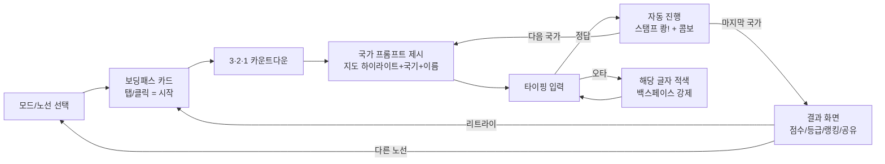
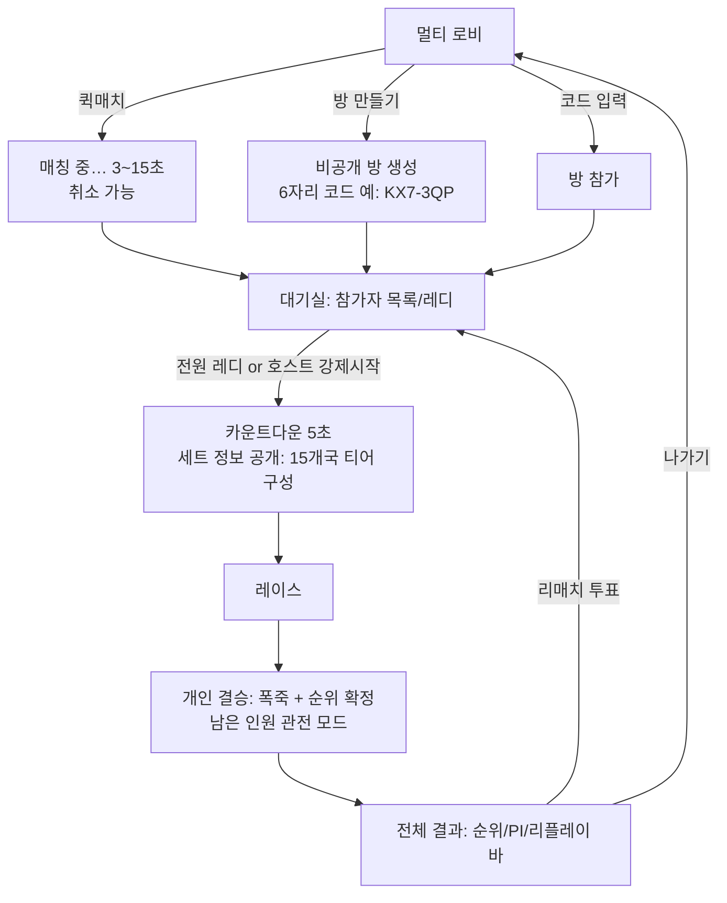
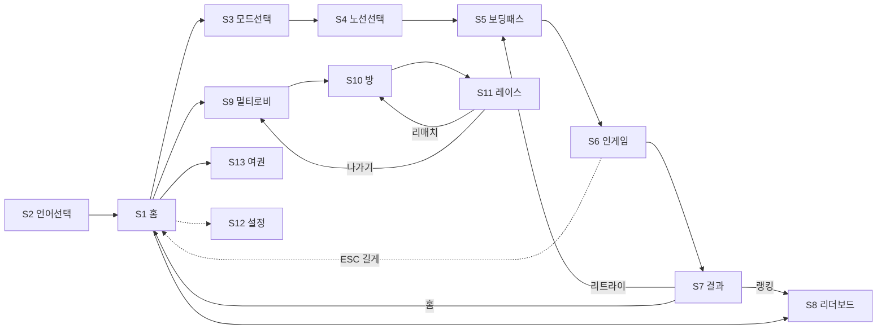

# 01. 게임 디자인 문서 (GDD)

> 프로젝트 코드네임: **WORLD TYPING** (가칭)
> 문서 버전: v1.0 (2026-07-21) / 담당: 게임 디자인
> 관련 문서: 02. 국가 데이터 스펙, 03. 입력 엔진 스펙(한글 IME), 04. 멀티플레이 프로토콜, 05. Cloudflare 아키텍처, 06. 랭킹/랭킹 부정 방지

---

## 1. 제품 비전 / 타깃 유저 / 톤앤매너

### 1.1 제품 비전 (한 문장)

**"지하철 노선도 대신 세계 지도를 타이핑으로 완주하는, 3분짜리 바이럴 웹 타이핑 레이스."**

METRO TYPING이 증명한 재미 구조 — ① 익숙한 고유명사의 나열, ② "완주"라는 명확한 목표, ③ 타수/정확도라는 자랑하기 좋은 숫자, ④ 링크 하나로 즉시 실행되는 제로 프릭션 — 을 그대로 계승한다. 소재를 "서울 지하철 역"에서 "세계 국가"로 바꿈으로써 얻는 것:

- **글로벌 확장성**: 한국어/영어 양측 시장에서 동일한 콘텐츠로 성립. 역 이름은 한국 로컬 밈이지만 국가 이름은 전 세계 공통 상식이다.
- **교육적 알리바이**: "타자 연습 + 세계지리 공부"라는 명분이 있어 학교/학원/스터디 공유 맥락에서 퍼지기 좋다.
- **난이도의 자연 계층**: "프랑스"는 누구나 알지만 "키리바시"는 아무나 모른다. 콘텐츠 자체에 난이도 곡선이 내장되어 있다.

### 1.2 타깃 유저

| 세그먼트 | 설명 | 핵심 니즈 | 대응 기능 |
|---|---|---|---|
| P0 코어 | 15~29세, SNS(IG릴스/Threads/X)에서 타이핑 게임 챌린지를 접한 유저 | 친구보다 잘하기, 결과 공유 | 결과 카드 이미지 공유, 랭킹, 멀티 레이스 |
| P1 타자 연습층 | 타자 연습 사이트(한컴타자, monkeytype 등) 기존 유저 | 지루하지 않은 반복 연습 | 티어 모드, 데일리 챌린지, CPM 기록 추적 |
| P2 지리 퀴즈층 | Seterra/GeoGuessr류 지리 게임 팬 | 국가 지식 테스트 | 지도 하이라이트 프롬프트, 세계일주 모드, 업적 |
| P3 라이트 유입 | 링크 타고 들어온 1회성 방문자 | 10초 안에 이해, 3분 안에 한 판 | 로그인 없는 즉시 플레이, 튜토리얼 없는 직관 UI |

- 기기: 데스크톱(물리 키보드)이 1차, 모바일(소프트 키보드)이 2차. 모바일 유입이 SNS 특성상 60% 이상일 것으로 가정하고 §11에서 별도 설계.
- 계정: 비로그인 플레이 100% 가능. 랭킹 등록 시에만 닉네임(비로그인 게스트 ID) 또는 소셜 로그인.

### 1.3 톤앤매너

- **키워드**: 여행(travel), 여권(passport), 스탬프, 항공권, 출국 심사. "공부"가 아니라 "여행"의 프레임.
- **비주얼**: 플랫 벡터 세계지도 + 종이 여권/보딩패스 텍스처. 채도 높은 파스텔(모드별 시그니처 컬러: 아시아=레드, 유럽=블루, 아프리카=오렌지, 북미=그린, 남미=옐로, 오세아니아=시안 — 지하철 노선색 감성의 계승).
- **문체**: 짧고 경쾌한 반말체 UI 카피(한국어) / 캐주얼 영어. 예: "출국 준비 완료?" / "Ready for boarding?"
- **금지**: 국가별 스테레오타입 이미지(음식/의상 캐리커처 등) 사용 금지 — 국기, 위치, 이름만 사용한다(§12 정책과 연동).

### 1.4 게임 이름 후보 (한/영)

| # | 한글 | 영문 | 콘셉트 | 비고 |
|---|---|---|---|---|
| 1 | **타입트립** | **TypeTrip** | 타이핑+여행. 짧고 발음 쉬움 | ★ 1순위 추천. typetrip.gg / typetrip.kr 도메인 확보 시도 |
| 2 | 월드 타이핑 | World Typing | METRO TYPING 직계 계승 어필 | 검색 유입 유리, 상표 방어력 약함. 코드네임으로 유지 |
| 3 | 80타의 세계일주 | Around the World in 80 Types | 쥘 베른 패러디, 세계일주 모드 강조 | 서브타이틀/이벤트명으로 활용 가치 높음 |
| 4 | 타자 여권 | Typing Passport | 여권 스탬프 메타 강조 | 코스메틱 시스템명으로 강함 |
| 5 | 지오타입 | GeoType | 지리 퀴즈층 소구 | GeoGuessr 연상 리스크 |

> 결정 사항: v1 개발 중 코드네임은 `WORLD TYPING`, 런칭명은 **TypeTrip(타입트립)** 을 기본안으로 하되 상표/도메인 조사 후 확정. 이하 문서에서는 코드네임을 사용한다.

---

## 2. 코어 게임 루프와 세션 길이

### 2.1 코어 루프 (한 판)



한 판의 감정 곡선: **선택(기대) → 카운트다운(긴장) → 초반 쉬운 국가(리듬 형성) → 중후반 생소한 국가(위기) → 마지막 국가(스퍼트) → 결과(보상/공유 욕구)**. 모든 모드에서 이 곡선을 유지하도록 국가 배치 순서를 설계한다(§3).

### 2.2 세션 길이 설계 목표

| 모드 | 1판 길이(중앙값 목표) | 설계 근거 |
|---|---|---|
| 대륙별 (남미/오세아니아) | 45초~1분 20초 | 첫 방문자의 "맛보기" 진입 모드 |
| 대륙별 (유럽/아시아) | 2분 30초~4분 | 코어 유저의 메인 반복 콘텐츠 |
| 대륙별 (아프리카) | 3분~5분 | 최장 노선, 완주 자체가 업적 |
| 티어별 (1런=20개국) | 1분~2분 | 서바이벌 긴장감, 짧은 반복 |
| 세계일주 (80개국) | 8분~14분 | 주 1~2회 도전하는 마라톤 |
| 멀티 레이스 (15개국) | 1분 30초~2분 30초 | 대기시간 포함 1매치 4분 이내 |
| 데일리 챌린지 (10개국) | 1분 내외 | 매일 1회, 출석 루프 |

- 총 방문 세션 목표: 첫 방문 8~12분(2~4판), 재방문 5분 이상.
- 리트라이 프릭션: 결과 화면에서 `R` 키 또는 리트라이 버튼 1탭으로 동일 세트 즉시 재시작(카운트다운 포함 2초 내 재개).

---

## 3. 싱글플레이 3모드 상세 설계

### 3.0 공통: 국가 마스터 데이터 전제

- 수록 국가 수: **197개** = UN 회원국 193 + 바티칸 시국 + 팔레스타인(UN 옵서버) + 대만 + 코소보 (수록 정책 근거는 §12).
- 각 국가 레코드는 `countries.master.json`에 정의 (상세 스키마는 02 문서, GDD에서 참조하는 필드만 발췌):

```typescript
interface Country {
  code: string;          // ISO 3166-1 alpha-2. 예: "KR". 대만 "TW", 코소보 "XK"(사용자 지정 코드)
  nameKo: string;        // 정답 캐노니컬(한국어). 외교부 국명 표기 기준. 예: "대한민국" 아님 → 통용명 "한국"? ❌ §12.1 규칙: 통용 단축명. 예: "미국", "영국", "체코"
  nameEn: string;        // 정답 캐노니컬(영어). ISO short name 기반 통용명. 예: "United States" → "USA"? ❌ 캐노니컬은 "United States", 별칭에 "USA" 허용
  aliasesKo: string[];   // 허용 이형 표기. 예: 미국 → ["미합중국","아메리카합중국"]
  aliasesEn: string[];   // 예: United States → ["USA","US","United States of America","America"]
  continent: "AS"|"EU"|"AF"|"NA"|"SA"|"OC";
  familiarity: number;   // 0~100 익숙함 점수 (§3.2)
  tier: 1|2|3|4|5;       // familiarity로부터 파생
  capitalLatLng: [number, number]; // 경로 생성용
  disputed?: boolean;    // §12 정책 플래그 (TW, XK, PS)
  keystrokesKo: number;  // 한국어 정답 필요 타수(자모 기준, 사전 계산). 예: "한국" = ㅎㅏㄴㄱㅜㄱ = 6
  keystrokesEn: number;  // 영어 정답 글자 수(공백 포함). 예: "United States" = 13
}
```

### 3.1 (a) 대륙별 모드 — "노선" 메타포

METRO TYPING의 "노선 선택"에 1:1 대응. 세계지도에서 대륙을 노선처럼 고르고, 그 대륙의 국가를 **고정된 순서**로 처음부터 끝까지 입력한다.

| 노선 | 색 | 국가 수 | 목표 완주 시간(중급자) | 시작 → 종점 |
|---|---|---|---|---|
| 아시아선 | #E5484D (레드) | 49 | 3분 30초 | 한국 → 예멘 |
| 유럽선 | #3B82F6 (블루) | 45 | 3분 10초 | 영국 → 바티칸 시국 |
| 아프리카선 | #F97316 (오렌지) | 54 | 4분 20초 | 이집트 → 세이셸 |
| 북아메리카선 | #22C55E (그린) | 23 | 1분 40초 | 캐나다 → 파나마 |
| 남아메리카선 | #EAB308 (옐로) | 12 | 55초 | 콜롬비아 → 칠레 |
| 오세아니아선 | #06B6D4 (시안) | 14 | 1분 5초 | 호주 → 팔라우 |

**진행 순서 규칙 (고정, 데이터 빌드 타임에 확정)**
1. 각 대륙의 국가를 수도 좌표 기준 **최근접 이웃 경로(nearest-neighbor path)** 로 연결하되,
2. 시작 국가는 "해당 대륙에서 familiarity 최상위 국가"로 고정한다(첫 국가는 반드시 누구나 아는 나라 → 리듬 형성).
3. 알고리즘 결과에서 지리적으로 부자연스러운 점프(예: 섬나라 왕복)는 수작업으로 최대 5개까지 교정하고, 최종 순서를 `countries.continent-order.json`에 하드코딩한다. **런타임 계산 금지** — 순서가 곧 콘텐츠이며 랭킹 공정성의 기반이다.
4. 예시(아시아선 첫 10개): 한국 → 북한 → 일본 → 중국 → 몽골 → 대만 → 필리핀 → 베트남 → 라오스 → 캄보디아 → …

**완주 조건**: 해당 대륙 전 국가를 순서대로 입력(스킵 포함 시 "완주(스킵 n)" 표기, 스킵 0이면 "퍼펙트 루트" 배지).

**모드 특성**
- 규칙: **타임어택**(§7). 국가당 제한시간 없음, 전체 시간이 점수에 반영.
- 지도 연출: 입력할 때마다 지도 위에 노선 색으로 경로가 그려진다(지하철 노선도가 완성되는 감각). 완주 시 대륙 전체에 노선이 완성된 이미지가 결과 카드가 됨 → 공유 포인트.
- 진행바: 화면 하단에 노선도 스타일 진행바(●─●─●…), 현재 국가는 확대된 원.

### 3.2 (b) 난이도 티어별 모드 — "출국 심사" 메타포

**Familiarity 점수 산정** (데이터 빌드 파이프라인, 02 문서에서 구현):

```
familiarity = 0.35 × norm(구글 트렌드 12개월 검색량, 언어권별)
            + 0.25 × norm(해당국 인구 log10)
            + 0.20 × (한국 초중고 교과서/영미권 K-12 커리큘럼 등장 여부 큐레이션 0/1)
            + 0.20 × norm(연간 방한/방미 관광 교류 규모 log10)
```
- 언어권(ko/en)별로 따로 계산하되 v1은 두 값의 평균으로 단일 tier를 확정한다(티어가 언어별로 갈리면 콘텐츠 관리 비용 2배). 런칭 후 스킵률/시간초과율 텔레메트리로 분기별 재조정.
- 티어 분할: familiarity 내림차순 정렬 후 T1: 1~40위, T2: 41~80위, T3: 81~120위, T4: 121~160위, T5: 161~197위(37개).
- 티어 대표 예시: T1 = 한국·미국·일본·프랑스…, T3 = 우루과이·요르단·라트비아…, T5 = 키리바시·투발루·상투메 프린시페·나우루….

**런 구성**
- 1런 = 해당 티어 풀에서 **20개국**을 출제. 셔플 시드 = `SHA-256(tierId + YYYY-MM-DD)` → **모든 유저가 그날 동일한 20개국·동일 순서**를 받는다(일간 랭킹 공정성 확보). 자정(KST 00:00) 갱신.
- 출제 순서는 시드 셔플 결과 그대로(티어 내에서는 난이도 균질하므로 재정렬 불필요).

**완주 조건 및 규칙**: **서바이벌**(§7). 라이프 3, 국가당 제한시간 초과/스킵 시 라이프 1 감소, 라이프 0이면 그 자리에서 종료(진행 수만큼 부분 점수 기록). 20개국 모두 통과 시 완주.

**모드 특성**
- 프레임: "출국 심사대" — 티어가 올라갈수록 심사관이 어려운 나라를 들이민다는 콘셉트. 티어 아이콘: T1 🟢일반 심사 → T5 🔴외교관 심사.
- 언락: T1은 즉시 개방. T(n+1)은 T(n)을 라이프 1 이상 남기고 완주하면 개방(계정/localStorage 저장). 단, "언락 건너뛰기" 버튼 제공(도전 자체는 막지 않음, 랭킹 등록은 정식 언락자만).
- 티어별 국가당 제한시간은 §7.2 수식 참조.

### 3.3 (c) 세계일주 루트 — 마라톤 모드

**루트 정의**
- 총 **80개국**, 인천(한국) 출발 → 서쪽 방향 일주 → 한국 귀환. "80"은 『80일간의 세계일주』 오마주이며 마케팅 카피("80타의 세계일주")와 연동.
- 선정 기준: 197개국 중 familiarity 상위 60개 + 루트 연속성을 위한 경유국 20개(대륙 간 징검다리). 최종 80개국과 순서는 `countries.route.json`에 하드코딩.
- 루트 생성 규칙: ① 수도 좌표 기준 서진(西進) 대순환(아시아→중동→아프리카→유럽→남미→북미→오세아니아→귀환), ② 대륙 내에서는 최근접 이웃 경로, ③ 체크포인트(아래) 직전 국가는 반드시 T1~T2 국가 배치(위기 뒤 안도감), ④ 마지막 5개국은 T1로만 구성(피날레 스퍼트 연출).
- 루트 앞부분 15개국(확정): 한국 → 일본 → 대만 → 필리핀 → 베트남 → 태국 → 말레이시아 → 싱가포르 → 인도네시아 → 인도 → 파키스탄 → 이란 → 아랍에미리트 → 사우디아라비아 → 이집트 → … (전체 80개는 02 문서 부록 A).

**체크포인트와 완주 조건**
- 10개국마다 체크포인트(총 8개 구간, 구간명 = 경유 도시: 도쿄→방콕→두바이→카이로→파리→상파울루→뉴욕→시드니→인천).
- 규칙: **타임어택 + 라이프 3 하이브리드**(§7). 스킵 시 라이프 1 소모. 라이프 0 → 게임오버, 단 **마지막 통과 체크포인트에서 이어하기 1회 허용**(이어하기 사용 시 결과에 "경유편" 표기, 랭킹은 논스톱 완주만 등재).
- 완주 조건: 80개국 전부 입력(스킵 = 라이프 소모이므로 "스킵 완주"는 라이프 한도 내에서만 가능).

**모드 특성**
- 상단에 비행기 아이콘이 세계지도 위 루트를 따라 이동. 체크포인트 도달 시 "경유지 도착" 배너 + 구간 기록(스플릿 타임) 표시 — 스피드런 감성.
- 첫 완주 시 여권에 "세계일주 스탬프"(코스메틱 최상위 티어, §9) 각인.
- 진입 조건: 없음(누구나 도전 가능). 단 홈 화면에서 "예상 소요 10분+" 라벨로 기대치 관리.

---

## 4. 언어 선택(한/영)이 플레이에 미치는 영향

| 항목 | 한국어(ko) | 영어(en) |
|---|---|---|
| 정답 표기 | `nameKo` (외교부 표기 기반 통용명: "미국", "체코", "튀르키예") | `nameEn` (ISO short name 통용형: "United States", "Czechia", "Türkiye" → 정답 판정은 diacritic 제거 후 "Turkiye"도 동일 취급, §5.4) |
| UI 언어 | 한국어 UI | 영어 UI (UI 언어와 입력 언어는 함께 전환, v1에서는 분리 설정 없음) |
| 타수(keystroke) 정의 | **자모 단위**. "한국" = ㅎㅏㄴㄱㅜㄱ = 6타 (두벌식 물리 타건 수와 일치) | 문자 단위(공백 포함). "South Korea" = 11타 |
| CPM 표기 | "타/분" (국내 타자연습 관례와 동일 스케일: 400타 = 중상급) | "CPM" + 보조로 WPM(=CPM/5) 병기 |
| 랭킹 | **언어별 분리 리더보드**. ko/en은 타수 체계가 달라 절대 비교 불가. 모든 리더보드 키에 `lang` 차원 포함 | 동일 |
| 데일리 시드 | 언어와 무관하게 동일 국가 세트(시드는 언어 비의존) — "오늘의 10개국"은 전 세계 공통 | 동일 |
| 난이도 체감 | 한글 국가명은 짧다(평균 3~4음절 = 7~9타) → 국가당 제한시간 짧게 체감 | 영문명은 길다("United Arab Emirates" = 20타) → 같은 제한시간 수식이 자수 비례라 공정(§7.2) |
| 온보딩 | 최초 방문 시 `navigator.language`로 기본값 추정(ko-* → 한국어), 홈에서 항상 토글 가능 | 동일 |

- 언어 전환은 홈/설정에서 즉시 가능하며 진행 중인 판에는 영향 없음(판 시작 시점의 언어로 고정).
- 기록 저장 시 `lang` 필드 필수. 동일 유저가 양 언어 기록을 모두 가질 수 있다.

---

## 5. 타이핑 메커닉

### 5.1 프롬프트 제시 방식 — "무엇을 보여주고 무엇을 치게 하는가"

v1의 기본은 **"따라치기(copy typing)"** 다. METRO TYPING과 동일하게, **정답 텍스트를 화면에 보여주고 그대로 입력**하게 한다. 지리 지식이 없어도 100% 플레이 가능해야 바이럴 최대 도달 범위가 나온다.

프롬프트 구성(항상 3요소 동시 표시):
1. **국가명 텍스트** (대형, 화면 중앙) — 입력 진행에 따라 글자별 색 변화(§5.3)
2. **국기** (텍스트 좌측, 48×32px)
3. **지도 하이라이트** — 배경 세계지도에서 해당 국가 폴리곤이 시그니처 컬러로 점등 + 카메라가 부드럽게 팬

> 지식 테스트형(국기/지도만 보여주고 이름을 맞히게 하는 "퀴즈 모드")은 v1.5 백로그. v1 데이터 구조(`aliases` 판정기)가 그대로 재사용되므로 설계 부채 없음.

### 5.2 정답 판정과 자동 진행

- **Enter 불필요.** 입력 버퍼가 정답(정규화 후)과 완전 일치하는 순간 자동으로 다음 국가로 진행한다. 마지막 글자를 치는 그 키스트로크가 곧 확정이다.
- 판정 파이프라인 (03 입력 엔진 문서에서 구현):

```typescript
function normalize(input: string, lang: "ko" | "en"): string {
  let s = input.normalize("NFC").trim();
  if (lang === "en") {
    s = s.toLowerCase()
         .normalize("NFD").replace(/\p{M}/gu, "")  // diacritic 제거: Côte→Cote
         .replace(/[’'.\-]/g, "")                    // 아포스트로피/마침표/하이픈 무시
         .replace(/\s+/g, " ");
  }
  return s;
}

function isMatch(input: string, c: Country, lang: "ko" | "en"): boolean {
  const candidates = lang === "ko" ? [c.nameKo, ...c.aliasesKo] : [c.nameEn, ...c.aliasesEn];
  const n = normalize(input, lang);
  return candidates.some(ans => normalize(ans, lang) === n);
}
```

- **별칭(alias) 정답 처리**: 별칭으로 완성해도 정답. 단 화면 표시는 캐노니컬이므로, 따라치기 UX에서는 사실상 캐노니컬 입력이 기본 경로이고 별칭은 "화면 안 보고 치는 고수"의 지름길이다. 별칭이 캐노니컬보다 짧으면(예: "USA") 타수 계산은 **실제 입력한 타수** 기준 — 지름길을 아는 것도 실력으로 인정.

### 5.3 오타 / 백스페이스 처리

- **글자 잠금 방식(strict)**: 입력 버퍼를 정답과 위치별로 비교하여, 최초 불일치 지점 이후의 글자는 화면에 적색으로 표시되고 **불일치 상태에서는 정답이 절대 성립하지 않으므로 백스페이스로 지워야만 진행 가능**하다.
  - 회색(미입력) → 검정/흰색(정타) → 적색(오타) 3상태. 오타 발생 시 텍스트 박스 6px 좌우 셰이크(120ms) + 둔탁한 오답음.
  - 오타 글자도 계속 입력은 가능(최대 정답 길이 +8자까지 버퍼 허용, 초과분 무시) — 입력을 막으면 IME 조합과 충돌하기 때문(03 문서 리스크 항목).
- **백스페이스**: 무제한 허용, 페널티 없음. 단 오타로 기록된 키스트로크는 정확도 계산에서 이미 차감(§6).
- **통계 계상**: `totalKeystrokes` = 정타 + 오타 (백스페이스 자체는 타수 미포함), `errorKeystrokes` = 오타 발생 수. 한국어는 자모 단위로 계상.

### 5.4 한글 조합 중 상태의 UX (핵심 리스크 항목)

- 정답 비교는 **자모 분해(NFD 유사, 두벌식 자모 시퀀스) 기준 prefix 매칭**으로 수행한다. 예: 정답 "몽골"에 대해 입력이 "몽ㄱ"(조합 중) 상태라면 자모열 `ㅁㅗㅇㄱ`은 정답 자모열 `ㅁㅗㅇㄱㅗㄹ`의 prefix → **정타 취급(오타 표시 금지)**.
- "먀"처럼 조합 중 글자가 아직 정답 prefix가 아니어도, **다음 키 입력으로 정답 prefix가 될 수 있는 상태**(도깨비불 현상: "몽고"+"ㄹ" 입력 도중 "몽골" 완성 직전의 "몽고" 등)는 오타로 판정하지 않는다. 판정 함수는 "현재 자모열이 정답 자모열의 prefix인가"만 본다 — 도깨비불은 자모열 관점에서 자연스럽게 prefix를 유지하므로 별도 특례 불필요(검증 케이스는 03 문서 테스트 목록).
- 마지막 글자 조합 완료 판정: 자모열이 정답 자모열과 **완전 일치하는 순간** 즉시 확정한다. compositionend를 기다리지 않는다(기다리면 다음 국가 첫 타가 이전 IME 버퍼에 먹히는 버그 발생 — 확정 시 IME 버퍼 강제 플러시, 03 문서 참조).
- 화면 표시: 조합 중인 글자는 밑줄 커서로 표시하되 색 판정은 자모 기준으로 이미 정타/오타 반영.

### 5.5 힌트 / 스킵

| 기능 | 트리거 | 효과 | 페널티 |
|---|---|---|---|
| 소프트 힌트 | 4초간 입력 없음 | 다음 입력해야 할 글자가 펄스 애니메이션(따라치기라 사실상 리마인드 역할) | 없음 |
| 스킵 | `ESC` 키 또는 화면 스킵 버튼(모바일) | 현재 국가를 건너뛰고 다음으로 | ① 콤보 0 리셋, ② 해당 국가 필요 타수 전량을 오타로 계상(정확도 하락), ③ 서바이벌/세계일주에선 라이프 1 소모, ④ 국가별 점수 0점 |
| 일시정지 | 없음 (의도적 미제공) | — | 싱글도 일시정지 불가. 기록 경쟁 게임에서 정지는 부정의 온상. 창 블러 시 자동 판 무효("연습 기록" 처리) |

---

## 6. 점수 모델

### 6.1 측정 원시값 (한 판 기준)

```typescript
interface RunStats {
  totalKeystrokes: number;   // 정타+오타 (자모/문자 단위, §4)
  correctKeystrokes: number;
  elapsedMs: number;         // 카운트다운 종료~마지막 확정
  maxCombo: number;          // 연속 "노오타·노스킵" 국가 수 최대치
  countriesCleared: number;
  countriesSkipped: number;
  perCountry: { code: string; ms: number; errors: number; skipped: boolean }[];
}
```

- `CPM = correctKeystrokes / (elapsedMs / 60000)` — **정타 기준 CPM**(오타는 분자에서 제외). 소수점 버림.
- `ACC = correctKeystrokes / totalKeystrokes` (0~1). 스킵한 국가는 `keystrokes(정답)` 전량을 totalKeystrokes에 오타로 가산.
- 콤보: 국가 1개를 오타 0·스킵 없이 통과하면 +1, 오타 1회라도 나면 그 국가 확정 시점에 0으로 리셋. (글자 단위 콤보가 아니라 **국가 단위 콤보** — 화면에 "×7 STREAK"로 표시.)

### 6.2 최종 점수 공식

```
BaseScore  = Σ_{i ∈ cleared} (60 + 8 × L_i) × w_i
             L_i = 국가 i의 정답 필요 타수 (keystrokesKo | keystrokesEn)
             w_i = 1 + 0.15 × (tier_i − 1)        // T1=1.00 … T5=1.60

AccFactor  = ACC²                                   // 정확도는 제곱으로 강하게 반영
ComboFactor= 1 + 0.01 × min(maxCombo, 40)           // 최대 ×1.40

TimeBonus  = max(0, T_par − elapsedSec) × 15
             T_par = Σ_{i ∈ all} L_i / 3.5          // "파 타임": 초당 3.5타(=210타/분) 기준
             // elapsedSec가 파 타임보다 빠른 만큼 초당 15점. 상한 = T_par × 15 (0초 클리어 가정치)

FinalScore = round( BaseScore × AccFactor × ComboFactor + TimeBonus )
```

설계 의도:
- **정확도 제곱**: ACC 95% → ×0.9025, 90% → ×0.81. "빠르지만 지저분한" 플레이가 랭킹 상위를 점령하지 못하게 한다.
- **티어 가중 w_i**: 같은 타수라도 생소한 나라(긴 인지 지연)를 보상. 티어 모드 T5 런의 이론 만점이 T1보다 60% 높다.
- **TimeBonus 분리 가산**: 곱연산에 넣으면 속도가 정확도를 압도하므로 가산항으로 분리. 210타/분(초당 3.5타)은 한국 성인 평균 타자속도 하위권 기준 — 평균 이상이면 누구나 보너스를 받기 시작해 성취감을 준다.
- 서바이벌 중도 탈락 시에도 `cleared` 국가분 BaseScore는 유효(부분 점수) — 단 TimeBonus는 완주 시에만 지급.

### 6.3 등급 컷 (S/A/B/C/D)

등급은 점수가 아니라 **성능지수 PI**로 판정한다(모드·세트 길이에 무관한 개인 실력 지표 → "나 S 받음" 자랑이 모드 간 비교 가능해짐):

```
PI = CPM × ACC²
```

| 등급 | PI 컷 | 대략적 의미 (ko 자모 타수 기준) |
|---|---|---|
| **S** | PI ≥ 450 | 500타/분 + 정확도 95% 수준. 상위 ~3% |
| **A** | 340 ≤ PI < 450 | 400타/분 + 정확도 92% |
| **B** | 230 ≤ PI < 340 | 300타/분 + 정확도 88% |
| **C** | 120 ≤ PI < 230 | 200타/분 + 정확도 78% |
| **D** | PI < 120 | 입문 |

- 추가 조건: **미완주(서바이벌 탈락/세계일주 게임오버) 시 최대 B**. S/A는 완주자의 전유물.
- en도 동일 컷 사용(문자 타수 기준 CPM 스케일이 ko 자모 타수와 유사 범위임을 전제로 하되, 런칭 후 상위 percentile 분포를 보고 en 컷을 ±15% 내에서 보정한다. 컷 값은 `config/grades.json`으로 분리 배포).
- 등급 연출: S 등급은 여권에 금박 스탬프 + 결과 카드에 홀로그램 효과(공유 욕구 자극).

---

## 7. 타이머 / 라이프 규칙

### 7.1 모드별 규칙 매트릭스

| 모드 | 유형 | 국가당 제한 | 전체 제한 | 라이프 | 시간초과/스킵 결과 |
|---|---|---|---|---|---|
| 대륙별 | 타임어택 | 없음 | 없음 (시간=점수 요인) | 없음 | 스킵만 존재 → §5.5 페널티 |
| 티어별 | 서바이벌 | **있음** (§7.2) | 없음 | 3 | 라이프 −1, 해당 국가 자동 스킵 처리 |
| 세계일주 | 타임어택+라이프 | 없음 | 없음 | 3 | 스킵 시 라이프 −1. 라이프 0 → 게임오버(체크포인트 이어하기 1회) |
| 데일리 챌린지 | 서바이벌 변형 | 있음 (T7.2, tier=출제국 티어) | 없음 | 1 | 라이프 0 → 즉시 종료, 그 시점 기록 확정 |
| 멀티 레이스 | 레이스 | 10초 고정 | 180초 하드캡 | 없음 | 10초 초과 시 자동 스킵+정확도 페널티, 180초 도달 시 전원 강제 결승 처리 |

### 7.2 서바이벌 국가당 제한시간 수식

```
timeLimit_i (sec) = clamp( 3.0,  1.5 + L_i × 0.40 × tierRelax,  15.0 )
tierRelax = 1.30 − 0.075 × (tier_i − 1)     // T1=1.30, T3=1.15, T5=1.00
```

- 자수 비례라 한/영 간 공정("싱가포르"=9타 vs "Singapore"=9타는 유사, "아랍에미리트"=13타 vs "United Arab Emirates"=20타는 각자 자기 제한시간).
- T1 예: "미국"(5타: ㅁㅣㄱㅜㄱ) → 1.5+5×0.40×1.30 = 4.10초. T5 예: "상투메 프린시페"(16타) → 1.5+16×0.40 = 7.90초. (§11-D27로 예시 산수 정정 — 공식·자모 계상 규칙은 불변)
- HUD 표현: 국가 텍스트 아래 얇은 게이지 바가 줄어든다. 잔여 25% 이하에서 적색 점멸 + 틱톡 사운드.
- 예외: 각 런의 **첫 번째 국가는 제한시간 ×2** (손 올리는 시간 보정).

---

## 8. 멀티플레이 실시간 레이스 — 플레이어 경험 흐름

> 프로토콜/서버 설계는 04 문서. 여기서는 UX 계약만 정의한다.

### 8.1 매치 규격

- 인원: 2~8명. 세트: **15개국** (매치 생성 시 서버가 티어 혼합 규칙 T1×6 + T2×5 + T3×4로 시드 생성, 전원 동일 세트·동일 순서).
- 언어: 방 생성 시 ko/en 중 하나로 고정(혼합 불가 — 타수 체계가 달라 레이스 불공정). 퀵매치는 유저 언어 설정 기준 매칭.
- 승패: **15개국 전부 입력 완료가 결승선.** 완주 순서 = 순위. 180초 하드캡 도달 시 미완주자는 진행 국가 수 → 남은 국가의 진행 타수 순으로 순위 결정.

### 8.2 경험 흐름



**대기실(W)**
- 참가자 슬롯에 닉네임+여권 커버(코스메틱)+최근 PI 표시. 레디 토글. 호스트는 인원/공개여부 설정.
- 퀵매치는 4인 모이거나 15초 경과 시(2인 이상) 자동 시작. 60초 내 상대 없으면 **봇 매치 제안**(고스트 리플레이 봇 — 과거 유저 기록 재생, "GHOST" 라벨로 정직하게 표기).

**레이스 중(RACE)**
- 내 화면은 싱글과 동일한 타이핑 뷰. 차이는 좌측(모바일: 상단)의 **실시간 상대 진행바**: 플레이어별 수평 트랙에 비행기 아이콘이 15칸을 이동. 250ms 간격 서버 브로드캐스트(04 문서).
- 상대 화면의 타이핑 내용은 보이지 않는다(진행 칸 수 + 현재 콤보만). 선두 플레이어 트랙에 왕관 아이콘.
- 심리전 요소: 누군가 오타로 멈추면 해당 비행기가 0.5초 흔들림 — 관찰 가능한 실수.

**결승(FIN) / 결과(RES)**
- 1등 확정 후에도 나머지는 완주까지 계속(순위 확정). 전원 완주 또는 하드캡 시 결과로.
- 결과: 순위표(순위/닉네임/시간/CPM/ACC/PI), 구간별 리드 체인지 그래프.
- **리매치 투표**: 30초 카운트다운, 과반 동의 시 새 시드로 같은 멤버 재경기. 방 코드는 유지.

**이탈 처리(UX 관점)**: 레이스 중 이탈자는 트랙이 회색 처리되고 "이탈" 표기, 남은 인원의 순위 계산에서 최하위 고정. 재접속 시 관전만 가능.

---

## 9. 진행 / 메타 시스템

### 9.1 데일리 챌린지

- 매일 KST 00:00, 전 세계 공통 시드로 **10개국**(티어 혼합: T1×3, T2×3, T3×2, T4×1, T5×1) 출제. 라이프 1 서바이벌 변형(§7.1).
- **1일 1회만 기록 등재.** 재도전은 가능하나 "연습" 라벨, 리더보드 미반영(첫 트라이의 긴장감 = Wordle 문법).
- 결과 공유 텍스트(자동 생성, Wordle식 스포일러 프리):
  ```
  WORLD TYPING 데일리 #187
  🟩🟩🟩🟩🟩🟩🟩🟩🟨🟩  9/10 완주
  ⚡ 412타 · 🎯 96.2% · PI 381 (A)
  worldtyping.gg/daily
  ```
- 연속 출석 스트릭 카운터(여권 표지에 표시). 스트릭 7/30/100일 업적 연동.

### 9.2 업적 (Achievements) — v1 수록 24종

| 카테고리 | 예시 (id / 이름 / 조건) |
|---|---|
| 완주 | `first_flight` 첫 비행: 아무 모드 첫 완주 / `six_continents` 육대주 정복: 대륙 6개 노선 전부 완주 / `around_the_world` 80타의 세계일주: 세계일주 논스톱 완주 |
| 실력 | `perfect_run` 무결점 입국: 오타 0 완주 / `speed_demon_500` 초음속: CPM 500+ / `grade_s_all` 올 S: 6개 대륙 전부 S |
| 서바이벌 | `tier5_clear` 외교관 여권: T5 완주 / `no_life_lost` 무사통과: 서바이벌 라이프 3 유지 완주 |
| 멀티 | `first_win` 첫 승리 / `win_streak_5` 5연승 / `photo_finish` 포토피니시: 1초 이내 격차 승리 |
| 꾸준함 | `daily_7` / `daily_30` / `daily_100` 데일리 스트릭 |
| 이스터에그 | `alias_master` 지름길 여행자: 별칭 입력으로 20개국 통과(예: "USA") |

### 9.3 언락 트리

```
시작 시 개방: 대륙별 6개 노선 전체, 티어 T1, 세계일주, 데일리, 멀티
잠김 → 해제:
  T2~T5        ← 직전 티어 완주 (§3.2, 건너뛰기 버튼 존재)
  여권 커버 #2~#12 ← 업적/등급 조건 (아래 9.4)
  고스트 모드   ← 아무 노선 완주 1회 (자기 최고 기록 고스트와 대결하는 싱글 옵션)
```
- **콘텐츠는 잠그지 않는다**(도달 범위 최우선). 잠그는 것은 코스메틱과 도전과제성 옵션뿐.

### 9.4 코스메틱 — "여권과 스탬프" (레퍼런스 교통카드의 대응물)

- **여권 커버**: METRO TYPING의 교통카드에 대응하는 아이덴티티 아이템. 시작 화면에서 "여권을 탭하여 출국" — 시작 버튼 그 자체다. 12종: 기본 그린 / 대륙 6색(각 대륙 완주 보상) / 골드(올 S) / 홀로그램(세계일주 완주) / 데일리 스트릭 30·100 / 시즌 한정 1종.
- **스탬프 페이지**: 완주한 노선/모드마다 여권 내지에 스탬프가 찍힌다(국경 심사 도장 디자인, 완주 일자·등급 각인). 프로필 = 여권 펼침 뷰이며 그대로 공유 이미지가 된다.
- 수익화 없음(v1). 코스메틱은 전량 플레이 보상. (광고/후원은 별도 사업 결정 사항, GDD 범위 외.)

---

## 10. 화면별 UX 흐름

### 10.1 화면 목록과 전이도

| id | 화면 | 라우트 |
|---|---|---|
| S1 | 홈 (지도 허브) | `/` |
| S2 | 언어 선택 (첫 방문 오버레이) | `/` 오버레이 |
| S3 | 모드 선택 | `/play` |
| S4 | 노선/세부 선택 (대륙·티어·일주 공용) | `/play/:mode` |
| S5 | 시작 전 보딩패스 카드 | `/play/:mode/:id` |
| S6 | 인게임 (싱글) | 동일 라우트 상태 전환 |
| S7 | 결과 | 동일 라우트 상태 전환 |
| S8 | 리더보드 | `/rank` |
| S9 | 멀티 로비 | `/multi` |
| S10 | 방 (대기실) | `/multi/:roomCode` |
| S11 | 레이스 (멀티 인게임+결과) | 동일 라우트 상태 전환 |
| S12 | 설정 | 오버레이(전 화면) |
| S13 | 프로필/여권 | `/passport` |



### 10.2 와이어프레임 (데스크톱 기준, 모바일은 세로 재배치 원칙만 §11)

**S1 홈**
```
+--------------------------------------------------------------+
| WORLD TYPING            [데일리 D#187] [랭킹] [여권] [KO|EN] [⚙] |
|                                                              |
|        (인터랙티브 세계지도 — 대륙 호버 시 노선색 점등)           |
|                                                              |
|   +----------------+  +----------------+  +---------------+  |
|   |  ▶ 싱글플레이    |  |  ⚔ 멀티 레이스  |  | 📅 데일리 챌린지 |  |
|   |  대륙/티어/일주  |  |  실시간 대결     |  | 오늘 10개국     |  |
|   +----------------+  +----------------+  +---------------+  |
|                                                              |
| 오늘의 1위: NIMBUS_KR · PI 512 · 유럽선 2:41   [내 최고: PI 388] |
+--------------------------------------------------------------+
```
- HUD/요소: 언어 토글 상시 노출, 데일리 뱃지(미완료 시 붉은 점), 하단 티커에 실시간 랭킹 1위.

**S2 언어 선택 (첫 방문 1회 오버레이)**
```
+----------------------------+
|   어떤 언어로 여행할까요?      |
|   Which language?          |
|                            |
|  [ 🇰🇷 한국어로 타이핑 ]       |
|  [ 🌐 Type in English ]    |
|                            |
|  나중에 언제든 바꿀 수 있어요    |
+----------------------------+
```

**S3 모드 선택**
```
+--------------------------------------------------------------+
| ← 홈                    싱글플레이                              |
| +------------------+ +------------------+ +----------------+ |
| | 🗺 대륙별 노선      | | 🛂 출국 심사(티어)  | | ✈ 세계일주      | |
| | 6개 노선           | | T1~T5 서바이벌     | | 80개국 마라톤    | |
| | 45초~5분          | | 1~2분 · 라이프 3   | | 10분+ · 라이프 3 | |
| | 완주: 4/6         | | 진행: T3 도전 중    | | 최고: 카이로 도달 | |
| +------------------+ +------------------+ +----------------+ |
+--------------------------------------------------------------+
```

**S4 노선/세부 선택 (대륙 모드 예)**
```
+--------------------------------------------------------------+
| ← 모드                  노선을 고르세요                          |
|   (세계지도 — 각 대륙에 노선색 라인 프리뷰)                        |
|  ● 아시아선(49)  레드   최고 S 2:58   [출발→]                    |
|  ● 유럽선(45)   블루   최고 A 3:22   [출발→]                    |
|  ● 아프리카선(54) 오렌지  미완주       [출발→]                    |
|  ● 북아메리카선(23) 그린  최고 B      [출발→]                    |
|  ● 남아메리카선(12) 옐로  최고 S 0:49  [출발→]                    |
|  ● 오세아니아선(14) 시안  미도전       [출발→]                    |
+--------------------------------------------------------------+
```

**S5 시작 전 보딩패스 카드** (교통카드 태그 순간의 계승 — 게임의 시그니처 인터랙션)
```
+--------------------------------------------------------------+
|            ┌──────────────────────────────┐                  |
|            │  BOARDING PASS    유럽선 ● 블루 │                  |
|            │  ICN → 45 COUNTRIES          │                  |
|            │  탑승자: GUEST_4821 (여권커버🟢) │                  |
|            │  규칙: 타임어택 · 파 타임 4:06    │                  |
|            │                              │                  |
|            │   [ 여권을 탭해서 출국하기 ]       │ ← 클릭/스페이스     |
|            └──────────────────────────────┘                  |
|      내 최고: A · 3:22 · 96.1%      세계 1위: 2:41              |
+--------------------------------------------------------------+
```
- 탭 → 카드가 개찰기 통과 애니메이션(200ms) → "삑" 사운드 → 3·2·1 카운트다운.

**S6 인게임 HUD (싱글)**
```
+--------------------------------------------------------------+
| ⏱ 1:23.4   ⚡ 402타/분   🎯 97.2%   ×12 STREAK   ♥♥♥(서바이벌만) |
|                                                              |
|        (배경: 세계지도, 현재 국가 폴리곤 블루 점등 + 팬)            |
|                                                              |
|                 🇩🇪   독  일                                   |
|                      ▔▔ ▔▔        ← 정타=흰색, 오타=적색, 커서 밑줄 |
|              [▓▓▓▓▓▓░░░░] 국가당 타이머(서바이벌만)               |
|                                                              |
| ●─●─●─●─◉─○─○─○─○─○ … 12/45        다음: 폴란드    [ESC 스킵]   |
+--------------------------------------------------------------+
```
- 구성요소: ① 상단 스탯 바(실시간 CPM은 500ms 스로틀 갱신), ② 중앙 프롬프트(국기+텍스트), ③ 노선 진행바(다음 국가 1개 미리보기 — 고수의 선입력 준비 허용), ④ 지도 배경(모션 줄이기 설정 시 정지).

**S7 결과**
```
+--------------------------------------------------------------+
|                      🛬 입국 완료!                             |
|      ┌────────────────────────────────────┐                  |
|      │   유럽선 완주    등급  ★ A ★         │                  |
|      │   점수 48,220   PI 388             │                  |
|      │   ⏱ 3:22.1  ⚡402타/분  🎯96.1%  ×18 │                  |
|      │   (지도에 완성된 블루 노선 썸네일)       │ ← 이 카드가 공유 이미지 |
|      └────────────────────────────────────┘                  |
|   구간 그래프: [CPM 추이 스파크라인]  최다 오타: "리히텐슈타인"(3회)   |
|   [R 리트라이]  [랭킹 등록/보기]  [공유 📤]  [다른 노선]  [홈]      |
+--------------------------------------------------------------+
```

**S8 리더보드**
```
+--------------------------------------------------------------+
| ← 홈   리더보드     [일간|주간|전체]  [KO|EN]  [모드: 유럽선 ▼]     |
|  #   닉네임          점수      PI    시간    ACC               |
|  1   NIMBUS_KR      61,430   512   2:41   98.9%             |
|  2   qwerty_god     59,110   497   2:45   98.1%             |
|  ...                                                         |
|  841 나 (GUEST_4821) 48,220   388   3:22   96.1%  ← 고정 표시   |
+--------------------------------------------------------------+
```

**S9 멀티 로비**
```
+--------------------------------------------------------------+
| ← 홈                 멀티 레이스                                |
|   [ ⚡ 퀵매치 시작 ]        (예상 대기 ~10초 · 현재 접속 132명)     |
|   [ + 방 만들기 ]  [ 방 코드 입력: ___-___  → 참가 ]              |
|   진행 중인 공개 방:  #KX7-3QP 3/8 대기중 (ko) [참가]             |
+--------------------------------------------------------------+
```

**S10 방 (대기실)**
```
+--------------------------------------------------------------+
| 방 코드 KX7-3QP  [복사] [링크 공유]        설정: ko · 15개국 · 8인  |
|  ┌김치워리어 🟣 PI421 ✅레디┐ ┌GUEST_777 🟢 PI- ⬜┐ ┌ (빈 슬롯) ┐  |
|  ┌나(호스트) 🌈 PI388 ✅  ┐ ┌ (빈 슬롯) ┐        ┌ (빈 슬롯) ┐  |
|  채팅: 김치워리어: ㄱㄱ                                   [입력]  |
|            [ 레디 ]        [ 게임 시작 ▶ (호스트) ]              |
+--------------------------------------------------------------+
```

**S11 레이스 (멀티 인게임)**
```
+--------------------------------------------------------------+
| 👑김치워리어 ✈▓▓▓▓▓▓▓░░░░░░░ 9/15    나 ✈▓▓▓▓▓▓░░░░░░░░ 7/15    |
|   GUEST_777 ✈▓▓▓▓░░░░░░░░░ 5/15   (하드캡 ⏱ 1:12 남음)         |
|--------------------------------------------------------------|
|                 🇧🇷   브라질                                   |
|                      ▔▔▔                                     |
|              [▓▓▓▓▓▓▓░░░] 10초 타이머                          |
+--------------------------------------------------------------+
```

**S12 설정 (오버레이)**
```
+------------------------------+
| 설정                       ✕ |
| 언어(입력/UI):   [한국어|EN]   |
| 사운드:  마스터 ▓▓▓░ 효과 ▓▓▓░ |
| 모션 줄이기:        [OFF|ON]  |
| 고대비 모드:        [OFF|ON]  |
| 키보드 소리:  [없음|기계식|멤브레인]|
| 닉네임 변경 · 데이터 초기화       |
| 개인정보처리방침 · 크레딧         |
+------------------------------+
```

**S13 여권(프로필)**: 펼친 여권 2페이지 — 좌: 커버/닉네임/스트릭/PI 최고 기록, 우: 스탬프 그리드(완주 기록). `[이미지로 공유]` 버튼.

---

## 11. 온보딩 / 접근성 / 모바일

### 11.1 온보딩 (튜토리얼 없는 튜토리얼)

- 별도 튜토리얼 화면을 만들지 않는다. 대신:
  1. 첫 방문 → S2 언어 선택(1탭) → 홈에서 "싱글플레이" 카드에 펄스 하이라이트.
  2. **첫 판 전용 스캐폴딩**: 계정에 완주 기록이 없으면 첫 노선(어느 것이든)의 1~3번째 국가에서 "보이는 대로 따라 치면 돼요" 툴팁 + 첫 정답 시 "Enter 없이 자동으로 넘어가요!" 토스트 1회.
  3. 첫 완주 결과 화면에서 여권 발급 연출("여권이 발급되었습니다") → 메타 시스템 자연 소개.
- 목표: 랜딩 → 첫 타이핑까지 **3클릭·15초 이내**.

### 11.2 접근성

- 색각: 정타/오타를 색+형태로 이중 부호화(오타는 적색 **+ 밑줄 물결**). 고대비 모드 제공.
- 모션 줄이기: 지도 팬/셰이크/파티클 비활성, `prefers-reduced-motion` 자동 감지 + 수동 토글.
- 스크린리더: 게임 특성상 완전 대응은 불가하나, 메뉴/결과/리더보드는 시맨틱 마크업 + aria-live로 결과 낭독.
- 키보드 온리 내비게이션: 전 메뉴 Tab/Enter 순회 가능, 인게임은 원래 키보드 온리.
- 폰트 크기: 인게임 프롬프트 3단계(표준/크게/아주 크게) 설정.

### 11.3 모바일 — 타이핑 게임 성립성

전제: 모바일 소프트 키보드에서도 게임은 성립한다(카카오톡 세대의 모바일 타건 속도는 충분). 단 물리 키보드와 기록 경쟁이 불공정하므로:

- **플랫폼 분리 랭킹**: 기록에 `platform: "desktop" | "mobile"` 태깅(터치이벤트+뷰포트 휴리스틱). 리더보드 필터 기본값은 자기 플랫폼.
- 입력 UI: 화면 하단에 항상 포커스 유지되는 인비저블 input(`autocapitalize=off, autocorrect=off, spellcheck=false, enterkeyhint=next`). 자동완성/스와이프 입력으로 인한 벌크 텍스트 삽입은 이벤트에서 감지 시 그 판을 "연습 기록" 처리(부정 방지, 06 문서).
- 레이아웃: 세로 1열 — 상단 축약 HUD(타이머/CPM만) → 중앙 프롬프트 → 키보드 위 진행바. 지도는 배경에서 축소 유지(프롬프트 가독성 우선).
- 키보드 높이 대응: `visualViewport` API로 리사이즈, 프롬프트가 항상 키보드 위 중앙.
- 세계일주(10분+)는 모바일에서 "장시간 모드" 경고 1회 노출.
- 대안 입력(백로그 v1.5): 국가명 음절 타일 탭 모드(타이핑 불가 상황용 캐주얼 변형) — v1 범위 제외를 명시한다.

---

## 12. 엣지 케이스 / 논쟁 처리 정책

### 12.1 국가명 표기·허용 원칙

- 캐노니컬(화면 표시)은 **가장 통용되는 단축명**: "미국"(미합중국 ❌ 표시), "영국", "북한", "체코", "튀르키예", "콩고민주공화국".
- 별칭 허용 원칙: ① 공식 명칭("미합중국", "조선민주주의인민공화국"), ② 직전 공식 표기("터키", "체코슬로바키아 ❌ — 소멸국은 불허, 개명 전 표기만 허용: "마케도니아"→북마케도니아 OK), ③ 영문 약칭("USA","UK","UAE","DRC"), ④ 외래어 표기 흔들림("에티오피아/이디오피아", "말레이시아/말레이지아" — 국립국어원 비표준이라도 통용 빈도 상위는 허용).
- 별칭 목록은 `countries.master.json`에 국가당 명시적으로 등재하며, 판정기는 등재된 것만 인정(퍼지 매칭·편집거리 허용 ❌ — 타자 게임의 본질 훼손).
- 유사 이름 충돌 처리: "콩고공화국" vs "콩고민주공화국", "남수단" vs "수단" — 짧은 쪽 이름이 긴 쪽의 prefix가 되는 쌍은 **완전 일치 시에도 300ms 유예 없이 즉시 확정하되, 두 국가가 같은 세트에 함께 있을 때는 화면에 항상 캐노니컬 전체를 표시하므로 따라치기에서는 혼동 없음**. 별칭 "콩고"는 어느 쪽에도 미등재(모호성 원천 차단).

### 12.2 분쟁 지역·정치적 민감성 정책 (운영 리스크 문서와 공유)

| 항목 | 정책 |
|---|---|
| 수록 기준 | UN 회원국 193 + 바티칸 + 팔레스타인 + 대만 + 코소보 = 197. "국가 승인"이 아니라 **"타이핑 게임의 통용 상식 커버리지"** 기준임을 명시 |
| 표기 | 대만("타이완" 별칭 허용), 팔레스타인, 코소보 — 캐노니컬 그대로, 수식어·괄호 주석 없음 |
| 지도 | 국경선은 중립 소스(Natural Earth) 사용, 분쟁 경계는 해당 데이터셋의 point-of-view 기본값. 국가 폴리곤 하이라이트만 하고 국경 강조 연출 없음 |
| 면책 문구 | 설정 → 크레딧에 고정 문구: "본 게임의 국가 수록·표기·지도는 어떠한 정치적 입장도 나타내지 않으며, 언어 학습·오락 목적의 통용 표기를 따릅니다." (en 병기) |
| 제외 | 사하라 아랍 민주 공화국(서사하라), 북키프로스, 압하지야 등 승인 논쟁이 큰 미수록 지역은 v1 제외. 문의 대응 스크립트를 운영 문서에 준비 |
| 국가 소멸/개명 대응 | `countries.master.json` 버전 필드 + 원격 설정으로 핫스왑 가능하게(클라 재배포 없이 KV에서 데이터 갱신) |
| 러시아/이스라엘 등 시사 이슈국 | 수록 유지(통용 상식 기준). 이벤트성 콘텐츠(예: "이달의 국가")에서는 시사 민감국 선정 회피 |

### 12.3 기타 엣지

- 공백 포함 영문명("South Korea"): 공백도 1타로 계상, 판정은 연속 공백 정규화.
- `Ivory Coast`처럼 별칭이 사실상 주류인 경우: 캐노니컬 "Cote d'Ivoire"(diacritic 제거형 표시), 별칭 "Ivory Coast" 허용 — 표시는 ISO를 따르고 입력은 관용을 따른다.
- 한/영 혼입 입력(ko 모드에서 영문 자판): 자모 매핑 불가 문자는 즉시 오타 처리 + 첫 발생 시 "한/영 키를 확인하세요" 토스트.
- CapsLock(en 모드): 판정은 case-insensitive라 영향 없음.

---

## 13. 오디오 / 비주얼 / 게임 Juice

### 13.1 오디오

| 이벤트 | 사운드 | 비고 |
|---|---|---|
| 키 입력(정타) | 키보드 타건음 3종 세트(없음/기계식 갈축풍/멤브레인) | 피치 미세 랜덤(±3%)으로 기관총 효과 방지 |
| 오타 | 낮은 "톡" (100ms, 비귀책적 톤 — 처벌감 최소화) | 연속 오타 시 볼륨 감쇠 |
| 국가 확정 | 스탬프 "쾅" + 콤보 단계별 피치 상승(×5마다 반음↑, ×20에서 캡) | 콤보의 청각화 — 핵심 도파민 |
| 체크포인트/완주 | 공항 차임(딩동댕) + 짧은 팡파레 | |
| 카운트다운 | 개찰구 비프 3연 + 출발음 | 레퍼런스의 교통카드 "삑" 감성 계승 |
| 서바이벌 잔여 25% | 틱톡 가속 | |
| BGM | 인게임 무(無)BGM 기본(타건 리듬이 음악이다), 메뉴에만 라운지풍 루프 1곡 | BGM ON 옵션 제공 |

### 13.2 비주얼

- 스타일: 플랫 벡터 지도(Natural Earth 기반 단순화 폴리곤) + 여권/보딩패스 페이퍼 텍스처. 다크 모드 기본(타이핑 집중), 라이트 모드 옵션.
- 타이포그래피: 인게임 프롬프트는 한글 Pretendard / 영문 JetBrains Mono 계열 — 자간 넓게, 오타 식별성 최우선.
- 컬러 시스템: §1.3 대륙 6색 + 등급색(S=골드, A=퍼플, B=블루, C=그린, D=그레이).

### 13.3 Juice 체크리스트 (구현 필수 목록)

1. 정타마다 글자가 8% 스케일 팝(60ms ease-out).
2. 국가 확정 시: 스탬프가 프롬프트 위에 15° 기울어져 찍히며(150ms) 지도에서 해당 국가 폴리곤이 노선색으로 채워지고 노선 라인이 이전 국가에서 그려져 들어옴(300ms).
3. 콤보 ×5 단위: 화면 가장자리 미세 글로우 + "×15 STREAK" 배지 바운스.
4. 오타: 프롬프트 셰이크 6px/120ms(모션 줄이기 시 색 변화만).
5. 서바이벌 라이프 상실: 화면 적색 비네트 펄스 1회 + 하트 파괴 파티클.
6. 완주: 노선 전체가 지도 위에서 한 번에 리트레이스되는 1.2초 연출 → 결과 카드 슬라이드 인. 이 리트레이스 장면이 공유 카드의 정지 컷.
7. 멀티 결승: 1등 비행기 착륙 + 색종이. 포토피니시(1초 이내)면 슬로모션 리플레이 바.
8. 모든 연출은 **입력을 블로킹하지 않는다** — 다음 국가 타이핑은 연출과 병행 가능(고수 배려, 프레임 예산: 연출 중에도 입력 지연 < 16ms).

### 13.4 성능 가드레일 (디자인 제약)

- 인게임 애니메이션은 transform/opacity만 사용(리플로우 금지). 지도는 사전 단순화된 단일 SVG/Canvas 레이어.
- 저사양 자동 감지(첫 판 프레임 드랍 > 10%) 시 juice 레벨 자동 하향(파티클 off) — "타이핑 반응성 > 연출"이 절대 우선순위.

---

## 부록 A. v1 범위 요약 (스코프 계약)

| 포함 (v1) | 제외 (백로그) |
|---|---|
| 싱글 3모드(대륙 6노선, 티어 T1~T5, 세계일주 80), 데일리 챌린지, 멀티 레이스(2~8인, 퀵매치+코드 방), 언어 ko/en, 리더보드(일간/주간/전체 × 언어 × 플랫폼), 업적 24종, 여권/스탬프 코스메틱 12종, 고스트 모드, 결과 공유 카드 | 퀴즈 모드(국기/지도만 보고 이름 맞히기), 음절 타일 모바일 대안 입력, 수도 이름 확장 팩, 시즌제/배틀패스, 언어별 tier 분리, 관전 전용 링크, 수익화 |

## 부록 B. 다른 문서로 위임된 결정

- 한글 IME 자모 판정기 구현·테스트 케이스 → 03
- 멀티 프로토콜(브로드캐스트 주기, 이탈/재접속, anti-cheat 서버 검증) → 04, 06
- `countries.master.json` 전체 데이터(197개국 × 별칭·타수·좌표·순서) 생성 파이프라인 → 02
- 등급 컷/제한시간 계수의 원격 설정 배포(KV) → 05