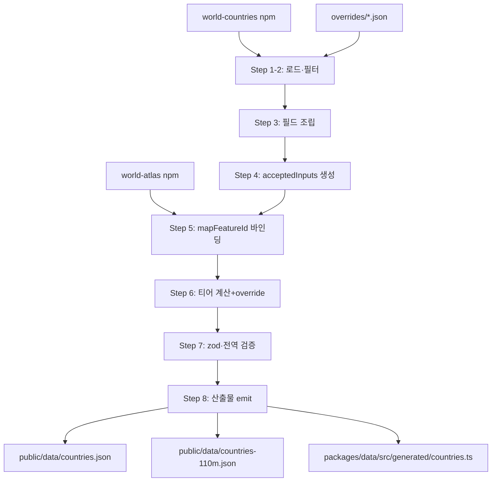

# 02. 데이터 & 콘텐츠 명세

본 문서는 WORLD TYPING의 모든 게임 콘텐츠 데이터(국가 마스터 데이터, 매칭 규칙, 난이도 티어, 대륙 노선, 세계일주 루트, 지도/국기 자산, i18n, 빌드 파이프라인)를 구현 가능한 수준으로 확정한다. 구현 에이전트는 이 문서만으로 `packages/data` 워크스페이스와 `scripts/build-data.ts`를 작성할 수 있어야 한다.

---

## 1. 국가 데이터 스키마

`packages/data/src/types.ts`:

```ts
/** ISO 3166-1 alpha-2, 대문자. 게임 전역의 국가 기본 키 (예: "KR") */
export type CountryId = string;

export type Continent =
  | 'asia'
  | 'europe'
  | 'africa'
  | 'north-america'
  | 'south-america'
  | 'oceania';

export type DifficultyTier = 1 | 2 | 3 | 4 | 5;

export interface Country {
  /** ISO 3166-1 alpha-2 (대문자, 2자). 예: "KR" */
  id: CountryId;
  /** ISO 3166-1 alpha-3 (대문자, 3자). 예: "KOR" */
  iso3: string;
  /** 한국어 통용 국가명(외래어 표기법 기준 통용 표기). 예: "대한민국" */
  nameKo: string;
  /** 영어 통용 국가명(common name). 예: "South Korea" */
  nameEn: string;
  /**
   * 한국어 별칭. nameKo는 포함하지 않는다.
   * 예: ["한국", "남한"]
   */
  aliasesKo: string[];
  /**
   * 영어 별칭. nameEn은 포함하지 않는다.
   * 예: ["Korea", "Republic of Korea", "ROK"]
   */
  aliasesEn: string[];
  /** 게임 자체 대륙 구분(§5의 배정 규칙을 따른 최종값. 소스의 region을 그대로 쓰지 않음) */
  continent: Continent;
  /** UN M49 소지역명(영문). 예: "Eastern Asia". world-countries의 subregion 그대로 */
  subregion: string;
  /** 난이도 티어. §4의 방법론으로 산출 후 curated override 적용된 최종값 */
  difficultyTier: DifficultyTier;
  /** 수도 한국어명. 복수 수도는 대표 1개(행정수도 우선). 예: "서울" */
  capitalKo: string;
  /** 수도 영어명. 예: "Seoul" */
  capitalEn: string;
  /** 국기 이모지(리저널 인디케이터 2코드포인트). 예: "🇰🇷" */
  flagEmoji: string;
  /** 인구(정수, 최신 추정치. 소스: world-countries → override 가능) */
  population: number;
  /** [위도, 경도] (국가 중심점, world-countries latlng 그대로) */
  latlng: [number, number];
  /**
   * world-atlas(countries-110m.json) geometry의 id와 매칭하기 위한 값.
   * ISO 3166-1 numeric을 3자리 0-패딩 문자열로. 예: "410"(KR), "076"(BR).
   * topojson에 지오메트리가 없는 초소국(모나코 등)은 null → 지도에는 점(circle)으로 렌더.
   */
  mapFeatureId: string | null;
  /**
   * 정답으로 인정되는 한국어 입력 전체(정규화 완료 상태로 빌드 시 생성).
   * = normalizeKo(nameKo) ∪ normalizeKo(aliasesKo[]). 중복 제거, 원본 순서 유지.
   */
  acceptedInputsKo: string[];
  /**
   * 정답으로 인정되는 영어 입력 전체(정규화 완료 상태로 빌드 시 생성).
   * = normalizeEn(nameEn) ∪ normalizeEn(aliasesEn[]) ∪ 규칙 기반 변형(§3.4).
   */
  acceptedInputsEn: string[];
}

/** 빌드 산출물 countries.json의 루트 형태 */
export interface CountriesDataset {
  /** 데이터 스키마 버전. 매칭 로직과 호환성 체크에 사용 */
  schemaVersion: 2;
  /** 빌드 시각 ISO8601 */
  builtAt: string;
  /** 소스 패키지 버전 기록(재현성) */
  sources: { worldCountries: string; worldAtlas: string };
  countries: Country[];
}
```

검증용 zod 스키마(`packages/data/src/schema.ts`)도 동일 형태로 작성하고, 빌드 마지막 단계에서 전체 레코드를 파싱 검증한다(§10 Step 7).

**수록 범위(콘텐츠 세트)**: 기본 세트 `un195` = UN 회원국 193 + 옵서버 2(바티칸 VA, 팔레스타인 PS) = **195개국**. 대만(TW)·코소보(XK)·서사하라(EH)는 `extended` 세트로 데이터에는 포함하되 v1 랭킹 모드에서는 제외한다(§12 정책 참조). `countries.json`에는 195 + 3 = 198개 레코드가 들어가고, 각 모드가 어떤 세트를 쓰는지는 콘텐츠 정의(§5, §6)에서 id 리스트로 명시한다.

---

## 2. 데이터 소스와 라이선스

| 소스 | 용도 | 획득 방법 | 라이선스 | 비고 |
|---|---|---|---|---|
| **world-countries** (npm, mledoze/countries) v5.x | 국가 기본 데이터의 단일 원천: cca2/cca3/ccn3, 영문 common/official명, `translations.kor`(한국어 공식/통용명), capital(영문), region/subregion, latlng, population, flag emoji, altSpellings | `npm i world-countries` 후 `import countries from 'world-countries'` — **빌드 시 정적 import, 런타임 네트워크 없음** | **ODbL 1.0** | 파생 데이터셋(countries.json) 배포 시 출처 고지 + ODbL 링크를 게임 크레딧 페이지에 표기해야 함 |
| **world-atlas** (npm) v2.0.2 | 지도 topojson: `countries-110m.json`, `land-110m.json` | `npm i world-atlas` 후 `node_modules/world-atlas/countries-110m.json` 복사 | **ISC** (데이터 원천 Natural Earth는 **public domain**) | geometry id = ISO numeric 문자열 |
| **Natural Earth** | world-atlas의 원천. 직접 사용 안 함 | — | public domain | 크레딧에 "Made with Natural Earth" 표기(권장 사항) |
| **REST Countries API** (restcountries.com v3.1) | 사용하지 않음(참고용). world-countries와 동일 데이터의 API 버전 | — | MPL 2.0 | 런타임 외부 API 의존을 만들지 않기 위해 배제. 필드 확인용 레퍼런스로만 |
| **Wikidata** (query.wikidata.org SPARQL) | **수도 한국어명** 1회성 시드 추출 (`P36` capital → `rdfs:label@ko`) | 빌드 파이프라인이 아닌 별도 시드 스크립트 `scripts/seed-capitals-ko.ts`로 1회 실행 → 결과를 저장소에 커밋 | **CC0** | 이후에는 커밋된 override 파일이 원천 |
| **flag-icons** (npm, lipis/flag-icons) v7.x | 국기 SVG (§8에서 채택) | `npm i flag-icons` | **MIT** | |
| **직접 큐레이션 override** (저장소 내 커밋) | 한국어 표기 교정, 별칭, 수도 한국어명, 인지도 점수, 티어 override | `packages/data/overrides/*.json` | 자체 저작(프로젝트 라이선스) | 아래 상세 |

### 한글 국가명/수도 확보 방법 (구체 절차)

1. **국가명(ko)**: `world-countries`의 `translations.kor.common`을 1차값으로 사용. 예: KR → "한국"이 아니라 "대한민국"으로 나오는 등 소스 표기가 게임 통용 표기와 다른 경우가 있으므로, `overrides/names.ko.json`으로 최종 확정한다.
   ```json
   // packages/data/overrides/names.ko.json — 소스 표기가 부적절한 것만 기재
   {
     "KR": "대한민국",
     "KP": "북한",
     "US": "미국",
     "GB": "영국",
     "CZ": "체코",
     "TR": "튀르키예",
     "CI": "코트디부아르",
     "MK": "북마케도니아",
     "SZ": "에스와티니",
     "TL": "동티모르",
     "CG": "콩고 공화국",
     "CD": "콩고 민주 공화국"
   }
   ```
   빌드 시 override에 없는 국가는 `translations.kor.common`을 그대로 쓰고, 그것도 없으면 **빌드 실패**(누락을 조용히 넘기지 않는다).
2. **수도(ko)**: 소스에 한국어 수도명이 없으므로 `scripts/seed-capitals-ko.ts`가 Wikidata SPARQL로 198개국 수도 한국어 라벨을 뽑아 `overrides/capitals.ko.json`을 생성 → 사람이 검수 후 커밋. SPARQL:
   ```sparql
   SELECT ?iso2 ?capitalKo WHERE {
     ?country wdt:P297 ?iso2 ; wdt:P36 ?capital .
     ?capital rdfs:label ?capitalKo . FILTER(LANG(?capitalKo) = "ko")
   }
   ```
   복수 수도 국가는 대표 1개를 수동 확정한다: ZA→"프리토리아", BO→"라파스", LK→"스리자야와르데네푸라코테", MY→"쿠알라룸푸르", TZ→"도도마", CI→"야무수크로", BI→"기테가".
3. **별칭(ko/en)**: 전량 수동 큐레이션 `overrides/aliases.json` (§3.4에 규칙과 필수 목록 명시).

---

## 3. 정답 매칭 규칙과 알고리즘

매칭은 클라이언트(즉시 피드백)와 서버(멀티플레이 검증, `packages/data`를 Workers에서 공유)에서 **동일 코드**로 실행된다. 순수 함수, 의존성 0.

### 3.1 상태 모델

입력 필드의 매 keystroke마다 현재 입력 문자열 전체를 평가해 3-상태를 반환한다.

```ts
export type MatchState =
  | 'EXACT'   // acceptedInputs 중 하나와 완전 일치 → 정답 처리, 다음 국가로
  | 'PREFIX'  // 어떤 acceptedInput의 접두(조합 중 포함) → 계속 입력
  | 'MISS';   // 어떤 것의 접두도 아님 → 오타 카운트 +1, 입력 필드 빨간 플래시
```

- `EXACT` 판정 즉시 필드를 비우고 다음 국가 제시. Enter 키 불필요(METRO TYPING과 동일한 자동 확정).
- `MISS`는 "직전 상태가 PREFIX였는데 이번 keystroke로 MISS가 됨"일 때 1회 카운트하고, **마지막으로 조합/입력된 문자만 제거**(전체 클리어가 아님)한다. 한글 IME 조합 중 문자는 compositionupdate 이벤트의 조합 문자열로 평가하되 MISS여도 조합을 강제로 끊지 않고 시각 피드백만 준다(IME 강제 개입은 브라우저별로 불안정하므로 금지). 정확도 계산 규칙은 04 게임플레이 문서가 이 3-상태를 소비한다.

### 3.2 정규화 (빌드 시 + 런타임 동일 함수)

```ts
/** 영어: NFD → 결합 다이어크리틱 제거 → lowercase → 공백/구두점 제거 */
export function normalizeEn(s: string): string {
  return s
    .normalize('NFD')
    .replace(/[\u0300-\u036f]/g, '')      // é→e, ô→o (Côte d'Ivoire 대응)
    .toLowerCase()
    .replace(/[\s.\-'’`,()]/g, '');       // 공백·마침표·하이픈·아포스트로피·쉼표·괄호 제거
}
// normalizeEn("Côte d'Ivoire") === "cotedivoire"
// normalizeEn("United States") === "unitedstates"

/** 한국어: NFC → 공백/구두점/가운뎃점 제거. 대소문자 개념 없음 */
export function normalizeKo(s: string): string {
  return s.normalize('NFC').replace(/[\s.\-·,()]/g, '');
}
// normalizeKo("파푸아 뉴기니") === "파푸아뉴기니"
```

`acceptedInputsKo/En`은 빌드 시 이미 이 함수를 통과한 값이므로, 런타임에는 **사용자 입력만** 정규화하면 된다.

### 3.3 한글 자모 분해 프리픽스 매칭

**문제**: 두벌식 IME는 조합 중 음절이 목표 문자열의 음절과 다르다. 목표 "가나"를 칠 때 keystroke 순서는 ㄱ→"ㄱ", ㅏ→"가", ㄴ→"**간**"(받침으로 임시 결합), ㅏ→"가나". 음절 단위 `startsWith` 비교면 "간" 시점에 오답 판정이 나는 치명적 버그가 생긴다. **해결**: 입력과 목표를 모두 자모(jamo) 시퀀스로 분해해 자모 수준에서 접두 비교한다. 위 예에서 "간"→`ㄱㅏㄴ`은 "가나"→`ㄱㅏㄴㅏ`의 접두이므로 PREFIX가 유지된다.

분해 규칙:
- 완성형 음절(U+AC00–U+D7A3)은 초성/중성/종성 인덱스로 분해.
- **복합 중성은 단모음 시퀀스로 추가 분해**: ㅘ→ㅗㅏ, ㅙ→ㅗㅐ, ㅚ→ㅗㅣ, ㅝ→ㅜㅓ, ㅞ→ㅜㅔ, ㅟ→ㅜㅣ, ㅢ→ㅡㅣ. (목표 "과테말라"를 칠 때 ㄱ→ㅗ 시점의 조합 문자 "고"가 접두로 인정되어야 함: `ㄱㅗ` ⊂ `ㄱㅗㅏ…` ✓)
- **복합 종성도 분해**: ㄳ→ㄱㅅ, ㄵ→ㄴㅈ, ㄶ→ㄴㅎ, ㄺ→ㄹㄱ, ㄻ→ㄹㅁ, ㄼ→ㄹㅂ, ㄽ→ㄹㅅ, ㄾ→ㄹㅌ, ㄿ→ㄹㅍ, ㅀ→ㄹㅎ, ㅄ→ㅂㅅ.
- **쌍자음(ㄲㄸㅃㅆㅉ)과 ㅐㅔㅒㅖ는 분해하지 않는다** — 두벌식에서 Shift 1타로 입력되는 단일 keystroke이므로 분해하면 오히려 존재하지 않는 중간 상태를 만든다.
- 낱자모(호환 자모 U+3131–U+3163)가 입력에 그대로 오는 경우(조합 시작 직후)도 동일 테이블로 매핑.

구현(`packages/data/src/hangul.ts`) — 전문:

```ts
const CHO = [
  'ㄱ','ㄲ','ㄴ','ㄷ','ㄸ','ㄹ','ㅁ','ㅂ','ㅃ','ㅅ',
  'ㅆ','ㅇ','ㅈ','ㅉ','ㅊ','ㅋ','ㅌ','ㅍ','ㅎ',
];
const JUNG = [
  'ㅏ','ㅐ','ㅑ','ㅒ','ㅓ','ㅔ','ㅕ','ㅖ','ㅗ','ㅘ',
  'ㅙ','ㅚ','ㅛ','ㅜ','ㅝ','ㅞ','ㅟ','ㅠ','ㅡ','ㅢ','ㅣ',
];
const JONG = [
  '','ㄱ','ㄲ','ㄳ','ㄴ','ㄵ','ㄶ','ㄷ','ㄹ','ㄺ',
  'ㄻ','ㄼ','ㄽ','ㄾ','ㄿ','ㅀ','ㅁ','ㅂ','ㅄ','ㅅ',
  'ㅆ','ㅇ','ㅈ','ㅊ','ㅋ','ㅌ','ㅍ','ㅎ',
];
/** 두벌식 keystroke 단위로의 재분해 테이블 (쌍자음·ㅐㅔㅒㅖ는 미분해) */
const COMPOUND: Record<string, string> = {
  'ㅘ':'ㅗㅏ','ㅙ':'ㅗㅐ','ㅚ':'ㅗㅣ','ㅝ':'ㅜㅓ','ㅞ':'ㅜㅔ','ㅟ':'ㅜㅣ','ㅢ':'ㅡㅣ',
  'ㄳ':'ㄱㅅ','ㄵ':'ㄴㅈ','ㄶ':'ㄴㅎ','ㄺ':'ㄹㄱ','ㄻ':'ㄹㅁ','ㄼ':'ㄹㅂ',
  'ㄽ':'ㄹㅅ','ㄾ':'ㄹㅌ','ㄿ':'ㄹㅍ','ㅀ':'ㄹㅎ','ㅄ':'ㅂㅅ',
};

function expand(jamo: string): string {
  return COMPOUND[jamo] ?? jamo;
}

/** 임의 문자열 → keystroke 수준 자모 시퀀스. 비한글 문자는 그대로 통과 */
export function toJamoSeq(s: string): string {
  let out = '';
  for (const ch of s) {
    const code = ch.codePointAt(0)!;
    if (code >= 0xac00 && code <= 0xd7a3) {
      const idx = code - 0xac00;
      const cho = CHO[Math.floor(idx / 588)];
      const jung = JUNG[Math.floor((idx % 588) / 28)];
      const jong = JONG[idx % 28];
      out += expand(cho) + expand(jung) + (jong ? expand(jong) : '');
    } else if (code >= 0x3131 && code <= 0x3163) {
      out += expand(ch); // 낱자모 (조합 첫 타)
    } else {
      out += ch; // 숫자·라틴 등
    }
  }
  return out;
}
```

매칭 본체(`packages/data/src/match.ts`):

```ts
import { toJamoSeq } from './hangul';
import { normalizeEn, normalizeKo } from './normalize';

export interface CompiledTarget {
  /** acceptedInput 원문(정규화 완료) — UI 힌트 표시용 */
  display: string;
  /** ko: 자모 시퀀스 / en: normalizeEn 결과 */
  key: string;
}

export function compileTargets(c: Country, lang: 'ko' | 'en'): CompiledTarget[] {
  const inputs = lang === 'ko' ? c.acceptedInputsKo : c.acceptedInputsEn;
  return inputs.map((display) => ({
    display,
    key: lang === 'ko' ? toJamoSeq(display) : display,
  }));
}

export function matchInput(
  rawInput: string,
  targets: CompiledTarget[],
  lang: 'ko' | 'en',
): MatchState {
  const norm = lang === 'ko' ? normalizeKo(rawInput) : normalizeEn(rawInput);
  if (norm.length === 0) return 'PREFIX'; // 빈 입력은 항상 유효
  const key = lang === 'ko' ? toJamoSeq(norm) : norm;
  let anyPrefix = false;
  for (const t of targets) {
    if (t.key === key) return 'EXACT';
    if (t.key.startsWith(key)) anyPrefix = true;
  }
  return anyPrefix ? 'PREFIX' : 'MISS';
}
```

**EXACT의 자모 동치 주의**: "간"과 "가나"처럼 자모 시퀀스가 같은데 음절이 다른 경우는 없다(자모→음절 결합은 IME가 결정하며, 같은 자모 시퀀스의 서로 다른 결합은 동일 keystroke 열의 다른 시각 표현일 뿐이다). 따라서 `t.key === key`로 EXACT를 판정해도 안전하다. 단, 목표가 다른 목표의 접두인 경우(예: "가나" GH ⊂ "가봉" 없음—실존 케이스: "인도" IN ⊂ "인도네시아" ID)를 위해 **한 국가의 targets 안에서만** 비교하므로 문제없다. 콘텐츠 제작 시 같은 국가의 acceptedInputs 안에서 한 항목이 다른 항목의 진접두이면 짧은 쪽 EXACT가 우선한다(위 루프가 EXACT를 먼저 반환하므로 자동 보장). 단, **D82(docs/00 §11) 콘텐츠 규칙**: 별칭이 같은 국가의 **표시 정식명 정규화 키의 진접두**가 되는 것은 금지 — 플레이어가 화면 표시명을 그대로 타이핑하는 도중 별칭에서 조기 EXACT가 발화한다(SA "사우디"·CG "콩고"·CD(en) "DRC" 3건 실측, 전부 제거됨). 짧은 쪽이 정식명 자신인 경우(체코⊂체코공화국 등)는 표시명 끝에서 정확히 EXACT라 정상. 위반은 빌드 §10 Step 7-(f)가 에러로 차단한다.

**테스트 케이스(필수 구현, vitest)**:

| 목표 | 입력 시퀀스 | 기대 |
|---|---|---|
| 가나(GH) | "ㄱ"→"가"→"간"→"가나" | P→P→P→**EXACT** |
| 과테말라 | "ㄱ"→"고"→"과"→…"과테말라" | P→P→P→…**EXACT** |
| 대한민국(KR) | "한국" | **EXACT** (별칭) |
| 미국(US) | "일" | **MISS** |
| 벨기에 | "벨"→"벩"(ㄹㄱ 복합 종성 — 도깨비불 임시 상태) | P→**PREFIX** (자모 접두 성립, docs/00 §11-D28. 진짜 오타는 "벨키"→MISS) |
| Côte d'Ivoire(CI) | "cote divoire" | **EXACT** (공백·아포스트로피 무시) |
| United States(US) | "usa" / "america" | **EXACT** |

### 3.4 별칭 큐레이션 규칙과 필수 목록

`overrides/aliases.json` 형식: `{ "US": { "ko": ["미합중국"], "en": ["USA", "United States of America", "America", "US"] }, ... }`

생성 규칙:
- **en 자동 변형**(빌드 시 acceptedInputsEn에 추가): (a) world-countries의 `name.official`, (b) `altSpellings` 중 길이 ≥ 2인 항목, (c) "the "로 시작하면 제거한 형태. 자동 변형 결과가 **다른 국가**의 acceptedInputs와 충돌하면 빌드 에러(§10 Step 7의 전역 유일성 검사).
- **ko 수동 필수 별칭**(최소 세트, 전량 기재):

| id | nameKo | aliasesKo |
|---|---|---|
| KR | 대한민국 | 한국, 남한 |
| KP | 북한 | 조선민주주의인민공화국 |
| US | 미국 | 미합중국 |
| GB | 영국 | 그레이트브리튼 |
| CN | 중국 | 중화인민공화국 |
| TW | 대만 | 타이완 |
| TR | 튀르키예 | 터키 |
| CZ | 체코 | 체코공화국 |
| AE | 아랍에미리트 | UAE, 아랍에미리트연합 |
| CD | 콩고 민주 공화국 | 민주콩고, DR콩고, 콩고민주공화국 |
| CG | 콩고 공화국 | — ("콩고"는 D82로 제거: 표시명 진접두 → 조기 EXACT 유발) |
| MK | 북마케도니아 | 마케도니아 |
| SZ | 에스와티니 | 스와질란드 |
| TL | 동티모르 | 티모르레스테 |
| MM | 미얀마 | 버마 |
| NL | 네덜란드 | 홀란드 |
| CH | 스위스 | 스위스연방 |
| VA | 바티칸 | 바티칸시국, 교황청 |
| RU | 러시아 | 러시아연방 |
| DE | 독일 | 독일연방공화국 |
| SA | 사우디아라비아 | — ("사우디"는 D82로 제거: 표시명 진접두 → 조기 EXACT 유발) |
| NZ | 뉴질랜드 | 신서란 제외 — 등록하지 않음(사어) |

(표에 없는 국가는 aliasesKo = [] 로 시작하고 QA 중 추가한다. "콩고"·"사우디" 단독은 D82로 더 이상 어느 국가의 정답도 아니다 — 각각 CG·SA 표시명의 진접두라 PREFIX로 판정되어 계속 입력해야 한다. 별칭 추가 시 D82 진접두 금지 규칙을 지킬 것. 위반은 빌드 §10 Step 7-(f)가 에러로 차단한다.)

---

## 4. 난이도 티어링 방법론

### 4.1 산식

각 국가의 **친숙도 점수 F(0–100)** 를 계산하고 경계값으로 T1..T5를 배정한다.

```
F = 0.50 × R + 0.35 × P + 0.15 × (100 − L)
```

- **P (인구 점수, 0–100)**: `P = clamp((log10(population) − 5) / 4.2 × 100, 0, 100)`
  - 인구 10만(10^5) → 0점, 인구 약 15.8억(10^9.2) → 100점. 예: 중국 14.1억 → P≈97, 한국 5,170만 → P≈65, 투발루 1.1만 → P=0.
- **R (인지도 점수, 0–100)**: 규칙 기반 가산으로 시드 생성 후 `overrides/recognition.json`에 커밋하여 사람이 검수·조정(최종 원천은 override 파일).
  - G20 회원국: +40
  - OECD 회원국: +20
  - 인천공항 직항 노선 존재 국가(2025 기준): +15
  - FIFA 월드컵 본선 진출 이력(1998–2026): +15
  - 하계 올림픽 개최 이력: +10
  - 합계 100 초과 시 100으로 클램프
- **L (이름 길이 페널티, 0–100)**: 한국어 표기 음절 수(공백 제외) 기준 — ≤3음절: 0, 4음절: 25, 5음절: 45, 6–7음절: 70, ≥8음절: 100. (영어 모드도 동일 티어를 사용한다. 언어별 티어 분리는 v2 과제.)

### 4.2 경계값

| F 범위 | 티어 | 의도 |
|---|---|---|
| F ≥ 72 | **T1** | 초등학생도 아는 나라 |
| 55 ≤ F < 72 | **T2** | 뉴스에 자주 나오는 나라 |
| 38 ≤ F < 55 | **T3** | 이름은 들어봤는데 위치는 애매 |
| 22 ≤ F < 38 | **T4** | 퀴즈쇼 수준 |
| F < 22 | **T5** | 지리 덕후 영역 |

산식 결과가 직관과 어긋나는 국가는 `overrides/tiers.json`으로 강제 배정한다(예: 인구가 작아도 인지도가 절대적인 바티칸·모나코·싱가포르, 인구는 크지만 생소한 국가들). override는 최종값이며 빌드 로그에 "formula T? → override T?"로 남긴다.

### 4.3 대표 30개국 배정 예시 (산식 계산치 → 최종 티어)

| id | nameKo | population | R | P | L(음절) | F | 티어 |
|---|---|---:|---:|---:|---|---:|---|
| US | 미국 | 341,000,000 | 100 | 84 | 0 (2) | 94 | **T1** |
| JP | 일본 | 123,300,000 | 100 | 74 | 0 (2) | 91 | **T1** |
| CN | 중국 | 1,410,000,000 | 90 | 97 | 0 (2) | 94 | **T1** |
| GB | 영국 | 68,300,000 | 100 | 68 | 0 (2) | 89 | **T1** |
| FR | 프랑스 | 68,200,000 | 100 | 68 | 0 (3) | 89 | **T1** |
| DE | 독일 | 84,500,000 | 100 | 70 | 0 (2) | 90 | **T1** |
| KR | 대한민국 | 51,700,000 | 100 | 65 | 25 (4) | 84 | **T1** |
| IT | 이탈리아 | 58,900,000 | 100 | 66 | 25 (4) | 84 | **T1** |
| AU | 호주 | 26,600,000 | 85 | 57 | 0 (2) | 78 | **T1** |
| BR | 브라질 | 216,400,000 | 70 | 79 | 0 (3) | 78 | **T1** |
| IN | 인도 | 1,428,600,000 | 70 | 97 | 0 (2) | 84 | **T1** |
| CA | 캐나다 | 40,100,000 | 85 | 62 | 0 (3) | 79 | **T1** |
| RU | 러시아 | 144,400,000 | 70 | 75 | 0 (3) | 76 | **T1** |
| MX | 멕시코 | 128,500,000 | 70 | 74 | 0 (3) | 76 | **T1** |
| TH | 태국 | 71,800,000 | 30 | 68 | 0 (2) | 54 | T3→**T2** (override: 여행 인지도) |
| VN | 베트남 | 98,900,000 | 30 | 71 | 0 (3) | 55 | **T2** |
| TR | 튀르키예 | 85,300,000 | 55 | 70 | 25 (4) | 63 | **T2** |
| EG | 이집트 | 112,700,000 | 25 | 72 | 0 (3) | 53 | T3→**T2** (override: 피라미드 인지도) |
| AR | 아르헨티나 | 45,800,000 | 55 | 63 | 45 (5) | 58 | **T2** |
| ES | 스페인 | 48,400,000 | 85 | 64 | 0 (3) | 80 | **T1** |
| PL | 폴란드 | 36,800,000 | 35 | 61 | 0 (3) | 54 | **T3** |
| PT | 포르투갈 | 10,500,000 | 55 | 48 | 25 (4) | 55 | **T2** |
| KZ | 카자흐스탄 | 19,600,000 | 15 | 54 | 45 (5) | 34 | **T4** |
| PE | 페루 | 34,000,000 | 25 | 60 | 0 (2) | 49 | **T3** |
| MA | 모로코 | 37,800,000 | 25 | 61 | 0 (3) | 49 | **T3** |
| KE | 케냐 | 55,100,000 | 10 | 65 | 0 (2) | 43 | **T3** |
| UZ | 우즈베키스탄 | 35,200,000 | 15 | 61 | 70 (6) | 33 | **T4** |
| BF | 부르키나파소 | 23,000,000 | 0 | 56 | 70 (6) | 24 | **T4** |
| TV | 투발루 | 11,000 | 0 | 0 | 0 (3) | 15 | **T5** |
| KM | 코모로 | 850,000 | 0 | 22 | 0 (3) | 23 | T4→**T5** (override: 인지도 극히 낮음) |

티어별 목표 분포(198개국 기준, override로 맞춘다): T1=20, T2=30, T3=45, T4=55, T5=48(±5 허용).

**티어 모드 플레이 규칙**: 티어 선택 시 해당 티어 국가 풀에서 셔플(시드 셔플 — 06 멀티플레이 문서의 seed 규격과 공유) 후 20개를 출제한다. T5는 풀이 48개이므로 라운드마다 다른 20개가 나온다.

---

## 5. 대륙 그룹핑과 "노선" 진행 순서

### 5.1 대륙 배정 규칙 (world-countries region → 게임 continent)

- 기본: `region` "Asia"→asia, "Europe"→europe, "Africa"→africa, "Oceania"→oceania, "Americas"는 `subregion`으로 분리: "South America"→south-america, 그 외(Northern America, Central America, Caribbean)→north-america.
- 명시적 override: **RU→europe**(수도 기준), **TR→asia**, **CY→europe**, **GE/AM/AZ→asia**, **TL→asia**, **EH→africa**.
- 결과 국가 수(`un195` 기준): **asia 47, europe 45, africa 54, north-america 23, south-america 12, oceania 14 = 195**. (extended 포함 시 asia 48(TW), europe 46(XK), africa 55(EH).)

### 5.2 노선 순서 규칙

지하철 노선처럼 **지리적으로 이어지는 한 줄**이어야 한다. 규칙:
1. 시작점은 해당 대륙에서 한국 사용자에게 가장 친숙한 국가(아시아=KR, 유럽=PT 서단, 아프리카=EG, 북미=CA, 남미=CO, 오세아니아=AU).
2. 육상 인접국 우선, 없으면 최단 해상/공로 인접국으로 연결하는 스네이크(snake) 경로. 경도 방향을 한 번에 한 방향으로만 쓸어 지그재그(왕복 최소화).
3. 섬나라는 가장 가까운 본토 국가 뒤에 삽입.
4. 순서는 데이터가 아니라 **콘텐츠 정의 파일** `packages/data/content/routes.ts`에 id 배열 상수로 커밋한다(빌드 시 존재/중복 검증).

### 5.3 아시아 노선 (완전한 순서, 47개)

```ts
export const ROUTE_ASIA: CountryId[] = [
  'KR','JP','KP','CN','MN',                            // 동아시아
  'PH','VN','LA','KH','TH','MM','MY','SG','BN','ID','TL', // 동남아시아
  'BD','BT','NP','IN','LK','MV','PK','AF',             // 남아시아
  'TJ','KG','KZ','UZ','TM',                            // 중앙아시아
  'IR','AZ','AM','GE','TR',                            // 서진: 이란→캅카스→아나톨리아
  'IQ','SY','LB','IL','PS','JO',                       // 레반트
  'SA','KW','BH','QA','AE','OM','YE',                  // 아라비아반도
];
```

### 5.4 유럽 노선 (완전한 순서, 45개)

```ts
export const ROUTE_EUROPE: CountryId[] = [
  'PT','ES','AD','FR','MC',                    // 이베리아→서유럽
  'IE','GB','IS',                              // 섬나라 클러스터
  'NL','BE','LU','DE',                         // 저지대→독일
  'DK','NO','SE','FI',                         // 북유럽
  'EE','LV','LT','PL',                         // 발트→폴란드
  'CZ','SK','AT','LI','CH',                    // 중부
  'IT','SM','VA','MT',                         // 이탈리아반도+몰타
  'SI','HR','BA','ME','AL','MK','GR',          // 발칸 서안 남하
  'RS','BG','RO','HU',                         // 발칸 내륙 북상
  'MD','UA','BY','RU','CY',                    // 동유럽, 키프로스는 종점 보너스역
];
```

### 5.5 나머지 대륙 (방법론 + 대표 순서 앞 12개)

- **africa (54)**: EG에서 시작, 북아프리카를 서진(EG→LY→TN→DZ→MA), 서아프리카 해안 남하(MR→SN→GM→GW→GN→SL→LR→CI→GH→TG→BJ→NG…), 중부(CM→GQ→GA→CG→CD…) → 남부(→ZA…) → 동아프리카 북상(→MZ→MW→TZ→KE→ET…)으로 마무리. 섬나라(CV, ST, KM, MG, MU, SC)는 인접 해안국 뒤 삽입.
- **north-america (23)**: CA→US→MX→(중미 남하) GT→BZ→SV→HN→NI→CR→PA→(카리브 서→동) CU→JM→HT→DO→BS→…→TT.
- **south-america (12)**: CO→VE→GY→SR→BR→PY→UY→AR→CL→BO→PE→EC (북안 동진 후 대륙 시계방향).
- **oceania (14)**: AU→NZ→PG→SB→VU→FJ→TO→WS→TV→KI→NR→MH→FM→PW (멜라네시아→폴리네시아→미크로네시아).

---

## 6. 세계일주 루트 (마라톤 모드, 50개국)

**설계 근거**: 인천 출발 → 태평양을 동쪽으로 건너 아메리카 종단 → 남태평양 횡단으로 오세아니아 → 동남아·남아시아 → 중동·아프리카 종단 후 → 유럽을 남서단부터 크게 한 바퀴 → 중앙아시아 실크로드로 귀환하는 **동회(東回) 일주**. 모든 인접 구간은 실제 정기 항공 노선 또는 육로로 연결 가능하다(장거리 점프 구간: ICN→NRT→LAX, 산티아고→오클랜드, 케이프타운→카사블랑카, 트빌리시→알마티). 6대륙을 모두 1회 이상 경유하며, 티어가 T1~T4 사이를 오르내리도록 배열해 마라톤 중 난이도 리듬을 만든다.

```ts
export const ROUTE_WORLD_TOUR: CountryId[] = [
  // Leg 1 — 동아시아 출발, 태평양 횡단 (1–5)
  'KR','JP','US','CA','MX',
  // Leg 2 — 카리브·중미·남미 종단 (6–12)
  'CU','PA','CO','PE','BR','AR','CL',
  // Leg 3 — 남태평양 → 오세아니아 (13–14)
  'NZ','AU',
  // Leg 4 — 동남아시아 (15–20)
  'ID','SG','MY','TH','KH','VN',
  // Leg 5 — 남아시아 → 중동 (21–23)
  'IN','NP','AE',
  // Leg 6 — 아프리카 종단: 북동→동→남→북서 (24–27)
  'EG','KE','ZA','MA',
  // Leg 7 — 유럽 대순환: 남서단 → 북상 → 동진 → 남하 (28–44)
  'PT','ES','FR','GB','IE','IS','NO','SE','FI','EE',
  'PL','DE','NL','BE','CH','IT','GR',
  // Leg 8 — 실크로드 귀환 (45–50)
  'TR','GE','KZ','UZ','MN','CN',
]; // 50개국. 완주 시 종착 연출: CN → 서울 도착
```

빌드 검증: 50개 전부 `un195` 세트에 존재, 중복 없음, 6개 continent 모두 포함 — 실패 시 빌드 에러.

---

## 7. 지도 렌더링 데이터

- **파일**: `world-atlas@2.0.2`의 `countries-110m.json`(약 108KB, gzip 후 ~60KB)을 빌드 시 `public/data/`로 복사. 110m 해상도는 국가 실루엣 강조용으로 충분하며 50m(~700KB)은 v1에서 불필요.
- **Projection**: `d3-geo`의 **`geoNaturalEarth1()`** 를 표준으로 한다. `fitSize([width, height], { type: 'Sphere' })`로 컨테이너에 맞춤. 대륙 모드에서는 해당 대륙 국가들의 merged bounds로 `fitExtent` 줌.
- **numeric ↔ alpha-2 매핑**: topojson geometry의 `id`는 ISO numeric 문자열(예: `"410"`)이다. 빌드 시 world-countries의 `ccn3` 필드로 역인덱스를 생성해 `countries.json`의 `mapFeatureId`에 3자리 0-패딩 문자열로 넣는다(`String(ccn3).padStart(3,'0')` — world-countries의 ccn3는 이미 "076" 형태의 문자열이므로 그대로 사용). 렌더러는 `Map<string /*featureId*/, CountryId>`를 런타임에 1회 구성한다.
- **매칭 실패 처리**: (a) `mapFeatureId === null`인 초소국(MC, SM, VA, LI, AD, MT, SG, BH, MV, TV, NR 등 110m에 폴리곤이 없거나 지나치게 작은 국가)은 `latlng`를 projection에 통과시켜 반경 4px circle로 렌더. (b) topojson에는 있으나 우리 데이터셋에 없는 feature(예: 그린란드 — 덴마크령, 프랑스령 기아나 병합 등 속령)는 중립 회색 `--map-neutral`으로만 칠하고 인터랙션 없음. (c) 코소보는 world-atlas에서 id가 없거나 `-99`류로 나올 수 있으므로 `properties.name === 'Kosovo'`로 식별해 XK에 수동 바인딩한다(빌드 스크립트에서 처리, §10 Step 5).

```mermaid
flowchart LR
  A[countries-110m.json<br/>geometry.id = "410"] -->|featureId → alpha-2 Map| B[Country "KR"]
  C[world-countries ccn3 "410"] -->|빌드 시 역인덱스| B
  B -->|latlng fallback| D[초소국 circle 렌더]
```

---

## 8. 국기 자산

| 방식 | 라이선스 | 장점 | 치명적 단점 |
|---|---|---|---|
| 유니코드 이모지 (`flagEmoji`) | 폰트 내장 | 0바이트 | **Windows Chrome/Edge는 국기 이모지를 렌더하지 않고 "KR" 두 글자로 표시** — 데스크톱 타이핑 게임에 부적합 |
| **flag-icons** (lipis/flag-icons v7) | **MIT** | 4:3/1:1 SVG 전 국가, CSS 클래스(`fi fi-kr`) 한 줄, XK 포함 | 스프라이트 CSS ~수십 KB (허용) |
| twemoji SVG | 그래픽 CC-BY 4.0(저작자 표시 필수) + 코드 MIT | 이모지 룩 통일 | attribution 요구, 국기 디자인이 단순화됨 |

**결정: flag-icons를 표준 채택**(MIT, attribution 부담 없음, Windows 문제 해결). 사용법: `import 'flag-icons/css/flag-icons.min.css'` 후 `<span class="fi fi-${id.toLowerCase()}"></span>`. `flagEmoji` 필드는 OG 이미지/공유 텍스트("🇰🇷 3,921 CPM")용으로 유지한다. 코드 생성은 리저널 인디케이터 산술로 빌드 시 계산: `String.fromCodePoint(...[...id].map(c => 0x1f1e6 + c.charCodeAt(0) - 65))`.

---

## 9. i18n 문자열 카탈로그

UI 언어(ko/en)와 **출제 언어**(타이핑 대상 언어)는 별개 설정이다. 카탈로그는 UI 언어만 담당하고, 국가명은 항상 `countries.json`에서 온다(카탈로그에 국가명을 중복 수록하지 않는다).

`packages/i18n/ko.json` / `en.json` — 평면 네임스페이스 키, ICU 플레이스홀더:

```json
{
  "app.title": "WORLD TYPING",
  "app.tagline.ko": "세계를 타이핑하다",

  "menu.single": "싱글플레이",
  "menu.multi": "멀티 레이스",
  "menu.ranking": "랭킹",
  "menu.settings": "설정",

  "mode.continent.title": "대륙 노선",
  "mode.continent.desc": "{continent} {count}개국을 순서대로",
  "mode.tier.title": "난이도 티어",
  "mode.tier.desc": "티어 {tier} · 20개국 랜덤",
  "mode.worldtour.title": "세계일주",
  "mode.worldtour.desc": "50개국 마라톤",

  "continent.asia": "아시아",
  "continent.europe": "유럽",
  "continent.africa": "아프리카",
  "continent.north-america": "북아메리카",
  "continent.south-america": "남아메리카",
  "continent.oceania": "오세아니아",

  "game.start.tap": "여권을 눌러 출발",
  "game.progress": "{current} / {total}",
  "game.next": "다음 목적지",
  "result.cpm": "타수 {cpm} CPM",
  "result.accuracy": "정확도 {accuracy}%",
  "result.time": "기록 {seconds}초",
  "result.share": "기록 공유하기",

  "multi.room.create": "방 만들기",
  "multi.room.join": "코드로 입장",
  "multi.countdown": "{n}초 후 출발",
  "multi.rank.finish": "{rank}위로 도착!",

  "settings.inputLang": "타이핑 언어",
  "settings.inputLang.ko": "한국어",
  "settings.inputLang.en": "English",

  "error.network": "연결이 끊겼어요. 다시 시도해 주세요.",
  "notice.disputed": "국가 표기는 게임 목적의 편의상 구분이며 정치적 입장을 나타내지 않습니다."
}
```

규칙: (1) 키는 `영역.의미[.상세]` 소문자-하이픈, 최대 3단계. (2) `en.json`은 `ko.json`과 **키 집합이 완전히 동일**해야 하며 CI에서 diff 검사. (3) 복수형이 필요한 en 문자열은 ICU plural(`{count, plural, one {...} other {...}}`) 사용. (4) 라이브러리는 의존성 최소화를 위해 자체 5줄 포매터(`t(key, params)`)로 충분 — ICU plural이 필요한 키가 5개 미만이면 분기 하드코딩 허용.

---

## 10. 데이터 빌드 파이프라인

위치 `scripts/build-data.ts`, 실행 `pnpm build:data` (`tsx scripts/build-data.ts`). **네트워크 접근 없음** — 모든 원천은 npm 패키지와 저장소 내 override 파일. 결정적(deterministic) 출력이어야 하며 CI에서 `git diff --exit-code`로 산출물 신선도를 검사한다.



단계별 명세:

1. **로드**: `import raw from 'world-countries'`; overrides 디렉터리의 `names.ko.json`, `aliases.json`, `capitals.ko.json`, `recognition.json`, `tiers.json`, `population.json`(선택), `content-sets.json`(un195/extended id 리스트) 로드.
2. **필터**: `content-sets.json`의 id 합집합(198개)에 해당하는 레코드만 추출. 소스에 없는 id가 있으면 throw. XK는 world-countries에 있음(cca2 "XK", ccn3 없음 → mapFeatureId는 Step 5에서 이름 바인딩).
3. **필드 조립**: `id=cca2`, `iso3=cca3`, `nameEn=name.common`, `nameKo=overrides.names ?? translations.kor.common ?? throw`, `subregion`, `capitalEn=capital[0] ?? ''`(VA처럼 수도=국가인 경우 국가명), `capitalKo=overrides.capitals[id] ?? throw`, `population=overrides.population[id] ?? population`, `latlng`, `flagEmoji`(리저널 인디케이터 산술 생성), `continent`(§5.1 규칙 함수).
4. **acceptedInputs 생성**: §3.2 정규화 + §3.4 자동 변형 규칙 적용, 순서 = [정식명, ...수동 별칭, ...자동 변형], `Array.from(new Set(...))`.
5. **mapFeatureId 바인딩**: `world-atlas/countries-110m.json`의 `objects.countries.geometries[].id` 집합 구성 → `ccn3` 3자리 문자열이 집합에 있으면 채택, 없으면 null. 코소보 특례: `geometries.find(g => g.properties?.name === 'Kosovo')`의 id를 XK에 바인딩(없으면 null). 바인딩 결과 통계(매칭 n, circle-fallback m)를 stdout에 출력.
6. **티어 계산**: §4.1 산식으로 F 계산 → 경계값 배정 → `overrides/tiers.json` 적용. 티어별 분포를 stdout 표로 출력하고 목표 분포 ±5 이탈 시 경고(에러 아님).
7. **검증**: (a) zod 전체 파싱, (b) **acceptedInputs 전역 유일성** — 언어별로 `Map<normalizedInput, CountryId>`를 만들며 서로 다른 국가가 같은 입력을 가지면 throw(예: "콩고" 충돌 방지), (c) 한국어 acceptedInputs의 **자모 시퀀스 유일성**도 동일 검사, (d) routes.ts의 모든 id 존재·중복·§6 검증, (e) i18n ko/en 키 집합 동일성, (f) **국가 내부 진접두-별칭 금지(D82)** — 언어별 canonical 키(acceptedInputs[0]; ko는 자모 시퀀스)에 대해 별칭 유래 입력의 키가 진접두이면 throw.
8. **emit**: (a) `public/data/countries.json` — `JSON.stringify(dataset)`(공백 없음, 키 순서 고정: id 오름차순 정렬), (b) `public/data/countries-110m.json` 복사, (c) `packages/data/src/generated/countries.ts` — `export const COUNTRIES = [...] as const satisfies Country[]` 형태로 **Workers 서버 번들용** 산출(D1/KV 조회 없이 메모리 상수로 검증 가능, 198개 × ~300B ≈ 60KB로 Workers 번들 한도에 무해), (d) SHA-256 해시를 `public/data/manifest.json`에 기록(클라이언트 캐시 버스팅 키).

---

## 11. countries.json 샘플 항목 10개 (완전한 실데이터)

```json
[
  {
    "id": "KR", "iso3": "KOR", "nameKo": "대한민국", "nameEn": "South Korea",
    "aliasesKo": ["한국", "남한"],
    "aliasesEn": ["Korea", "Republic of Korea", "ROK"],
    "continent": "asia", "subregion": "Eastern Asia", "difficultyTier": 1,
    "capitalKo": "서울", "capitalEn": "Seoul", "flagEmoji": "🇰🇷",
    "population": 51712619, "latlng": [37, 127.5], "mapFeatureId": "410",
    "acceptedInputsKo": ["대한민국", "한국", "남한"],
    "acceptedInputsEn": ["southkorea", "korea", "republicofkorea", "rok"]
  },
  {
    "id": "US", "iso3": "USA", "nameKo": "미국", "nameEn": "United States",
    "aliasesKo": ["미합중국"],
    "aliasesEn": ["USA", "United States of America", "America", "US"],
    "continent": "north-america", "subregion": "North America", "difficultyTier": 1,
    "capitalKo": "워싱턴 D.C.", "capitalEn": "Washington, D.C.", "flagEmoji": "🇺🇸",
    "population": 341000000, "latlng": [38, -97], "mapFeatureId": "840",
    "acceptedInputsKo": ["미국", "미합중국"],
    "acceptedInputsEn": ["unitedstates", "usa", "unitedstatesofamerica", "america", "us"]
  },
  {
    "id": "JP", "iso3": "JPN", "nameKo": "일본", "nameEn": "Japan",
    "aliasesKo": [], "aliasesEn": ["Nippon"],
    "continent": "asia", "subregion": "Eastern Asia", "difficultyTier": 1,
    "capitalKo": "도쿄", "capitalEn": "Tokyo", "flagEmoji": "🇯🇵",
    "population": 123294513, "latlng": [36, 138], "mapFeatureId": "392",
    "acceptedInputsKo": ["일본"],
    "acceptedInputsEn": ["japan", "nippon"]
  },
  {
    "id": "FR", "iso3": "FRA", "nameKo": "프랑스", "nameEn": "France",
    "aliasesKo": ["불란서"], "aliasesEn": ["French Republic"],
    "continent": "europe", "subregion": "Western Europe", "difficultyTier": 1,
    "capitalKo": "파리", "capitalEn": "Paris", "flagEmoji": "🇫🇷",
    "population": 68170228, "latlng": [46, 2], "mapFeatureId": "250",
    "acceptedInputsKo": ["프랑스", "불란서"],
    "acceptedInputsEn": ["france", "frenchrepublic"]
  },
  {
    "id": "DE", "iso3": "DEU", "nameKo": "독일", "nameEn": "Germany",
    "aliasesKo": ["독일연방공화국"], "aliasesEn": ["Deutschland", "Federal Republic of Germany"],
    "continent": "europe", "subregion": "Western Europe", "difficultyTier": 1,
    "capitalKo": "베를린", "capitalEn": "Berlin", "flagEmoji": "🇩🇪",
    "population": 84482267, "latlng": [51, 9], "mapFeatureId": "276",
    "acceptedInputsKo": ["독일", "독일연방공화국"],
    "acceptedInputsEn": ["germany", "deutschland", "federalrepublicofgermany"]
  },
  {
    "id": "BR", "iso3": "BRA", "nameKo": "브라질", "nameEn": "Brazil",
    "aliasesKo": [], "aliasesEn": ["Brasil", "Federative Republic of Brazil"],
    "continent": "south-america", "subregion": "South America", "difficultyTier": 1,
    "capitalKo": "브라질리아", "capitalEn": "Brasília", "flagEmoji": "🇧🇷",
    "population": 216422446, "latlng": [-10, -55], "mapFeatureId": "076",
    "acceptedInputsKo": ["브라질"],
    "acceptedInputsEn": ["brazil", "brasil", "federativerepublicofbrazil"]
  },
  {
    "id": "EG", "iso3": "EGY", "nameKo": "이집트", "nameEn": "Egypt",
    "aliasesKo": [], "aliasesEn": ["Arab Republic of Egypt"],
    "continent": "africa", "subregion": "Northern Africa", "difficultyTier": 2,
    "capitalKo": "카이로", "capitalEn": "Cairo", "flagEmoji": "🇪🇬",
    "population": 112716598, "latlng": [27, 30], "mapFeatureId": "818",
    "acceptedInputsKo": ["이집트"],
    "acceptedInputsEn": ["egypt", "arabrepublicofegypt"]
  },
  {
    "id": "KZ", "iso3": "KAZ", "nameKo": "카자흐스탄", "nameEn": "Kazakhstan",
    "aliasesKo": [], "aliasesEn": ["Republic of Kazakhstan"],
    "continent": "asia", "subregion": "Central Asia", "difficultyTier": 4,
    "capitalKo": "아스타나", "capitalEn": "Astana", "flagEmoji": "🇰🇿",
    "population": 19606633, "latlng": [48, 68], "mapFeatureId": "398",
    "acceptedInputsKo": ["카자흐스탄"],
    "acceptedInputsEn": ["kazakhstan", "republicofkazakhstan"]
  },
  {
    "id": "CI", "iso3": "CIV", "nameKo": "코트디부아르", "nameEn": "Ivory Coast",
    "aliasesKo": ["아이보리코스트"], "aliasesEn": ["Côte d'Ivoire", "Republic of Côte d'Ivoire"],
    "continent": "africa", "subregion": "Western Africa", "difficultyTier": 4,
    "capitalKo": "야무수크로", "capitalEn": "Yamoussoukro", "flagEmoji": "🇨🇮",
    "population": 28873034, "latlng": [8, -5], "mapFeatureId": "384",
    "acceptedInputsKo": ["코트디부아르", "아이보리코스트"],
    "acceptedInputsEn": ["ivorycoast", "cotedivoire", "republicofcotedivoire"]
  },
  {
    "id": "VU", "iso3": "VUT", "nameKo": "바누아투", "nameEn": "Vanuatu",
    "aliasesKo": [], "aliasesEn": ["Republic of Vanuatu"],
    "continent": "oceania", "subregion": "Melanesia", "difficultyTier": 5,
    "capitalKo": "포트빌라", "capitalEn": "Port Vila", "flagEmoji": "🇻🇺",
    "population": 334506, "latlng": [-16, 167], "mapFeatureId": "548",
    "acceptedInputsKo": ["바누아투"],
    "acceptedInputsEn": ["vanuatu", "republicofvanuatu"]
  }
]
```

(주: CI의 acceptedInputsEn에서 `Côte d'Ivoire`가 `cotedivoire`로 정규화되는 것이 §3.2의 다이어크리틱 처리 검증 케이스다.)

---

## 12. 분쟁/엣지 표기 정책 (중립 원칙)

글로벌 바이럴을 목표로 하는 게임이므로 정치적 논쟁을 게임이 판정하지 않는다는 원칙을 데이터 수준에서 강제한다.

1. **수록 기준은 단일 규칙**: 랭킹이 걸리는 모든 모드는 `un195`(UN 회원국 193 + 옵서버 VA·PS)만 사용한다. "UN 가입 여부"라는 외부의 객관 기준을 쓰므로 개별 판단이 없다.
2. **extended 세트(TW, XK, EH)**: 데이터에 존재하고 지도에 자국 폴리곤 색으로 렌더되지만, v1에서는 어떤 출제 풀에도 넣지 않는다. v2에서 "보너스 스테이지" 등 비랭킹 콘텐츠로만 검토. 설정에 노출하지 않는다(사용자 선택지로 만들면 그 자체가 논쟁 표면이 된다).
3. **명칭은 각 언어의 통용 표기**를 따르고 정치적 수식을 피한다: TW는 "대만 / Taiwan"(괄호 병기·주석 없음), PS는 "팔레스타인 / Palestine", KP는 ko "북한" / en "North Korea"(각 언어권 통용 표기 원칙의 동일 적용).
4. **지도 경계선**: world-atlas(Natural Earth) 기본 경계를 수정 없이 사용하고, 크레딧 페이지에 "국경·명칭 표기는 Natural Earth 데이터를 따르며 당사의 정치적 입장이 아닙니다"(i18n 키 `notice.disputed`)를 고지한다. 분쟁 지역 폴리곤(카슈미르, 크림 등)은 개별 색칠 대상이 아니며 소속 feature의 원본 형상 그대로 둔다.
5. **바다·지형 라벨은 v1에서 일절 렌더하지 않는다**(동해/일본해 문제를 원천 회피 — 국가 폴리곤과 국가명만 존재).
6. **러시아 위치 구분** 등 대륙 배정 이슈는 §5.1의 명시 규칙(수도 기준)으로만 설명하고 UI에는 노출하지 않는다.
7. 표기 이의 접수 채널(크레딧 페이지의 문의 메일)을 두고, 반영 여부는 "해당 언어권 주요 사전/언론의 다수 표기"만을 기준으로 결정한다.

---

### 산출물·소유권 요약

| 산출물 | 경로 | 소비자 |
|---|---|---|
| 국가 마스터 | `public/data/countries.json` | 웹 클라이언트 |
| 서버 상수 | `packages/data/src/generated/countries.ts` | Workers/Durable Objects (멀티 검증) |
| 지도 | `public/data/countries-110m.json` | 지도 렌더러 |
| 노선/루트 | `packages/data/content/routes.ts` | 클라·서버 공유 |
| 매칭 엔진 | `packages/data/src/{normalize,hangul,match}.ts` | 클라·서버 공유 (단일 코드) |
| overrides | `packages/data/overrides/*.json` | 빌드 스크립트 전용 |