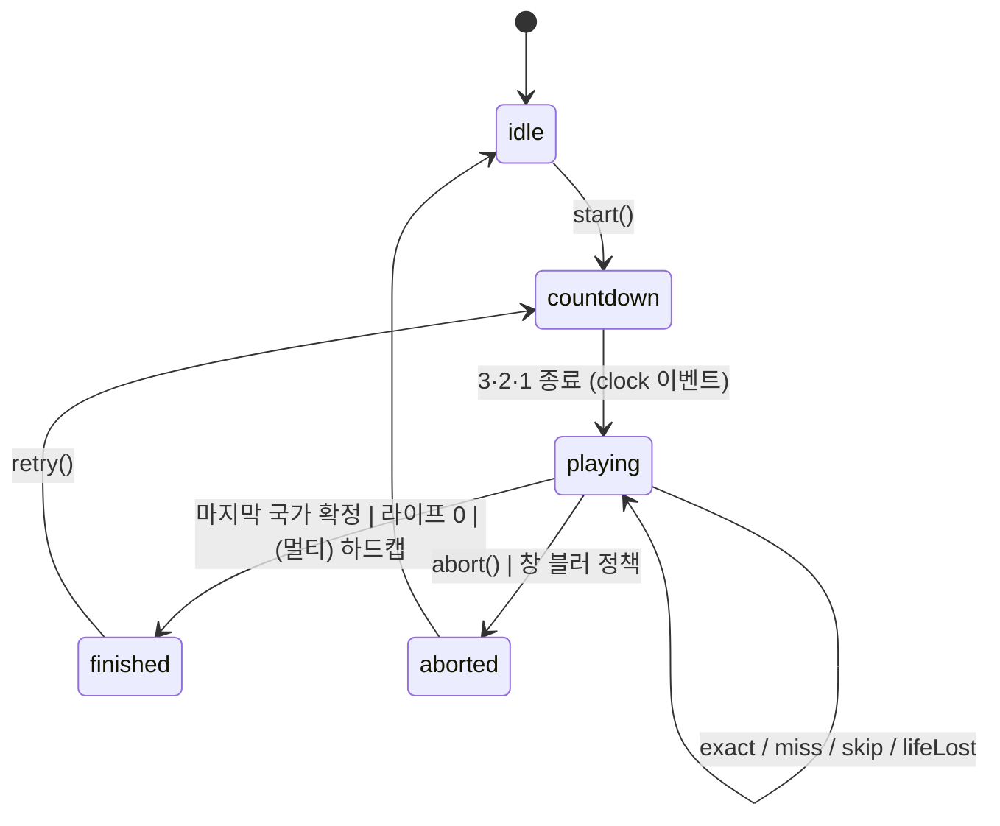

# 03. 프론트엔드 아키텍처

> 프로젝트 코드네임: **WORLD TYPING** / 문서 버전: v1.0 (2026-07-21) / 담당: 프론트엔드 아키텍처
> 선행 문서: 01. GDD, 02. 데이터 & 콘텐츠 명세 (본 문서는 02의 `packages/data` 매칭 엔진 — `normalize.ts`, `hangul.ts`, `match.ts` — 을 그대로 소비한다)
> 후행 문서: 04. 멀티플레이 프로토콜, 05. Cloudflare 아키텍처, 06. 랭킹/부정 방지

---

## 1. 기술 스택 권고와 근거

### 1.1 확정 스택

| 영역 | 선택 | 버전 고정 | 근거 |
|---|---|---|---|
| 빌드 | **Vite** | ^5 | dev HMR < 50ms, `rollupOptions.manualChunks`로 §10의 코드 스플리팅 제어, `vite-plugin-pwa`와 결합 |
| UI | **React 18** + **TypeScript 5 (strict)** | react ^18.3 | 팀/구현 에이전트 생산성 최우선. 단, **타이핑 핫패스는 React 렌더 사이클 밖에서 동작**시켜 React의 렌더 오버헤드가 입력 지연에 개입하지 못하게 한다(§2.7, §5). React는 "화면 배치와 비핫패스 UI"만 담당 |
| 상태 | **Zustand** ^4 | | 스토어가 React 외부 일반 객체 → 프레임워크 독립 게임 엔진(§5)과 자연 결합. `subscribeWithSelector` + `useShallow`로 부분 구독, Redux 대비 보일러플레이트 1/5 |
| 스타일 | **Tailwind CSS** ^3.4 | | 디자인 토큰(대륙 6색, 등급색)을 `tailwind.config.ts` theme로 일원화. 런타임 CSS-in-JS 금지(입력 핫패스에서 스타일 재계산 리스크 제거) |
| 지도 | **d3-geo + topojson-client + 자체 SVG 래퍼** | d3-geo ^3, topojson-client ^3 | §3 참조. react-simple-maps는 채택하지 않음(아래) |
| 애니메이션 | **Framer Motion** ^11 + CSS transition | | 화면 전이/결과 카드/보딩패스 연출은 FM, **인게임 juice는 CSS class 토글 + Web Animations API**(FM의 React 렌더 개입 회피) |
| i18n | **i18next + react-i18next** | ^23 | 02 문서 §9의 평면 키 카탈로그와 ICU 스타일 플레이스홀더 호환(`i18next-icu` 불필요 — 02 규칙상 plural 키 5개 미만이면 분기 하드코딩 허용이므로 기본 interpolation으로 충분) |
| 라우팅 | **React Router v6** (`createBrowserRouter`) | ^6.26 | lazy route + loader로 데이터 프리페치(§4.1) |
| WS | **자체 경량 클라이언트** (`packages/protocol` 공유 타입 + `WsManager` 클래스, §6) | 의존성 0 | socket.io류는 폴백 오버헤드·번들 비용 대비 이득 없음. Durable Objects는 표준 WebSocket |
| 검증 | zod ^3 | | 서버 메시지/`countries.json` 런타임 파싱(02와 공유) |
| 테스트 | Vitest + @testing-library/react + Playwright | | §11 |

### 1.2 대안 검토와 트레이드오프

| 대안 | 장점 | 기각 사유 |
|---|---|---|
| **Svelte 5** | 런타임 오버헤드 최소, 입력 지연에 유리 | 이점이 실질적으로 사라짐: 우리 설계는 어차피 핫패스를 프레임워크 밖(직접 DOM 조작 + rAF)에 둔다(§2.7). 남는 차이는 생태계/구현 에이전트 숙련도이며 React가 우세. 멀티 문서(04)의 예제·라이브러리도 React 전제 |
| **Vanilla TS (프레임워크 무)** | 최소 번들(~30KB 절감), 완전한 제어 | 화면 13종(S1~S13)·리더보드·로비·설정 등 "게임 외 UI"가 전체 코드의 70%. 선언적 UI 없이 이 볼륨을 유지보수하는 비용이 절감분을 압도. 다만 이 사고방식은 계승: **인게임 프롬프트/HUD 숫자 갱신은 vanilla 방식으로 구현**한다 |
| **PixiJS/Canvas 렌더** | 지도+파티클 60fps 보장, 대량 오브젝트 | 우리 화면의 동시 애니메이션 요소는 최대 수십 개(폴리곤 하이라이트 1, 노선 라인, 글자 수십). SVG+CSS transform으로 충분(02 §7의 110m topojson은 폴리곤 수백 개 수준). Pixi 도입 시 텍스트 렌더(한글 프롬프트!)·접근성·SSR-불가·번들 +350KB 비용. **단, 저사양에서 지도 레이어만 Canvas로 내리는 escape hatch를 설계에 남긴다**(§3.6) |
| **react-simple-maps** | 빠른 착수 | 유지보수 정체(React 18 경고), 내부에서 매 렌더 path 재계산, ZoomableGroup이 상태를 React로 끌어올려 팬 중 전체 리렌더 유발. 우리는 path `d`를 빌드 후 1회 계산·동결하고 하이라이트를 ref로 찍는 구조(§3.4)가 필요하므로 얇은 자체 래퍼(~200줄)가 총비용이 더 낮다 |
| hangul-js / **es-hangul** | 검증된 자모 분해 | **런타임 채택 안 함.** 정답 판정은 클라·서버 동일 코드여야 하므로(02 §3) `packages/data/src/hangul.ts`의 `toJamoSeq`가 유일한 원천. es-hangul의 `disassemble`은 복합 종성·복합 중성 분해 정책이 02 §3.3(쌍자음·ㅐㅔㅒㅖ 미분해)과 미묘하게 달라 이중 원천 버그의 온상. 단 **테스트 오라클로는 사용**: vitest에서 es-hangul 분해 결과와 교차 검증(§11.1) |

---

## 2. [최우선] 타이핑 입력 엔진 — 한글 IME 처리

이 섹션이 제품의 성패를 가른다. 목표: **어떤 브라우저·IME·플랫폼 조합에서도, 조합 중 글자를 오타로 판정하지 않고, 정답 완성 키스트로크에서 지연 없이 확정하며, 확정 직후 첫 타를 삼키지 않는다.**

### 2.1 문제 정의 — 브라우저 IME의 현실

한글 두벌식 IME 입력 시 이벤트 흐름(목표 "가나", Chrome/Windows 기준):

```
keydown(229) → compositionstart("") → compositionupdate("ㄱ") → input(data:"ㄱ", isComposing:true)
keydown(229) → compositionupdate("가") → input("가", isComposing:true)
keydown(229) → compositionupdate("간") → input("간", isComposing:true)   ← 도깨비불: 받침 임시 결합
keydown(229) → compositionupdate("가") → input(...) → compositionend("가")
             → compositionstart("") → compositionupdate("나") → input("나", isComposing:true)
```

핵심 함정 4가지:

1. **도깨비불(받침 이월)**: "간" 시점에 음절 비교하면 오답. → 자모 시퀀스 prefix 비교로 해결(02 §3.3의 `toJamoSeq`). "간"=`ㄱㅏㄴ` ⊂ "가나"=`ㄱㅏㄴㅏ` ✓
2. **조합 미확정 상태의 EXACT**: 정답 마지막 음절을 완성해도 IME는 조합을 열어둔 채다(`compositionend` 미발화). `compositionend`를 기다리면 (a) 확정이 다음 무관 키 입력까지 지연되고 (b) 그 키가 이전 조합에 붙어버린다. → **자모 일치 순간 즉시 확정 + IME 버퍼 강제 플러시**(§2.5)
3. **브라우저별 이벤트 순서 상이**: Safari는 `compositionend`가 마지막 `input`보다 먼저 오고, Android Gboard는 `compositionupdate`를 생략하거나 단어 단위로 몰아서 보낸다. `keydown`은 조합 중 `keyCode 229`만 준다. → **이벤트 종류에 의존하지 않고, `input` 이벤트마다 `<input>.value` 전체를 재평가**하는 value-snapshot 방식(§2.3). composition 이벤트는 "조합 중 플래그" 용도로만 사용
4. **한/영 혼입, 붙여넣기, 스와이프 입력**: `insertFromPaste`/`insertReplacementText` 등 벌크 삽입은 `beforeinput.inputType`으로 감지해 해당 판을 연습 기록 처리(06 부정 방지 연동)

### 2.2 아키텍처: 3층 분리

```mermaid
flowchart LR
  A[HiddenInput DOM 계층<br/>TypingInputController<br/>브라우저/IME 이벤트 흡수] -->|InputSnapshot| B[판정 계층 (순수)<br/>packages/data matchInput<br/>+ KeystrokeAccountant]
  B -->|TypingEvent| C[게임 엔진 §5<br/>GameSession FSM]
  C -->|상태 구독| D[React UI / 직접 DOM 프롬프트 렌더러]
```

- **계층 A**는 유일하게 브라우저를 아는 코드. 어떤 이벤트 조합이 오든 `InputSnapshot { value, isComposing, ts, inputType }`으로 정규화해 내보낸다.
- **계층 B**는 순수 함수: 스냅샷 → `PREFIX | EXACT | MISS` + 타수/오타 계상. 서버(Workers)와 동일 코드로 실행 가능(멀티 검증, 06).
- **계층 C**는 프레임워크 독립 엔진(§5).

### 2.3 판정 원칙: "이벤트 시퀀스"가 아니라 "값 스냅샷"

이벤트 순서에 상태를 걸면 브라우저별 분기 지옥이 된다. 원칙:

> **모든 `input` 이벤트에서, 조합 중 여부와 무관하게, `input.value` 전체를 정규화→자모화→prefix 판정한다.** `compositionupdate`의 `data`는 사용하지 않는다(브라우저마다 신뢰 불가). `input.value`는 조합 중 글자를 항상 포함하므로 단일 진실이다.

- `isComposing` = `event.isComposing || controllerComposing` (Safari의 순서 역전 대비: `compositionend` 후 도착하는 마지막 `input`은 `isComposing:false`).
- 한국어 모드에서 판정 대상 문자열: `toJamoSeq(normalizeKo(input.value))`. 02 §3.3의 `toJamoSeq`는 낱자모(U+3131–U+3163)도 처리하므로 조합 첫 타("ㄱ")부터 정확히 평가된다.
- 영어 모드: `normalizeEn(input.value)` 후 단순 문자열 prefix/exact 비교. composition은 발생하지 않는 것이 정상이나(라틴 자판), 모바일 자동수정이 composition을 열 수 있으므로 **동일 코드 경로**를 태운다(영어라고 `keydown` 기반으로 별도 구현하지 않는다).

### 2.4 타수·오타 계상 (KeystrokeAccountant)

스냅샷 간 **자모 시퀀스 diff**로 계상한다. GDD §6의 `totalKeystrokes`(정타+오타, 백스페이스 미포함) 정의를 구현하는 유일한 방법이 이 방식이다(keydown 카운트는 229 때문에 불가능).

```ts
// packages/engine/src/accountant.ts
export interface KeystrokeDelta {
  added: number;        // 이번 스냅샷에서 늘어난 자모 수 (0이면 백스페이스/무변화)
  removed: number;
  addedCorrect: number; // 늘어난 자모 중 정답 prefix 위로 얹힌 수
  addedError: number;   // = added - addedCorrect
}

export class KeystrokeAccountant {
  private prevJamo = '';

  reset(): void { this.prevJamo = ''; }

  /**
   * curJamo: 현재 스냅샷의 자모 시퀀스 (en 모드는 normalizeEn 결과 그대로)
   * targetJamo: 현재 국가의 "최장 일치 타깃"의 자모 시퀀스
   *   (acceptedInputs 중 curJamo와 공통 prefix가 가장 긴 타깃 — matchInput 확장판이 반환, §2.6)
   */
  consume(curJamo: string, targetJamo: string): KeystrokeDelta {
    const common = commonPrefixLen(this.prevJamo, curJamo);
    const removed = this.prevJamo.length - common;
    const addedStr = curJamo.slice(common);
    // 새로 추가된 자모 각각이 targetJamo의 올바른 위치에 놓였는지 판정
    let addedCorrect = 0;
    for (let i = 0; i < addedStr.length; i++) {
      const pos = common + i;
      if (pos < targetJamo.length && targetJamo[pos] === addedStr[i]) addedCorrect++;
      else break; // 첫 불일치 이후는 전부 오타
    }
    this.prevJamo = curJamo;
    return { added: addedStr.length, removed,
             addedCorrect, addedError: addedStr.length - addedCorrect };
  }
}
```

- **도깨비불 보정이 자동 성립**: "간"(`ㄱㅏㄴ`)→"가나"(`ㄱㅏㄴㅏ`) 전이는 common=3, added=`ㅏ` 1타. 음절이 재구성돼도 자모열은 단조 증가하므로 이중 계상이 없다.
- **백스페이스**: removed>0, added=0 → 타수 미가산(GDD §5.3). removed는 통계용으로만 누적.
- **붙여넣기/스와이프**: 한 스냅샷에서 `added > 8` 이거나 `beforeinput.inputType`이 `insertFromPaste|insertReplacementText|insertFromDrop`이면 `bulkInsert` 이벤트 발생 → 엔진이 해당 런을 `practice: true`로 강등(06 연동).
- 국가 확정/스킵 시 `reset()`.

### 2.5 EXACT 확정과 IME 버퍼 강제 플러시 (최중요 알고리즘)

자모 일치 순간(조합 중이어도) 즉시 확정해야 한다. 문제: 이 시점 IME는 조합을 열어두고 있어, 그냥 `input.value = ''`를 하면 브라우저에 따라 (a) 무시되거나 (b) 다음 키가 죽은 조합 버퍼에 붙거나 (c) 유령 `compositionend`가 늦게 도착해 방금 비운 값을 되살린다.

**플러시 프로토콜**:

```
EXACT 감지 (input 이벤트 핸들러 내부, 동기)
  1. epoch++                          // 이후 도착하는 이전 세대 이벤트 전부 무시할 열쇠
  2. engine.commitCountry(...)        // 게임 로직 먼저 (지연 0)
  3. if (isComposing):
       input.blur()                   // 모든 주요 브라우저에서 compositionend를 강제 발화시킴
       input.value = ''
       input.focus()                  // 동기 재포커스 — 다음 키스트로크를 놓치지 않음
     else:
       input.value = ''
  4. accountant.reset()
```

- **epoch 가드**: 컨트롤러가 정수 `epoch`를 유지. blur가 유발한 `compositionend`/`input`(브라우저에 따라 마이크로태스크 뒤에 옴)은 이벤트 발생 시점의 epoch 캡처와 현재 epoch를 비교해 **불일치 시 조용히 버린다.** 이것이 "다음 국가 첫 타가 이전 버퍼에 먹히는" GDD §5.4 버그의 근본 해결이다.
- blur→focus는 동기 실행이므로 사용자 체감 포커스 상실 없음. iOS Safari에서 blur 시 소프트 키보드가 접히는 문제는 **없다** — 같은 tick 안에서 재포커스하면 키보드가 유지된다(단, iOS는 프로그램적 focus에 제약이 있으므로 반드시 동기 호출; `setTimeout` 금지). 실기기 QA 필수 항목(§11.3).
- Android Gboard에서 blur로도 조합이 안 끊기는 극소수 케이스 대비: focus 직후 첫 `input` 이벤트의 value가 비어있지 않고 epoch 캡처가 현재와 일치하면 **그 값을 새 국가의 첫 입력으로 그대로 평가**한다(먹힘 방지의 이중 안전망 — 어차피 value-snapshot 방식이라 자연 처리됨).

> **개정(docs/00 §11-D70, WT-DC-09)** — 위 안전망을 flush 후 단일 관문(`resolveRaw`)으로 대체·강화한다. 실전에서 (a) 조합 중 EXACT 플러시의 `blur→focus` 복귀 시 IME가 방금 확정한 자모열을 재삽입하고, (b) 스킵(ESC/타임아웃)이 버퍼를 비우지 않아 잔여가 다음 국가로 새는 두 실버그가 확인됐다. 확정 결정:
> 1. **`epoch++`를 `blur` 뒤로 재배열** — `blur()`가 동기로 유발하는 자기유발 `compositionend`가 *옛* epoch를 캡처하도록 해, 그 microtask 재평가가 확정 이후 상태를 오염시키지 못하게 한다(위 "1. epoch++"는 이 위치로 이동한 것으로 읽는다; flush의 순 epoch 증가 +1·재진입 가드 의미는 불변).
> 2. **`setCountry`가 권위적 클리어를 소유** — 진입 시 잔여/열린 조합이 있으면 무조건 flush("새 국가 = 빈 버퍼"). 위 "그 값을 새 국가 첫 입력으로 평가"하던 재평가는 **폐기**한다.
> 3. **flush 후 첫 입력은 `resolveRaw`가 판별**: 48ms 내 ≥2자모 옛-꼬리 재삽입 = 무이벤트로 삼키고 재플러시(국가당 3회 후 fail-open), 옛 전체값 접두 + 연장 = 접두 가상 스트립 후 연장분만 평가(Gboard 승계), 그 외 = genuine. **단일 자모는 절대 삼키지 않는다**(§2.10 #4 — 확정 직후 0ms 첫 타 보존). `getValue()`가 가상 접두를 제외한 실입력을 노출한다(표시 계층용, additive).

### 2.6 MISS 처리와 매처 확장

02 §3.1의 `matchInput`은 3-상태만 반환한다. 프론트는 UI 채색과 계상을 위해 확장판을 사용한다(**같은 파일에 추가, 서버와 공유**):

```ts
// packages/data/src/match.ts 에 추가
export interface MatchDetail {
  state: MatchState;
  /** 입력 자모열과 공통 prefix가 가장 긴 타깃 (UI 채색·계상 기준) */
  bestTarget: CompiledTarget;
  /** bestTarget.key 기준 일치한 자모 길이 */
  matchedLen: number;
  /** 입력 자모열 전체 길이 */
  inputLen: number;
}

export function matchInputDetail(
  rawInput: string, targets: CompiledTarget[], lang: 'ko' | 'en',
): MatchDetail {
  const norm = lang === 'ko' ? normalizeKo(rawInput) : normalizeEn(rawInput);
  const key = lang === 'ko' ? toJamoSeq(norm) : norm;
  let best = targets[0], bestLen = -1;
  for (const t of targets) {
    if (t.key === key)
      return { state: 'EXACT', bestTarget: t, matchedLen: key.length, inputLen: key.length };
    const l = commonPrefixLen(t.key, key);
    if (l > bestLen) { bestLen = l; best = t; }
  }
  const state: MatchState =
    key.length === 0 || targets.some(t => t.key.startsWith(key)) ? 'PREFIX' : 'MISS';
  return { state, bestTarget: best, matchedLen: bestLen, inputLen: key.length };
}
```

MISS 시 동작(02 §3.1 준수 + GDD §5.3 절충):
- **입력을 지우지 않는다**(조합 중 강제 개입 금지). 오타 자모 구간(`matchedLen..inputLen`)을 적색 렌더 + 셰이크 + 오답음.
- 버퍼 상한: `inputLen > bestTarget.key.length + 8`이면 초과분 무시(표시만 …, 계상 제외) — GDD §5.3.
- MISS→PREFIX 회복은 사용자의 백스페이스로만 가능(적색 자모가 남아있는 한 EXACT 불성립이 수학적으로 보장됨: prefix 불일치 문자열은 어떤 타깃과도 완전일치 불가).
- 오타 카운트는 §2.4의 `addedError`로 자모 단위 계상(상태 전이 1회당 1개가 아니라 실제 잘못 친 자모 수 — GDD §6 정의와 일치).

### 2.7 TypingInputController — 전체 의사코드

프레임워크 독립 클래스. React는 `useTypingEngine` 훅(§4.4)에서 이것을 마운트할 뿐이다. **핫패스에 React 없음**: 프롬프트 글자 채색은 컨트롤러가 프롬프트 렌더러(§2.8)를 직접 호출한다.

```ts
// packages/engine/src/input-controller.ts
import { matchInputDetail, compileTargets, type MatchDetail } from '@wt/data/match';
import { toJamoSeq } from '@wt/data/hangul';
import { normalizeKo, normalizeEn } from '@wt/data/normalize';
import { KeystrokeAccountant } from './accountant';

export type TypingEvent =
  | { type: 'progress'; detail: MatchDetail; delta: KeystrokeDelta; rawValue: string }
  | { type: 'exact'; detail: MatchDetail; delta: KeystrokeDelta; elapsedFromShownMs: number }
  | { type: 'miss'; detail: MatchDetail; delta: KeystrokeDelta }   // addedError>0인 progress의 특수화
  | { type: 'bulkInsert' }                                          // 부정 의심 → practice 강등
  | { type: 'skipRequested' }                                       // ESC
  | { type: 'blurred' } | { type: 'refocused' };                    // 창 이탈 감지(GDD §5.5)

export class TypingInputController {
  private epoch = 0;
  private composing = false;
  private targets: CompiledTarget[] = [];
  private accountant = new KeystrokeAccountant();
  private shownAt = 0;
  private listeners = new Set<(e: TypingEvent) => void>();
  private detachFns: Array<() => void> = [];

  constructor(
    private input: HTMLInputElement,
    private lang: 'ko' | 'en',
  ) {}

  attach(): void {
    const on = <K extends keyof HTMLElementEventMap>(
      k: K, f: (e: HTMLElementEventMap[K]) => void,
    ) => { this.input.addEventListener(k, f); this.detachFns.push(() => this.input.removeEventListener(k, f)); };

    on('compositionstart', () => { this.composing = true; });
    on('compositionend', (e) => {
      const cap = this.epoch;
      this.composing = false;
      // Safari: compositionend가 마지막 input보다 먼저 → 여기서도 1회 평가해 이벤트 순서 비의존화
      queueMicrotask(() => { if (cap === this.epoch) this.evaluate(); });
    });
    on('beforeinput', (e) => {
      const t = (e as InputEvent).inputType;
      if (t === 'insertFromPaste' || t === 'insertReplacementText' || t === 'insertFromDrop') {
        e.preventDefault();
        this.emit({ type: 'bulkInsert' });
      }
    });
    on('input', () => { this.evaluate(); });
    on('keydown', (e) => {
      if (e.key === 'Escape') { e.preventDefault(); this.emit({ type: 'skipRequested' }); }
      // 그 외 키는 일절 preventDefault 하지 않는다 — IME 파이프라인 보존
    });
    on('blur', () => this.emit({ type: 'blurred' }));
    on('focus', () => this.emit({ type: 'refocused' }));
  }

  detach(): void { this.detachFns.forEach(f => f()); this.detachFns = []; }

  /** 엔진이 새 국가를 제시할 때 호출 */
  setCountry(c: Country): void {
    this.targets = compileTargets(c, this.lang);
    this.accountant.reset();
    this.shownAt = performance.now();
    // 잔여 버퍼가 있으면(§2.5 안전망 경로) 즉시 새 타깃으로 평가
    if (this.input.value.length > 0) this.evaluate();
  }

  private evaluate(): void {
    const cap = this.epoch;
    const raw = this.input.value;
    const detail = matchInputDetail(raw, this.targets, this.lang);
    const curKey = this.lang === 'ko' ? toJamoSeq(normalizeKo(raw)) : normalizeEn(raw);
    const delta = this.accountant.consume(curKey, detail.bestTarget.key);

    if (detail.state === 'EXACT') {
      const elapsedFromShownMs = performance.now() - this.shownAt;
      this.flushIme();                       // ★ §2.5 프로토콜 (epoch++ 포함)
      if (cap !== this.epoch - 1) return;    // 재진입 가드
      this.emit({ type: 'exact', detail, delta, elapsedFromShownMs });
      return;
    }
    this.emit(delta.addedError > 0
      ? { type: 'miss', detail, delta }
      : { type: 'progress', detail, delta, rawValue: raw });
  }

  private flushIme(): void {
    this.epoch++;
    if (this.composing) {
      this.input.blur();      // compositionend 강제 (구세대 epoch로 도착 → 무시됨)
      this.input.value = '';
      this.input.focus();     // 반드시 동기
      this.composing = false;
    } else {
      this.input.value = '';
    }
    this.accountant.reset();
  }

  /** 스킵/게임오버 등 외부 사유로 버퍼를 비울 때 */
  clear(): void { this.flushIme(); }

  focus(): void { this.input.focus({ preventScroll: true }); }
  private emit(e: TypingEvent): void { this.listeners.forEach(f => f(e)); }
  subscribe(f: (e: TypingEvent) => void): () => void {
    this.listeners.add(f); return () => this.listeners.delete(f);
  }
}
```

**epoch 가드의 정확한 의미론**: 모든 비동기 연속(microtask/이벤트)은 진입 시점에 `cap = this.epoch`를 캡처하고, 실행 시점에 `cap === this.epoch`가 아니면 no-op. `flushIme()`만이 epoch를 증가시킨다. 따라서 "EXACT 확정 이전에 발생한 어떤 IME 이벤트도 확정 이후 상태를 오염시킬 수 없다"가 불변식이다.

> **개정(docs/00 §11-D70, WT-DC-09)** — 위 의사코드는 다음과 같이 확정 구현됐다(실제 원천 `packages/engine/src/input-controller.ts`):
> - `setCountry`는 잔여 재평가(`if (value.length>0) this.evaluate()`)를 **삭제**하고, 대신 잔여/열린 조합이 있으면 `flushIme()`로 권위적으로 비운다(진입 시 `reinsertFlushes=0` 리셋). "새 국가 = 빈 버퍼" 불변식.
> - `flushIme`는 `blur()` **뒤에** `epoch++`한다(자기유발 `compositionend` 구세대화). 조합 branch에서 flush 직전 버퍼의 자모열을 `staleEcho`로 기록(48ms 재삽입 윈도우 기준).
> - `evaluate`는 진입 즉시 `resolveRaw(ev)` 단일 관문을 통과한다 — `null`이면 삼킴(무이벤트·무계상), 아니면 그 반환 문자열로 판정·계상한다(재삽입/기저붕괴 차단, Gboard 접두 스트립). `flushing` 가드로 blur/focus의 동기 재진입을 막는다.
> - `getValue()`는 Gboard 가상 접두(`basePrefix`)를 제외한 실입력을 돌려주는 additive 메서드다(표시 계층 소비). `TypingEvent`/`EngineEvent` 형태는 불변.

**hidden input 스펙** (데스크톱·모바일 공통, §7.2와 공유):

```html
<input id="typing-input" type="text"
  autocomplete="off" autocorrect="off" autocapitalize="off"
  spellcheck="false" enterkeyhint="next" inputmode="text"
  aria-label="국가 이름 입력" 
  style="position:fixed; opacity:0.01; height:1px; width:1px;
         top:50%; left:50%; pointer-events:none;" />
```

- `opacity:0.01`+1px (display:none/visibility:hidden은 포커스 불가·iOS IME 미동작). `top:50%`는 iOS가 포커스 요소로 자동 스크롤할 때 화면이 튀지 않게 하기 위함.
- 인게임 동안 포커스 유지 계약: `document`의 `pointerdown` 캡처 단계에서 인터랙티브 요소(버튼 등)가 아니면 `preventDefault()` 후 `controller.focus()` — 화면 아무 데나 탭해도 키보드가 유지된다.

### 2.8 프롬프트 렌더러 — 슬롯 + 힌트 + 입력 에코 (METRO식, docs/00 §11-D66)

React 리렌더 없이 컨트롤러 이벤트로 직접 DOM을 갱신하는 명령형 모듈. **큰 줄은 목표어가 아니라 사용자 입력 에코**다(원작 METRO 계승 — 목표어는 슬롯 위 소형 힌트로만 표시). 판정·점수·프로토콜·엔진 이벤트 계약은 전부 불변이며 이 모듈은 순수 표시 계층이다.

- **마운트 시 1회**: 캐노니컬 표기(ko=`nameKo` / en=`nameEn`)의 표시단위(ko 음절 / en 글자)마다 세로 칼럼 슬롯 `span.wt-slot`을 렌더한다. 각 슬롯 = 위쪽 정적 힌트 `span.wt-slot__hint`(그 유닛의 목표 문자) + 아래쪽 입력 에코 글리프 `span.wt-unit`(초기 빈). 공백·구두점(정규화로 사라지는 자모 len 0 유닛 — `toJamoSeq`/`normalizeEn`을 유닛별로 돌려 판별)은 구분자 슬롯: 힌트에 원문 문자를 보존하고 글리프는 밑줄 없는 좁은 스페이서(`.wt-unit--sep`)다. 슬롯 뒤에 초과 입력용 `span.wt-prompt__tail` 1개. **에코 글리프가 비어 있으므로 `prompt-mount`의 전체 `textContent`는 국가 전환 직후 국가명과 정확히 일치한다**(E2E 계약).
- **매 `progress`/`miss` 이벤트 `update(detail, rawValue)`**: `rawValue`(실입력)를 코드포인트 유닛으로 쪼개 각 유닛의 자모 구간 `[s,e)`를 얻는다(len 0 입력은 슬롯 미점유). `matched = detail.matchedLen`, `hasError = matched < detail.inputLen`. 유닛 상태(산식 전용 — composition 이벤트로 분기 금지):
  - `done`(`e ≤ matched`): 정타 접두 안에 완전히 든 유닛 — 정타색(적색 계열) + 밑줄.
  - `error`(`hasError && e > matched`): 정타 접두를 넘어선 오타 유닛 — 적색 + 글리프 물결 밑줄(색각 이중 부호화, GDD §11.2).
  - `partial`(`!hasError && e > matched`, 스펙상 `s<matched<e`): 조합 중 꼬리 — 파랑(accent) dashed. 실입력 파이프라인에선 `matched=inputLen`이라 드문 경계다.
  - 각 typed 유닛 k는 k번째 **비구분자** 슬롯에 글리프 textContent + 상태로 얹힌다. 잔여(미입력) 슬롯은 빈 `pending`(빈 밑줄). 슬롯을 넘어선 초과 입력은 `tail`(최대 4유닛, error색)로 흘러넘친다. 별칭 입력(고수의 지름길, 예: "한국"→대한민국)은 `bestTarget` 기준 matchedLen으로 채색되어 **에코가 실입력을 그대로 표시**한다 — 구 모델의 "별칭 채색 동결 + 하단 에코 라인"은 폐기(D66).
- **커서**: 첫 빈 비구분자 슬롯(= typed 유닛 수 위치)에 `.is-cursor`로 깜빡이는 세로 바(`::after`, absolute — 레이아웃 불변). 오버플로 중엔 `tail`에. `reduced-motion`이면 깜빡임 정지(항상 표시).
- **EXACT**: 확정 순간 `rawValue`는 플러시로 비므로(§2.5) 전 슬롯을 **캐노니컬 글리프 done**으로 되메우고 커서·tail을 정리한다(국가명 전체가 done으로 점등 → pop).
- 성능: 슬롯별 `{char,state}` 캐시를 diff해 **변경된 슬롯만** DOM을 만진다(`update` 1회당 접촉 ≤ 변경 슬롯 + 커서 이동). 밑줄 두께는 상태 불변(색/스타일만 변함)·글리프 박스 치수 고정·커서 absolute → **레이아웃 write 0**. 스케일 팝(GDD §13.3-1)은 `.wt-prompt--pop` class + CSS `animation`, 셰이크는 컨테이너 1회 class 토글 — transform/opacity만.

> **개정(docs/00 §11-D69, WT-DC-09)** — 색과 ko 슬롯 구조를 확정 개정한다(원천 `apps/web/src/features/typing/prompt-renderer.ts` + `styles/globals.css`):
> - **색**: 일치(정타)는 `--wt-prompt-match: var(--text)`(테마 자동 반전 — 구 done 적색 `#d6402d`/다크 `#ff7a5e` 폐기), `partial`(조합 중 꼬리)은 match로 **통합**(별도 accent 색 폐기), 불일치는 `--wt-prompt-error: #ef4444`(+글리프 물결 밑줄 이중부호화). 미입력 자모 밑줄은 `--wt-prompt-slot: var(--border)`. 원색은 토큰 정의부에만(D50).
> - **ko 자모 채움 행**: ko 콘텐츠 슬롯은 힌트/에코 글리프 아래에 캐노니컬 음절 자모 길이(`cap = toJamoSeq(음절).length`)만큼의 밑줄 슬롯 행 `span.wt-slot__jamo > span.wt-jamo × cap`을 mount 1회 생성한다(**en·구분자는 미생성**; ko `.wt-unit` 개별 dashed 밑줄은 제거 — 자모 행이 대체, en 밑줄 유지). `update`는 `detail.matchedLen/inputLen`을 캐노니컬 슬롯 경계 `[s,e)`에 사상해 각 자모 슬롯을 채운다: `m = clamp(matched−s, 0, cap)` match, 다음 `x = clamp(min(e,inputLen)−max(s,matched), 0, cap−m)` error, 나머지 empty(EXACT는 전량 match). 채색은 `data-fill="empty|match|error"` 속성으로만(치수 불변 → 리플로우 0).
> - **E2E 계약 격리**: `.wt-jamo`는 `textContent`가 없고(→ `prompt-mount` 전체 textContent=국가명 계약 보존) `data-fill` 별도 네임스페이스라 `.wt-unit`/`data-state`/`is-error` 셀렉터 계약과 충돌하지 않는다. 판정·점수·프로토콜·엔진 이벤트 계약 불변.

### 2.9 영문 입력 경로

동일 파이프라인의 퇴화 케이스로 처리한다(별도 구현 금지):
- `toJamoSeq`는 라틴 문자를 그대로 통과시키므로(02 §3.3 구현 참조) 사실상 `key = normalizeEn(value)`.
- diff 계상도 동일: `KeystrokeAccountant`는 문자 단위로 동작. 공백은 `normalizeEn`이 제거하므로 **키 스냅샷에는 공백이 없다** → 공백 타수는 계상되지 않음. GDD §4는 "공백 포함"으로 정의하나 02 §3.2 정규화가 우선한다(공백 유무를 판정에서 무시하는 대신 타수에서도 무시 — 한 소스 두 정책 금지). CPM 통계 정의는 이 계상 기준으로 확정하고 06 문서에 동일 반영.
- CapsLock/대문자: `normalizeEn`이 lowercase → 무영향.
- ko 모드에서 영문 자판 입력: 라틴 문자는 자모 테이블 밖 → 즉시 MISS. 최초 1회 `latinInKoMode` 감지 시 "한/영 키를 확인하세요" 토스트(연속 라틴 3자 이상일 때만 — 오발 방지).

### 2.10 IME 엣지 케이스 매트릭스 (QA 계약)

| # | 시나리오 | 기대 동작 | 검증 방법 |
|---|---|---|---|
| 1 | 도깨비불: "가나" 입력 중 "간" | PREFIX 유지, 오타음 없음 | vitest (§11.1) |
| 2 | 복합 모음 중간: "과테말라"의 "고" 시점 | PREFIX | vitest |
| 3 | 마지막 음절 조합 중 EXACT ("몽골"의 ㄹ 입력 순간) | 즉시 확정, compositionend 대기 없음 | Playwright CDP (§11.3) |
| 4 | 확정 직후 0ms 내 다음 국가 첫 타 | 유실·오염 없음 (epoch 가드) | Playwright CDP |
| 5 | Safari compositionend 선행 순서 | 판정 결과 동일 (value-snapshot) | 실기기 QA 시트 |
| 6 | Android Gboard 몰아치기 compositionupdate 생략 | input 이벤트 기반이므로 정상 | 실기기 QA 시트 |
| 7 | 조합 중 백스페이스로 자모 단위 삭제 ("간"→"가"→"ㄱ") | removed 계상, 오타 아님 | vitest |
| 8 | 붙여넣기 "대한민국" | preventDefault + bulkInsert → practice 강등 | Playwright |
| 9 | 창 블러(Alt-Tab) 중 조합 | blurred 이벤트 → 판 무효(연습 기록) | Playwright |
| 10 | 오타 상태에서 계속 타이핑 (버퍼 +8 상한) | 초과분 무시, 계상 제외 | vitest |
| 11 | ko 모드 영문 혼입 "d" | MISS + (3자 이상 시) 한/영 토스트 | vitest + RTL |
| 12 | 별칭 완성 "한국" (캐노니컬 "대한민국") | EXACT, 타수는 실입력 기준 6타 | vitest |

---

## 3. 세계지도 컴포넌트

### 3.1 데이터 흐름과 사전 계산

```mermaid
flowchart LR
  T[countries-110m.json<br/>fetch 1회] --> F[topojson-client feature]
  F --> P[geoNaturalEarth1 + geoPath<br/>path d 문자열 사전 계산]
  P --> G[GeoIndex (모듈 스코프 캐시, Object.freeze)]
  G --> SVG[WorldMap SVG 렌더 1회]
  E[게임 엔진 이벤트] -->|ref 명령형 갱신| SVG
```

- 앱 부팅 시(라우트 loader, §4.1) topojson을 fetch → `topojson.feature()` → **기준 뷰포트(960×500)에서 `geoNaturalEarth1().fitSize()` + `geoPath()`로 모든 폴리곤의 `d` 문자열을 1회 계산**해 `GeoIndex`에 동결 저장. 이후 지도는 어떤 리사이즈에도 path를 재계산하지 않는다 — SVG `viewBox="0 0 960 500"` + CSS 크기로 벡터 스케일(반응형 공짜).
- `GeoIndex`:

```ts
interface GeoIndex {
  paths: Map<string /*featureId*/, string /*d*/>;
  byCountry: Map<CountryId, { featureId: string | null; centroid: [number, number];
                              bounds: [[number, number], [number, number]] }>; // projected 좌표
  neutralFeatureIds: string[];   // 우리 데이터셋 밖 속령 등 (02 §7-b)
  circleFallback: Map<CountryId, [number, number]>; // mapFeatureId null 초소국 (02 §7-a)
}
```

- 코소보 수동 바인딩·초소국 circle 폴백은 02 §7 규칙 그대로 구현.

### 3.2 컴포넌트 계층

```tsx
<WorldMap ref={mapRef} className="...">          {/* 마운트 후 리렌더 없음 */}
  <svg viewBox="0 0 960 500" role="img" aria-hidden="true">
    <g data-layer="camera">                       {/* 줌/팬은 이 g의 transform만 조작 */}
      <g data-layer="base">{/* 전 폴리곤: 중립색. path는 GeoIndex에서 1회 생성 */}</g>
      <g data-layer="route"><path data-route/></g>{/* 노선 라인 (§3.5) */}
      <g data-layer="solved"/>                    {/* 해결 국가: 노선색 fill (path 복제) */}
      <g data-layer="target"/>                    {/* 현재 타깃: 하이라이트 path */}
      <g data-layer="dots"/>                      {/* 초소국 circle */}
    </g>
  </svg>
</WorldMap>
```

- `WorldMap`은 `React.memo` + props 불변(콜백 ref만). **게임 진행에 따른 변화는 전부 명령형 핸들로 처리**:

```ts
export interface WorldMapHandle {
  setTarget(id: CountryId | null): void;   // 이전 타깃 해제 + 신규 점등(펄스 CSS)
  markSolved(id: CountryId, colorVar: string): void; // solved 레이어에 path 추가 + fill 전이 300ms
  drawRouteSegment(from: CountryId, to: CountryId): void; // §3.5
  flyTo(ids: CountryId[], opts?: { padding?: number; durationMs?: number }): void; // §3.4
  reset(): void;
  setJuiceLevel(level: 0 | 1 | 2): void;   // §3.6 저사양 강등
}
```

- 이유: 국가 확정은 초당 수 회 발생 가능(고수 기준 1국가/1.5초). React state 경유 시 지도 서브트리 재조정 비용이 입력 프레임을 위협한다. `useImperativeHandle` 없이 **엔진 이벤트 구독을 WorldMap 내부 useEffect에서 직접** 하는 방식도 허용(스토어 우회) — 구현 단순한 쪽 선택하되 "React 리렌더로 폴리곤을 다시 그리지 않는다"는 계약은 불변.
- *(개정 — 00 §11-D67)*: 이 컴포넌트 계층은 **홈 히어로 평면 지도(`HeroMap`) 전용**이다. 싱글 인게임 지도는 §3.7 `GlobeMap`(canvas + SVG 오버레이)이며, `GlobeMapHandle = WorldMapHandle & { setIdleSpin }`으로 위 핸들 시그니처를 전부 승계한다("리렌더 0" 계약도 동일).

### 3.3 색상 상태

| 상태 | fill | 비고 |
|---|---|---|
| 미해결(출제 세트 내) | `var(--map-pending)` (다크: #2A3340) | base 레이어 |
| 출제 세트 외 국가 | `var(--map-idle)` (다크: #222A35) | |
| 중립 feature(속령) | `var(--map-neutral)` | 인터랙션 없음 (02 §7) |
| 현재 타깃 | `var(--continent-color)` + `filter: brightness(1.25)` + 외곽선 펄스(CSS `@keyframes`, 1.2s) | target 레이어 |
| 해결 | `var(--continent-color)` 불투명 0→1 전이 300ms | solved 레이어 |
| 스킵 | `var(--map-skipped)` (회색+빗금 patternUnits) | |

대륙 6색·등급색은 `tailwind.config.ts`와 CSS 변수(`:root`)에 동시 정의하고 SVG는 CSS 변수만 참조(테마 전환 시 지도 코드 무수정).

### 3.4 카메라 (대륙 zoom/pan)

- 자체 구현 (d3-zoom 미사용 — 사용자 제스처 줌은 v1 요구가 아니고, 필요한 것은 프로그램적 카메라뿐):

```ts
function computeCamera(ids: CountryId[], padding = 40): { x: number; y: number; k: number } {
  // GeoIndex.byCountry의 projected bounds를 합집합 → viewBox 960×500 기준 scale/translate 계산
  // k = min((960-2p)/bw, (500-2p)/bh, K_MAX=8), 중심 정렬
}
```

- 적용: `<g data-layer="camera">`에 `transform: translate(x,y) scale(k)`를 **WAAPI**(`element.animate`)로 800ms `ease-in-out` 전이. React 미개입.
- 모드별 카메라 정책: 대륙 모드 = 시작 시 해당 대륙 fitExtent 고정 + 타깃 국가가 뷰포트 밖이면 미세 팬(타깃 중심으로 25% 이내 이동만 — 멀미 방지). 세계일주 = 현재 leg 구간(현 타깃 ±2개국 bounds)을 따라가는 추적 카메라. 티어/데일리/멀티 = 국가 위치가 산발적이므로 **월드 전체 고정 + 타깃 펄스만**(카메라 이동 없음 — 매 국가 대륙 점프 팬은 시각 소음).
  - *(개정 — 00 §11-D63, 2026-07-23)*: 대륙/세계일주는 **현 구간(prev·cur·next) leg 추적 flyTo(padding 70, 600ms)**로 통일 개정("대륙 fitExtent 고정 + 미세 팬"·"타깃 ±2개국 bounds" 서술은 폐기). 티어/데일리/멀티 = 월드 전체 고정은 불변. 구현 원천 `apps/web/src/features/map/camera.ts`.
  - *(개정 — 00 §11-D67, WT-DC-08)*: 위 평면 카메라(`computeCamera`/`computeLegCamera`/`camera.ts`)는 이제 **홈 히어로 전용**이다. 싱글 인게임 카메라는 §3.7 지구본의 `projection.rotate` 홉 추적(줌 없음)으로 대체됐고 D63의 leg flyTo·"티어/데일리 월드 고정"은 폐기됐다.
- `prefers-reduced-motion` 또는 설정 ON 시: 전이 durationMs=0 (즉시 스냅).
- **stroke 보정**: scale 시 국경선이 두꺼워지므로 `vector-effect: non-scaling-stroke`를 전 path에 지정.

### 3.5 노선 라인 연출 (GDD §13.3-2, 완주 리트레이스 §13.3-6)

- 세그먼트 = 이전 국가 centroid → 현 국가 centroid의 quadratic Bézier(제어점: 중점을 법선 방향으로 거리의 12% 오프셋 — 항공 노선 감성). `route` 레이어에 `<path>` append 후 `stroke-dasharray`/`stroke-dashoffset` 트릭으로 300ms drawing 애니메이션(WAAPI).
- 날짜변경선 교차(예: 오세아니아 FJ→TO, 세계일주 KR→…→US): 두 centroid의 x 거리가 뷰포트 절반 초과면 **화면 밖으로 나갔다 들어오는 2-패스 세그먼트**로 분할(경도 ±180 래핑) — 지도를 가로지르는 흉한 직선 방지. `GeoIndex` 구축 시 각 인접쌍의 래핑 여부를 사전 계산해둔다.
- 완주 리트레이스: 전체 세그먼트를 하나의 합성 path로 미리 이어두고 `dashoffset`을 1.2s에 0으로 — 결과 카드 캡처(§8.3)는 이 종료 프레임.
- *(개정 — 00 §11-D67)*: 위 quadratic Bézier + 날짜변경선 2-패스 노선은 **홈 히어로 평면 지도 전용**이다. 싱글 인게임 노선은 §3.7 지구본에서 **great-circle 아크(`geoInterpolate` 64점 샘플)**로 그리며 진행 홉이 프리픽스(progress)를 구동한다(orthographic이 뒷면 아크를 자동 클립하므로 래핑 2-패스 불필요).

### 3.6 성능 가드

- **폴리곤 수**: 110m 기준 feature 177개, 총 path 명령 수 ~1.1만. SVG로 60fps 무난(하이라이트는 개별 path 2~3개의 attribute 변경뿐).
- **리렌더 회피 체크리스트**: ① WorldMap props는 마운트 후 불변, ② 게임 상태는 지도에 절대 props로 흐르지 않음(핸들/구독), ③ devtools Profiler로 "국가 확정 시 WorldMap 커밋 0회" CI 스냅샷은 불가하므로 코드리뷰 계약 항목으로 명시.
- **저사양 강등**(GDD §13.4): `useJuiceLevel` 훅이 첫 판 동안 `requestAnimationFrame` 델타를 샘플링, 33ms 초과 프레임 비율 > 10%면 level 하향 → `setJuiceLevel(1)`: 펄스/파티클 off, 카메라 스냅. level 0: route drawing도 즉시 완성형. 지도 Canvas 강등(escape hatch)은 v1 미구현, 인터페이스(`WorldMapHandle`)만 렌더러 독립적으로 유지.
  - *(개정 — 00 §11-D67)*: §3.2~§3.6은 이제 **홈 히어로 평면 지도(`HeroMap`)에 한해** 유효하다. **싱글 인게임 지도는 §3.7 지구본(`GlobeMap`)으로 대체**됐고, 강등/juice 계약(`setJuiceLevel`, reduced-motion=즉시 스냅)은 지구본에도 그대로 승계된다(canvas 홉 rAF는 홉/스핀 구간에만 돌고 playing 정지 시 재그리기 0).

### 3.7 지구본 여정 무대 (싱글 인게임 지도, 00 §11-D67)

*(WT-DC-08 신설)* 싱글 GamePage의 인게임 지도는 평면 지도(§3.2~§3.6, D63 leg 카메라)를 **d3-geo `geoOrthographic` 자체 벡터 지구본 + 비행기 홉**으로 대체한다(리드 프로토타입 FEEL 이식, maplibre 기각 — 오프라인/자기호스트/entry<170KB 불변). **표시 전용** — 엔진/판정/입력/프로토콜/엔진 이벤트 계약은 불변이다. 평면 `WorldMap`·`camera`·`route-layer`는 홈 히어로(S1) 전용으로 존치한다.

- **파일**: `apps/web/src/features/map/globe/` — `globe-index.ts`(GlobeIndex: 전 feature + featureByCountry + anchor[경도,위도]=latlng 역순 + continent + neutralFeatures, feature-binding 공유·코소보 바인딩) / `globe-hop.ts`(순수 수학: `bearingDeg`·`hopDurationMs`=clamp(550+400·각거리/π,550,900)·`easeInOutCubic`·`sampleArc`(geoInterpolate 64점)·`isFrontFacing`) / `globe-render.ts`(canvas 1패스) / `GlobeMap.tsx`(`GlobeMapHandle`=`WorldMapHandle & { setIdleSpin }` + rAF 루프) / `useGlobeIndex.ts`. 바인딩 규칙은 `feature-binding.ts`(평면 geo-index와 공유).
- **렌더 계층**: **canvas**(baseground, `aria-hidden`) — 바다 원판(`--map-ocean`)+림(`--map-rim`)+경위선(`geoGraticule10`,`--map-graticule`)+중립+기본 폴리곤+skipped+solved(대륙색 300ms 알파 램프)+target(대륙색+밝기)+노선 great-circle 아크(케이싱+대륙색, 진행 홉=프리픽스)+스테이션 도트. 매 프레임 `projection.rotate`로 전 폴리곤 재투영(orthographic이 뒷면 자동 클립). **SVG 오버레이**(`.wt-map .wt-globe__overlay`) — 숨김 ledger(`[data-layer=solved|skipped] [data-country]` = e2e 셀렉터 보존, d 없는 path) · 타깃 펄스 링 · 체크포인트 링 · 웨이포인트 라벨 3 · 비행기 g · 파티클 g. 팔레트는 사전 해석(루프 내 getComputedStyle 금지, §4.5).
- **카메라 = 홉 추적**: `moveVehicle(from,to)`가 단일 rAF 루프에서 `projection.rotate([-interp(easeInOutCubic(raw))])`로 카메라를 홉 보간 위치에 고정(비행기는 화면 중심에서 lift `scale=1+sin(π·raw)·0.85` + `bearingDeg-90` 회전). duration=각거리 가중 550~900ms. **홉 중 재호출=선점**(잔여 아크 즉시 완성, 현 위치→새 목적지 리타깃, 큐잉 없음). `drawRouteSegment`=노선 원장 등록(직후 동일 from/to 홉이 진행 소유). `flyTo`=세트 anchor `geoCentroid`로 회전만(줌 불변) — finished 리빌(1200ms)·스킵 카메라 이징(400ms).
- **전 싱글 모드 홉 추적 통일(D67 ③)**: D63의 "티어/데일리 월드 고정"과 leg flyTo는 폐기. 모든 모드가 확정 시 도착국으로 홉·카메라 추적하며, `countryShown`에서는 웨이포인트 라벨만 전 모드 무조건 갱신한다. 먼 타깃은 지구본 뒷면(비가시)일 수 있으나 타이핑은 텍스트 프롬프트 기반이라 무영향(리드 확정 ①).
- **idle spin(리드 확정 ②)**: 보딩(phase idle)·결과(finished) 배경에서만 ~1.2°/s 자전 ON, countdown·playing 중 OFF(playing 중 정지 = canvas 재그리기 0 = 입력 핫패스 무비용). reduced-motion/juice≥1이면 홉·스핀 생략(즉시 스냅).
- **좌표계**: canvas는 fit transform(logical 960×500 → 컨테이너 contain 매핑 × DPR≤2), SVG 오버레이는 동일 viewBox `0 0 960 500` + `preserveAspectRatio="xMidYMid meet"`로 정렬. 리사이즈는 `ResizeObserver`(1회 재그리기), 테마 전환은 `data-theme`/`data-contrast` `MutationObserver`(팔레트 재해석)로 흡수.

---

## 4. 앱 아키텍처

### 4.1 라우팅 (React Router v6) ↔ GDD 화면 매핑

```ts
// apps/web/src/app/router.tsx
const router = createBrowserRouter([
  { path: '/', element: <AppShell />, errorElement: <RootErrorBoundary />,
    loader: bootLoader,        // countries.json + manifest + 설정 하이드레이션 (§8.2)
    children: [
      { index: true, element: <HomePage /> },                       // S1 (+S2 오버레이)
      { path: 'play', element: <ModeSelectPage /> },                // S3
      { path: 'play/:mode', element: <TrackSelectPage /> },         // S4 (mode: continent|tier|worldtour|daily)
      { path: 'play/:mode/:trackId', lazy: () => import('../pages/GamePage') }, // S5→S6→S7 상태 전환
      { path: 'rank', lazy: () => import('../pages/RankPage') },    // S8
      { path: 'multi', lazy: () => import('../pages/multi/LobbyPage') },        // S9
      { path: 'multi/:roomCode', lazy: () => import('../pages/multi/RoomPage') }, // S10→S11 상태 전환
      { path: 'passport', lazy: () => import('../pages/PassportPage') },        // S13
      { path: 'privacy', lazy: () => import('../pages/PrivacyPage') },
    ]},
]);
```

- **S5(보딩패스)→S6(인게임)→S7(결과)은 라우트 전환이 아니라 `GamePage` 내부의 세션 FSM phase 렌더 분기**(GDD §10.1 "동일 라우트 상태 전환"). 브라우저 뒤로가기 = 판 포기 확인 모달(`useBlocker`).
- S12 설정은 전역 오버레이(라우트 무관, `?modal=settings` 검색 파라미터로 딥링크 가능).
- `bootLoader`는 `countries.json`을 fetch·zod 파싱해 모듈 캐시에 적재(§8.2). 실패 시 errorElement로 폴백.

### 4.2 컴포넌트 트리 (핵심부)

```
<AppShell>                        // 테마 클래스, 전역 토스트, 설정 오버레이, <Outlet/>
├─ HomePage (S1)
│   ├─ WorldMap (히어로, 인터랙션: 대륙 호버 점등)   // 홈 전용 평면 지도(§3.2~§3.6)
│   ├─ ModeCards / DailyBadge / TickerBar
│   └─ LanguageGateOverlay (S2, localStorage 'wt:lang' 부재 시 1회)
├─ GamePage (S5–S7)               // 세션 소유자. 엔진/컨트롤러 생명주기 관리 + GlobeMap 소유(배경)
│   ├─ GlobeMap (전 phase 배경, handle 연결)  // §3.7 지구본(00 §11-D67, 싱글 인게임 지도). WorldMap 대체
│   ├─ BoardingPass (phase: idle)
│   ├─ GameView (phase: countdown|playing)
│   │   ├─ HudBar                 // 타이머/CPM/ACC/콤보/라이프 — §4.5 직접 DOM 갱신
│   │   ├─ PromptArea             // FlagIcon + PromptRenderer(§2.8) 마운트 지점 + TimeLimitGauge
│   │   ├─ ProgressLine           // ●─●─◉ 노선 진행바 + 다음 국가 미리보기
│   │   └─ HiddenTypingInput      // §2.7 컨트롤러 부착점
│   └─ ResultView (phase: finished) // 결과 카드, 공유, 리트라이(R 키)
├─ multi/RoomPage (S10–S11)
│   ├─ WaitingRoom | RaceView(GameView 재사용 + OpponentTracks) | RaceResult
└─ RankPage / PassportPage / ...
```

- `GameView`는 싱글/멀티가 **동일 컴포넌트**: 멀티는 `variant="race"` prop으로 OpponentTracks·하드캡 타이머만 추가. 타이핑 파이프라인 코드는 1벌.

### 4.3 상태 슬라이스 (Zustand)

스토어 4개로 분리(단일 거대 스토어 금지 — 구독 폭발 방지). 게임 세션의 **고빈도 값은 스토어에 넣지 않는다**(§4.5).

```ts
// stores/settings.ts — localStorage persist (zustand/middleware persist, key 'wt:settings')
interface SettingsState {
  lang: 'ko' | 'en';               // 입력+UI 언어 (GDD §4: v1 통합)
  theme: 'dark' | 'light';
  reducedMotion: boolean | 'auto'; // 'auto' = prefers-reduced-motion 따름
  highContrast: boolean;
  keySound: 'off' | 'mech' | 'membrane';
  volume: { master: number; sfx: number; bgm: number };
  fontScale: 0 | 1 | 2;
  nickname: string; guestId: string;      // 최초 부팅 시 crypto.randomUUID 기반 생성
  platform: 'desktop' | 'mobile';         // 부팅 시 휴리스틱 1회 판정
  setLang(l: 'ko' | 'en'): void; /* ...setters */
}

// stores/session.ts — 저빈도 세션 상태만 (phase 전환, 결과). 엔진(§5)이 유일한 쓰기 주체
interface SessionState {
  phase: 'idle' | 'countdown' | 'playing' | 'finished' | 'aborted';
  mode: GameMode; trackId: string;
  countryIds: CountryId[];         // 확정된 출제 순서
  currentIndex: number;            // 국가 전환 시에만 변경 (초당 최대 ~1회 — 스토어 허용)
  lives: number | null;
  result: RunResult | null;        // finished 시 1회 기록
  practice: boolean;               // bulkInsert/블러 강등 플래그
}

// stores/multiplayer.ts
interface MultiplayerState {
  connection: 'idle' | 'connecting' | 'open' | 'reconnecting' | 'failed';
  latencyMs: number;               // EWMA (§6.4)
  room: { code: string; hostId: string; lang: 'ko'|'en';
          players: RoomPlayer[]; phase: 'waiting'|'countdown'|'racing'|'result' } | null;
  opponents: Map<string, OpponentProgress>;  // §6.5 — 250ms 브로드캐스트 반영, 개별 셀렉터 구독
  myServerAck: { index: number; serverTime: number } | null; // 서버 확인 최신값
  raceResult: ServerRaceResult | null;       // ★ 서버 권위 (§6.6)
}

// stores/leaderboard.ts — 서버 fetch 캐시 (TanStack Query 미도입, 자체 SWR 유틸 ~40줄)
interface LeaderboardState {
  boards: Map<string /*`${scope}:${mode}:${lang}:${platform}`*/, 
              { rows: RankRow[]; myRow: RankRow | null; fetchedAt: number }>;
  fetch(key: BoardKey): Promise<void>;       // stale 60s
}
```

메타(업적/여권/스트릭)는 `stores/meta.ts`(persist)로 분리 — 생략된 형태는 동일 패턴.

### 4.4 커스텀 훅

```ts
/** 세션 생성·파괴, 엔진↔스토어 배선. GamePage 최상단에서 1회 */
function useGameSession(opts: { mode: GameMode; trackId: string }): {
  engine: GameSessionEngine;                // §5
  start(): void; retry(): void; abort(): void;
}

/** 컨트롤러 마운트: hidden input ref에 TypingInputController attach, 엔진에 파이프 */
function useTypingEngine(engine: GameSessionEngine): {
  inputRef: RefCallback<HTMLInputElement>;
  focusInput(): void;
}

/** rAF 기반 게임 시계. 구독자에게 elapsed를 push하되 React state 미경유(§4.5) */
function useGameClock(engine: GameSessionEngine): {
  bindTimerEl(el: HTMLElement | null): void;      // ⏱ 표시 요소 직접 갱신
  bindGaugeEl(el: HTMLElement | null): void;      // 서바이벌 게이지 width 직접 갱신
}

/** WS 연결 수명 관리 (§6). RoomPage 마운트 시 연결, 언마운트 시 정책적 유지/해제 */
function useMultiplayer(roomCode?: string): {
  join(code: string): void; quickMatch(): void; leave(): void;
  sendReady(r: boolean): void; sendChat(t: string): void; voteRematch(): void;
}

/** countries.json 접근. bootLoader가 적재한 모듈 캐시의 셀렉터 */
function useCountries(): {
  byId(id: CountryId): Country;
  route(mode: GameMode, trackId: string): CountryId[];  // routes.ts + 시드 셔플(티어/데일리)
}

function useJuiceLevel(): 0 | 1 | 2;                    // §3.6
function useHotkeys(map: Record<string, () => void>): void; // R 리트라이, ESC 등 (인게임 제외 화면용)
```

### 4.5 고빈도 값의 처리 규약 (아키텍처 불변식)

> **매 키스트로크마다 변하는 값(입력 버퍼, 실시간 CPM, 콤보, 경과 시간, 게이지)은 절대 React state/Zustand에 넣지 않는다.**

- 엔진이 보유 → HUD 숫자는 `bindXxxEl`류로 넘긴 DOM 노드의 `textContent`/`style`을 rAF 루프에서 직접 갱신(CPM은 500ms 스로틀, GDD §10.2).
- React/Zustand에는 **국가 전환 단위 이하 빈도**의 값만: `currentIndex`, `lives`, `phase`. 이 규약 위반은 코드리뷰 리젝 사유.

---

## 5. 클라이언트 게임 엔진 코어 (`packages/engine`, 프레임워크 독립)

React/DOM 의존 없는 순수 TS. 동일 코드가 Workers에서 리플레이 검증(06)에 쓰일 수 있도록 `Date.now`/`performance.now`는 주입한다.

### 5.1 세션 상태머신



```ts
// packages/engine/src/session.ts
export type EngineEvent =
  | { type: 'phase'; phase: SessionPhase }
  | { type: 'countryShown'; index: number; id: CountryId; timeLimitMs: number | null }
  | { type: 'countryCommitted'; index: number; id: CountryId; ms: number;
      errors: number; skipped: boolean; combo: number }
  | { type: 'statsTick'; cpm: number; acc: number; elapsedMs: number }   // 500ms 스로틀
  | { type: 'comboChanged'; combo: number }
  | { type: 'lifeChanged'; lives: number }
  | { type: 'checkpoint'; legIndex: number; splitMs: number }            // 세계일주
  | { type: 'finished'; result: RunResult }
  | { type: 'degradedToPractice'; reason: 'bulk' | 'blur' | 'devtools' };

export interface EngineDeps {
  now(): number;                          // performance.now 주입
  schedule(cb: () => void, ms: number): () => void; // setTimeout 래퍼 (테스트 가상시계)
  rules: ModeRules;                       // §5.2
}

export class GameSessionEngine {
  constructor(deps: EngineDeps, countries: Country[], lang: 'ko' | 'en') {}
  start(): void; retry(): void; abort(): void;
  /** TypingInputController.subscribe를 그대로 연결 */
  handleInput(e: TypingEvent): void;
  subscribe(f: (e: EngineEvent) => void): () => void;
  getSnapshot(): Readonly<EngineSnapshot>; // 결과/디버그용
}
```

- `handleInput` 분기: `exact` → 콤보/스탯 갱신 + `countryCommitted` + 다음 `countryShown`(또는 finished). `miss` → 콤보 예약 리셋(국가 확정 시점 반영, GDD §6.1) + 오타 누적. `skipRequested` → 모드 규칙에 따라 라이프/페널티(GDD §5.5 표). `bulkInsert`/`blurred`(playing 중) → `practice` 강등.
- 서바이벌 제한시간: `countryShown` 시 `schedule`로 타임아웃 등록(GDD §7.2 수식은 `rules.timeLimitMs(country, indexInRun)`이 구현 — 첫 국가 ×2 포함), exact/skip 시 해제.

### 5.2 모드 규칙 전략 객체

```ts
export interface ModeRules {
  id: GameMode;                            // 'continent'|'tier'|'worldtour'|'daily'|'race'
  lives: number | null;
  timeLimitMs(c: Country, indexInRun: number): number | null;
  onSkip(s: MutableRunState): void;        // 라이프 차감/오타 가산 정책
  hardCapMs: number | null;                // race: 180_000
  checkpoints?: number[];                  // worldtour: [10,20,30,40] (02 §6 = 50개국 기준 10개국 간격)
}
```

GDD §7.1 매트릭스를 이 인터페이스의 구현 5종(`rules/continent.ts` 등)으로 1:1 코드화한다.

### 5.3 점수 계산 (클라)

GDD §6.2 공식을 `packages/engine/src/score.ts` 순수 함수로:

```ts
export function computeScore(stats: RunStats, countries: Country[], lang: 'ko'|'en',
                             cfg: GradeConfig /* KV 배포 config/grades.json, §8.2 */): RunResult {
  // BaseScore = Σ cleared (60 + 8·L_i)·w_i,  w_i = 1 + 0.15(tier_i − 1)
  // AccFactor = ACC², ComboFactor = 1 + 0.01·min(maxCombo,40)
  // TimeBonus = max(0, T_par − elapsedSec)·15, T_par = Σ_all L_i / 3.5 (완주 시에만)
  // PI = CPM·ACC², 등급 컷은 cfg에서 (미완주 상한 B)
}
```

- **권위 구분**: 싱글 점수·PI·등급은 클라 계산이 1차 표시값이고, 랭킹 등재 시 서버가 keystroke 로그로 재계산·검증한다(06 — 클라 결과는 "제출물"). **멀티는 처음부터 서버 권위**: 클라 계산치는 레이스 중 내 화면 표시 전용이고 최종 순위·PI는 서버 `race:result`만 진실(§6.6). 이 함수가 클라·서버 공유 코드(`packages/engine`)인 이유다 — 동일 수식, 다른 신뢰 등급.

### 5.4 이벤트 스트림 계약

- 엔진 이벤트는 **동기 emit**(마이크로태스크 지연 없음 — exact 직후 프롬프트 전환이 같은 프레임에 반영). 구독자는 3부류: ① Zustand session 스토어(저빈도만 반영), ② 명령형 렌더러(프롬프트/HUD/지도 핸들), ③ 멀티 송신기(§6.3 progress 리포트), ④ 사운드 매니저.
- 리플레이 로그: 모든 `TypingEvent`+타임스탬프를 `RunLog`(ring buffer, 최대 20k 엔트리)로 축적 — 랭킹 제출 페이로드(06)와 고스트 모드 재생 데이터의 공통 원천.

---

## 6. 멀티플레이 클라이언트

### 6.1 연결 관리자

```ts
// apps/web/src/net/ws-manager.ts
export class WsManager {
  private ws: WebSocket | null = null;
  private state: 'idle'|'connecting'|'open'|'reconnecting'|'failed' = 'idle';
  private attempt = 0;
  private sendQueue: ClientMsg[] = [];      // open 전 송신 버퍼 (최대 32, 초과 시 오래된 것 폐기)
  private heartbeatTimer?: number;

  connect(url: string /* wss://.../room/:code?token=... */): void;
  send(msg: ClientMsg): void;               // open이면 즉시, 아니면 큐잉
  close(code?: number): void;
  onMessage(f: (m: ServerMsg) => void): () => void;
  onStateChange(f: (s: ConnState) => void): () => void;
}
```

- **재연결 백오프**: `delay = min(500 · 2^attempt, 8000) + rand(0, 300)` ms. 최대 6회 → `failed`(UI: "연결 실패 — 다시 시도" 버튼). 정상 close(코드 1000, 서버 명시 종료)면 재연결 안 함.
- **하트비트**: 10s 간격 `{t:'ping', cts}` → `pong` 미수신 2회면 소켓 강제 close 후 재연결 트리거(좀비 커넥션 탐지).
- **재입장 프로토콜**: 재연결 성공 시 `{t:'resume', roomCode, playerToken, lastServerSeq}` 송신 → 서버가 스냅샷(`room:state` 전체) 재전송. 레이스 중 재접속은 관전 전환(GDD §8.2 이탈 정책 — 서버 결정을 그대로 렌더).
- 페이지 이탈: `pagehide`에서 `close(1000)`. 모바일 백그라운드(`visibilitychange` hidden)는 즉시 끊지 않고 서버 유예(04 문서)와 정합.

### 6.2 메시지 타입 (04 문서 스키마의 클라 소비 계약, `packages/protocol`)

```ts
type ServerMsg =
  | { t: 'room:state'; seq: number; room: RoomSnapshot }               // 전체 스냅샷 (입장/재입장)
  | { t: 'room:playerJoined'|'room:playerLeft'|'room:ready'; seq: number; /*...*/ }
  | { t: 'race:countdown'; seq: number; startAtServerTime: number; setCountryIds: CountryId[] }
  | { t: 'race:progress'; seq: number; players: { id: string; index: number;
        combo: number; missFlash: boolean }[] }                        // 250ms 브로드캐스트
  | { t: 'race:ack'; seq: number; index: number; serverTime: number }  // 내 커밋 서버 확인
  | { t: 'race:reject'; seq: number; index: number; reason: string }   // 검증 실패 → 롤백 (§6.3)
  | { t: 'race:finish'; seq: number; playerId: string; rank: number }
  | { t: 'race:result'; seq: number; result: ServerRaceResult }        // ★ 최종 권위
  | { t: 'pong'; cts: number; sts: number };

type ClientMsg =
  | { t: 'ready'; ready: boolean } | { t: 'chat'; text: string }
  | { t: 'progress'; index: number; jamoLen: number }                  // 진행 중 세밀 리포트(스로틀 200ms)
  | { t: 'commit'; index: number; inputHash: string; clientMs: number; keystrokes: number; errors: number }
  | { t: 'rematchVote'; yes: boolean } | { t: 'ping'; cts: number } | { t: 'resume'; /*...*/ };
```

- 모든 ServerMsg는 단조 `seq` — 클라는 `lastServerSeq`보다 작거나 같은 메시지를 폐기(재전송/순서 역전 방어). zod로 파싱, 실패 메시지는 무시+Sentry 로깅.

### 6.3 낙관적 UI와 서버 검증 동기화

- **내 타이핑은 100% 로컬 즉시 반영**(입력 지연에 네트워크 개입 0). 국가 EXACT 시: 로컬로 다음 국가 진행 + `commit` 송신(`inputHash` = 정규화 입력의 SHA-256 앞 8바이트 — 서버가 정답 검증, 06).
- `race:ack` 수신 → `myServerAck` 갱신(진행바에 얇은 "서버 확인선" 이중 표시 — 내 비행기 아이콘은 로컬 위치, 반투명 고스트가 ack 위치. 정상 상태에선 두 개가 겹쳐 보임).
- `race:reject` 수신(비정상 — 치트 오탐/버그): 해당 index로 **로컬 롤백**(엔진에 `rollbackTo(index)` — 진행 중이던 입력 버퍼 flush, 프롬프트 되감기) + 토스트 "동기화 재조정". 발생률 지표를 Analytics로 관측(정상 운영 시 0이어야 함).
- 결승: 내 15번째 commit의 **ack가 와야** 폭죽(낙관 연출은 "완주!" 텍스트까지만) — 1등 판정이 뒤집히는 연출 사고 방지.

### 6.4 시계 동기화와 지연 표시

- ping/pong으로 `offset = sts − (cts + rtt/2)`, `rtt`를 EWMA(α=0.2)로 유지. `race:countdown`의 `startAtServerTime`을 로컬 시계로 환산해 **전원 동일 순간 출발**(오차 목표 ±50ms).
- 지연 표시: 대기실·레이스 HUD 구석에 `latencyMs` 뱃지(<80ms 초록 / <150 노랑 / ≥150 빨강). ≥300ms 지속 10s면 "연결이 불안정해요" 배너.

### 6.5 상대 진행바 (OpponentTracks)

- `race:progress`(250ms)를 스토어 `opponents` Map에 반영. 각 트랙 컴포넌트는 `useMultiplayerStore(s => s.opponents.get(id))`로 **자기 플레이어만 구독**(Map 교체 시 참조 동일성 유지 — 변경된 엔트리만 새 객체).
- 비행기 아이콘 이동은 칸 단위 점프가 아니라 **CSS transition 250ms linear**로 다음 브로드캐스트까지 보간(부드러운 추월 연출). `missFlash: true`면 0.5s 흔들림 class(GDD §8.2 심리전).
- 8인 × 4Hz 갱신 = 초당 32회 소규모 커밋 — 트랙 서브트리만 리렌더되므로 예산 내. 프롬프트/입력 경로와 완전 분리(트랙은 별 React 루트 수준으로 격리할 필요까지는 없음, 프로파일로 확인).

### 6.6 서버 권위 원칙 (명문화)

> 멀티플레이의 **순위·완주 시간·CPM/ACC/PI·리드 체인지 그래프는 전부 `race:result` 페이로드가 유일한 진실**이다. 클라이언트가 레이스 중 표시한 어떤 수치도 결과 화면에서 서버 값으로 대체된다. 클라 계산치와 서버 값의 차이가 임계(PI ±5%)를 넘으면 텔레메트리 이벤트 `client_server_divergence`를 남긴다(06 문서의 검증 튜닝 입력).

---

## 7. 반응형 / 모바일 / 접근성

### 7.1 브레이크포인트와 레이아웃

| 토큰 | 범위 | 레이아웃 |
|---|---|---|
| `mobile` | < 640px | 세로 1열: 축약 HUD → 프롬프트(키보드 위 중앙) → 진행바. 지도는 배경 축소·저채도 |
| `tablet` | 640–1023px | 데스크톱 배치 + 터치 타깃 44px 규격 |
| `desktop` | ≥ 1024px | GDD §10.2 와이어프레임 기준 |

- Tailwind `screens: { sm: '640px', lg: '1024px' }`. 인게임은 미디어쿼리가 아니라 **`useLayoutMode()` 훅(뷰포트+`visualViewport` 합성)** 으로 결정 — 소프트 키보드가 뜨면 높이가 절반이 되므로 뷰포트 폭만으론 오판.
- **키보드 높이 대응**: `visualViewport.resize/scroll` 구독 → CSS 변수 `--vv-height`, `--vv-offset-top` 갱신 → 프롬프트 컨테이너 `top: calc(var(--vv-offset-top) + var(--vv-height)/2)`. iOS 주소창 수축/키보드 등장 모두 커버. `interactive-widget=resizes-content` 메타(Android Chrome 108+) 병용.
- 플랫폼 판정(랭킹 태깅): `('ontouchstart' in window) && matchMedia('(pointer: coarse)').matches && innerWidth < 1024` → `mobile`. 부팅 1회 확정, 세션 중 불변.

### 7.2 모바일 입력

- §2.7의 hidden input을 그대로 사용. 추가 규칙:
  - **첫 포커스는 반드시 사용자 제스처 핸들러 안에서**(iOS 제약): 보딩패스 탭 핸들러에서 동기 `focus()` → 카운트다운 동안 키보드가 미리 올라와 있게 함(출발과 동시에 타이핑 가능).
  - 키보드 유지 계약(§2.7 pointerdown 트릭) + 스킵은 화면 우하단 고정 버튼(ESC 없음).
  - 스와이프/자동완성 벌크 삽입 → `bulkInsert` → practice 강등(§2.4). 판 시작 전 안내 문구 1회: "자동완성을 끄면 기록이 등재돼요".
  - Enter(`enterkeyhint=next`) 키 입력은 no-op(자동 확정 게임) — `keydown Enter` preventDefault로 폼 동작/키보드 닫힘 방지.

### 7.3 접근성

| 항목 | 구현 |
|---|---|
| 키보드 온리 | 전 메뉴 Tab 순회(Tailwind `focus-visible:ring-2`), 라우트 전환 시 `<h1 tabIndex={-1}>`로 포커스 이동, 모달은 focus trap(`inert` 폴리필 불요 — 최신 브라우저 `inert` 사용) + ESC 닫기 + 트리거로 복귀 |
| ARIA/스크린리더 | 인게임: `<div aria-live="polite" class="sr-only">`에 국가 전환 시 "다음: 몽골, 12번째, 45개 중" 낭독(매 키스트로크 낭독 금지 — 소음). 결과: `aria-live="assertive"`로 등급/점수 1회 낭독. 진행바 `role="progressbar" aria-valuenow`. 지도 SVG는 `aria-hidden`(정보 중복) |
| reduced motion | `matchMedia('(prefers-reduced-motion: reduce)')` + 수동 토글 합성 → 전역 CSS `:root[data-reduced] * { animation-duration:.01ms!important; transition-duration:.01ms!important }` 예외 화이트리스트(게이지 등 정보성 모션) + 카메라 스냅(§3.4) + FM `MotionConfig reducedMotion` |
| 대비/색각 | 고대비 모드: 토큰 스왑(`data-theme="high-contrast"`), 오타 = 적색+물결 밑줄 이중 부호화, 대륙색 위 텍스트는 WCAG AA(4.5:1) 검사 CI(§11 축소판: 토큰 조합 정적 검사 스크립트) |
| 폰트 크기 | `fontScale` 0/1/2 → 프롬프트 `clamp(2rem, 6vw, 3.5rem)` 기준 ×1/×1.25/×1.5 |

---

## 8. i18n·테마 / 에셋 / 코드 스플리팅 / PWA / 성능 예산 / 에러 바운더리

### 8.1 i18n과 테마

- i18next 리소스는 `packages/i18n/{ko,en}.json`을 **정적 import(번들 포함)** — 카탈로그 합계 < 15KB라 지연 로드 불필요, 언어 전환 즉시성 확보. `lng`는 settings 스토어와 단방향 동기화(`settings.lang` 변경 → `i18n.changeLanguage`).
- 국가명은 카탈로그 밖(02 §9 규칙): 표시 언어에 따라 `nameKo|nameEn` 직접 참조.
- 테마: `<html data-theme="dark|light" data-reduced data-contrast>` 속성 + CSS 변수 토큰 1벌(`tokens.css`). Tailwind는 `darkMode: ['selector', '[data-theme="dark"]']`. 기본 다크(GDD §13.2), FOUC 방지 인라인 스니펫을 `index.html` head에.

### 8.2 에셋/데이터 로딩

| 자산 | 크기(gzip) | 전략 |
|---|---|---|
| `countries.json` | ~25KB | `bootLoader`에서 fetch, `manifest.json`의 SHA-256을 쿼리 키로(`countries.json?v=<hash>`) → 불변 캐시. zod 파싱 후 `Object.freeze`, 모듈 캐시 |
| `countries-110m.json` | ~60KB | 홈 마운트 직후 `requestIdleCallback` 프리페치(홈 히어로 지도에 필요하므로 사실상 즉시). 동일 해시 버스팅 |
| flag-icons CSS+스프라이트 | ~40KB | 정적 import(전 화면 사용) |
| 폰트 | Pretendard Variable subset(한글 2,780자 KS 완성형 subset ~280KB woff2) + JetBrains Mono latin | `preload` + `font-display: optional`(프롬프트 폰트 스왑에 의한 레이아웃 튐 금지) |
| 사운드 | 타건/스탬프/차임 등 ≤ 12개, 합계 ~150KB | 단일 스프라이트 오디오 + Web Audio API(`AudioContext`, 첫 제스처에서 unlock). `<audio>` 태그 금지(지연) |
| `config/grades.json` | <1KB | KV 원격 설정(05). 부팅 시 fetch, 실패 시 번들 내 기본값 폴백 |

### 8.3 코드 스플리팅

```
entry (초기 로드): AppShell + Home + 설정 + i18n + flag-icons + zustand  → 목표 < 170KB gzip
lazy chunks:
  game    = GamePage + engine + 프롬프트/지도 렌더러 + framer-motion   (홈 노출 시 prefetch)
  multi   = 로비/방 + WsManager + protocol
  rank    = RankPage
  passport= PassportPage + html-to-image (결과 카드 캡처 — 공유 시점 dynamic import)
```

- `manualChunks`: `vendor-react`, `vendor-motion`, `d3-geo+topojson`(game과 홈 히어로가 공유 → 별도 청크). 홈 렌더 완료 후 `import(/* webpackPrefetch */)`식 수동 prefetch로 game 청크 예열(첫 판 진입 지연 0 목표).
- 결과 카드 이미지는 `html-to-image`의 `toBlob` → Web Share API(모바일) / 클립보드+다운로드(데스크톱).

### 8.4 PWA / 오프라인 (싱글 한정)

- `vite-plugin-pwa`(Workbox `generateSW` + `runtimeCaching`):
  - **precache**: 앱 셸, JS/CSS 청크, 폰트, 사운드 스프라이트.
  - **runtime**: `countries.json`/`countries-110m.json` = `CacheFirst`(해시 버스팅이라 안전), API(`/api/*`) = `NetworkOnly`, 리더보드 = `NetworkFirst`(timeout 3s → 캐시 폴백 + "오프라인 데이터" 뱃지).
- 오프라인 동작 범위: **싱글 3모드 + 데일리 연습 플레이 가능**. 단 오프라인 중 기록은 `practice: true`가 아니라 `pendingSubmission` 큐(IndexedDB, `idb-keyval`)에 적재 → 재접속 시 제출 시도. 서버가 keystroke 로그 검증(06)으로 수용/거절 판단(데일리는 당일 자정 경과 시 서버가 거절 — 클라는 결과만 표시). 멀티/랭킹 조회는 오프라인 시 진입 차단 + 안내.
- 업데이트 UX: `registerType: 'prompt'` — 새 SW 대기 시 토스트 "새 버전이 있어요 [새로고침]". **인게임(playing) 중에는 토스트 유예**(판 종료 후 표시).

### 8.5 성능 예산 (CI 게이트)

| 지표 | 예산 | 측정 |
|---|---|---|
| 초기 JS (entry) | < 170KB gzip | `rollup-plugin-visualizer` + size-limit CI |
| LCP (홈, Moto G4급) | < 2.5s | Lighthouse CI (threshold assert) |
| 첫 타이핑까지 (랜딩→입력 가능) | < 15s 여정 / 인터랙션 지연 < 200ms | Playwright 트레이스 |
| 입력 반영 지연 (keydown→프롬프트 채색) | **< 16ms p95** | 인게임 자체 계측(`performance.mark`) → Analytics Engine 리포트 |
| 인게임 long task | 0건/판 (>50ms) | PerformanceObserver 계측 |
| 지도 하이라이트 전환 | < 8ms | 동일 |

### 8.6 에러 바운더리와 복원

- 3단 격리: ① `RootErrorBoundary`(라우터 errorElement — 전체 붕괴 시 새로고침 CTA), ② `GameErrorBoundary`(GamePage 래핑 — 엔진/렌더러 예외 시 세션만 리셋, "판이 중단됐어요 [다시 시작]", 진행 중이던 RunLog를 로컬에 덤프해 버그리포트 첨부 가능), ③ `MultiErrorBoundary`(방 화면 — WS 상태 보존한 채 UI만 리마운트).
- 전역: `window.onerror`/`unhandledrejection` → 자체 경량 리포터(POST `/api/telemetry/error`, 샘플링 10%). Sentry SDK는 번들 비용(+60KB)로 v1 보류, 인터페이스만 추상화(`reportError(e, ctx)`).
- WS 에러는 바운더리가 아니라 §6.1 상태머신이 처리(에러 화면 금지 — 재연결 UI).

---

## 9. 폴더 구조 (pnpm workspaces 모노레포 중 프론트 관할)

```
apps/web/
├─ index.html                  # 테마 FOUC 스니펫, 폰트 preload
├─ vite.config.ts              # manualChunks, vite-plugin-pwa, size-limit
├─ public/
│  └─ data/                    # build-data.ts 산출물 (countries.json, countries-110m.json, manifest.json)
├─ src/
│  ├─ app/                     # router.tsx, AppShell.tsx, bootLoader.ts, providers.tsx
│  ├─ pages/                   # HomePage/ ModeSelectPage/ TrackSelectPage/ GamePage/ RankPage/
│  │  └─ multi/                #   LobbyPage/ RoomPage (+각 페이지 전용 하위 컴포넌트 co-locate)
│  ├─ features/
│  │  ├─ typing/               # HiddenTypingInput.tsx, PromptArea.tsx, prompt-renderer.ts(명령형),
│  │  │                        # useTypingEngine.ts, useGameSession.ts, useGameClock.ts
│  │  ├─ map/                  # WorldMap.tsx, geo-index.ts, camera.ts, route-layer.ts
│  │  ├─ hud/                  # HudBar.tsx, ProgressLine.tsx, TimeLimitGauge.tsx, ComboBadge.tsx
│  │  ├─ result/               # ResultView.tsx, ShareCard.tsx, capture.ts
│  │  ├─ multiplayer/          # OpponentTracks.tsx, WaitingRoom.tsx, useMultiplayer.ts
│  │  ├─ leaderboard/          # RankTable.tsx, useLeaderboard.ts
│  │  └─ passport/             # PassportView.tsx, StampGrid.tsx, achievements.ts
│  ├─ stores/                  # settings.ts, session.ts, multiplayer.ts, leaderboard.ts, meta.ts
│  ├─ net/                     # ws-manager.ts, api-client.ts, telemetry.ts, swr.ts
│  ├─ audio/                   # sound-manager.ts, sprites.ts
│  ├─ styles/                  # tokens.css, globals.css
│  └─ lib/                     # hotkeys.ts, platform.ts, juice-level.ts, format.ts
packages/
├─ data/                       # (02 문서 관할) normalize/hangul/match + generated/countries.ts
├─ engine/                     # ★ 프레임워크 독립: session.ts, input-controller.ts, accountant.ts,
│  │                           #   score.ts, rules/*.ts, replay.ts — DOM 타입은 input-controller만 허용
├─ protocol/                   # ClientMsg/ServerMsg zod 스키마 (04와 공유, 클라·서버 단일 원천)
└─ i18n/                       # ko.json, en.json
e2e/                           # Playwright 스펙 + fixtures
```

경계 규칙(eslint `import/no-restricted-paths`): `packages/*` → `apps/web` 참조 금지, `features/*` 간 직접 참조 금지(공유는 stores/lib 경유), React import는 `packages/engine`에서 금지.

---

## 10. 테스트 전략

### 10.1 Vitest 단위 테스트 (핵심 커버리지 대상)

| 대상 | 파일 | 필수 케이스 |
|---|---|---|
| 자모 분해 | `data/hangul.test.ts` | 02 §3.3 표 전체 + **es-hangul 교차 오라클**: 198개국 nameKo에 대해 `toJamoSeq` 결과와 es-hangul `disassemble`(정책 차이 항목 제외 필터) 일치 검사 |
| 매처 | `data/match.test.ts` | 02 §3.3 테스트 표 7종 + `matchInputDetail`의 bestTarget/matchedLen + 버퍼 상한 +8 |
| 계상기 | `engine/accountant.test.ts` | §2.10 표 #1,2,7,10,12 — 스냅샷 시퀀스를 배열로 주입해 delta 검증. 예: `["ㄱ","가","간","가나"]` → added [1,1,1,1], addedError 전부 0 |
| 입력 컨트롤러 | `engine/input-controller.test.ts` | jsdom + 합성 이벤트로 IME 시퀀스 재현(compositionstart→input(value 갱신)→…), **epoch 가드**: EXACT 후 지연 도착 유령 compositionend가 무시되는지, blur/focus 호출 순서 spy |
| 세션 FSM | `engine/session.test.ts` | 가상 시계(`schedule` 주입)로 5개 모드 규칙: 서바이벌 타임아웃→라이프 차감, 첫 국가 ×2, 라이프 0 종료, 세계일주 체크포인트 이벤트, practice 강등 |
| 점수 | `engine/score.test.ts` | GDD §6.2 공식 고정 벡터(스프레드시트로 산출한 기대값 5세트), ACC² 반영, 미완주 TimeBonus 0, 등급 컷 경계값(PI 449.99→A, 450→S), 미완주 상한 B |
| 스토어/훅 | RTL | 언어 전환 시 진행 중 판 불변(판 시작 시점 lang 고정), OpponentTracks 부분 구독(다른 플레이어 갱신 시 리렌더 0 — `@testing-library` + render counter) |
| 프로토콜 | `protocol/*.test.ts` | zod 파싱 왕복, seq 역전 폐기 |

커버리지 게이트: `packages/data`, `packages/engine` **line 95%+** (이 두 패키지가 게임의 정합성 전부), 그 외 60%.

### 10.2 Playwright E2E 시나리오

한글 IME는 실제 OS IME 없이 **CDP `Input.imeSetComposition` + `Input.insertText`** 로 조합 시퀀스를 재현한다(Chromium 프로젝트에서만 실행, 헬퍼 `e2e/helpers/ime.ts`로 래핑: `typeHangul(page, "몽골")` — 자모→조합 스텝 자동 생성).

| # | 시나리오 | 검증 |
|---|---|---|
| E1 | 첫 방문 여정: 랜딩→언어 선택→남미선 완주 | 4클릭 내 인게임 도달(§11-D36), 12개국 IME 완주, 결과 화면 등급/점수 표시, R 키 리트라이 2초 내 재개 |
| E2 | IME 정밀: "가나" 도깨비불 / 조합 중 EXACT("몽골") / 확정 직후 즉시 다음 국가 타이핑 | 오타 카운트 0, 프롬프트 채색 스냅샷, 첫 타 유실 없음(§2.10 #3,4) |
| E3 | 오타/백스페이스/스킵: 고의 MISS → 적색 표시 → 백스페이스 회복, ESC 스킵 → 콤보 리셋+지도 빗금 | HUD 수치, aria-live 낭독 텍스트 |
| E4 | 서바이벌: 티어 T1 진입, 1개국 방치 → 타임아웃 라이프 차감, 라이프 0 → 부분 점수 결과 | 게이지/하트 UI, 미완주 상한 B |
| E5 | 붙여넣기 부정: clipboard로 정답 삽입 | bulkInsert 차단 + "연습 기록" 라벨 |
| E6 | 멀티 2인 레이스: 브라우저 컨텍스트 2개 + 모의 WS 서버(`e2e/mock-do-server.ts`, 04 프로토콜 구현) | 카운트다운 동시 출발, 상대 진행바 보간, 완주 순위 = 서버 result와 일치, 클라 표시값이 서버 값으로 대체됨 |
| E7 | 재연결: 레이스 중 WS 강제 절단 → 백오프 재연결 → resume 스냅샷 | 관전 전환 UI, 중복 seq 폐기 |
| E8 | 모바일 뷰포트(Pixel 7 에뮬레이션): 보딩패스 탭→키보드 유지→완주 | visualViewport 레이아웃, 스킵 버튼, hidden input 포커스 유지 |
| E9 | PWA 오프라인: SW 설치 후 오프라인 전환 → 대륙 모드 플레이 → 온라인 복귀 제출 큐 | CacheFirst 동작, pendingSubmission flush |
| E10 | 접근성 스모크: 키보드 온리로 홈→설정→랭킹 순회 + `@axe-core/playwright` 전 페이지 | 위반 0 (rule 세트: wcag2aa) |

CI 매트릭스: 단위(모든 PR) → E2E Chromium(모든 PR) → E2E WebKit/Firefox(E1·E3·E8만, IME 케이스 제외 — CDP 불가) → 실기기 IME QA 시트(§2.10 #5,6은 릴리스 게이트에서 수동, iOS Safari + Galaxy Gboard/삼성키보드).

---

## 부록 A. 구현 순서 권고 (프론트 마일스톤)

1. **M1 — 타이핑 코어** (최우선 리스크 소거): `packages/engine`(controller/accountant/session) + 프롬프트 렌더러 + vitest 전체 → 실기기 IME 스모크. 이 단계에서 §2.10 매트릭스 전부 그린.
2. **M2 — 싱글 수직 슬라이스**: GamePage(대륙 모드) + WorldMap + HUD + 결과/점수 + 리트라이.
3. **M3 — 모드 완성**: 티어/세계일주/데일리 규칙, 메타(여권/업적), 공유 카드.
4. **M4 — 멀티**: WsManager + 방/레이스 (04 서버와 통합), 모의 서버 E2E.
5. **M5 — 폴리시**: PWA, 성능 예산 튜닝, 접근성 감사, 랭킹 연동(06).