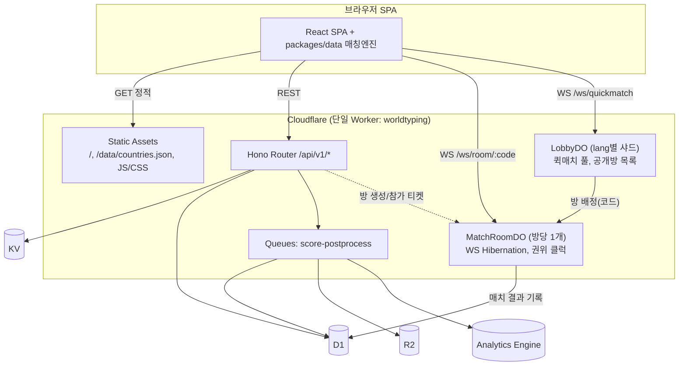
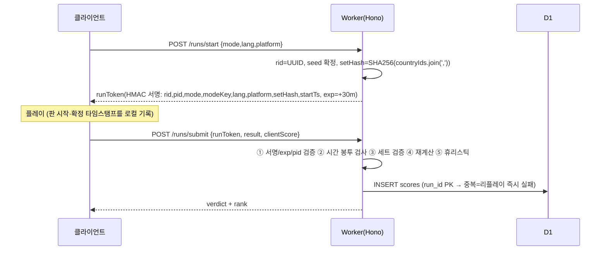

# 04. 백엔드 & Cloudflare 아키텍처

> 문서 버전: v1.0 (2026-07-21) / 담당: 백엔드 아키텍처
> 선행 문서: 01(GDD), 02(데이터 & 콘텐츠), 03(입력 엔진) / 후행 문서: 05(멀티플레이 프로토콜 상세), 06(랭킹/부정 방지 운영)
> 이 문서는 `apps/worker` 워크스페이스(단일 Cloudflare Worker + Durable Objects)와 `migrations/` 디렉터리를 이 문서만 읽고 구현할 수 있도록 작성되었다.

---

## 1. 스택 확정과 전체 토폴로지

### 1.1 확정 스택

| 레이어 | 선택 | 근거 |
|---|---|---|
| SPA 호스팅 | **Cloudflare Workers Static Assets** (`assets` 바인딩) | Cloudflare Pages는 신규 기능 추가가 중단된 유지보수 트랙이며, Cloudflare 공식 권장이 Workers로의 통합이다. 결정적 이유 3가지: ① API Worker와 정적 자산이 **하나의 배포 단위**(wrangler.toml 1개, 배포 1회, 버전 원자성 — `countries.json` 스키마와 API 검증 로직이 항상 같은 버전으로 움직여야 함), ② Durable Objects 바인딩은 Pages Functions에서 제약이 많고 Workers에선 1급 시민, ③ 같은 오리진(`worldtyping.gg`)에서 SPA와 `/api/*`, `/ws/*`를 서빙하므로 **CORS 자체가 소멸**한다. 정적 자산 요청은 무료·무제한이라 비용도 Pages와 동일. |
| API | **Workers + Hono** (v4) | 파일 크기 ~20KB, Workers 네이티브, `zod-validator` 미들웨어로 요청 스키마 검증, DO/WS 라우팅과 자연스럽게 결합. |
| 실시간 | **Durable Objects + WebSocket Hibernation API** | 방(room)당 1 DO = 단일 스레드 권위 서버. Hibernation으로 대기실/유휴 시간의 duration 과금 제거. |
| DB | **D1 (SQLite)** | 점수/매치/닉네임 영속화. 리더보드는 KV 캐시 뒤에서만 조회. |
| KV | 원격 설정(`config/*`), 리더보드 캐시(`lb:*`), 데일리 시드(`daily:*`), 레이트리밋 카운터(`rl:*`), 데이터 핫스왑(`data:*`) | 읽기 중심·최종 일관성 허용 데이터 전용. |
| R2 | 결과 공유 OG 카드 이미지(`cards/`), 고스트 리플레이 blob(`ghosts/`) | v1 필수 아님(카드 클라 생성 폴백 존재) — 바인딩만 준비. |
| Queues | 점수 제출 후처리(업적 판정, 고스트 저장, Analytics 적재)를 응답 경로에서 분리 | v1 포함. producer=API Worker, consumer=동일 Worker의 `queue()` 핸들러. |
| Cron Triggers | ① 데일리 챌린지 시드 발행(KST 00:00 = UTC 15:00), ② 리더보드 스냅샷 집계(5분), ③ 데이터 보존 정리(일 1회) | §8, §9. |
| Analytics Engine | 게임플레이 텔레메트리(판 시작/완주/스킵률/오타율), 치트 플래그 카운트 | 무스키마 write, SQL API로 조회. |

### 1.2 토폴로지



- 라우팅 규칙(wrangler `assets.run_worker_first`): `/api/*`, `/ws/*` 만 Worker 코드 실행, 나머지는 정적 자산 우선(SPA 404 → `index.html` fallback = `not_found_handling = "single-page-application"`).
- **국가 데이터 제공 방식(확정)**: `countries.json`은 API가 아니라 **정적 자산**으로 서빙한다(`/data/countries.<sha8>.json`, `Cache-Control: public, max-age=31536000, immutable`). 클라이언트는 부팅 시 `GET /api/v1/config`가 주는 `dataUrl`을 fetch한다. 02 문서의 "핫스왑" 요구는 KV로 충족: 운영자가 `data:countries:override` KV 키에 새 JSON을 넣으면 `config.dataUrl`이 `/api/v1/data/countries`(KV를 읽어 서빙, `max-age=300`)로 전환된다. 재배포 없이 국명 개정 대응 가능.

---

## 2. API 설계 (Hono)

### 2.1 공통 규약

- Base: `https://worldtyping.gg/api/v1`. 모든 응답 `application/json; charset=utf-8`.
- 에러 포맷(전역):

```ts
interface ApiError {
  error: {
    code: string;        // "INVALID_TOKEN" | "RATE_LIMITED" | "RUN_REJECTED" | "ROOM_FULL" | ...
    message: string;     // 영어 개발자 메시지. UI 문구는 클라 i18n이 code로 매핑
    retryAfterSec?: number;
  };
}
```

- 인증: `Authorization: Bearer <sessionToken>` (§5). 인증 불요 엔드포인트는 표에 명시.
- 모든 쓰기 엔드포인트에 레이트리밋(§6.5). 요청 바디는 zod로 검증하고 초과 필드는 reject(`.strict()`).

### 2.2 엔드포인트 목록

| # | Method/Path | 인증 | 용도 |
|---|---|---|---|
| 1 | `POST /session` | 없음 | 익명 세션 토큰 발급/갱신 |
| 2 | `GET /config` | 없음 | 원격 설정 + 데이터 버전 |
| 3 | `GET /daily` | 없음 | 오늘의 데일리 챌린지 메타 |
| 4 | `POST /runs/start` | 세션 | 싱글 판 시작 — 서명된 runToken(nonce) 발급 |
| 5 | `POST /runs/submit` | 세션 | 싱글 점수 제출 → 서버 재계산·검증 |
| 6 | `GET /leaderboard` | 없음 | 리더보드 조회(KV 캐시) |
| 7 | `GET /leaderboard/me` | 세션 | 내 순위/기록 |
| 8 | `POST /nickname/check` | 세션 | 닉네임 가용성/정책 검사 |
| 9 | `PUT /nickname` | 세션 | 닉네임 확정(예약) |
| 10 | `POST /rooms` | 세션 | 비공개 방 생성 → 방 코드 |
| 11 | `POST /rooms/:code/join` | 세션 | 방 참가 티켓 발급 |
| 12 | `GET /rooms/public` | 없음 | 공개 방 목록(LobbyDO 프록시, 3s 캐시) |
| 13 | `WS /ws/room/:code?ticket=...` | 티켓 | MatchRoomDO 웹소켓 |
| 14 | `WS /ws/quickmatch?ticket=...` | 티켓 | LobbyDO 퀵매치 대기열 |
| 15 | `GET /api/v1/data/countries` | 없음 | (핫스왑 활성 시에만) KV 데이터 서빙 |
| 16 | `DELETE /me` | 세션 | 내 데이터 삭제(§10) |
| 17 | `POST /auth/google` | 없음 | Google GIS ID-token 검증 → 계정 세션 토큰(wt1, `acct:1`) 발급. RL `auth` 10/60s/IP (00 §11-D68) |
| 18 | `POST /auth/dev` | 없음 | 테스트 심 — `ENVIRONMENT==='dev'`에서만 활성, 그 외 404 (00 §11-D68-⑩) |

### 2.3 스키마 상세 (TypeScript)

```ts
// ---------- 1. POST /session ----------
interface SessionReq {
  deviceId: string;           // 클라 생성 UUIDv4, localStorage 영속 (§5)
  prevToken?: string;         // 갱신 시. 만료 7일 전부터 rolling refresh
}
interface SessionRes {
  token: string;              // "wt1.<payloadB64>.<sigB64>" — 유효 30일
  playerId: string;           // deviceId로부터 결정: base58(HMAC(secret,"pid:"+deviceId))[0:12]
  nickname: string | null;    // 미설정 시 null → 클라가 "GUEST_xxxx" 표시
  expiresAt: string;          // ISO8601
}

// ---------- 2. GET /config ----------
interface ConfigRes {
  schemaVersion: 2;
  dataUrl: string;            // "/data/countries.a1b2c3d4.json" | "/api/v1/data/countries"
  mapUrl: string;             // "/data/countries-110m.json"
  grades: { S: number; A: number; B: number; C: number };   // PI 컷 (KV config:grades)
  timeLimit: { base: number; perKey: number; tierRelaxBase: number; tierRelaxStep: number; min: number; max: number };
  anticheat: { cpmHardCapKo: number; cpmHardCapEn: number; minMsPerKeystroke: number }; // §6
  featureFlags: Record<string, boolean>;   // {"ghostMode":true,"quiz":false}
}
// 전체가 KV "config:client" JSON 1개. edge cache 60s.

// ---------- 3. GET /daily ----------
interface DailyRes {
  dailyNo: number;            // 런칭일 기준 1부터 증가
  dateKst: string;            // "2026-07-21"
  seed: string;               // hex 64자 = SHA-256(serverSecret + dateKst) — 국가세트는 클라가 시드로 동일 재현
  countryIds: string[];       // 서버가 확정한 10개 (클라 재현값과 반드시 일치, 불일치 시 이 값이 권위)
  alreadyPlayed: boolean;     // 세션 토큰 있으면 계산, 없으면 false
}

// ---------- 4. POST /runs/start ----------
type GameMode = 'continent' | 'tier' | 'worldtour' | 'daily';
interface RunStartReq {
  mode: GameMode;
  lang: 'ko' | 'en';
  platform: 'desktop' | 'mobile';
  continent?: Continent;      // mode==='continent'일 때 필수
  tier?: 1|2|3|4|5;           // mode==='tier'일 때 필수
}
interface RunStartRes {
  runToken: string;           // 서명 토큰(§6.1): { rid, pid, mode, setHash, seed, startTs, exp: startTs+30min }
  runId: string;              // = rid (UUIDv4)
  serverStartTs: number;      // epoch ms — 클라 클럭 보정용
  countryIds: string[];       // 이 판의 출제 세트(순서 포함). tier/daily는 시드 셔플 결과를 서버가 확정
  seed: string;
}

// ---------- 5. POST /runs/submit ----------
interface RunSubmitReq {
  runToken: string;
  result: {
    elapsedMs: number;
    totalKeystrokes: number;
    correctKeystrokes: number;
    maxCombo: number;
    countriesCleared: number;
    countriesSkipped: number;
    livesLost: number;
    finished: boolean;
    perCountry: Array<{
      code: string;           // CountryId — runToken의 세트 순서와 정확히 일치해야 함
      ms: number;             // 이 국가에 소요된 시간
      keystrokes: number;     // 실제 입력 타수(별칭 지름길 반영)
      errors: number;
      skipped: boolean;
      inputUsed: string;      // 확정에 사용된 acceptedInput (정규화형) — 서버가 매칭엔진으로 재검증
    }>;
  };
  clientScore: number;        // 클라 계산치 — 서버 재계산과 비교(±1 초과 시 reject)
  nickname?: string;          // 랭킹 등재용(선택). 미보유+미제공 시 기록은 저장하되 리더보드 노출명 "GUEST"
}
interface RunSubmitRes {
  accepted: boolean;
  verdict: 'verified' | 'flagged' | 'practice';  // §6.4
  score: number; pi: number; grade: 'S'|'A'|'B'|'C'|'D';
  bestScore: number;          // 이 (mode,키) 조합의 내 역대 최고
  rank: { daily: number | null; weekly: number | null; alltime: number | null }; // flagged/practice면 null
}

// ---------- 6. GET /leaderboard ----------
// query: period=daily|weekly|alltime & mode=continent:asia|tier:3|worldtour|daily
//        & lang=ko|en & platform=desktop|mobile & cursor?=<opaque> & limit<=100
interface LeaderboardRes {
  entries: Array<{
    rank: number; playerId: string; nickname: string;
    score: number; pi: number; cpm: number; accuracy: number; elapsedMs: number;
    createdAt: string;
  }>;
  nextCursor: string | null;
  snapshotAt: string;         // 집계 시각 — "5분 전 기준" UI 표기용
}

// ---------- 8/9. 닉네임 ----------
interface NicknameCheckReq { nickname: string }
interface NicknameCheckRes {
  ok: boolean;
  reason?: 'TAKEN' | 'TOO_SHORT' | 'TOO_LONG' | 'INVALID_CHARS' | 'BLOCKED_WORD' | 'RESERVED';
}
// PUT /nickname: body 동일. 성공 시 SessionRes.nickname 갱신. 변경은 7일당 1회(레이트리밋 아님, 정책 — nicknames.changed_at 검사)

// ---------- 10/11. 방 ----------
interface RoomCreateReq {
  lang: 'ko' | 'en';
  maxPlayers: number;         // 2..8
  isPublic: boolean;
}
interface RoomCreateRes {
  roomCode: string;           // "KX7-3QP" — 표시용 하이픈 포함, 내부 키는 "KX73QP"
  ticket: string;             // WS 접속 티켓(§5.3): 60초 유효, 1회용
  wsUrl: string;              // "wss://worldtyping.gg/ws/room/KX73QP"
}
interface RoomJoinRes { ticket: string; wsUrl: string; }
// 에러: ROOM_NOT_FOUND(404), ROOM_FULL(409), ROOM_IN_PROGRESS(409), LANG_MISMATCH(409)
```

### 2.4 Hono 앱 골격

```ts
// apps/worker/src/index.ts
import { Hono } from 'hono';
import { zValidator } from '@hono/zod-validator';

export interface Env {
  ASSETS: Fetcher;
  DB: D1Database;
  KV: KVNamespace;
  BUCKET: R2Bucket;                       // R2 (v1: 카드/고스트)
  SCORE_QUEUE: Queue<ScoreJob>;
  AE: AnalyticsEngineDataset;
  MATCH_ROOM: DurableObjectNamespace;
  LOBBY: DurableObjectNamespace;
  SESSION_HMAC_SECRET: string;            // secret
  RUN_HMAC_SECRET: string;                // secret (세션과 키 분리 — 키 용도 격리)
  TURNSTILE_SECRET?: string;              // 예약(§6.6)
  ENVIRONMENT: 'dev' | 'staging' | 'prod';
}

const app = new Hono<{ Bindings: Env }>();
app.route('/api/v1', apiV1);              // 위 2.2의 REST 전부
app.get('/ws/room/:code', roomWsUpgrade); // ticket 검증 → MATCH_ROOM.idFromName(`room:${code}`).fetch()
app.get('/ws/quickmatch', lobbyWsUpgrade);// ticket 검증 → LOBBY.idFromName(`lobby:${lang}`).fetch()
app.all('*', (c) => c.env.ASSETS.fetch(c.req.raw)); // run_worker_first 매칭 외에는 도달 안 함(방어)

export default {
  fetch: app.fetch,
  queue: scoreQueueConsumer,              // §8
  scheduled: cronDispatcher,              // §8
};
export { MatchRoomDO } from './do/match-room';
export { LobbyDO } from './do/lobby';
```

---

## 3. Durable Objects 설계

### 3.1 MatchRoomDO — 방당 1개, 완전 권위 서버

**아이덴티티**: `idFromName("room:" + roomCode)` (roomCode는 하이픈 제거 6자, 알파벳 `23456789ABCDEFGHJKMNPQRSTUVWXYZ` 28^6 ≈ 4.8억 조합). API의 `POST /rooms`가 코드를 랜덤 생성 → DO에 `POST /init` → DO가 이미 `meta`를 가진 경우 409 → API가 재생성(최대 3회 시도). 별도 레지스트리 불필요 — **이름 결정적 매핑이 곧 레지스트리**다.

**상태 머신**:

```
WAITING → COUNTDOWN(5s, alarm) → RACING(hardcap 180s, alarm) → FINISHED(결과 30s, 리매치 투표) → (리매치: COUNTDOWN | 30s 경과: CLOSED)
어느 상태든 인원 0 + 10분 경과(alarm) → storage.deleteAll() (GC)
```

**storage 키 설계** (Hibernation 후 wake-up 시 이 키들만으로 완전 복원):

| 키 | 값 | 비고 |
|---|---|---|
| `meta` | `{ roomCode, lang, maxPlayers, isPublic, hostPid, state, createdAt, matchId? }` | matchId는 RACING 진입 시 UUIDv4 발급 |
| `set` | `{ seed, countryIds: string[15], compiled: 없음 }` | compiled targets는 wake 시 `packages/data`의 `COUNTRIES` 상수에서 메모리 재구성(저장 안 함) |
| `p:{pid}` | `{ pid, nickname, cover, pi, ready, joinedAt, progressIdx, errors, keystrokes, finishedAt?, disconnected }` | 플레이어당 1키 |
| `clock` | `{ countdownEndTs?, raceStartTs?, hardcapTs? }` | 권위 클럭. 모든 판정은 DO의 `Date.now()` 기준 |
| `rematch` | `{ votes: pid[], deadline }` | |

WS 연결은 **Hibernation API** 사용: `this.ctx.acceptWebSocket(ws, [pid])` + `ws.serializeAttachment({ pid })`. 대기실에서 아무 메시지가 없으면 DO는 메모리에서 내려가고 duration 과금이 멈춘다. `webSocketMessage/webSocketClose` 핸들러에서 `ws.deserializeAttachment()`로 pid 복원.

```ts
export class MatchRoomDO extends DurableObject<Env> {
  // --- HTTP (Worker 내부 호출 전용) ---
  // POST /init {lang,maxPlayers,isPublic,hostPid}  → 201 | 409(코드 충돌)
  // POST /join {pid} → 참가 가능성 사전 검사(FULL/IN_PROGRESS/LANG) → 200 (티켓은 API가 발급)
  // GET  /info → 공개 방 목록용 요약
  // --- WS 업그레이드 ---
  async fetch(req: Request) { /* /ws 경로: ticket 재검증(변조 방어) 후 acceptWebSocket */ }

  async webSocketMessage(ws: WebSocket, raw: string) {
    // 메시지 rate guard: pid별 토큰버킷 30 msg/s, 초과 시 1006 close
    const msg = parse(raw); // zod
    switch (msg.t) {
      case 'ready': ...
      case 'start':        // host만. 전원 ready 검사 → COUNTDOWN: alarm(now+5000)
      case 'progress': {   // { t:'progress', idx, input }  ← 국가 확정 시에만 전송
        // 권위 검증(§6.3): idx === player.progressIdx 인지,
        // matchInput(input, compiledTargets[idx], lang) === 'EXACT' 인지,
        // (now - raceStartTs) 가 물리적 최소시간(누적 keystroke × minMsPerKeystroke)보다 큰지.
        // 통과 → progressIdx++, 15 도달 시 finishedAt = now, 순위 확정
      }
      case 'typo': ...     // 진행바 셰이크 연출용, errors++ (검증 없음, 통계만)
      case 'chat': ...     // 대기실만, 120자, 초당 1회
      case 'rematchVote': ...
    }
  }

  async webSocketClose(ws: WebSocket) { /* disconnected=true, RACING 중이면 최하위 고정, WAITING이면 슬롯 제거 */ }

  async alarm() {
    // clock 상태로 분기: COUNTDOWN 종료 → RACING 시작(raceStartTs=now, alarm(now+180_000))
    // hardcap 도달 → 전원 강제 결승(§8.1 규칙: 진행수 → 진행중 국가의 입력 타수 순) → FINISHED, D1 기록
    // FINISHED+30s → 리매치 미성립 시 CLOSED, 인원 0 GC 체크
  }

  private broadcast(payload: unknown) {
    for (const ws of this.ctx.getWebSockets()) ws.send(JSON.stringify(payload));
  }
  // 진행 브로드캐스트는 250ms 스로틀: 마지막 브로드캐스트 후 변경 있을 때만 setTimeout 배치
}
```

**D1 기록**: FINISHED 확정 시 DO가 직접 `matches` 1행 + `match_participants` N행을 단일 `batch()`로 insert. 실패 시 storage `pendingWrite` 키에 페이로드 저장 + alarm 재시도(최대 5회, 지수 백오프) — 결과 유실 방지.

**브로드캐스트 페이로드**(레이스 중, 250ms):

```ts
{ t: 'tick', now: number, players: Array<{ pid: string; idx: number; combo: number; disc: boolean; fin?: number }> }
```

### 3.2 LobbyDO — 퀵매치 풀 + 공개 방 레지스트리

**샤딩**: `idFromName("lobby:" + lang)` — v1은 **ko/en 2개 싱글턴**. 병목 분석: LobbyDO가 처리하는 것은 ① 퀵매치 WS의 join/leave(유저당 수 회), ② 15초 매칭 타이머 alarm, ③ 공개 방 목록 갱신(방 DO가 상태 변화 시 push). 단일 DO의 실용 처리량 ~500 req/s인데, 동시 접속 1만 명이 전원 1분에 1회 퀵매치를 눌러도 ~170 req/s — **v1 규모에서 싱글턴으로 충분**. 초과 성장 시 확장 경로를 지금 코드에 박아둔다: 샤드 키를 `lobby:{lang}:{shard}`로 하고 `shard = hash(pid) % N`, N은 KV `config:lobbyShards`로 배포(기본 1). 샤드 간 풀 파편화는 "같은 샤드 내 매칭"만 하므로 정합성 문제 없음(매칭 품질만 미세 저하).

**퀵매치 알고리즘**(GDD §8.2 계약 구현):

```
storage 키: pool = [{ pid, ws연결tag, joinedAt, pi }]
- join: pool에 추가. |pool| >= 4 → 즉시 매치 성사.
- alarm(가장 오래된 대기자 joinedAt + 15s): |pool| >= 2 → 성사, 아니면 계속 대기.
- joinedAt + 60s: 봇 매치 제안 메시지 push (v1: 고스트 봇, 클라 싱글 폴백 — 방 미생성)
- 성사 시: LobbyDO가 방 코드 생성 → MATCH_ROOM.idFromName().fetch('/init') → 각 대기자 WS로
  { t:'matched', roomCode, ticket } 전송 후 연결 종료. 티켓은 LobbyDO가 RUN_HMAC_SECRET로 서명 발급.
- 매칭 기준 v1: 선착순(FIFO). PI 밴드 매칭은 v1.5 (pool 정렬 기반, 코드 자리만 확보).
```

**공개 방 레지스트리**: `publicRooms` storage 키 = `Map<roomCode, {count,max,lang,state,updatedAt}>`. MatchRoomDO가 상태 변화 시 LobbyDO에 `POST /room-status` (Worker 경유 없이 DO→DO stub 호출). 60초 이상 갱신 없는 항목은 목록 제공 시 lazy 제거. `GET /rooms/public`은 API Worker가 LobbyDO에 프록시하되 `caches.default`로 3초 캐시.

---

## 4. D1 스키마 (DDL)

`migrations/0001_init.sql` — wrangler d1 migrations로 관리. 규약: 시각은 epoch ms `INTEGER`, id는 TEXT(UUID/파생 ID), 불리언은 INTEGER 0/1.

```sql
-- 0001_init.sql
PRAGMA defer_foreign_keys = true;

CREATE TABLE players (
  player_id     TEXT PRIMARY KEY,            -- base58(HMAC(secret, deviceId))[0:12] — deviceId 원문 비저장(§10)
  nickname      TEXT,                        -- NULL = 게스트
  created_at    INTEGER NOT NULL,
  last_seen_at  INTEGER NOT NULL,
  country_region TEXT,                       -- request.cf.country 2자 (통계용, 좌표/IP 비저장)
  flags         INTEGER NOT NULL DEFAULT 0   -- bit0: shadow-banned(리더보드 비노출), bit1: nickname locked
);

CREATE TABLE nicknames (
  nickname_norm TEXT PRIMARY KEY,            -- lower + NFC + 공백제거 정규화형 (유일성 판정 키)
  nickname      TEXT NOT NULL,               -- 표시형
  player_id     TEXT NOT NULL REFERENCES players(player_id),
  changed_at    INTEGER NOT NULL
);
CREATE INDEX idx_nicknames_player ON nicknames(player_id);

CREATE TABLE scores (
  run_id        TEXT PRIMARY KEY,            -- runToken의 rid — PK 유일성이 nonce 재사용(리플레이) 방지 그 자체
  player_id     TEXT NOT NULL REFERENCES players(player_id),
  mode          TEXT NOT NULL CHECK (mode IN ('continent','tier','worldtour','daily')),
  mode_key      TEXT NOT NULL,               -- continent:'asia'.. / tier:'1'..'5' / worldtour:'-' / daily:'2026-07-21'
  lang          TEXT NOT NULL CHECK (lang IN ('ko','en')),
  platform      TEXT NOT NULL CHECK (platform IN ('desktop','mobile')),
  score         INTEGER NOT NULL,
  pi            INTEGER NOT NULL,            -- round(CPM × ACC²)
  cpm           INTEGER NOT NULL,
  accuracy      REAL    NOT NULL,            -- 0..1
  elapsed_ms    INTEGER NOT NULL,
  max_combo     INTEGER NOT NULL,
  cleared       INTEGER NOT NULL,
  skipped       INTEGER NOT NULL,
  finished      INTEGER NOT NULL,            -- 0/1
  verdict       TEXT NOT NULL DEFAULT 'verified' CHECK (verdict IN ('verified','flagged','practice')),
  region        TEXT,                        -- request.cf.colo 대륙 코드 (레이턴시 통계)
  created_at    INTEGER NOT NULL
);
-- 리더보드 핵심 쿼리: WHERE mode_key/lang/platform/verdict + 기간 → score DESC
CREATE INDEX idx_scores_lb ON scores(mode, mode_key, lang, platform, verdict, created_at, score DESC);
-- 개인 최고 조회: WHERE player_id AND mode/mode_key/lang → score DESC
CREATE INDEX idx_scores_player ON scores(player_id, mode, mode_key, lang, score DESC);
-- 보존 정리(cron): WHERE created_at < ?
CREATE INDEX idx_scores_created ON scores(created_at);

CREATE TABLE matches (
  match_id      TEXT PRIMARY KEY,            -- MatchRoomDO 발급 UUID
  room_code     TEXT NOT NULL,
  lang          TEXT NOT NULL,
  seed          TEXT NOT NULL,
  country_ids   TEXT NOT NULL,               -- JSON array (15개)
  player_count  INTEGER NOT NULL,
  started_at    INTEGER NOT NULL,
  ended_at      INTEGER NOT NULL,
  end_reason    TEXT NOT NULL CHECK (end_reason IN ('all_finished','hardcap','abandoned'))
);
CREATE INDEX idx_matches_started ON matches(started_at);

CREATE TABLE match_participants (
  match_id      TEXT NOT NULL REFERENCES matches(match_id),
  player_id     TEXT NOT NULL,
  rank          INTEGER NOT NULL,
  progress      INTEGER NOT NULL,            -- 완료 국가 수 (완주=15)
  elapsed_ms    INTEGER,                     -- 미완주 NULL
  cpm           INTEGER NOT NULL,
  accuracy      REAL NOT NULL,
  pi            INTEGER NOT NULL,
  disconnected  INTEGER NOT NULL DEFAULT 0,
  PRIMARY KEY (match_id, player_id)
);
CREATE INDEX idx_mp_player ON match_participants(player_id, rank);   -- 전적/승수 조회

CREATE TABLE daily_challenges (
  date_kst      TEXT PRIMARY KEY,            -- '2026-07-21'
  daily_no      INTEGER NOT NULL UNIQUE,
  seed          TEXT NOT NULL,
  country_ids   TEXT NOT NULL,               -- JSON array (10개) — cron이 확정 저장(사후 분쟁 방지)
  created_at    INTEGER NOT NULL
);

-- 리더보드 스냅샷(§9.2): cron 집계 결과. KV 캐시의 원천
CREATE TABLE leaderboard_snapshots (
  snap_key      TEXT NOT NULL,               -- 'daily:2026-07-21|continent:asia|ko|desktop'
  rank          INTEGER NOT NULL,
  player_id     TEXT NOT NULL,
  nickname      TEXT NOT NULL,
  score         INTEGER NOT NULL, pi INTEGER NOT NULL, cpm INTEGER NOT NULL,
  accuracy      REAL NOT NULL, elapsed_ms INTEGER NOT NULL, created_at INTEGER NOT NULL,
  PRIMARY KEY (snap_key, rank)
);
```

**데일리 1일 1회 등재**(GDD §9.1): `scores`에 `mode='daily' AND mode_key=날짜 AND player_id` 존재 검사 후 두 번째부터 `verdict='practice'`로 강등 insert. 유니크 제약 대신 애플리케이션 검사인 이유: 연습 기록도 저장은 해야 하므로.

---

## 5. 신원/세션 모델

### 5.1 익명 디바이스 신원

- 클라 최초 실행 시 `crypto.randomUUID()` → `localStorage["wt:did"]`. 삭제 시 새 신원(= 기록 리셋, 정책상 허용).
- 서버는 deviceId **원문을 저장하지 않는다**. `playerId = base58(HMAC-SHA256(SESSION_HMAC_SECRET, "pid:" + deviceId)).slice(0,12)` — 일방향 파생이라 D1 유출 시에도 디바이스 역추적 불가(§10).

### 5.2 세션 토큰 (stateless HMAC)

```
포맷:  wt1.<base64url(JSON payload)>.<base64url(HMAC-SHA256(SESSION_HMAC_SECRET, "wt1."+payloadB64))>
payload: { v:1, pid: string, iat: number, exp: number }   // exp = iat + 30일
```

- 검증은 WebCrypto `crypto.subtle.verify` (Workers에서 ~0.1ms). D1/KV 조회 없는 완전 stateless — 세션 검증이 DB 병목이 되지 않는다.
- 갱신: `exp - now < 7일`이면 `POST /session`에 prevToken 동봉 → 새 토큰. 만료 토큰은 deviceId 재제출로 재발급(같은 pid 파생이므로 기록 연속).
- 폐기: 개별 폐기 불가(stateless 트레이드오프) → 악성 유저는 `players.flags` shadow-ban 비트로 대응(토큰은 유효하되 기록이 리더보드에 안 나감).

### 5.3 WS 티켓

WebSocket은 헤더를 못 실으므로 쿼리스트링 1회용 티켓: `{ v:1, pid, room, iat, exp: iat+60s }`를 `RUN_HMAC_SECRET`로 서명. DO가 검증 + storage `usedTickets` 세트(만료분 lazy 정리)로 재사용 차단. URL 로그 노출 위험은 60초 수명 + 1회용으로 상쇄.

### 5.4 향후 OAuth 확장 (v1 구현 안 함, 스키마만 대비)

- `players`에 마이그레이션으로 `auth_provider TEXT, auth_subject TEXT` 추가 + `UNIQUE(auth_provider, auth_subject)`.
- 로그인 시: OAuth(id_token 검증은 Workers에서 JWKS fetch) → 기존 익명 pid와 **병합 API** `POST /auth/link` — scores/match_participants의 player_id를 UPDATE하는 대신 `player_links(old_pid, new_pid)` 매핑 테이블로 조인(대량 UPDATE 회피). 세션 토큰 포맷은 payload에 `sub` 필드만 추가되고 검증 경로 동일 — **현 토큰 설계가 그대로 상위 호환**.

### 5.5 계정 계층 (Google 로그인 — 00 §11-D68)

> §5.4의 "v1 구현 안 함" 전제는 D68로 개정되었다. 단 §5.4의 병합 API(`POST /auth/link`, `player_links`) 구상은 **미채택** — 게스트→계정 데이터 연결(병합)은 v1 비도입이고(D68-④), 결과 화면 등재용 guestToken 브리지(§6.2-①)만 허용된다.

- **플로우**: 클라 GIS(Google Identity Services)가 ID-token 취득(프론트는 `GOOGLE_CLIENT_ID` 공개값만 사용, redirect URI 없음) → `POST /auth/google` → 서버가 Google JWKS(RS256)로 서명·iss·aud·exp 검증(JWKS는 KV `auth:google:jwks` 6h 캐시, client secret 불요) → 계정 세션 토큰(wt1) 발급.
- **신원 파생**: 계정 `user_id = derivePlayerId(SESSION_HMAC_SECRET, "google:" + sub)` — §5.1의 일방향 파생 규약(D38) 승계. `device_hash`도 동일 입력 파생으로 0001 스키마 무변경, 계정 매핑은 신규 `0005_auth_identities.sql`(provider+subject PK, email은 `email_verified`인 경우만 저장).
- **토큰**: wt1 포맷 유지 + `SessionPayload`에 `acct?: 1` 옵션 클레임 추가 — 기존 게스트 토큰은 계속 유효. 랭킹 등재는 acct 세션 전용(비로그인 제출은 `verdict='practice'`/`reason='guest'` 강등 — D39), 멀티 REST 4종(방 생성/참가/퀵매치/코드참가)은 `requireAccountAuth`(401 `LOGIN_REQUIRED`). WS 티켓은 계정 pid로만 발급되므로 WS/DO 프로토콜 무수정(D7 불변).

---

## 6. 안티치트 — 서버 권위 설계

원칙: **멀티는 DO가 100% 권위**(클라는 입력 문자열만 보냄, 판정·클럭·순위 전부 서버), **싱글은 "제출 시 재계산 + 물리 불가능성 검사"**로 통계적 권위를 확보한다. 클라 재계산 로직은 `packages/data` + `packages/scoring`을 서버와 공유(단일 코드, 02 문서 §3과 동일 원칙).

### 6.1 싱글 판의 생명주기



### 6.2 제출 검증 파이프라인 (전 단계 순서 고정, 구현 체크리스트)

| # | 검사 | 실패 시 |
|---|---|---|
| 1 | runToken HMAC/exp, `token.pid === session.pid`. **guestToken 브리지(00 §11-D68-④)**: 계정(acct) 제출인데 `runToken.pid ≠ session.pid`이면 body의 `guestToken`(pid === runToken.pid) 검증으로 두 신원 동시 보유를 증명한 경우에만 통과 → 계정 원장 등재 | 401 `INVALID_TOKEN` |
| 2 | **리플레이**: `INSERT`가 `run_id` PK 충돌 | 409 `RUN_ALREADY_SUBMITTED` |
| 3 | **시간 봉투**: `serverElapsed = now − token.startTs`. 요구: `result.elapsedMs ≤ serverElapsed + 3000` (실제 흐른 시간보다 짧게 플레이했다고 주장 불가). 또한 `serverElapsed ≤ 30min`(토큰 exp와 동일) | reject `TIME_ENVELOPE` |
| 4 | **세트 일치**: `SHA256(perCountry.map(c=>c.code).join(',')) === token.setHash`의 prefix(중도 탈락 시 앞부분 일치), skipped/cleared 수 합계 일치 | reject `SET_MISMATCH` |
| 5 | **매칭 재검증**: cleared 국가마다 `matchInput(inputUsed, compileTargets(country, lang), lang) === 'EXACT'` — 서버가 02 문서의 동일 매칭엔진 실행 | reject `INPUT_INVALID` |
| 6 | **합산 정합**: `Σ perCountry.ms ∈ [elapsedMs×0.99 − 500, elapsedMs×1.01 + 500]`, `Σ keystrokes+errors === totalKeystrokes`, `correct = total − errors − skipped국가 타수` 재계산 일치 | reject `STATS_MISMATCH` |
| 7 | **물리 한계(국가 단위)**: 각 cleared 국가에서 `ms ≥ keystrokes × minMsPerKeystroke` (config 기본 **40ms/키 = 순간 1500타/분**). 위반 1개라도 있으면 reject — 인간 세계기록의 밖 | reject `IMPOSSIBLE_SPEED` |
| 8 | **CPM 하드캡(판 단위)**: 재계산 CPM > `cpmHardCapKo=1100` / `cpmHardCapEn=1000` (KV config, 무배포 조정) | reject `IMPOSSIBLE_CPM` |
| 9 | **점수 재계산**: 01 문서 §6.2 공식을 서버에서 계산, `|serverScore − clientScore| > 1` | reject `SCORE_MISMATCH` (클라 버그 탐지 겸용) |
| 10 | **휴리스틱 플래그**(reject 아님 → `verdict='flagged'`): (a) CPM이 해당 pid 최근 20판 평균의 2.5배 초과, (b) 국가별 ms 분산이 비정상적으로 낮음(σ/μ < 0.08 — 봇의 균일 타이밍), (c) ACC=100% AND CPM>700 AND 첫 제출 계정, (d) 클라가 자진 신고한 벌크 입력 이벤트(모바일 스와이프 감지, GDD §11.3) → `verdict='practice'` | 리더보드 비노출, AE에 적재, 06 문서의 운영 리뷰 큐로 |

flagged는 본인 화면에는 정상 표시(어뷰저에게 탐지 사실을 알리지 않는 shadow 방식), 리더보드 집계 쿼리는 `verdict='verified'`만 읽는다.

### 6.3 멀티 (DO 권위)

- 클라는 국가 확정 시 `{t:'progress', idx, input}`만 전송. **타임스탬프를 클라가 보내지 않는다** — DO 수신 시각이 곧 기록.
- DO 검증: ① `idx`가 서버가 아는 다음 인덱스인지(순서 강제), ② `matchInput === 'EXACT'`, ③ 누적 물리 한계: `now − raceStartTs ≥ Σ(완료 국가 keystroke) × 40ms` 위반 시 해당 progress 무시 + `strike++`, 3 strike → kick(1008 close) + 매치 기록에 disconnected 처리.
- 레이스당 메시지 상한: progress 15 + typo ≤ 200 + 여유 = 연결당 300 메시지, 초과 시 close. 토큰버킷 30 msg/s.
- 결과는 DO가 계산·기록하므로 클라 조작 표면이 없다.

### 6.4 verdict 규정

| verdict | 의미 | 리더보드 | 개인 기록 |
|---|---|---|---|
| `verified` | 전 검사 통과 | 등재 | 갱신 |
| `flagged` | 휴리스틱 의심 | 비등재(shadow) | 갱신(본인 화면) |
| `practice` | 정책상 비경쟁(데일리 재도전, 창 블러, 벌크 입력) | 비등재 | 별도 표기 |

### 6.5 레이트리밋 (KV 고정윈도 + DO 토큰버킷 2계층)

```ts
// KV 고정윈도(관대한 1차 방어): 키 rl:{scope}:{pid|ip}:{windowStart}
// KV는 결과적 일관성 → 경계 오차 허용. 정밀 한도는 쓰기 엔드포인트의 D1/DO 검증이 담당.
const LIMITS = {
  'session':      { per: 'ip',  window: 60, max: 10 },
  'runs/start':   { per: 'pid', window: 60, max: 10 },   // 판당 최소 20s 가정
  'runs/submit':  { per: 'pid', window: 60, max: 10 },
  'nickname':     { per: 'pid', window: 3600, max: 5 },
  'rooms(create)':{ per: 'pid', window: 60, max: 5 },
  'leaderboard':  { per: 'ip',  window: 60, max: 60 },
} as const;
// 초과 → 429 + retryAfterSec. IP는 request.headers.get('CF-Connecting-IP')의 SHA-256 해시만 키에 사용(원문 비저장).
```

추가로 Workers **Rate Limiting binding**(`[[unsafe.bindings]] type="ratelimit"`)을 `runs/submit`에 이중 적용(콜로 로컬·저지연). WS는 §6.3의 DO 내 토큰버킷.

### 6.6 예약 항목

- Turnstile(Invisible)을 `POST /session`에 옵션 연결(`TURNSTILE_SECRET` 시크릿 자리만 확보) — 봇 대량 세션 생성이 관측되면 KV 플래그로 활성화.
- 키스트로크 타이밍 로그 전체 제출(리플레이 검증)은 v1.5 — 페이로드 크기 대비 효익으로 보류. `perCountry` 단위가 v1의 균형점.

---

## 7. 설정 / 환경 (wrangler.toml)

```toml
# apps/worker/wrangler.toml
name = "worldtyping"
main = "src/index.ts"
compatibility_date = "2026-06-01"
compatibility_flags = ["nodejs_compat"]

[assets]
directory = "../web/dist"          # SPA 빌드 산출물 + public/data/*
binding = "ASSETS"
not_found_handling = "single-page-application"
run_worker_first = ["/api/*", "/ws/*"]

[observability]
enabled = true                      # Workers Logs

[durable_objects]
bindings = [
  { name = "MATCH_ROOM", class_name = "MatchRoomDO" },
  { name = "LOBBY",      class_name = "LobbyDO" },
]
[[migrations]]
tag = "v1"
new_sqlite_classes = ["MatchRoomDO", "LobbyDO"]   # SQLite-backed DO (신규 기본, storage API 동일)

[[queues.producers]]
queue = "score-postprocess"
binding = "SCORE_QUEUE"
[[queues.consumers]]
queue = "score-postprocess"
max_batch_size = 50
max_batch_timeout = 5

[triggers]
crons = [
  "0 15 * * *",   # KST 00:00 — 데일리 시드 발행
  "*/5 * * * *",  # 리더보드 스냅샷 집계
  "30 16 * * *",  # KST 01:30 — 데이터 보존 정리
]

[[analytics_engine_datasets]]
binding = "AE"
dataset = "wt_telemetry"

# ---------- dev (wrangler dev 기본) ----------
[[d1_databases]]
binding = "DB"
database_name = "worldtyping-dev"
database_id = "<dev-uuid>"
[[kv_namespaces]]
binding = "KV"
id = "<dev-kv-id>"
[[r2_buckets]]
binding = "BUCKET"
bucket_name = "worldtyping-dev"
[vars]
ENVIRONMENT = "dev"
GOOGLE_CLIENT_ID = "<google-oauth-client-id>"   # 공개 client ID — 시크릿 아님 (00 §11-D68)

# ---------- staging ----------
[env.staging]
name = "worldtyping-staging"
routes = [{ pattern = "staging.worldtyping.gg", custom_domain = true }]
[env.staging.vars]
ENVIRONMENT = "staging"
GOOGLE_CLIENT_ID = "<google-oauth-client-id>"   # 공개 client ID — 시크릿 아님 (00 §11-D68)
[[env.staging.d1_databases]]
binding = "DB"
database_name = "worldtyping-staging"
database_id = "<staging-uuid>"
[[env.staging.kv_namespaces]]
binding = "KV"
id = "<staging-kv-id>"
[[env.staging.r2_buckets]]
binding = "BUCKET"
bucket_name = "worldtyping-staging"
# (DO/Queues/AE 바인딩은 env별 재선언 — 클래스 동일, 네임스페이스 분리)

# ---------- prod ----------
[env.prod]
name = "worldtyping-prod"
routes = [
  { pattern = "worldtyping.gg",     custom_domain = true },
  { pattern = "www.worldtyping.gg", custom_domain = true },  # Worker에서 apex로 301
]
[env.prod.vars]
ENVIRONMENT = "prod"
GOOGLE_CLIENT_ID = "<google-oauth-client-id>"   # 공개 client ID — 시크릿 아님 (00 §11-D68)
[[env.prod.d1_databases]]
binding = "DB"
database_name = "worldtyping-prod"
database_id = "<prod-uuid>"
[[env.prod.kv_namespaces]]
binding = "KV"
id = "<prod-kv-id>"
[[env.prod.r2_buckets]]
binding = "BUCKET"
bucket_name = "worldtyping-prod"
```

- **Secrets** (환경별 `wrangler secret put --env prod`): `SESSION_HMAC_SECRET`, `RUN_HMAC_SECRET`(각 32바이트 랜덤 hex, 분기 1회 로테이션 — 로테이션 시 구/신 2키 동시 검증 기간 7일), `SENTRY_DSN`, `TURNSTILE_SECRET`(예약). **코드/토ML에 시크릿 절대 미기재.**
- **커스텀 도메인**: `worldtyping.gg` 존을 Cloudflare에 두고 Workers Custom Domains 사용(DNS/인증서 자동). WS도 동일 도메인(`wss://worldtyping.gg/ws/...`) — 별도 인프라 없음.
- **CORS**: 동일 오리진 설계라 prod에선 불필요. 예외 2곳만 허용 — ① `wrangler dev` 로컬(`http://localhost:5173` → `Access-Control-Allow-Origin` 반사, `ENVIRONMENT==='dev'`일 때만), ② staging 도메인. Hono `cors()` 미들웨어를 `/api/*`에만, `allowHeaders: ['Authorization','Content-Type']`, `maxAge: 86400`.

---

## 8. 배포 / CI / 관측성

### 8.1 파이프라인 (GitHub Actions)

```yaml
# .github/workflows/deploy.yml (요지)
on:
  pull_request:
  push: { branches: [main] }
  release: { types: [published] }

jobs:
  ci:
    runs-on: ubuntu-latest
    steps:
      - uses: actions/checkout@v4
      - uses: pnpm/action-setup@v4
      - run: pnpm install --frozen-lockfile
      - run: pnpm build:data && git diff --exit-code public/data  # 02 문서 §10: 산출물 신선도
      - run: pnpm typecheck && pnpm test                          # vitest (매칭엔진·점수 재계산·DO는 vitest-pool-workers)
      - run: pnpm --filter web build

  preview:            # PR마다 — 프로덕션 트래픽 0%의 버전 업로드
    if: github.event_name == 'pull_request'
    needs: ci
    steps:
      - run: pnpm wrangler versions upload --env staging
      # 출력된 preview URL(버전별 *.workers.dev)을 PR 코멘트로 게시 (cloudflare/wrangler-action@v3)

  deploy-staging:     # main 머지 시
    if: github.ref == 'refs/heads/main'
    needs: ci
    steps:
      - run: pnpm wrangler d1 migrations apply worldtyping-staging --env staging --remote
      - run: pnpm wrangler deploy --env staging

  deploy-prod:        # GitHub Release 발행 시 (수동 게이트)
    if: github.event_name == 'release'
    needs: ci
    environment: production          # GH environment protection rule로 승인자 지정
    steps:
      - run: pnpm wrangler d1 migrations apply worldtyping-prod --env prod --remote
      - run: pnpm wrangler deploy --env prod
```

- 인증: `CLOUDFLARE_API_TOKEN`(Workers Scripts:Edit + D1:Edit + KV:Edit 최소 권한), `CLOUDFLARE_ACCOUNT_ID`를 GH Secrets에.
- **D1 마이그레이션 규율**: 파일은 `migrations/000N_*.sql` 추가 전용(수정 금지). 배포 순서는 항상 "migrations apply → deploy" — 신 코드가 구 스키마를 만나는 창을 없앤다. 파괴적 변경(컬럼 삭제)은 2단계 배포(코드에서 참조 제거 배포 → 다음 릴리스에서 DDL).
- **DO 마이그레이션**: 클래스 rename/삭제는 `[[migrations]]` 태그 증가로만. MatchRoomDO 상태는 판 단위 휘발이라 코드 배포 중 진행 중이던 방은 wake 시 storage에서 복원 — 프로토콜 메시지에 `pv`(protocol version) 필드를 넣어 구버전 클라에 `{t:'reload'}` 지시.

### 8.2 관측성

| 도구 | 용도 | 설정 |
|---|---|---|
| Workers Logs (`observability.enabled`) | 구조화 로그 보존·검색. `console.log(JSON.stringify({evt, pid, rid, ...}))` 규약 | 대시보드 쿼리: `evt="run_rejected"` 등 |
| `wrangler tail --env prod --format pretty` | 실시간 디버그 | 온콜 런북에 명령 명시 |
| Analytics Engine | 제품 지표: `AE.writeDataPoint({ blobs:[evt,mode,lang,platform,verdict], doubles:[cpm,acc,elapsedMs], indexes:[pid] })` — 판 시작/제출/거부/매치 종료 | SQL API로 Grafana 연결 |
| Sentry (`toucan-js`) | 예외 수집. Hono `onError` + DO try/catch 최상위에서 capture. `tracesSampleRate: 0.05` | `SENTRY_DSN` secret |
| Cloudflare Notifications | Workers 에러율/CPU 급증, D1 스토리지 80% 알림 → Slack webhook | 대시보드에서 구성 |
| 합성 모니터링 | 외부(BetterStack/UptimeRobot)에서 `GET /api/v1/config` 60초 폴링 + WS 핸드셰이크 체크 5분 | 무료 플랜으로 충분 |

핵심 알람 3개(런칭 주 필수): ① 5xx 비율 > 1%/5min, ② `run_rejected` 비율 > 10%/15min(클라 버그 신호 — 점수 재계산 불일치 대량 발생), ③ MatchRoomDO 예외 > 10건/5min.

---

## 9. 비용 / 스케일 모델

### 9.1 기준 시나리오: 10,000 DAU (바이럴 성공 초기), 피크 동접 1,000

가정: 유저당 4판/일(싱글 3 + 데일리 1), 20%가 멀티 1매치, 평균 매치 5분(대기 2 + 레이스 3), 4인/매치.

| 리소스 | 일 사용량 산정 | 월 환산 | 한도/과금 (Workers Paid $5 포함분) | 월 비용 |
|---|---|---|---|---|
| Workers 요청 | API ~15 req/판 × 40k판 + 기타 = ~700k/일 | ~21M | 10M 포함, 초과 $0.30/M | **$5 + ~$3.3** |
| 정적 자산 | SPA+데이터 요청 | 무제한 | **무료** | $0 |
| DO requests | 매치 500/일 × (WS 메시지 수신 ~2k/매치, hibernation 20:1 계상 ≈ 100 req) + init | ~1.6M | 1M 포함, $0.15/M | ~$0.1 |
| DO duration | 활성 시간: 500매치 × 5분 × (레이스 중 비활면 hibernation) ≈ 실효 3분 × 128MB | ~48k GB-s | 400k GB-s 포함 | $0 |
| D1 writes | scores 40k + match 2.5k + players upsert ≈ 90k rows/일 | ~2.7M | 50M 포함 | $0 |
| D1 reads | 리더보드는 KV 뒤 → 제출 검증/개인기록 위주 ~500k/일 | ~15M | 25B 포함 | $0 |
| KV reads | config/lb 캐시 ~600k/일 | ~18M | 10M 포함, $0.50/M | ~$4 |
| KV writes | rl 카운터+캐시 ~200k/일 | ~6M | 1M 포함, $5/M | ~$25 → **최적화 §9.3** |
| Queues | 40k msg/일 | 1.2M ops | 1M 포함 | ~$0.1 |
| AE | 100k 포인트/일 | 3M | 10M 포함 | $0 |
| **합계** | | | | **~$15/월** (KV 쓰기 최적화 후, §9.3) |

100k DAU로 10배 성장 시 선형 외삽 ~$120–180/월. **아키텍처 변경 없이 요금만 늘어나는 구조**가 이 스택의 핵심 가치. 병목 후보와 임계는: D1 단일 DB 쓰기 (~수백 writes/s 실용 한계 — 300k DAU 수준까지 여유), LobbyDO 싱글턴(§3.2 샤딩 경로 확보), 리더보드 읽기(KV 캐시라 사실상 무한).

### 9.2 리더보드 캐싱 전략 (3계층)

```
[D1 scores] --(cron 5분: 집계 SQL)--> [D1 leaderboard_snapshots] --(cron 동일 실행에서 직렬화)--> [KV lb:*]
클라 GET /leaderboard → ① edge cache (Cache-Control 60s) → ② KV lb:{period}:{modeKey}:{lang}:{platform} (top 100 JSON)
                        → ③ (KV miss — cron 이전 신규 키) D1 snapshots 직접 조회 후 KV 채움
```

- 집계 SQL(daily 예):

```sql
INSERT INTO leaderboard_snapshots
SELECT ?1 AS snap_key,
       ROW_NUMBER() OVER (ORDER BY s.score DESC, s.elapsed_ms ASC) AS rank,
       s.player_id, COALESCE(p.nickname,'GUEST'), s.score, s.pi, s.cpm, s.accuracy, s.elapsed_ms, s.created_at
FROM (SELECT player_id, MAX(score) AS best FROM scores
      WHERE mode=?2 AND mode_key=?3 AND lang=?4 AND platform=?5 AND verdict='verified'
        AND created_at >= ?6 AND created_at < ?7
      GROUP BY player_id) b
JOIN scores s ON s.player_id=b.player_id AND s.score=b.best AND s.mode=?2 AND s.mode_key=?3
JOIN players p ON p.player_id=s.player_id AND (p.flags & 1)=0   -- shadow-ban 제외
ORDER BY rank LIMIT 1000;   -- 스냅샷 상위 1000, KV엔 상위 100만
```

- 조합 수 관리: (period 3) × (mode_key: 대륙6+티어5+일주1+데일리1=13) × (lang 2) × (platform 2) = **156 키**/사이클. cron 1회당 D1 집계 156회는 과하므로 **더티 마킹**: 제출 시 KV `lbdirty:{key}`=1 세트, cron은 dirty 키만 재집계(일반적으로 사이클당 10~30키).
- `GET /leaderboard/me`: 개인 순위는 스냅샷에서 `snap_key` 내 이분 탐색 대신 D1 직접: `SELECT COUNT(*)+1 FROM (개인최고 서브쿼리) WHERE best > :myBest` — 호출 빈도 낮아(결과 화면에서만) D1 직행 허용.

### 9.3 KV 쓰기 최적화 (위 표의 $25 항목 제거)

- 레이트리밋 카운터를 KV 대신 **Rate Limiting binding**(무과금, 콜로 로컬)으로 1차 처리하고, KV 고정윈도는 `runs/submit`·`nickname` 등 저빈도 쓰기에만 유지 → KV 쓰기 ~90% 절감, 월 ~$2로.

---

## 10. 보안 / 프라이버시

### 10.1 입력 검증·일반 보안

- 모든 바디는 zod `.strict()` + 길이 상한(닉네임 16자, `perCountry` ≤ 80항목, `inputUsed` ≤ 64자, WS 메시지 ≤ 1KB). JSON 파싱 전 `Content-Length` 상한 64KB.
- SQL은 전량 D1 prepared statement 바인딩(문자열 조립 금지). 응답의 유저 생성 텍스트(닉네임, 채팅)는 클라에서 textContent 렌더(innerHTML 금지) — API는 저장 원문 그대로 반환하되 제어문자·zero-width 제거(`/[\u0000-\u001f\u200b-\u200f\u2028\u2029\ufeff]/gu`).
- 보안 헤더(정적 응답 포함, Worker 미들웨어): `Content-Security-Policy: default-src 'self'; script-src 'self' https://accounts.google.com; frame-src https://accounts.google.com; connect-src 'self' wss://worldtyping.gg https://*.sentry.io https://accounts.google.com; img-src 'self' data: https://*.googleusercontent.com`, `X-Content-Type-Options: nosniff`, `Referrer-Policy: strict-origin-when-cross-origin`, `Permissions-Policy: camera=(), microphone=(), geolocation=()`. (accounts.google.com script/frame/connect + `*.googleusercontent.com` img는 GIS 로그인 채널 확장 — 00 §11-D68-⑤)
- WS 오리진 검사: 업그레이드 시 `Origin`이 자기 도메인 아니면 403(크로스사이트 WS 하이재킹 차단).

### 10.2 닉네임 모더레이션

1. 형식: 2–16자, 허용 문자 `[가-힣a-zA-Z0-9_\-]`(자모 단독·특수문자 불가), 정규화형(lower+NFC)으로 유일성.
2. 블록리스트: `packages/moderation/blocklist.{ko,en}.json` — 욕설/혐오/성적 단어 + leet 변형(치환 테이블 `1→i, 0→o, 3→e, @→a, $→s` 적용 후 부분 문자열 매칭). 한국어는 자모 분해 후 매칭(02 문서 `toJamoSeq` 재사용 — "ㅅ1ㅂ" 류 우회 차단).
3. 예약어: `admin, mod, staff, worldtyping, typetrip, system, ghost, guest` 시작 금지.
4. 사후 대응: 신고 없이도 운영자가 D1에서 `flags` bit1(nickname locked) 세트 + 닉네임 `PLAYER_{pid앞4}`로 강제 치환하는 운영 스크립트(`scripts/ops/rename.ts`) 준비.

### 10.3 남용 방지 요약 (§6과 연동)

- 계층: edge(Cloudflare WAF 기본 룰 + Bot Fight Mode) → Rate Limiting binding → KV 윈도 → 엔드포인트 자체 검증(HMAC/PK 충돌) → 휴리스틱 shadow-flag.
- 대량 익명 신원 생성(리더보드 도배): 동일 IP 해시의 시간당 신규 pid 생성 > 20 → 해당 IP 해시 24h 세션 발급 차단(KV `blk:ip:{hash}`).

### 10.4 개인정보 (PIPA / GDPR)

| 항목 | 정책 |
|---|---|
| 수집 데이터 | 익명 deviceId의 **일방향 파생 ID**, 닉네임(자발 입력), 국가 단위 지역 코드(`cf.country`), 게임플레이 통계. **이메일·이름·IP 원문·정밀 위치·쿠키 기반 트래킹 없음.** |
| 법적 성격 | deviceId 파생 ID는 가명정보. 로그인 없는 v1은 PIPA상 수집 최소화 원칙 충족이 용이. 그럼에도 `worldtyping.gg/privacy`에 개인정보처리방침 게시(레퍼런스 metrotyping.kr/privacy와 동일 관행): 수집 항목·목적·보존기간·삭제 방법·문의처(en/ko). |
| GDPR | (a) 접근/삭제권: `DELETE /me` — players 행 익명화(`nickname=NULL, flags=0`) + scores/match_participants의 player_id를 `deleted_{random}`으로 치환(리더보드 스냅샷은 다음 사이클에서 자연 소거), 닉네임 예약 해제. 클라 설정의 "데이터 초기화" 버튼이 이 API 호출 + localStorage 삭제. (b) 법적 근거: 정당한 이익(게임 제공·부정 방지). (c) 국외 이전 고지: Cloudflare 글로벌 네트워크 사용 명시. |
| 데이터 보존 | scores: verified 상위 기록은 무기한(리더보드 자산), `flagged/practice`는 90일 후 cron 삭제. matches/match_participants: 12개월. Workers Logs: 플랫폼 기본(3~7일). AE: 90일(플랫폼 정책). 레이트리밋 KV: TTL 자동 소멸(≤1h). |
| 아동 | 회원가입·채팅(대기실 채팅은 세션 휘발, 미저장… 단 v1은 채팅 로그를 아예 D1에 쓰지 않는다) 없음 → 연령 확인 의무 최소화. 그래도 채팅 blocklist 필터는 송신 시점에 적용. |
| 쿠키 | 미사용(localStorage만, 필수 기능 목적) → 쿠키 배너 불요. 이 사실을 privacy 페이지에 명시. |

---

## 부록 A. 구현 체크리스트 (Sonnet/Opus 작업 순서)

1. `migrations/0001_init.sql` 작성 → `wrangler d1 migrations apply` (로컬 `--local`부터).
2. `packages/shared`에 토큰 서명/검증(`sign.ts`: WebCrypto HMAC, base64url 유틸) + zod 스키마(§2.3) — 클라·서버 공유.
3. Hono 앱: session → config → runs(start/submit, §6.2 파이프라인 그대로) → leaderboard → nickname → rooms 순.
4. `packages/scoring`: 01 문서 §6.2 공식의 순수 함수화(클라·서버 동일 import) + vitest 골든 케이스 10개.
5. MatchRoomDO(§3.1 상태 머신·storage 키 그대로) → LobbyDO(§3.2) → WS 티켓 플로우.
6. Cron 3종 + Queue consumer(업적/AE 적재) + 리더보드 집계 SQL(§9.2).
7. GitHub Actions(§8.1) — staging까지 붙이고 preview URL로 QA.
8. 보안 헤더/CORS/레이트리밋 미들웨어 → Sentry/알람(§8.2) → privacy 페이지.

## 부록 B. 다른 문서로 위임된 사항

- WS 메시지 전체 스키마·시퀀스 다이어그램·재접속 프로토콜 상세 → 05
- 휴리스틱 임계값 튜닝·운영 리뷰 큐·제재 정책 → 06
- 매칭엔진/점수 공식의 단일 소스 코드 → 02(§3), 01(§6)