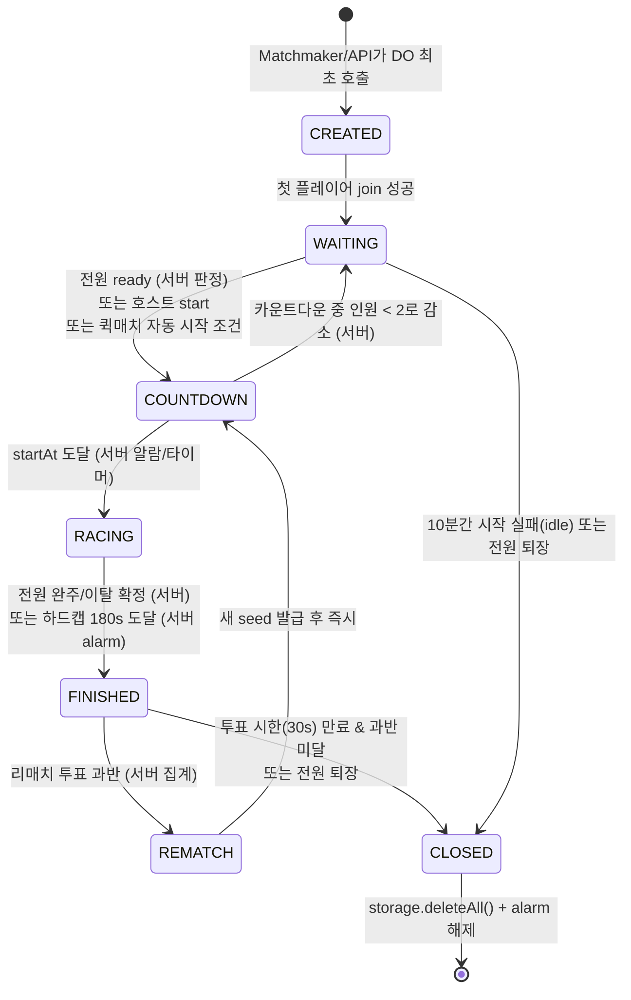
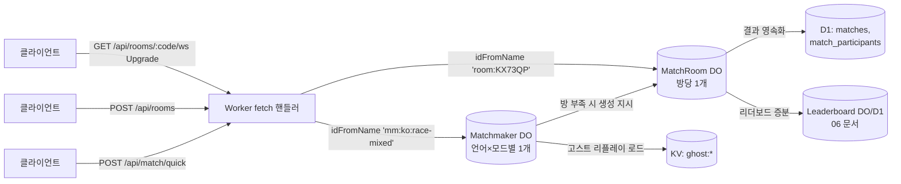
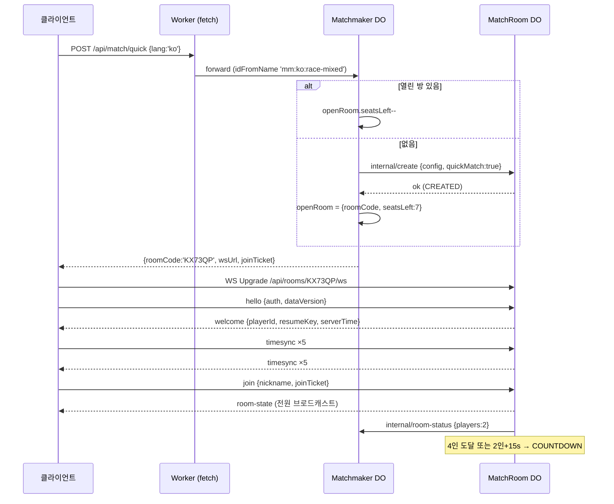
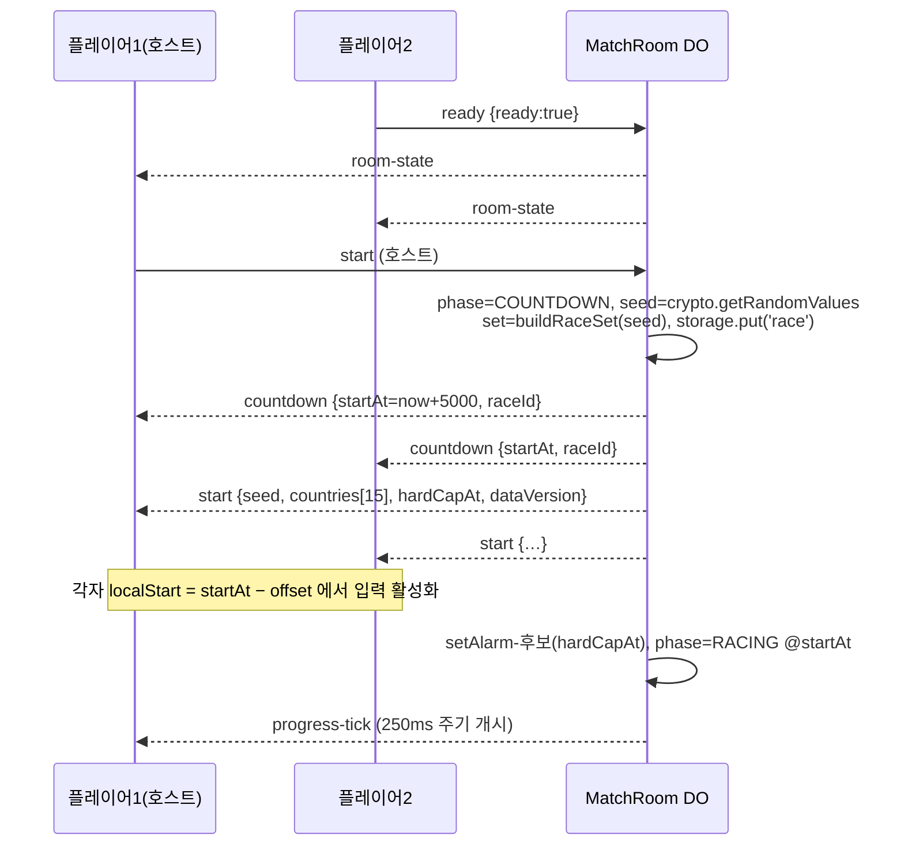
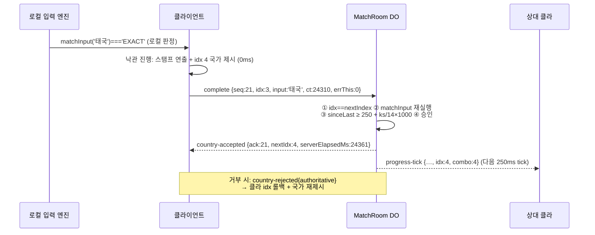
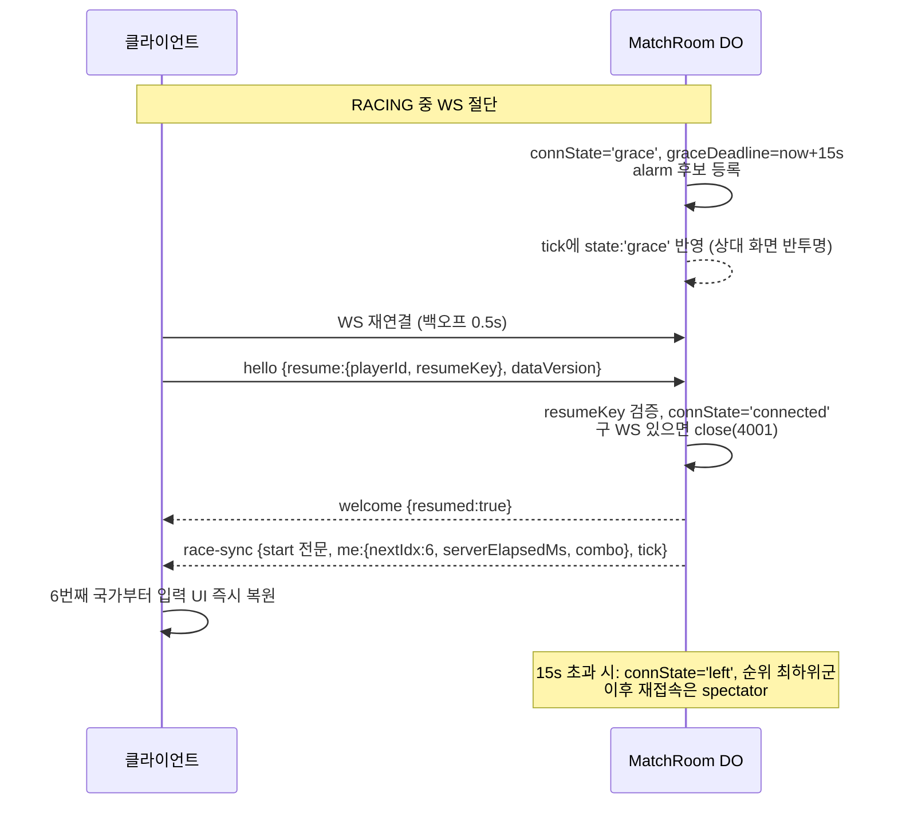

# 05. 멀티플레이 실시간 프로토콜

> 프로젝트: **WORLD TYPING** / 문서 버전: v1.0 (2026-07-21) / 담당: 실시간 프로토콜 설계
> 선행 문서: 01 GDD(§8 멀티 UX 계약), 02 데이터 명세(§3 매칭 엔진, `packages/data`), 04 게임플레이/점수
> 후속 문서: 06 랭킹·부정 방지(본 문서의 검증 결과를 소비), 07 Cloudflare 아키텍처(배포·바인딩)

본 문서는 멀티플레이 레이스의 **서버 권위(server-authoritative) 실시간 프로토콜** 전체를 확정한다. 구현 대상은 3개 패키지다.

| 패키지 | 내용 | 런타임 |
|---|---|---|
| `packages/protocol` | 메시지 타입·직렬화·시딩 함수 (클라/서버 공유, 의존성 0) | 브라우저 + Workers |
| `apps/worker/src/do/Matchmaker.ts` | 퀵매치 큐 Durable Object | Workers (DO) |
| `apps/worker/src/do/MatchRoom.ts` | 방 1개 = DO 1개. 상태머신·검증·브로드캐스트 | Workers (DO, WS Hibernation) |

전역 원칙:

1. **DO가 유일한 진실이다.** 클라이언트는 낙관적으로 렌더하되, 진행 인덱스·순위·점수·시각은 전부 `MatchRoom` DO가 결정한다. 클라이언트가 보내는 숫자는 "주장"이며 검증 후에만 상태에 반영된다.
2. **정답 판정 코드는 02 문서의 `matchInput`을 서버에서 그대로 재실행한다.** 클라와 서버가 같은 `packages/data` 코드를 번들하므로 판정 불일치가 구조적으로 불가능하다.
3. **와이어 포맷은 JSON 텍스트 프레임 1메시지 = 1프레임.** v1 트래픽 규모(방당 8인, 250ms tick)에서 바이너리 인코딩은 과설계다. 모든 메시지에 `v: 1` 버전 필드를 넣어 향후 마이그레이션 여지를 남긴다.

---

## 1. 방 라이프사이클 상태머신



### 1.1 상태 정의와 전이 트리거 주체

| 상태 | 정의 | 진입 시 서버 액션 | 전이 | 트리거 주체 |
|---|---|---|---|---|
| `CREATED` | DO 인스턴스는 있으나 플레이어 0명. 방 설정만 존재 | `roomConfig` storage 기록, 60s 정리 alarm 설정 | → WAITING | 첫 클라이언트의 `join` (클라 요청, 서버 승인) |
| `WAITING` | 대기실. 입장/레디/채팅 가능 | 정리 alarm을 idle 10분으로 재설정 | → COUNTDOWN | **서버 단독 판정**: ①레디 인원 == 재실 인원 ≥ 2, ②호스트 `start`(레디 무시, 인원 ≥ 2), ③퀵매치 방은 §2.3 자동 시작 규칙 |
| `COUNTDOWN` | 5초 카운트다운. 입장 차단(관전 입장만 허용), 레디 해제 불가 | `seed` 확정·storage 저장, `start` 메시지 브로드캐스트, `startAt = now + 5000` alarm | → RACING | **서버**: `startAt` 도달. → WAITING: 이탈로 인원 < 2 (서버) |
| `RACING` | 레이스 진행 | 250ms tick 브로드캐스트 시작, 하드캡 alarm(`startAt + 180_000`) | → FINISHED | **서버**: ①활성 플레이어 전원 완주 또는 이탈 확정, ②하드캡 도달 |
| `FINISHED` | 결과 표출 + 리매치 투표(30s) | 순위 확정, D1 영속화(§10), `results` 브로드캐스트, 투표 마감 alarm | → REMATCH / → CLOSED | **서버**: 재실 인원 과반 `rematch{vote:true}` 집계 시 즉시 REMATCH. 30s 만료 시 과반 미달이면 CLOSED |
| `REMATCH` | 논리적 순간 상태(브로드캐스트용) | 새 seed 발급, 레이스 상태 초기화, 투표 불참/거부자 퇴장 처리 | → COUNTDOWN | **서버**: 즉시 |
| `CLOSED` | 방 소멸 | 잔여 WS 전원에 `room-closed` 후 close(code 1000), `storage.deleteAll()`, alarm 해제 | 종단 | **서버** |

원칙: **모든 전이는 서버(DO)가 실행한다.** 클라이언트 메시지는 전이의 "입력"일 뿐이며, 전이 결과는 반드시 `room-state` 브로드캐스트로 전파된다. 클라이언트는 자기 메시지의 성공을 가정하지 않고 `room-state`를 수신해야 UI를 바꾼다(레디 토글 포함 — 낙관적 토글은 허용하되 다음 `room-state`로 정정).

### 1.2 phase 열거형과 저장 스키마 (DO storage)

```ts
// apps/worker/src/do/room-state.ts
export type RoomPhase =
  | 'CREATED' | 'WAITING' | 'COUNTDOWN' | 'RACING' | 'FINISHED' | 'CLOSED';

export interface RoomConfig {
  roomCode: string;              // "KX73QP" (표시할 때만 "KX7-3QP"로 하이픈 삽입)
  lang: 'ko' | 'en';
  mode: 'race-mixed' | 'race-continent' | 'race-tier';
  poolParam: string | null;      // race-continent → 'asia' 등 / race-tier → '3' / mixed → null
  maxPlayers: number;            // 기본 8, 호스트가 2~8 설정
  isPublic: boolean;             // 공개 방 목록 노출 여부
  createdAt: number;
  quickMatch: boolean;           // Matchmaker가 만든 방인가 (자동 시작 규칙 적용)
}

export interface PlayerRecord {
  playerId: string;              // 서버 발급 ULID. 세션 간 불변(게스트는 클라 localStorage의 guestId 기반)
  nickname: string;
  passportCover: string;         // 코스메틱 id
  bestPi: number | null;
  isHost: boolean;
  isBot: boolean;                // GHOST 봇 (§2.4)
  ready: boolean;
  // --- 레이스 중 권위 상태 (서버만 쓴다) ---
  nextIndex: number;             // 다음에 완료해야 할 국가 인덱스 (0-base). 완주 시 == set.length
  lastAcceptAt: number;          // 직전 country-complete 승인 서버 시각(ms)
  correctKeystrokes: number;     // 승인된 국가들의 필요 타수 누계 (서버 계산)
  errorKeystrokes: number;       // 클라 신고 오타 누계 (표시용, 순위에 미사용)
  combo: number;
  finishedAt: number | null;     // 서버 시각. null = 미완주
  rank: number | null;
  connState: 'connected' | 'grace' | 'left' | 'spectator';
  graceDeadline: number | null;  // grace 진입 시 now + 15_000
  resumeKey: string;             // 재접속 인증용 32byte hex (welcome으로 1회 전달)
  suspicionFlags: string[];      // §9 안티치트 누적 플래그
}
```

storage 키 설계: `config`(RoomConfig), `phase`, `players:{playerId}`(PlayerRecord), `race`(seed·countryIds·startAt·raceId), `rematchVotes`. WS Hibernation을 쓰므로 **인메모리 캐시는 항상 storage에서 재수화 가능해야 한다**(hydrate-on-wake 패턴, §11).

---

## 2. 매치메이킹

### 2.1 토폴로지



- **MatchRoom DO id**: `env.MATCH_ROOM.idFromName('room:' + roomCode)`. 방 코드가 곧 주소다(별도 코드→id 매핑 스토리지 불필요). CLOSED 후 같은 코드가 재사용될 수 있으므로 `join` 처리 시 `phase === 'CLOSED'` 또는 storage 빈 상태면 "방 없음"으로 응답하고, 새 방 생성은 항상 신규 코드 발급을 거친다.
- **Matchmaker DO id**: `env.MATCHMAKER.idFromName('mm:' + lang + ':' + queueKey)`. `queueKey` = `race-mixed`(기본 퀵매치) 또는 `race-continent:asia` 등. v1 퀵매치 UI는 `race-mixed`만 노출하고 대륙별 풀 큐는 프로토콜상 예약(§2.5).

### 2.2 방 코드

- 형식: 6자, 알파벳 `23456789ABCDEFGHJKMNPQRSTUVWXYZ`(31자 — 혼동 문자 0/O/1/I/L 제외). 엔트로피 31⁶ ≈ 8.9×10⁸. 표시 시 `KX7-3QP`처럼 3-3 하이픈, 입력 정규화 시 하이픈/공백 제거 + 대문자화.
- 발급: `POST /api/rooms` Worker가 `crypto.getRandomValues`로 생성 → 해당 코드 DO에 `internal/claim` 호출 → 이미 활성(phase ≠ CLOSED/빈 storage) 상태면 재생성(최대 5회 시도, 실패 시 500 — 실질 발생 확률 0).

### 2.3 퀵매치 흐름 (Matchmaker DO)

```ts
// Matchmaker DO 내부 상태 (storage)
interface QueueEntry {
  playerId: string;
  enqueuedAt: number;
  ticket: string;          // 1회용. 방 배정 결과 폴링/수령에 사용
}
// storage: 'queue' → QueueEntry[] (FIFO), 'openRoom' → { roomCode, seatsLeft } | null
```

절차(모든 단계는 Matchmaker DO 단일 스레드 안에서 원자적):

1. 클라 `POST /api/match/quick { lang, playerId }` → Worker가 해당 Matchmaker DO로 전달.
2. Matchmaker는 **채워지는 중인 열린 방**(`openRoom`)이 있으면 좌석 1개 배정(`seatsLeft--`), 없으면 새 roomCode 발급 + MatchRoom DO에 `internal/create { config, quickMatch: true }` 호출 후 `openRoom` 등록.
3. 응답: `{ roomCode, wsUrl: '/api/rooms/KX73QP/ws', joinTicket }`. 클라는 즉시 WS 연결 → `hello` → `join`.
4. **자동 시작 규칙**(MatchRoom이 quickMatch=true일 때 적용, 서버 판정):
   - 4인 도달 즉시 COUNTDOWN.
   - 2~3인 상태로 **15초** 경과 시 COUNTDOWN.
   - MatchRoom은 인원 변화를 Matchmaker에 `internal/room-status`로 통지, 만석/카운트다운 진입 시 Matchmaker가 `openRoom`을 비운다(다음 대기자는 새 방).
5. **봇 채우기**: 1인 상태로 **60초** 경과 시 MatchRoom이 클라에 `bot-offer` 메시지 전송 → 유저가 수락(`bot-accept`)하면 KV `ghost:{lang}:{mode}:{piBucket}`에서 고스트 리플레이(과거 유저의 국가별 스플릿 타임 배열) 1~3개를 로드해 `isBot: true, nickname: 'GHOST_...'` 플레이어로 삽입 후 즉시 COUNTDOWN. 거절 시 큐 유지. 고스트의 진행은 RACING 중 서버가 스플릿 타임표대로 재생한다(클라와 통신 없음, tick에만 실림). **봇 매치 결과는 D1에 기록하되 리더보드·승수 업적에 반영하지 않는다**(`is_bot_match = 1`).

큐 이탈: 클라가 매칭 취소 시 `DELETE /api/match/quick { ticket }`. WS join이 30초 내에 오지 않은 좌석은 MatchRoom이 회수하고 Matchmaker에 반환 통지.

### 2.4 비공개 방 (코드 공유)

1. `POST /api/rooms { lang, mode, poolParam, maxPlayers, isPublic }` → 코드 발급 + DO 생성 → `{ roomCode, wsUrl }` 응답. 생성자는 WS join 시 자동으로 호스트.
2. 참가자는 코드 입력 또는 공유 링크(`/multi/KX7-3QP`) → 동일 WS 엔드포인트.
3. 공개 방 목록(`GET /api/rooms/public`): 각 MatchRoom이 WAITING 진입/인원 변화 시 KV `publicroom:{code}`에 `{ code, lang, players, maxPlayers }`를 TTL 60s로 갱신 기록 — Worker가 KV list로 응답. (강한 일관성 불필요한 표시용 데이터라 KV 적합.)
4. 호스트 권한: 강제 시작(레디 무시), 인원 설정 변경, 공개 여부 토글. **호스트 이탈 시 입장 순서상 다음 플레이어에게 자동 승계**(서버가 `room-state`로 통지). 전원 이탈 시 §7.4 정리.

### 2.5 매치 세트 규격 (모드별)

| mode | 풀 | 길이 | 구성 규칙 |
|---|---|---|---|
| `race-mixed` (기본) | `un195` | **15** | T1×6 + T2×5 + T3×4 (GDD §8.1) |
| `race-continent` | 해당 대륙 국가(§02-5.1) | 15 | 대륙 풀에서 티어 오름차순 정렬 후 하위 15개 풀 내 시드 셔플 15개 추출(대륙 풀이 15 미만이면 전체 사용: south-america=12, oceania=14) |
| `race-tier` | 해당 티어 풀 | 15 | 풀에서 시드 셔플 15개 |

---

## 3. 국가 세트 시딩 — 결정적 RNG

**요구**: 서버가 seed 하나를 발급하면, 같은 seed·같은 데이터 버전에서 클라/서버 누구나 **동일한 국가 시퀀스**를 재현할 수 있어야 한다(클라는 `start` 메시지에 국가 id 배열이 명시되므로 재현이 필수는 아니지만, 검증·리플레이·고스트 기록에 결정성이 필요하다).

- seed: 128-bit hex 문자열(32자). COUNTDOWN 진입 시 DO가 `crypto.getRandomValues(new Uint8Array(16))`로 생성, `race.seed`로 storage에 저장. 리매치마다 새로 발급.
- PRNG: **mulberry32** (32-bit, 의존성 0, 결정적). seed hex를 8자씩 잘라 4개의 uint32로 파싱, XOR 폴드로 초기 상태 구성.

```ts
// packages/protocol/src/seeding.ts — 클라/서버 공유
export function mulberry32(a: number): () => number {
  return function () {
    a |= 0; a = (a + 0x6d2b79f5) | 0;
    let t = Math.imul(a ^ (a >>> 15), 1 | a);
    t = (t + Math.imul(t ^ (t >>> 7), 61 | t)) ^ t;
    return ((t ^ (t >>> 14)) >>> 0) / 4294967296;
  };
}

export function rngFromSeedHex(seedHex: string, streamId: number): () => number {
  // streamId로 파생 스트림 분리(티어별 셔플이 서로 독립이도록)
  const parts = [0, 8, 16, 24].map((i) => parseInt(seedHex.slice(i, i + 8), 16) >>> 0);
  const state = (parts[0] ^ parts[1] ^ parts[2] ^ parts[3] ^ Math.imul(streamId, 0x9e3779b9)) >>> 0;
  return mulberry32(state);
}

export function seededShuffle<T>(arr: readonly T[], rng: () => number): T[] {
  const a = arr.slice();
  for (let i = a.length - 1; i > 0; i--) {
    const j = Math.floor(rng() * (i + 1));
    [a[i], a[j]] = [a[j], a[i]];
  }
  return a;
}

/**
 * 결정적 레이스 세트 생성. 클라·서버 동일 결과 보장 조건:
 *  - COUNTRIES는 packages/data 생성물(id 오름차순 고정 정렬, §02-10 Step 8)
 *  - dataVersion(=manifest.json 해시)이 start 메시지로 함께 전달되어 불일치 시 클라가 강제 리로드
 */
export function buildRaceSet(
  seedHex: string,
  mode: 'race-mixed' | 'race-continent' | 'race-tier',
  poolParam: string | null,
  countries: readonly Country[],       // un195 필터 적용된 목록
): CountryId[] {
  const un195 = countries; // extended(TW/XK/EH)는 호출 전에 제외되어 있어야 함
  if (mode === 'race-mixed') {
    const pick = (tier: DifficultyTier, n: number, stream: number) =>
      seededShuffle(un195.filter((c) => c.difficultyTier === tier).map((c) => c.id),
        rngFromSeedHex(seedHex, stream)).slice(0, n);
    const set = [...pick(1, 6, 1), ...pick(2, 5, 2), ...pick(3, 4, 3)];
    return seededShuffle(set, rngFromSeedHex(seedHex, 4)); // 최종 순서 셔플(티어 블록 제거)
  }
  if (mode === 'race-continent') {
    const pool = un195.filter((c) => c.continent === poolParam)
      .sort((a, b) => a.difficultyTier - b.difficultyTier).slice(0, Math.max(15, 0));
    return seededShuffle(pool.map((c) => c.id), rngFromSeedHex(seedHex, 1)).slice(0, 15);
  }
  // race-tier
  const pool = un195.filter((c) => c.difficultyTier === Number(poolParam));
  return seededShuffle(pool.map((c) => c.id), rngFromSeedHex(seedHex, 1)).slice(0, 15);
}
```

vitest 필수 케이스: ①같은 seed → 같은 배열(1,000회 반복 동일), ②다른 seed → 첫 5개가 전부 같을 확률 검사 아님, 단순 불일치 확인, ③`race-mixed` 결과가 항상 15개·중복 없음·티어 분포 6/5/4, ④`south-america`는 12개 반환.

**언어와 시드의 관계**: 세트(국가 id 시퀀스)는 언어 비의존이다. 언어는 방 설정(`config.lang`)이 결정하며 같은 세트를 ko/en로 각각 타이핑하는 것 — 단 방은 단일 언어 고정(GDD §8.1)이므로 한 레이스에서 혼합은 없다.

---

## 4. WebSocket 메시지 프로토콜 카탈로그

### 4.1 공통 규약

- 엔드포인트: `GET /api/rooms/:code/ws` (Upgrade). Worker가 `MatchRoom` DO로 라우팅.
- 프레임: UTF-8 JSON 텍스트. 서버는 파싱 불가/스키마 위반 프레임에 `error{code:'BAD_MESSAGE'}` 응답, 동일 연결에서 10회 누적 시 close(4400).
- 모든 메시지는 `{ v: 1, type: string, ... }`. 클라→서버 메시지에는 `seq`(클라 단조 증가 정수)를 넣고, 서버의 직접 응답(`accepted/rejected/error`)은 `ack: seq`로 상관시킨다.
- 타임스탬프는 전부 **서버 클록 기준 epoch ms** 또는 **레이스 상대시간 ms**(`startAt` 기준)로 명시한다. 클라 로컬 클록 절대값은 와이어에 싣지 않는다(§6).

### 4.2 TypeScript 타입 전문 (`packages/protocol/src/messages.ts`)

```ts
import type { CountryId } from '@worldtyping/data';

// ───────────────────────── Client → Server ─────────────────────────

/** 연결 직후 1회. 인증 + (재접속 시) 세션 복구 요청 */
export interface C2S_Hello {
  v: 1; type: 'hello'; seq: number;
  auth: { kind: 'guest'; guestId: string } | { kind: 'session'; token: string };
  /** 재접속: welcome에서 받았던 값. 최초 접속이면 생략 */
  resume?: { playerId: string; resumeKey: string };
  /** 클라가 로드한 데이터 버전(manifest 해시 앞 8자) — 불일치 시 서버가 error DATA_VERSION */
  dataVersion: string;
}

/** 대기실 입장 (hello→welcome 후) */
export interface C2S_Join {
  v: 1; type: 'join'; seq: number;
  nickname: string;            // 1~16자, 서버에서 트림·금칙어 필터
  passportCover: string;
  joinTicket?: string;         // 퀵매치 배정 티켓 (비공개 방은 불필요)
}

export interface C2S_Ready   { v: 1; type: 'ready'; seq: number; ready: boolean; }
export interface C2S_Start   { v: 1; type: 'start'; seq: number; }          // 호스트 전용
export interface C2S_Chat    { v: 1; type: 'chat';  seq: number; text: string; } // ≤120자, WAITING/FINISHED에서만
export interface C2S_BotAccept { v: 1; type: 'bot-accept'; seq: number; accept: boolean; }

/** 진행 상황 신고. 클라 스로틀 최대 10Hz(100ms) + 내용 변화 시에만 전송 */
export interface C2S_Progress {
  v: 1; type: 'progress'; seq: number;
  idx: number;        // 현재 타이핑 중인 국가 인덱스 (0-base)
  ks: number;         // 현재 국가에서 입력한 유효 자모/문자 수 (프리픽스 길이)
  err: number;        // 이번 레이스 누적 오타 keystroke
}

/** 국가 완료 주장 — 서버 검증 대상 */
export interface C2S_Complete {
  v: 1; type: 'complete'; seq: number;
  idx: number;             // 완료했다고 주장하는 인덱스
  input: string;           // 실제 입력한 문자열(정규화 전 원문). 서버가 matchInput 재실행
  ct: number;              // clientTime: 레이스 상대시간 ms (클라 performance 기준, §6 보정 참고값)
  errThis: number;         // 이 국가에서 발생한 오타 수
}

export interface C2S_TimeSync { v: 1; type: 'timesync'; seq: number; t0: number; } // t0 = 클라 performance.now()
export interface C2S_Rematch  { v: 1; type: 'rematch'; seq: number; vote: boolean; }
export interface C2S_Leave    { v: 1; type: 'leave'; seq: number; }

export type ClientMessage =
  | C2S_Hello | C2S_Join | C2S_Ready | C2S_Start | C2S_Chat | C2S_BotAccept
  | C2S_Progress | C2S_Complete | C2S_TimeSync | C2S_Rematch | C2S_Leave;

// ───────────────────────── Server → Client ─────────────────────────

export interface PlayerPublic {
  playerId: string; nickname: string; passportCover: string;
  bestPi: number | null; isHost: boolean; isBot: boolean; ready: boolean;
  connState: 'connected' | 'grace' | 'left' | 'spectator';
}

/** hello 성공 응답 (해당 연결에만) */
export interface S2C_Welcome {
  v: 1; type: 'welcome'; ack: number;
  playerId: string;
  resumeKey: string;           // 최초 접속 시 신규 발급, 재접속 시 동일값 재확인
  serverTime: number;          // epoch ms — 클라 오프셋 초기 추정
  resumed: boolean;            // true면 곧바로 race-sync가 따라온다
}

/** 방 전체 스냅샷. 멤버십/설정/phase 변화마다 전원 브로드캐스트 */
export interface S2C_RoomState {
  v: 1; type: 'room-state';
  phase: 'WAITING' | 'COUNTDOWN' | 'RACING' | 'FINISHED';
  roomCode: string;
  config: { lang: 'ko' | 'en'; mode: string; poolParam: string | null; maxPlayers: number; isPublic: boolean };
  players: PlayerPublic[];
  hostId: string;
  /** quickMatch 자동 시작 타이머가 돌고 있으면 그 마감 서버시각 */
  autoStartAt: number | null;
}

export interface S2C_Countdown {
  v: 1; type: 'countdown';
  startAt: number;             // 서버 epoch ms. 클라는 (startAt − offset)에 로컬 출발
  raceId: string;              // ULID — 이 레이스의 영속 키
}

/** 세트 공개. countdown과 함께(또는 직후) 전송 */
export interface S2C_Start {
  v: 1; type: 'start';
  raceId: string;
  seed: string;                          // 32-hex
  countries: CountryId[];                // 권위 시퀀스 (클라는 이 배열을 그대로 사용)
  dataVersion: string;
  startAt: number;                       // countdown과 동일값 재통지
  hardCapAt: number;                     // startAt + 180_000
  perCountryLimitMs: number;             // 10_000 고정 (GDD §7.1)
}

/** 코얼레싱 진행 브로드캐스트 — RACING 중 250ms 간격, 변화가 있을 때만 */
export interface S2C_ProgressTick {
  v: 1; type: 'progress-tick';
  at: number;                            // 서버 epoch ms
  players: {
    id: string;
    idx: number;                         // 서버 권위 nextIndex
    ksPct: number;                       // 현재 국가 내 진행률 0~100 (클라 신고 기반, 표시용)
    combo: number;
    state: 'racing' | 'finished' | 'grace' | 'left';
    rank: number | null;                 // 완주자만
  }[];
}

/** complete 승인 (해당 연결에만) */
export interface S2C_CountryAccepted {
  v: 1; type: 'country-accepted'; ack: number;
  idx: number;
  nextIdx: number;                       // == idx + 1, 완주 시 == countries.length
  serverElapsedMs: number;               // 권위 누적 시간 (startAt 기준)
  combo: number;
  finished: boolean;
  rank: number | null;                   // finished일 때 확정 순위
}

/** complete 거부 (해당 연결에만) — 클라는 authoritative로 롤백 */
export interface S2C_CountryRejected {
  v: 1; type: 'country-rejected'; ack: number;
  idx: number;
  reason: 'WRONG_INDEX' | 'NOT_EXACT' | 'TOO_FAST' | 'NOT_RACING' | 'ALREADY_FINISHED';
  authoritative: { nextIdx: number; serverElapsedMs: number; combo: number };
}

export interface S2C_PlayerFinished {
  v: 1; type: 'player-finished';         // 전원 브로드캐스트 (결승 연출용)
  playerId: string; rank: number; elapsedMs: number;
  photoFinish: boolean;                  // 직전 순위와 1000ms 이내
}

export interface S2C_RaceFinished {
  v: 1; type: 'race-finished';
  reason: 'all-finished' | 'hardcap' | 'all-left';
}

export interface ResultRow {
  playerId: string; nickname: string; isBot: boolean;
  rank: number; finished: boolean; countriesCleared: number;
  elapsedMs: number | null; cpm: number; acc: number; pi: number;
  disconnected: boolean;
}
export interface S2C_Results {
  v: 1; type: 'results';
  raceId: string;
  rows: ResultRow[];                     // rank 오름차순
  rematchDeadline: number;               // 서버 epoch ms
}

export interface S2C_RematchState {
  v: 1; type: 'rematch-state';
  votes: { playerId: string; vote: boolean | null }[];
  deadline: number;
}

/** 재접속 시 전체 재동기 (해당 연결에만, welcome 직후) */
export interface S2C_RaceSync {
  v: 1; type: 'race-sync';
  phase: 'COUNTDOWN' | 'RACING' | 'FINISHED';
  start: S2C_Start;                      // seed·countries 포함 전체 재전송
  me: { nextIdx: number; serverElapsedMs: number; combo: number; errorKeystrokes: number };
  tick: S2C_ProgressTick;                // 최신 상대 진행 스냅샷
}

export interface S2C_TimeSync { v: 1; type: 'timesync'; ack: number; t0: number; t1: number; } // t1 = 서버 수신 epoch ms
export interface S2C_BotOffer { v: 1; type: 'bot-offer'; expiresAt: number; }
export interface S2C_Chat     { v: 1; type: 'chat'; playerId: string; text: string; at: number; }
export interface S2C_RoomClosed { v: 1; type: 'room-closed'; reason: 'idle' | 'empty' | 'rematch-declined' | 'error'; }

export interface S2C_Error {
  v: 1; type: 'error'; ack?: number;
  code: 'BAD_MESSAGE' | 'ROOM_FULL' | 'ROOM_NOT_FOUND' | 'WRONG_PHASE' | 'NOT_HOST'
      | 'DATA_VERSION' | 'RATE_LIMIT' | 'AUTH_FAILED' | 'NICKNAME_INVALID';
  message: string;                       // 사람용 (i18n 키가 아닌 영어 원문, 클라가 code로 i18n)
}

export type ServerMessage =
  | S2C_Welcome | S2C_RoomState | S2C_Countdown | S2C_Start | S2C_ProgressTick
  | S2C_CountryAccepted | S2C_CountryRejected | S2C_PlayerFinished | S2C_RaceFinished
  | S2C_Results | S2C_RematchState | S2C_RaceSync | S2C_TimeSync | S2C_BotOffer
  | S2C_Chat | S2C_RoomClosed | S2C_Error;
```

### 4.3 JSON 예시 (대표 왕복)

```jsonc
// C→S: 접속·인증
{ "v": 1, "type": "hello", "seq": 1,
  "auth": { "kind": "guest", "guestId": "g_01J2ZK8Q3W" },
  "dataVersion": "a3f9c1d2" }

// S→C: welcome
{ "v": 1, "type": "welcome", "ack": 1, "playerId": "p_01J2ZKA0XT",
  "resumeKey": "9f2c…e1", "serverTime": 1784612345678, "resumed": false }

// C→S: 입장
{ "v": 1, "type": "join", "seq": 2, "nickname": "김치워리어", "passportCover": "green-basic" }

// S→C: 방 스냅샷 (전원)
{ "v": 1, "type": "room-state", "phase": "WAITING", "roomCode": "KX73QP",
  "config": { "lang": "ko", "mode": "race-mixed", "poolParam": null, "maxPlayers": 8, "isPublic": false },
  "players": [
    { "playerId": "p_01J2ZKA0XT", "nickname": "김치워리어", "passportCover": "green-basic",
      "bestPi": 421, "isHost": true, "isBot": false, "ready": false, "connState": "connected" }
  ],
  "hostId": "p_01J2ZKA0XT", "autoStartAt": null }

// S→C: 시작 (countdown + start)
{ "v": 1, "type": "countdown", "startAt": 1784612360000, "raceId": "r_01J2ZKCQ55" }
{ "v": 1, "type": "start", "raceId": "r_01J2ZKCQ55",
  "seed": "5b1e0d9a44c2f7013e88ab6d90c41f27",
  "countries": ["KR","BR","DE","TH","EG","JP","PL","VN","US","PE","FR","MA","GB","AR","KE"],
  "dataVersion": "a3f9c1d2", "startAt": 1784612360000,
  "hardCapAt": 1784612540000, "perCountryLimitMs": 10000 }

// C→S: 진행 신고 (≤10Hz)
{ "v": 1, "type": "progress", "seq": 17, "idx": 3, "ks": 2, "err": 1 }

// S→C: 코얼레싱 tick (250ms)
{ "v": 1, "type": "progress-tick", "at": 1784612384250, "players": [
  { "id": "p_01J2ZKA0XT", "idx": 3, "ksPct": 40, "combo": 3, "state": "racing", "rank": null },
  { "id": "p_01J2ZKB7MM", "idx": 4, "ksPct": 10, "combo": 4, "state": "racing", "rank": null } ] }

// C→S: 국가 완료 주장
{ "v": 1, "type": "complete", "seq": 21, "idx": 3, "input": "태국", "ct": 24310, "errThis": 0 }

// S→C: 승인
{ "v": 1, "type": "country-accepted", "ack": 21, "idx": 3, "nextIdx": 4,
  "serverElapsedMs": 24361, "combo": 4, "finished": false, "rank": null }

// S→C: 거부 (인덱스 어긋남 — 클라 롤백)
{ "v": 1, "type": "country-rejected", "ack": 34, "idx": 7, "reason": "WRONG_INDEX",
  "authoritative": { "nextIdx": 6, "serverElapsedMs": 51200, "combo": 0 } }

// C→S / S→C: 타임싱크
{ "v": 1, "type": "timesync", "seq": 5, "t0": 10321.5 }
{ "v": 1, "type": "timesync", "ack": 5, "t0": 10321.5, "t1": 1784612351042 }
```

### 4.4 전송 빈도·스로틀 규약

| 채널 | 방향 | 빈도 | 규칙 |
|---|---|---|---|
| `progress` | C→S | 최대 10Hz | 클라가 100ms 스로틀 + `idx/ks` 변화 시에만. 서버는 11Hz 초과 연결에 `RATE_LIMIT` 후 초과분 폐기 |
| `progress-tick` | S→C 전원 | 4Hz (250ms) | DO 인메모리에 최신 진행을 코얼레싱했다가 250ms 주기로 1프레임에 병합 방송. **변화 없으면 스킵**. RACING 외 phase에서는 중지 |
| `complete` | C→S | 이벤트 | 국가당 1회가 정상. 미승인 상태 중복 전송은 `ack`로 멱등 처리 |
| `timesync` | C→S | 연결 직후 5회(200ms 간격) + 이후 10초마다 1회 | §6 |
| `chat` | C→S | 2초당 3건 | 초과 시 폐기 + `RATE_LIMIT` |
| ping/pong (프로토콜 레벨) | — | 20초 | Hibernation API `setWebSocketAutoResponse(new WebSocketRequestResponsePair('{"v":1,"type":"ping"}','{"v":1,"type":"pong"}'))` — **DO를 깨우지 않고** 연결 생존 확인(§11). 애플리케이션 타임싱크와 별개 |

대역폭 추정(8인 방, RACING): tick 1프레임 ≈ 8인 × 90B ≈ 720B × 4Hz ≈ 2.9KB/s/연결 다운링크, 업링크는 `progress` ≤ 10Hz × 60B ≈ 0.6KB/s. 방 전체 ≈ 30KB/s 미만 — DO 1개로 여유.

---

## 5. 서버 권위 검증 (country-complete 처리)

`MatchRoom.onComplete()` — 유일한 점수 결정 지점:

```ts
async function onComplete(p: PlayerRecord, m: C2S_Complete, ws: WebSocket) {
  const race = this.race; // { countryIds, startAt, hardCapAt, raceId }
  const now = Date.now();

  // 0) phase / 완주 가드
  if (this.phase !== 'RACING') return reject(ws, m, 'NOT_RACING', p);
  if (p.finishedAt !== null)   return reject(ws, m, 'ALREADY_FINISHED', p);

  // 1) 인덱스 권위 검사: 반드시 서버가 아는 다음 인덱스여야 함
  if (m.idx !== p.nextIndex) {
    // 멱등: 직전 승인 인덱스의 재전송(재접속 직후 중복)은 조용히 무시
    if (m.idx === p.nextIndex - 1) return; 
    return reject(ws, m, 'WRONG_INDEX', p);
  }

  // 2) 정답 재검증 — 02 문서 matchInput을 서버 번들 COUNTRIES로 그대로 실행
  const country = COUNTRIES_BY_ID[race.countryIds[m.idx]];
  const targets = compileTargets(country, this.config.lang); // 방 생성 시 사전 컴파일해 캐시
  if (matchInput(m.input, targets, this.config.lang) !== 'EXACT') {
    return reject(ws, m, 'NOT_EXACT', p);
  }

  // 3) 타이밍 타당성 (§9 상세): 최소 소요시간 하한
  const ksNeeded = this.config.lang === 'ko'
    ? toJamoSeq(normalizeKo(m.input)).length
    : normalizeEn(m.input).length;
  const minMs = REACTION_FLOOR_MS + (ksNeeded / MAX_KPS[this.config.lang]) * 1000;
  const sinceLast = now - (p.lastAcceptAt ?? race.startAt);
  if (sinceLast < minMs) {
    p.suspicionFlags.push(`TOO_FAST:${m.idx}:${sinceLast}<${Math.round(minMs)}`);
    return reject(ws, m, 'TOO_FAST', p);   // 진행 자체를 거부 — 봇은 레이스가 안 됨
  }

  // 4) 승인: 권위 상태 갱신 (클라 ct는 저장만, 계산엔 서버 시각 사용 — §6)
  p.nextIndex = m.idx + 1;
  p.lastAcceptAt = now;
  p.correctKeystrokes += ksNeeded;
  p.errorKeystrokes = Math.max(p.errorKeystrokes, /* 누적 신고 */ p.errorKeystrokes + m.errThis);
  p.combo = m.errThis === 0 ? p.combo + 1 : 0;
  const serverElapsedMs = now - race.startAt;

  const finished = p.nextIndex === race.countryIds.length;
  if (finished) {
    p.finishedAt = now;
    p.rank = ++this.finishCounter;               // DO 단일스레드 → 원자적 순위 확정 (§5.1)
    this.broadcast(playerFinishedMsg(p, serverElapsedMs));
  }
  send(ws, acceptedMsg(m.seq, p, serverElapsedMs, finished));
  await this.persistPlayer(p);                    // storage 쓰기 (묶음 처리 가능)
  if (finished) this.maybeFinishRace();
}
```

핵심 규칙:

- **클라이언트는 낙관적 렌더**: 로컬에서 `EXACT` 판정이 나면 즉시 다음 국가로 넘어가고 스탬프 연출을 재생한다. `country-accepted`는 백그라운드 확인이며, `country-rejected` 수신 시 `authoritative.nextIdx`로 롤백하고 해당 국가를 다시 제시한다(레이턴시가 게임감을 해치지 않는 유일한 구조).
- **진행·순위·시간의 원천은 서버 상태뿐**: `progress-tick`의 `idx`는 항상 서버 `nextIndex`다. 클라 `progress.idx`는 `ksPct` 표시용 참고로만 쓰고, `nextIndex`보다 앞선 값은 무시한다.
- **국가당 10초 제한(멀티 규칙)**: 서버는 250ms tick 루프에서 `now - max(lastAcceptAt, startAt) > 10_000`인 플레이어를 자동 스킵 처리(`nextIndex++`, combo 0, 해당 국가 keystroke 전량 오타 계상). 자동 스킵도 `country-rejected`가 아닌 별도 승인 흐름 — 클라에는 다음 tick의 `idx` 증가로 전파되고, 본인에게는 `country-accepted{finished:false, combo:0}` 대신 **`country-rejected{reason:'NOT_RACING'}`이 아니라** `progress-tick`과 함께 개인 메시지 `country-accepted{idx:스킵된 인덱스, nextIdx, combo:0}`로 통지한다(클라는 "시간 초과 — 자동 스킵" 토스트).

### 5.1 동시 결승 / 타이브레이크

DO는 단일 스레드이므로 두 `complete`가 "동시에" 처리되는 일은 없다 — **DO 이벤트 큐 도착 순서가 곧 결승선 통과 순서**다. 규칙을 명문화하면:

1. 순위 = 마지막 국가 `complete`가 **DO에서 승인 처리된 순서** (`finishCounter` 증가 순).
2. 하드캡(180s) 도달 시 미완주자 순위: ①`nextIndex` 내림차순 → ②현재 국가 내 신고 `ks` 내림차순(마지막 수신 `progress` 기준) → ③`correctKeystrokes` 내림차순 → ④마지막 `lastAcceptAt` 오름차순(먼저 도달한 쪽 우선).
3. 이탈 확정자(`left`)는 항상 재실 인원 아래, 이탈자끼리는 위 ②~④ 규칙.
4. **포토피니시**: `player-finished` 브로드캐스트에 직전 완주자와의 격차 ≤ 1000ms이면 `photoFinish: true` — 클라 슬로모션 연출 트리거(GDD §13.3-7). 네트워크 지연이 1초 내 격차의 순위를 좌우할 수 있음은 감수한다(전원 동일 조건이며, RTT 편차 보상은 v1 범위 외 — §8 한계 참조).

---

## 6. 시간 동기화

**목표**: 카운트다운 동시 출발(±80ms 이내 체감 동기), 그리고 기록 시간의 공정한 산정.

### 6.1 오프셋 추정 (NTP 축약형)

- 클라는 연결 직후 `timesync`를 200ms 간격 5회 전송, 이후 10초마다 1회.
- 서버는 수신 즉시 `t1 = Date.now()`를 되돌려준다.
- 클라 계산: 왕복마다 `t2 = performance.now()` 기록 후
  `rtt = t2 − t0`, `offset ≈ t1 + rtt/2 − t2` (offset: "서버 epoch ms = 로컬 performance.now() + offset").
- **최소 RTT 표본 채택**: 표본 중 rtt가 가장 작은 것의 offset을 사용(큐잉 지연 오염 최소화). 표본 갱신 시 offset 변화가 30ms 미만이면 유지(출발선 떨림 방지).

### 6.2 동시 출발

- `countdown.startAt`은 서버 epoch ms. 클라는 `localStart = startAt − offset`으로 환산해 자기 클록으로 3·2·1을 렌더하고 정확히 그 시점에 입력을 활성화한다.
- 서버는 `startAt` 이전에 도착한 `progress/complete`를 전부 거부한다(`NOT_RACING`). 클록을 속여 일찍 출발해도 서버 시각 기준 `sinceLast`가 짧아져 §5-3 하한에 걸린다.

### 6.3 기록 시간의 원천

- **권위 시간 = 서버 수신 시각** (`serverElapsedMs = DO 처리 시각 − startAt`). 클라 `ct`(clientTime)는 저장만 하고 다음 두 용도로만 쓴다:
  1. **경계 검증**: `|ct − serverElapsedMs|`가 3000ms 초과하면 `suspicionFlags.push('CLOCK_DRIFT')` — 클록 조작 또는 심각한 회선 문제 신호(06 문서의 신뢰도 점수에 반영).
  2. **표시 보정 없음**: v1은 레이턴시 보상(클라 시각 채택)을 하지 않는다. 채택하는 순간 `ct`가 공격면이 된다. 상수 RTT는 모든 국가에 대칭적으로 붙으므로 총 기록에는 마지막 1회 왕복 지연만 순수 불이익으로 남고(≤ ~50ms), 이는 수용한다.

---

## 7. 연결 관리 / 재연결

### 7.1 유예(grace) 모델

| phase | WS 끊김 시 | 유예 | 유예 만료 시 |
|---|---|---|---|
| WAITING | 즉시 퇴장 처리(레디 해제, 슬롯 반환) | 없음 | — |
| COUNTDOWN | `grace` 전환, 출발은 그대로 진행 | 15s | 이탈 확정(레이스는 결원으로 진행, 인원 < 2면 WAITING 복귀) |
| RACING | `grace` 전환. tick에 `state:'grace'`(상대 화면에서 트랙 반투명+깜빡임) | **15s** | `left` 확정 — 트랙 회색, 순위 최하위군(§5.1-3). **이후 재접속은 관전만**(GDD §8.2 계약 준수) |
| FINISHED | 연결 무관(결과는 D1에 이미 영속) | — | 리매치 투표에서 `null` 처리 |

### 7.2 재접속 절차

1. 클라는 WS 끊김 감지 시 지수 백오프(0.5s→1s→2s, 최대 5회)로 재연결. **[§11-D89] WS 티켓은 1회용(60s TTL)이라 매 재연결 직전 `POST /rooms/:code/join`을 재호출해 신규 티켓을 발급받아 붙는다**(멤버 미등록·grant만 발급이라 재사용 안전). 재발급이 ROOM_NOT_FOUND/ROOM_IN_PROGRESS/ROOM_FULL/LOGIN_REQUIRED/INVALID_TOKEN이면 잔여 시도 없이 즉시 실패(터미널 중단). E2E mock(VITE_WS_BASE)은 정적 URL 프로바이더로 현행 계약 보존.
2. `hello`에 `resume: { playerId, resumeKey }` 포함. 서버는 resumeKey 일치 + `connState !== 'left'` 확인.
3. 성공 시: `welcome{resumed:true}` → **`race-sync`** 1건으로 전체 재수화 — `start` 전문(seed·countries), 본인 권위 상태(`nextIdx`, `serverElapsedMs`, `combo`), 최신 `progress-tick` 스냅샷. 클라는 `nextIdx` 국가부터 입력 UI를 즉시 복원한다(경과 시간은 계속 흘렀음 — 멈춰주지 않는다).
4. 실패(`resumeKey` 불일치 또는 이미 `left`): `AUTH_FAILED` 또는 관전자 모드 `room-state`(입력 채널 없음). **[§11-D89] WAITING 절단은 즉시 퇴장이라 resume이 `AUTH_FAILED`로 거부된다 → 클라는 같은 소켓에서 무-resume `hello`+`join`을 1회 조용히 재시도해 신원을 재수립한다(WAITING 재입장 복구).**
5. 구 연결 처리: 같은 playerId의 새 WS가 인증되면 구 WS는 close(4001, "superseded") — 탭 복제 악용 차단.

### 7.3 유령 연결 감지

- Hibernation auto-response ping/pong(20s)이 실패하면 런타임이 `webSocketClose/webSocketError`를 호출 → grace 진입.
- 보조: RACING 중 40초간 어떤 메시지도 없는 연결(10초 제한 자동 스킵만 반복되는 방치 상태)은 grace 없이 `left` 처리하고 서버가 close(4408, "inactive").

### 7.4 방 정리 (DO alarm)

alarm은 DO당 1개이므로 **다음 만료 시각이 가장 이른 이벤트 하나**로 관리한다: `storage.put('alarms', {...})`에 후보(자동시작·grace 만료들·하드캡·투표 마감·idle 정리)를 기록하고, 변경 때마다 `min()`으로 `setAlarm`. `alarm()` 핸들러는 만기된 후보를 모두 처리 후 다음 min으로 재설정.

정리 트리거:

- **전원 이탈**(연결 0 + grace 0): 60초 alarm 후에도 무인이면 CLOSED. RACING 중이었으면 결과를 `reason:'all-left'`로 확정·D1 기록 후 CLOSED.
- **호스트 이탈**: 방은 유지, 호스트 자동 승계(§2.4). 승계 대상 없음 = 전원 이탈 케이스.
- **WAITING idle 10분** / **FINISHED 투표 만료**: CLOSED.
- CLOSED 처리: `room-closed` 브로드캐스트 → 전 WS close(1000) → `storage.deleteAll()` → `deleteAlarm()`. KV `publicroom:{code}` 삭제.

---

## 8. 지연 / 공정성 설계

1. **상대 상태의 최소 노출**: 상대에 대해 브로드캐스트되는 것은 `idx`(권위), `ksPct`(0~100 정수), `combo`, `state`, `rank`뿐이다. 상대의 **입력 문자열·오타 위치·키 타이밍은 절대 와이어에 싣지 않는다** — 대역폭 절감과 동시에, 진행 정보를 이용한 치트(상대 입력 미러링)와 관음 요소를 원천 차단.
2. **클라 보간**: 250ms tick 사이에서 상대 비행기 아이콘은 `idx + ksPct/100`을 목표값으로 하는 지수 스무딩(계수 0.25/frame, 60fps 기준)으로 이동 — 순간이동 없이 부드럽게. 오타 흔들림 연출(GDD §8.2)은 `combo`가 0으로 리셋된 tick에서 0.5초 셰이크로 근사한다(별도 이벤트 없음).
3. **내 화면은 제로 레이턴시**: 내 판정·연출은 전부 로컬 `matchInput`으로 즉시. 서버 왕복은 화면에 나타나지 않는다(거부 롤백은 드문 예외 경로).
4. **공평한 출발**: §6.2. 추가로 서버는 `start` 직후 500ms 내 도착한 첫 `complete`를 전부 `TOO_FAST`로 거부한다(REACTION_FLOOR와 중복 방어).
5. **한계(명시)**: RTT 편차(예: 20ms vs 200ms 유저)는 마지막 결승 `complete`의 전송 지연만큼 불리하게 작용한다. v1은 이를 보상하지 않는다 — 보상하려면 `ct` 신뢰가 필요한데 그 비용(치트 표면)이 편익(≤180ms 공정성)보다 크다. 다만 `results`에 각자 평균 RTT를 기록해 두어(§10 `avg_rtt_ms`) 추후 정책 변경의 데이터 기반을 남긴다.

---

## 9. 멀티 안티치트 (서버 측)

06 문서(랭킹 부정 방지)의 총론 중 **MatchRoom DO가 실시간으로 수행하는 부분**만 규정한다.

| # | 위협 | 방어 | 동작 |
|---|---|---|---|
| A1 | 정답 문자열 위조(아무 문자열로 complete) | `matchInput` 서버 재실행 (§5-2) | `NOT_EXACT` 거부 |
| A2 | 인덱스 점프(국가 건너뛰기) | `m.idx === p.nextIndex` 강제 (§5-1) | `WRONG_INDEX` 거부 |
| A3 | 초인적 속도(스크립트 봇) | 국가당 최소 소요시간 하한: `REACTION_FLOOR_MS = 250`, `MAX_KPS = { ko: 14, en: 18 }` (ko 14자모/s = 840타/분 — 인간 최상위 기록에 20% 여유) | `TOO_FAST` 거부 + suspicion 플래그. **한 레이스에서 3회 누적 시** 해당 플레이어를 `flagged`로 마킹 — 레이스는 계속하되 결과가 리더보드에 반영되지 않고 D1에 `suspicion` 기록 |
| A4 | 클라 점수/시간 자가 신고 | 클라는 점수를 아예 보내지 않는다. CPM/ACC/PI 전부 서버 계산(§10.2). `ct`는 참고값(§6.3) | 구조적 차단 |
| A5 | 이른 출발(클록 조작) | `startAt` 이전 메시지 거부 + TOO_FAST 하한 | 거부 |
| A6 | progress 부풀리기(ksPct 조작) | `ksPct`는 표시 전용, 순위 계산엔 하드캡 타이브레이크 ②에서만 사용 — 그 경우도 `ks ≤ 해당 국가 필요 타수` 클램프 + A3 속도 검증과 교차 | 클램프 |
| A7 | 다중 연결/탭 복제 | playerId당 활성 WS 1개, 신규가 구를 대체 (§7.2-5) | close(4001) |
| A8 | 메시지 폭주(DoS성) | 타입별 rate limit(§4.4), 위반 반복 시 close(4429) | 차단 |
| A9 | 붙여넣기/IME 벌크 삽입 | 클라가 `input` 이벤트 `inserted.length > 4`(비조합) 감지 시 자체 신고 플래그 — 서버는 신고 없더라도 A3 하한이 잡는다. 신고 시 `suspicionFlags.push('BULK_INSERT')` | 리더보드 제외 |

원칙 재확인: **거부는 조용히, 차단은 드물게.** 오탐(모바일 IME 이벤트 순서 꼬임 등)이 있어도 게임 진행은 막지 않고, 리더보드 반영 단계에서만 걸러낸다(06 문서 신뢰 점수로 이관).

---

## 10. 결과 산정과 영속화

### 10.1 레이스 종료 처리 순서 (DO 내 단일 트랜잭션 흐름)

1. 종료 조건 성립(§1.1 RACING→FINISHED) → phase 전환.
2. 미완주자 순위 확정(§5.1-2·3).
3. 플레이어별 최종 지표 **서버 계산**:
   - `elapsedMs` = `finishedAt − startAt` (완주자) / null (미완주)
   - `cpm` = `floor(correctKeystrokes / (activeMs / 60000))`, `activeMs` = 완주자는 elapsedMs, 미완주자는 하드캡/이탈 시점까지
   - `acc` = `correctKeystrokes / (correctKeystrokes + errorKeystrokes)` (자동 스킵 국가의 필요 타수는 오타로 가산 — GDD §6.1과 동일 규칙)
   - `pi` = `floor(cpm × acc²)`
4. `results` 브로드캐스트 + 리매치 투표 개시.
5. **D1 영속화** — DO에서 `env.DB.batch()` 1회:

```sql
-- migrations/0004_matches.sql (D1 / SQLite)
CREATE TABLE IF NOT EXISTS matches (
  id             TEXT PRIMARY KEY,             -- raceId (ULID)
  room_code      TEXT NOT NULL,
  lang           TEXT NOT NULL CHECK (lang IN ('ko','en')),
  mode           TEXT NOT NULL,                -- 'race-mixed' | 'race-continent' | 'race-tier'
  pool_param     TEXT,
  seed           TEXT NOT NULL,                -- 32-hex
  country_ids    TEXT NOT NULL,                -- JSON array, 재현/리플레이용
  data_version   TEXT NOT NULL,
  started_at     INTEGER NOT NULL,             -- epoch ms
  finished_at    INTEGER NOT NULL,
  finish_reason  TEXT NOT NULL CHECK (finish_reason IN ('all-finished','hardcap','all-left')),
  player_count   INTEGER NOT NULL,
  is_bot_match   INTEGER NOT NULL DEFAULT 0,
  rematch_of     TEXT REFERENCES matches(id)   -- 리매치 체인 추적
);

CREATE TABLE IF NOT EXISTS match_participants (
  match_id           TEXT NOT NULL REFERENCES matches(id),
  player_id          TEXT NOT NULL,
  nickname           TEXT NOT NULL,
  is_guest           INTEGER NOT NULL,
  is_bot             INTEGER NOT NULL DEFAULT 0,
  rank               INTEGER NOT NULL,
  finished           INTEGER NOT NULL,
  countries_cleared  INTEGER NOT NULL,
  elapsed_ms         INTEGER,                  -- 완주자만
  correct_keystrokes INTEGER NOT NULL,
  error_keystrokes   INTEGER NOT NULL,
  cpm                INTEGER NOT NULL,
  acc                REAL NOT NULL,
  pi                 INTEGER NOT NULL,
  disconnected       INTEGER NOT NULL DEFAULT 0,
  suspicion          TEXT,                     -- JSON array of flags, null이면 클린
  avg_rtt_ms         INTEGER,                  -- §8-5 정책 데이터
  PRIMARY KEY (match_id, player_id)
);

CREATE INDEX IF NOT EXISTS idx_mp_player  ON match_participants(player_id, match_id);
CREATE INDEX IF NOT EXISTS idx_matches_at ON matches(started_at);
```

6. **리더보드/업적 증분**: 클린(suspicion null, is_bot_match=0) 참가자에 대해 06 문서의 Leaderboard 갱신 엔드포인트로 fire-and-forget 호출(승수, `first_win`/`win_streak_5`/`photo_finish` 업적 판정 포함). D1 기록과 리더보드 갱신 사이 실패는 **D1이 원천**이므로 Cron 재집계(07 문서)로 자가 치유.
7. D1 batch 실패 시: 1회 재시도 → 재실패 시 결과 JSON을 `storage.put('pendingPersist', ...)` 후 alarm 재시도(방이 CLOSED 되기 전까지 최대 5회). 클라 결과 표시는 이미 완료된 상태(UX 비차단).

### 10.2 리매치

- 과반(재실 인원 기준, 봇 제외) `rematch{vote:true}` → REMATCH: `rematch_of = 직전 raceId`, **roomCode·DO·WS 연결 전부 유지**, 새 seed·raceId 발급, `PlayerRecord` 레이스 필드 초기화, 투표 거부/무응답자는 관전 전환 여부를 묻지 않고 퇴장 처리(`room-state` 갱신) → COUNTDOWN.

---

## 11. 확장성과 비용

### 11.1 배치 원칙

- **방당 DO 1개**: 8인 × (progress 10Hz 수신 + tick 4Hz 방송) ≈ 초당 이벤트 ~112건 — DO 단일 스레드 한도에 크게 미달. 방 수 = DO 수로 수평 확장은 자동.
- **Matchmaker 샤딩**: `mm:{lang}:{queueKey}` 이름 샤딩으로 v1은 언어 2 × 큐 1 = DO 2개. 단일 Matchmaker DO가 병목이 되는 기준은 대략 초당 수백 enqueue인데, 그 트래픽이면 `mm:{lang}:{queueKey}:{shard0..N}`으로 이름 샤딩 + 클라 랜덤 샤드 배정으로 확장한다(방 배정이 샤드 로컬이라 전역 조정 불필요). v1은 비샤딩으로 시작하고 shard 접미사만 프로토콜에 예약.
- **지리 배치**: DO는 최초 요청 리전 근처에 생성된다. 퀵매치는 같은 Matchmaker(=같은 언어권)에서 모이므로 자연히 근접 유저끼리 같은 방 — 추가 지역 라우팅 없이 수용. 비공개 방은 생성자 리전에 고정되므로 대륙 간 초대 시 원거리 유저의 RTT 증가는 감수(§8-5).

### 11.2 WebSocket Hibernation (비용 절감 핵심)

- `state.acceptWebSocket(ws, [playerId])` 기반 Hibernation API를 **필수 사용**. WAITING에서 대화가 없으면 DO가 메모리에서 내려가고 duration 과금이 멈춘다 — 방치된 대기실이 비용을 태우지 않는다.
- 연결 메타데이터는 `ws.serializeAttachment({ playerId })`로 저장 — wake 시 `ws.deserializeAttachment()`로 복원. **인메모리 상태는 wake마다 storage에서 재수화**하는 `ensureHydrated()` 가드를 모든 핸들러 앞단에 둔다.
- ping/pong은 `setWebSocketAutoResponse`(§4.4)로 처리해 keepalive가 DO를 깨우지 않게 한다.
- RACING 중에는 어차피 상시 활성(250ms tick) — tick은 `alarm`이 아니라 `setInterval`이 아닌, **이벤트 도착 시 코얼레싱 + 250ms `setTimeout` 체인**으로 구현하되 RACING 종료 시 반드시 해제(누수 시 hibernation 불가).

### 11.3 한계 (알고 시작하는 것)

| 한계 | 내용 | 완화 |
|---|---|---|
| DO 단일 스레드 | 방당 처리량 상한. 100인 관전 같은 확장은 불가 | v1 스코프 아님. 필요 시 관전 전용 팬아웃 DO 분리(백로그) |
| alarm 1개/DO | 타이머 다중화 수동 관리 필요 | §7.4 min-heap 패턴으로 흡수 |
| WS 메시지 크기/연결 수 | 연결당 1MiB 프레임 한도, DO당 실용 연결 수백 | 본 프로토콜 최대 프레임 < 4KB, 방당 ≤ 8+α |
| 리전 간 RTT | 원거리 참가자 결승 지연 불이익 | §8-5 명시적 수용 + rtt 데이터 수집 |
| D1 쓰기 지연 | 결과 영속화 수십 ms~ | 브로드캐스트 후 비동기 기록, 재시도 큐(§10.1-7) |

---

## 12. 시퀀스 다이어그램

### (a) 퀵매치 참가



### (b) 레이스 시작



### (c) 국가 완료 왕복 (낙관 렌더 + 서버 권위)



### (d) 재연결



---

## 13. 실패 모드 / 대응 표

| # | 실패 모드 | 감지 | 즉시 대응 | 사용자 체감 | 데이터 정합성 |
|---|---|---|---|---|---|
| F1 | 클라 WS 절단 (RACING) | close/error 이벤트, ping 무응답 | grace 15s (§7.1) | 상대: 반투명 트랙. 본인: 자동 재연결 스피너 | 서버 상태 무손실 |
| F2 | grace 만료 | alarm | `left` 확정, 순위 최하위군, tick 반영 | "이탈" 표기, 재접속 시 관전 | D1에 `disconnected=1` |
| F3 | DO 크래시/재배포 (RACING) | 런타임 재기동 | Hibernation WS는 유지, wake 시 `ensureHydrated()`로 storage 재수화. 미영속 인메모리(코얼레싱 버퍼)만 소실 — 다음 progress로 회복 | 최악 250ms tick 1회 결손 | `players:*`/`race`가 storage에 있어 권위 상태 보존. **승인 직후 storage 쓰기 전 크래시** 시 해당 complete 1건 소실 → 클라 재전송(`ack` 미수신 2s 후 1회) + 멱등 처리로 복구 |
| F4 | 하드캡 도달 | alarm(startAt+180s) | 전원 강제 결승, §5.1-2 타이브레이크 | "타임 오버" 배너 → 결과 | 정상 경로 |
| F5 | D1 쓰기 실패 | batch 예외 | `pendingPersist` + alarm 재시도 ×5, 최종 실패 시 콘솔 error + Analytics Engine 이벤트 | 없음(결과는 이미 표시) | 최종 실패 시 매치 유실 — 리더보드는 Cron 재집계 대상 아님을 로그로 추적 |
| F6 | Matchmaker openRoom이 가리키는 방이 이미 시작됨 (레이스 컨디션) | join 시 `WRONG_PHASE` | 클라는 quick 요청 자동 재시도(1회, 새 방 배정) | 매칭 1~2초 지연 | 없음 |
| F7 | dataVersion 불일치 (배포 직후 구 클라) | hello 검증 | `error{DATA_VERSION}` + close(4426) | "새 버전이 있어요" 강제 리로드 | 세트 재현성 보장 |
| F8 | 카운트다운 중 인원 < 2 | leave/grace 처리 시 | COUNTDOWN 취소 → WAITING, seed 폐기 | "상대가 나갔어요" 토스트 | race storage 삭제 |
| F9 | 전원 이탈 (RACING) | 마지막 grace 만료 | `finish_reason='all-left'`로 결과 확정·기록 → CLOSED | — | 부분 진행도 D1 보존 |
| F10 | 메시지 폭주/변조 | rate limit, zod 파싱 | 폐기 → 누적 시 close(4400/4429) | 정상 유저 영향 없음 | 없음 |
| F11 | 고스트 봇 데이터 없음 (KV miss) | bot-accept 처리 시 | 내장 기본 스플릿(중급자 프로필 3종, 코드 상수) 폴백 | GHOST 난이도 고정 | `is_bot=1` 기록 동일 |
| F12 | 클라 낙관 진행 ↔ 서버 거부 반복 (데이터 불일치 버그) | rejected 3연속 | 클라가 `race-sync` 요청(재연결 절차 재사용) 후 전체 재동기 | 0.5s 프리즈 후 복구 | 서버 권위 유지 |
| F13 | 리매치 중 신규 코드 충돌(CLOSED DO 재사용) | claim 검사 | 리매치는 코드 유지라 무관. 신규 생성만 재발급 루프 | 없음 | 없음 |

---

## 부록 A. 구현 파일 매니페스트

| 경로 | 내용 |
|---|---|
| `packages/protocol/src/messages.ts` | §4.2 타입 전문 + zod 스키마(서버 파싱용) |
| `packages/protocol/src/seeding.ts` | §3 `mulberry32`, `rngFromSeedHex`, `seededShuffle`, `buildRaceSet` + vitest |
| `packages/protocol/src/constants.ts` | `TICK_MS=250`, `PROGRESS_THROTTLE_MS=100`, `GRACE_MS=15000`, `HARDCAP_MS=180000`, `PER_COUNTRY_LIMIT_MS=10000`, `REACTION_FLOOR_MS=250`, `MAX_KPS={ko:14,en:18}`, `REMATCH_VOTE_MS=30000`, `AUTOSTART_WAIT_MS=15000`, `BOT_OFFER_MS=60000` |
| `apps/worker/src/do/Matchmaker.ts` | §2.3 큐 DO |
| `apps/worker/src/do/MatchRoom.ts` | §1, §5, §7, §10 — 상태머신·검증·tick·alarm·영속화 |
| `apps/worker/src/routes/multi.ts` | REST: quick/rooms/public 목록, WS 업그레이드 라우팅 |
| `apps/web/src/multi/socket.ts` | 클라 WS 래퍼: 재연결 백오프, timesync, 낙관 렌더-롤백 |
| `migrations/0004_matches.sql` | §10.1 DDL |

wrangler 바인딩(07 문서에서 통합): `MATCH_ROOM`(DO, `new_sqlite_classes`), `MATCHMAKER`(DO), `DB`(D1), `KV`(publicroom/ghost).