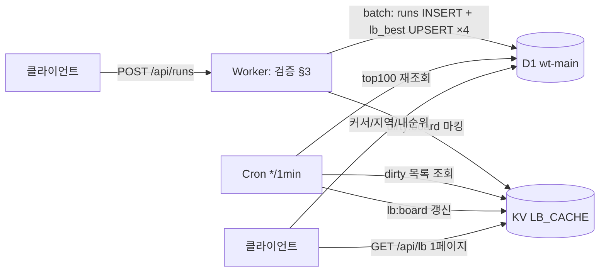
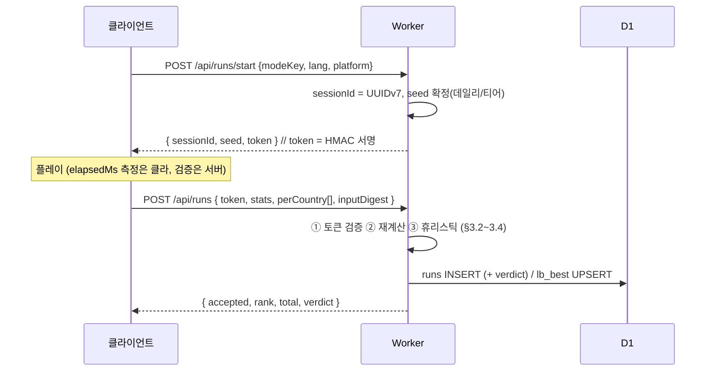
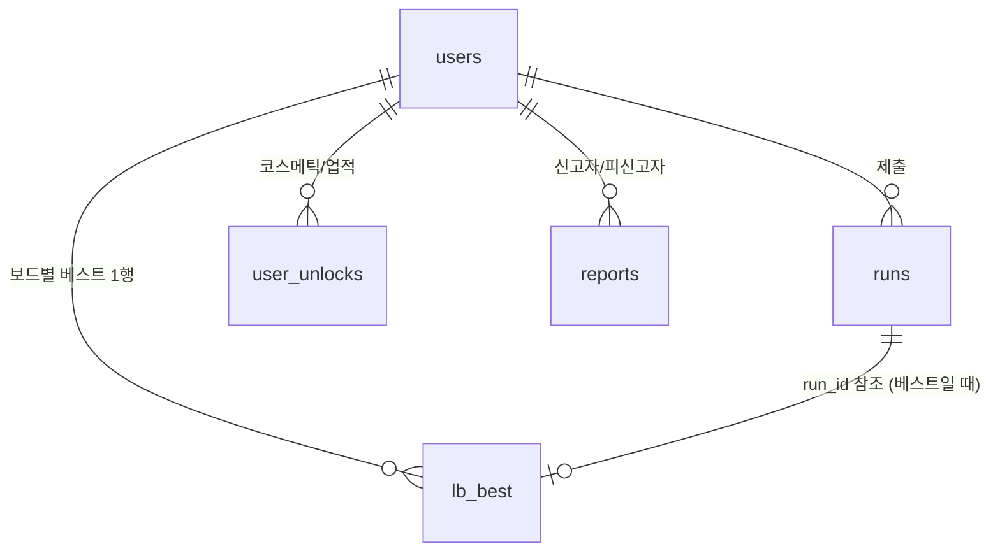

# 06. 랭킹 · 운영 · 성장

> 프로젝트 코드네임: **WORLD TYPING** / 문서 버전: v1.0 (2026-07-21) / 담당: 랭킹·운영·성장
> 선행 문서: 01 GDD(점수 공식 §6, 등급 §6.3), 02 데이터 명세(un195, 시드 규격), 03 입력 엔진, 04 멀티 프로토콜, 05 Cloudflare 아키텍처
> 본 문서의 소유 범위: 리더보드 전체(D1/KV/Cron), 데일리 챌린지 보드, 점수 무결성 종단, 프로필/신원, 분석 파이프라인, 프라이버시, 관측성/런북, 공유/바이럴 기능, 런칭 체크리스트

---

## 1. 리더보드 설계

### 1.1 차원(Dimension) 모델

리더보드는 4개 차원의 조합으로 유일하게 식별된다. 모든 조합을 `board_key` 단일 문자열로 직렬화하여 저장·캐시·조회의 키로 쓴다.

```
board_key = "{modeKey}|{lang}|{platform}|{periodKey}"
예: "continent:europe|ko|desktop|w:2026-W30"
```

| 차원 | 값 | 개수 | 비고 |
|---|---|---|---|
| `modeKey` | `continent:asia` `continent:europe` `continent:africa` `continent:north-america` `continent:south-america` `continent:oceania` / `tier:1`..`tier:5` / `worldtour` / `daily:YYYY-MM-DD` / `multi` | 6+5+1+1(일자별)+1 | daily는 날짜가 modeKey에 포함(§2) |
| `lang` | `ko` \| `en` | 2 | 타수 체계가 달라 절대 분리 (GDD §4) |
| `platform` | `desktop` \| `mobile` | 2 | GDD §11.3. 판정 휴리스틱은 클라가 보내되 서버가 UA/터치 이벤트 리포트로 교차검증 |
| `periodKey` | `all` / `d:YYYY-MM-DD` / `w:YYYY-Www` (ISO 주차) / `s:{seasonId}` (예: `s:2026q3`) | 4종 | 모든 period는 **KST(UTC+9) 자정 경계**. 주차는 월요일 시작 ISO 8601 |

**scope(global/지역)는 board_key 차원이 아니라 행 속성이다.** 지역 보드는 `lb_best.geo` 컬럼(Cloudflare `CF-IPCountry` 기반 ISO alpha-2) 필터로 파생한다. 이유: 지역 × 위 4차원을 모두 물리 보드로 만들면 보드 수가 200개국 배수로 폭발하고, 지역 보드 트래픽은 롱테일이라 D1 직접 쿼리로 충분하다. v1 UI에는 `Global` / `내 지역(자동 감지)` 두 탭만 노출한다.

- daily 모드는 `periodKey = all` 하나만 갖는다(날짜가 이미 modeKey에 있으므로 period 중복 불필요).
- `multi` 보드의 점수는 개인 매치 성적이 아니라 **레이팅 점수 MMR**(04 문서의 매치 결과 이벤트로 갱신, Elo K=32, 초기 1200)이다. period는 `s:{seasonId}`와 `all`만 운영한다.
- 활성 보드 수(캐시 대상): 싱글 12 modeKey × 2 lang × 2 platform × (all + 오늘 + 이번 주 + 현재 시즌) = **192** + daily 오늘분 4 + multi 8 ≈ **204개**. 분당 KV 리프레시에 무리 없는 규모(§1.5).

### 1.2 랭킹 키(정렬 순서) 정의

한 보드 내 순위는 아래 튜플의 사전식 비교로 결정한다. 모든 저장/캐시/쿼리는 이 순서를 따르며, 어떤 경로로 조회해도 동일 순위가 나와야 한다(불변식).

```
ORDER BY score DESC, elapsed_ms ASC, acc_milli DESC, achieved_at ASC
```

1. `score` — GDD §6.2 `FinalScore` (multi 보드는 MMR). 정수.
2. `elapsed_ms` — 동점 시 빠른 완주 우선.
3. `acc_milli` — 정확도(0~1000, ACC×1000 반올림 정수. REAL 비교의 부동소수 함정 회피).
4. `achieved_at` — 먼저 달성한 사람 우선(epoch ms).

**보드 등재 단위는 "유저당 베스트 1개"다.** 같은 유저의 하위 기록은 보드에 남지 않는다(runs 원장에는 전부 남는다). daily 보드만 예외 — "첫 정식 기록 1개"이며 갱신 불가(§2.3).

**불변식: lb_best 등재 = acct 세션(Google 계정 로그인) 전용이다(00 §11-D68).** 비로그인(게스트) 제출은 200 + `verdict='practice'`/`reason='guest'`로 강등되어 runs 원장에는 남되 보드에는 등재되지 않는다.

### 1.3 D1 스키마 (권위 저장소)

D1 데이터베이스 `wt-main` (05 문서의 단일 DB 정책 준수). 마이그레이션 파일 `migrations/0002_leaderboard.sql`:

```sql
-- 유저 (§4에서 재확인)
CREATE TABLE users (
  user_id        TEXT PRIMARY KEY,                 -- UUIDv7 (시간정렬 가능)
  device_id      TEXT NOT NULL UNIQUE,             -- 클라 생성 UUID, §4.1
  nickname       TEXT NOT NULL,                    -- 표시용 원문
  nickname_norm  TEXT NOT NULL UNIQUE,             -- 중복검사용 정규화형, §4.2
  passport_cover TEXT NOT NULL DEFAULT 'basic-green', -- 코스메틱 id, §4.4
  geo            TEXT,                             -- 가입 시 CF-IPCountry (alpha-2, 'T1'/'XX'는 NULL 처리)
  status         TEXT NOT NULL DEFAULT 'active'
                 CHECK (status IN ('active','shadowbanned','banned','deleted')),
  streak_daily   INTEGER NOT NULL DEFAULT 0,
  streak_updated TEXT,                             -- 마지막 스트릭 인정일 'YYYY-MM-DD' (KST)
  created_at     INTEGER NOT NULL,                 -- epoch ms
  updated_at     INTEGER NOT NULL
);

-- 판 원장 (모든 제출 기록. 리더보드 반영 여부와 무관하게 append-only)
CREATE TABLE runs (
  run_id             TEXT PRIMARY KEY,             -- UUIDv7
  user_id            TEXT NOT NULL REFERENCES users(user_id),
  mode_key           TEXT NOT NULL,                -- §1.1
  lang               TEXT NOT NULL CHECK (lang IN ('ko','en')),
  platform           TEXT NOT NULL CHECK (platform IN ('desktop','mobile')),
  score              INTEGER NOT NULL,
  pi                 INTEGER NOT NULL,             -- CPM × ACC² 반올림
  cpm                INTEGER NOT NULL,
  acc_milli          INTEGER NOT NULL,             -- ACC × 1000
  elapsed_ms         INTEGER NOT NULL,
  countries_cleared  INTEGER NOT NULL,
  countries_skipped  INTEGER NOT NULL,
  max_combo          INTEGER NOT NULL,
  completed          INTEGER NOT NULL,             -- 0/1
  grade              TEXT NOT NULL,                -- 'S'|'A'|'B'|'C'|'D'
  seed               TEXT,                         -- 티어/데일리/멀티 세트 시드
  session_id         TEXT NOT NULL,                -- 서명 세션 id (§3.1)
  verdict            TEXT NOT NULL DEFAULT 'valid'
                     CHECK (verdict IN ('valid','practice','flagged','rejected')),
  verdict_reason     TEXT,                         -- 예: 'cpm_over_hard_cap', 'replay_variance_low'
  geo                TEXT,                         -- 제출 시 CF-IPCountry
  detail_json        TEXT NOT NULL,                -- perCountry 배열 등 원시 제출 페이로드 (§3.2)
  created_at         INTEGER NOT NULL
);
CREATE INDEX idx_runs_user    ON runs (user_id, created_at DESC);
CREATE INDEX idx_runs_mode    ON runs (mode_key, created_at DESC);
CREATE INDEX idx_runs_flagged ON runs (verdict, created_at DESC) WHERE verdict IN ('flagged','rejected');

-- 보드별 유저 베스트 (materialized — 조회의 주 대상)
CREATE TABLE lb_best (
  board_key   TEXT NOT NULL,
  user_id     TEXT NOT NULL,
  run_id      TEXT NOT NULL,
  score       INTEGER NOT NULL,
  elapsed_ms  INTEGER NOT NULL,
  acc_milli   INTEGER NOT NULL,
  achieved_at INTEGER NOT NULL,
  geo         TEXT,                                 -- 지역 보드 필터용 (제출 시점 스냅샷)
  PRIMARY KEY (board_key, user_id)
) WITHOUT ROWID;

-- 순위 스캔용 복합 인덱스 — §1.2 랭킹 키와 완전 동일한 순서
CREATE INDEX idx_lb_rank ON lb_best
  (board_key, score DESC, elapsed_ms ASC, acc_milli DESC, achieved_at ASC);
-- 지역 보드용
CREATE INDEX idx_lb_geo  ON lb_best
  (board_key, geo, score DESC, elapsed_ms ASC, acc_milli DESC, achieved_at ASC);

-- 시즌 메타
CREATE TABLE seasons (
  season_id TEXT PRIMARY KEY,        -- 's:2026q3'
  starts_at INTEGER NOT NULL,        -- epoch ms, KST 경계
  ends_at   INTEGER NOT NULL
);
```

**쓰기 경로 (기록 제출 핸들러 `POST /api/runs`)** — 무결성 검증(§3) 통과 후 단일 D1 배치(batch)로:

```ts
// 해당 run이 갱신해야 할 board_key 목록: all + 오늘 d: + 이번 주 w: + 현재 시즌 s:
const periods = ['all', `d:${kstDate}`, `w:${isoWeek}`, `s:${season}`];
const boards = periods.map(p => `${modeKey}|${lang}|${platform}|${p}`);

const stmts = boards.map(bk => db.prepare(`
  INSERT INTO lb_best (board_key, user_id, run_id, score, elapsed_ms, acc_milli, achieved_at, geo)
  VALUES (?1, ?2, ?3, ?4, ?5, ?6, ?7, ?8)
  ON CONFLICT (board_key, user_id) DO UPDATE SET
    run_id=excluded.run_id, score=excluded.score, elapsed_ms=excluded.elapsed_ms,
    acc_milli=excluded.acc_milli, achieved_at=excluded.achieved_at, geo=excluded.geo
  WHERE (excluded.score, -excluded.elapsed_ms, excluded.acc_milli, -excluded.achieved_at)
      > (lb_best.score, -lb_best.elapsed_ms, lb_best.acc_milli, -lb_best.achieved_at)
`).bind(bk, userId, runId, score, elapsedMs, accMilli, achievedAt, geo));
await db.batch([insertRunStmt, ...stmts]);
```

(SQLite의 튜플 비교로 §1.2 랭킹 키를 정확히 재현 — 더 좋은 기록일 때만 UPSERT. `shadowbanned` 유저는 runs에는 쓰되 lb_best UPSERT를 건너뛴다 §3.5.)

### 1.4 조회 패턴

**① Top-N 페이지 (keyset 페이지네이션, OFFSET 금지)**

```sql
-- 첫 페이지
SELECT b.user_id, u.nickname, u.passport_cover, b.score, b.elapsed_ms, b.acc_milli, b.achieved_at
FROM lb_best b JOIN users u USING (user_id)
WHERE b.board_key = ?1 AND u.status = 'active'
ORDER BY b.score DESC, b.elapsed_ms ASC, b.acc_milli DESC, b.achieved_at ASC
LIMIT 51;   -- 50 + hasNext 판별용 1

-- 다음 페이지 (커서 = 마지막 행의 랭킹 키 튜플, base64url JSON)
WHERE b.board_key = ?1 AND u.status = 'active'
  AND (b.score, -b.elapsed_ms, b.acc_milli, -b.achieved_at)
    < (?2, -?3, ?4, -?5)
ORDER BY ... LIMIT 51;
```

API: `GET /api/lb?board={board_key}&cursor={c}&geo={optional alpha-2}` → `{ entries: [...], nextCursor, total }`. `geo` 지정 시 `idx_lb_geo` 사용 쿼리로 전환. 순위 번호는 페이지 오프셋이 아니라 `내 순위 쿼리(②)`와 동일한 COUNT 방식으로 첫 행에 대해 1회 계산 후 페이지 내 증분.

**② 내 순위 (rank-of-me)**

```sql
SELECT COUNT(*) + 1 AS rank FROM lb_best b JOIN users u USING (user_id)
WHERE b.board_key = ?1 AND u.status = 'active'
  AND (b.score, -b.elapsed_ms, b.acc_milli, -b.achieved_at)
    > (?2, -?3, ?4, -?5);
SELECT COUNT(*) AS total FROM lb_best WHERE board_key = ?1;  -- percentile = rank/total
```

`idx_lb_rank`의 board_key 프리픽스 범위 스캔이라 보드당 수십만 행에서도 D1에서 수 ms. 결과 화면의 "당신은 상위 12.4%" 문구가 이 쿼리 하나로 나온다. 응답은 유저별 60초 Cache API 캐시(기록 제출 직후에는 bypass 헤더로 최신값).

**③ 결과 화면 즉시 순위**: 기록 제출 응답에 ②를 인라인 포함(`{ accepted: true, rank, total, isPersonalBest }`) — 추가 왕복 없음.

### 1.5 KV Top-N 캐시 + Cron 집계

- **KV 네임스페이스 `LB_CACHE`**. 키 = `lb:{board_key}` (global top 100), 값 = 렌더에 필요한 전 필드가 담긴 JSON(닉네임/커버 포함 denormalized, ~15KB), `metadata = { builtAt, total }`.
- **Cron Trigger `*/1 * * * *`** (`wrangler.toml`의 scheduled) — 매분 실행되는 `lb-refresher`:
  1. 활성 board_key 목록(§1.1의 ~204개)을 생성한다(오늘/이번 주/현재 시즌은 실행 시각의 KST로 계산).
  2. **더티 마킹 최적화**: 기록 제출 핸들러가 `KV put("dirty:{board_key}", "1", { expirationTtl: 180 })`을 남긴다. Cron은 `KV list({ prefix: "dirty:" })`로 지난 1분간 변경된 보드만 D1에서 top 100 재조회 → `lb:{board_key}` 갱신. 평시 갱신 대상은 수 개~수십 개.
  3. `alltime`류 콜드 보드는 더티 여부와 무관하게 10분 주기(분기 조건 `minute % 10 === 0`)로 전량 리프레시(닉네임 변경 반영).
- **읽기 경로**: `GET /api/lb`의 첫 페이지(커서 없음, geo 없음)는 KV 히트 시 D1을 치지 않는다. KV miss(신규 보드) 시 D1 폴백 + 즉시 KV 백필. 2페이지 이후와 지역 필터는 항상 D1.
- **Queue는 v1에서 리더보드 경로에 사용하지 않는다.** 제출 시 D1 UPSERT는 동기 처리(배치 1회, p95 < 30ms)로 충분하다. Queues(`wt-events`)는 분석 이벤트 적재(§5)와 신고 처리(§3.6) 전용.
- **기간 롤오버**: 별도 삭제 작업 불필요 — 새 periodKey가 새 board_key를 만들 뿐이다. 지난 daily/weekly 보드 행은 90일 후 정리(Cron 일 1회 `DELETE FROM lb_best WHERE board_key LIKE '%|d:%' AND achieved_at < ?`, weekly는 180일). all/season은 영구.



---

## 2. 데일리 챌린지 보드

### 2.1 세트 결정 (전원 동일)

- 시드: `seed = SHA-256("wt-daily:" + YYYY-MM-DD + ":" + DAILY_SALT)` — 날짜는 **KST 기준**, `DAILY_SALT`는 Worker secret(사전 계산 유출 방지: salt 없이는 내일 세트를 미리 알 수 없다).
- 출제: 10개국 = T1×3 + T2×3 + T3×2 + T4×1 + T5×1 (GDD §9.1). 각 티어 풀(`un195` 한정, 02 §12)을 시드 기반 Fisher-Yates(**mulberry32** — 00 §11-D13, `shared/protocol/seeding.ts`의 멀티 시드 셔플과 동일 구현 공유)로 셔플해 앞에서 개수만큼 취하고, 최종 10개를 다시 시드 셔플하여 순서 확정.
- 세트는 서버가 `GET /api/v1/daily/today`에서 내려준다(클라 계산 금지 — salt가 서버에만 있으므로 자연 강제). 응답은 KST 자정까지 `Cache-Control: public, max-age=60` + KV 캐시.

### 2.2 보드

- `modeKey = daily:2026-07-21`, board_key 예: `daily:2026-07-21|ko|desktop|all`. §1의 인프라를 그대로 사용, 별도 테이블 없음.
- 언어와 무관하게 국가 세트는 동일(시드가 언어 비의존), 보드는 lang으로 분리(타수 체계).
- 보드 등재는 **계정(acct) 세션 전용**(00 §11-D68-①) — 게스트(비로그인) 제출은 데일리 포함 전 모드에서 `verdict='practice'`/`reason='guest'`로 runs 원장에만 기록되고 어느 보드에도 반영되지 않는다(플레이 자체는 비로그인 100% 유지).

### 2.3 1일 1회 등재 규칙

- 유저의 **첫 정식 제출**(계정 세션의 `verified` 제출 — §2.2, 00 §11-D68-①)만 lb_best에 등재. 서버 강제: daily 보드 UPSERT는 `ON CONFLICT DO NOTHING`으로 대체(§1.3 쿼리의 daily 분기).
- 이미 등재된 유저의 재도전 제출은 `verdict='practice'`로 runs에만 기록(클라는 시작 전에 `GET /api/v1/daily/me`로 등재 여부를 받아 "연습 모드" 라벨 표시).
- 스트릭 갱신: 첫 정식 제출 수리 시 `users.streak_updated`가 어제(KST)면 `streak_daily += 1`, 아니면 1로 리셋. 업적 `daily_7/30/100` 판정은 이 시점.
- 공유 텍스트(GDD §9.1의 Wordle식 이모지 그리드)는 결과 응답의 `shareText` 필드로 서버가 생성해 내려준다(클라 조작 여지 제거 목적이 아니라 포맷 단일화 목적 — 어차피 텍스트 공유는 신뢰 대상 아님).

---

## 3. 점수 무결성 종단 (Anti-cheat End-to-End)

원칙: **클라이언트가 보낸 점수를 절대 믿지 않는다. 서버는 원시 데이터에서 점수를 재계산하고, 통계적 이상치를 걸러내며, 확신이 없을 땐 조용히 배제한다(섀도우밴).**

### 3.1 서명 세션 (run session token)



- `token = base64url(payload) + "." + base64url(HMAC-SHA256(payload, RUN_TOKEN_SECRET))`, payload = `{ sid, uid, modeKey, lang, platform, seed, iat }`. Worker secret `RUN_TOKEN_SECRET`.
- 제출 시 검증: 서명 유효, `sid` 미사용(D1 `runs.session_id` UNIQUE 아님 — 대신 KV `sess:{sid}`에 사용 플래그, TTL 2h. **재사용 = 즉시 reject**), 페이로드의 modeKey/lang/platform이 제출과 일치, `iat` 기준 경과 시간이 물리적으로 타당(§3.3-b).
- start 없이 제출된 기록, 토큰 위조 → HTTP 200 + `verdict:'rejected'` (공격자에게 실패 신호를 명확히 주지 않기 위해 4xx를 쓰지 않는다. 클라 UI는 "기록이 검토 중입니다"로 표시).
- **계정 게이팅(00 §11-D68)**: 랭킹 등재는 acct 세션 전용 — 비로그인(게스트) 세션의 제출은 정상 처리하되 200 + `verdict='practice'`/`reason='guest'`로 강등(D39 규약 유지, 보드 미등재). 게스트로 플레이한 뒤 결과 화면에서 로그인해 제출하는 경우(계정 제출인데 `runToken.pid ≠ session.pid`)는 `RunSubmitReq`의 `guestToken`(pid === runToken.pid) 검증으로 두 신원 동시 보유를 증명한 때에만 계정 원장에 등재한다(04 §6.2-①).

### 3.2 서버 재계산 (authoritative rescoring)

클라이언트 제출 페이로드(runs.detail_json에 원문 보존):

```ts
interface RunSubmission {
  token: string;
  perCountry: {
    code: string;      // CountryId — 서버가 seed/modeKey로 복원한 세트와 순서까지 일치해야 함
    ms: number;        // 해당 국가 소요 시간
    keystrokes: number;// 정타+오타 (ko는 자모 단위)
    errors: number;
    skipped: boolean;
  }[];
  inputDigest: string; // §3.4-d 키 간격 통계 요약
}
```

서버 검증 절차(전부 `packages/data`의 공유 상수 `COUNTRIES`와 GDD §6.2 공식의 서버 구현 `packages/scoring`으로 수행 — 클라와 동일 코드):

1. **세트 일치**: seed → 세트/순서 복원, `perCountry[].code` 시퀀스가 정확히 일치하지 않으면 reject.
2. **타수 하한**: 국가 i에 대해 `keystrokes_i ≥ L_i`(정답 최소 타수, 02의 자모 시퀀스 길이). 미달이면 reject(붙여넣기/자동입력 흔적).
3. **점수 재계산**: `score, pi, cpm, acc` 전부 서버가 perCountry에서 재계산. 클라 제출 요약값과 다르면 **서버 값으로 덮어쓰고** 차이가 ±1(반올림 오차) 초과면 `flagged`.
4. **시간 합 정합**: `|Σ ms_i − elapsedMs| ≤ 1500ms` 초과 시 flagged.

### 3.3 이상치 탐지 휴리스틱

`config KV: anticheat.json`으로 배포되는 상수(핫스왑 가능, 05 문서의 원격 설정 채널):

| 규칙 | 기본값 | 판정 |
|---|---|---|
| (a) CPM 하드캡 | ko 1,400타/분, en 1,300 CPM | 초과 → `rejected` (인간 세계기록 상회) |
| (b) CPM 소프트캡 | ko 950, en 900 | 초과 → `flagged` (보드 반영하되 리뷰 큐 §3.6) |
| (c) 국가당 최소 시간 | `ms_i ≥ L_i × 35ms` (초당 28.5타 상회 불가) | 1개국이라도 위반 → rejected |
| (d) 세션 벽시계 | `elapsedMs ≤ (제출시각 − token.iat) + 3000ms` | 위반 → rejected (시간 압축 조작) |
| (e) 개인 성장 점프 | 동일 보드 직전 베스트 대비 PI +60% 초과 & 표본 ≥ 5판 | flagged |
| (f) 정확도-속도 결합 | CPM > 800 && ACC = 100% && maxCombo = 세트 길이 | flagged (봇 전형) |
| (g) 제출 빈도 | 유저당 시간당 정식 제출 > 40 | 초과분 practice 강등 (rate limit) |

### 3.4 입력 리듬 통계 (`inputDigest`)

- 클라(03 입력 엔진)가 키 이벤트 간격(ms)의 요약 통계를 전송: `{ n, mean, stdev, p10, p50, p90, burstMax }` (원시 타임스탬프 전송 금지 — 페이로드/프라이버시 절약).
- 봇 시그니처: `stdev/mean < 0.12`(인간은 0.3~0.6) 또는 `p90 − p10 < 25ms` → flagged. 모바일 스와이프/자동완성 벌크 삽입(단일 이벤트에 3자 이상)은 클라가 감지 즉시 그 판을 `practice` 셀프 강등(GDD §11.3)하고 서버는 digest의 `burstMax > 3`으로 교차 확인.
- 요약 통계는 위조 가능하다 — 이 계층은 "저노력 치터 필터"이며, 고노력 위조는 (a)~(f)의 물리 한계와 §3.5 운영 대응으로 막는다. **완벽을 목표하지 않고 리더보드 상위권의 신뢰만 지킨다**(상위 100위권은 flagged 발생 시 사람이 본다).

### 3.5 섀도우밴

- `users.status = 'shadowbanned'`: 본인 화면에는 자기 기록/순위가 정상 표시되지만(내 순위 쿼리에서 자기 자신만 예외 포함), lb_best UPSERT가 중단되고 기존 행은 Cron이 제거하며 KV top100과 타인 조회에서 사라진다.
- 부여: (i) `rejected` 누적 3회 자동, (ii) 리뷰 큐에서 운영자 수동. 해제도 수동. 상태 변경은 `admin_audit` 테이블(operator, action, reason, at)에 기록.
- `banned`는 API 레벨 차단(429 아님 — 200 + practice 처리 유지로 우회 학습 차단). `deleted`는 §6 삭제 요청 처리 상태.

### 3.6 신고 플로우

- UI: 리더보드 행의 컨텍스트 메뉴 "기록 신고" → 사유 선택(매크로 의심/닉네임 부적절/기타).
- `POST /api/report { targetRunId | targetUserId, reason }` → Queue `wt-events`에 적재 → 컨슈머가 D1 `reports` 테이블 INSERT. 동일 대상 신고 5건 도달 시 대상 run을 자동 `flagged` + 운영 알림(§8.2 웹훅).
- 리뷰 도구: v1은 별도 어드민 UI 없이 **읽기 전용 리뷰 쿼리 세트**(`ops/queries/review.sql`: flagged 최근순, 신고 집계, 유저 이력)를 `wrangler d1 execute`로 실행하고, 조치는 `ops/queries/actions.sql`의 파라미터화 UPDATE로 수행. 어드민 대시보드는 v1.5.

```sql
CREATE TABLE reports (
  report_id  TEXT PRIMARY KEY, reporter_user_id TEXT NOT NULL,
  target_user_id TEXT NOT NULL, target_run_id TEXT,
  reason TEXT NOT NULL, status TEXT NOT NULL DEFAULT 'open'
    CHECK (status IN ('open','actioned','dismissed')),
  created_at INTEGER NOT NULL
);
CREATE INDEX idx_reports_target ON reports (target_user_id, status);

CREATE TABLE admin_audit (
  audit_id TEXT PRIMARY KEY, operator TEXT NOT NULL, action TEXT NOT NULL,
  target TEXT NOT NULL, reason TEXT, created_at INTEGER NOT NULL
);
```

---

## 4. 프로필 / 신원

### 4.1 익명 신원 (device id)

- 최초 방문 시 클라가 `crypto.randomUUID()`로 `deviceId` 생성 → `localStorage['wt:did']` 저장. 서버 `POST /api/users/bootstrap { deviceId }` → 기존 매핑 있으면 해당 user 반환, 없으면 user 생성 + 기본 닉네임 `GUEST_{4자리}` 부여. 응답으로 **httpOnly 세션 쿠키가 아닌** 서명 identity token(JWT-형 HMAC, 90일)을 내려 localStorage에 보관, 이후 모든 API의 `Authorization` 헤더.
- localStorage 유실 = 신원 유실을 명시적으로 수용(v1은 소셜 로그인 없음 — GDD 1.2의 "비로그인 100%"). 설정 화면에 "이 기록은 이 브라우저에만 연결됩니다" 고지. 소셜 로그인 연동(기록 이전)은 v1.5 백로그.
- deviceId는 랜덤 UUID이며 기기 핑거프린팅(canvas/폰트 등)을 **하지 않는다**(§6 프라이버시 설계와 직결).

### 4.2 닉네임

- 규칙: 길이 2~12자(코드포인트 기준), 허용 문자 `[가-힣a-zA-Z0-9_-]`, 완성형 한글만(호환 자모 낱자 불가), 숫자/기호만으로 구성 불가, `-`/`_` 연속·선두·말미 불가.

```ts
const NICK_RE = /^(?![_\-])(?!.*[_\-]{2})(?=.*[가-힣a-zA-Z])[가-힣a-zA-Z0-9_\-]{2,12}(?<![_\-])$/u;
```

- **중복 검사 정규화** `nicknameNorm`: NFC → lowercase → `l→1? ❌`(leet 치환은 중복 판정에는 미적용 — 과잉 차단) → 그대로 유일성 비교(`users.nickname_norm UNIQUE`). 변경은 30일당 2회 제한(`nickname_changed_at` 카운터).
- **비속어 필터** (`packages/moderation`):
  1. 차단어 리스트 2종: `badwords.ko.txt`(약 600항목: 표준 비속어 + 지역·정치 혐오 표현 + 성적 표현), `badwords.en.txt`(약 400항목, LDNOOBW 리스트 기반 큐레이션). 저장소에 커밋, 배포 시 KV `config:moderation`으로도 푸시(핫픽스용).
  2. 매칭 전 정규화: lowercase → leet 치환(`1→i, 0→o, 3→e, 5→s, @→a, $→s`) → 구분자 제거(`_-` 및 공백) → **한글은 02 문서의 `toJamoSeq`로 자모 분해 후 자모열 부분 문자열 매칭**(예: "ㅅ1ㅂ", "시-발" 우회 차단. 매칭 엔진 재사용 — 신규 코드 최소).
  3. 부분 문자열 매칭으로 인한 오차단(스컨소프 문제, 예: "assassin")은 en 한정 allowlist(`allowwords.en.txt`)로 예외 처리.
  4. 예약어 차단: `admin, administrator, mod, staff, system, 운영자, 관리자, worldtyping, typetrip, official` + `GUEST_` 프리픽스(시스템 전용).
- 필터는 회원 닉네임과 멀티 방 채팅(04 문서) 양쪽에서 동일 함수 사용.

### 4.3 아바타 = 여권 커버 (코스메틱)

- 별도 이미지 업로드 없음(모더레이션 비용 0). 아바타는 GDD §9.4의 여권 커버 12종 중 획득한 것 선택. `users.passport_cover`에 id 저장.
- 커버/스탬프/업적 보유는 서버 권위:

```sql
CREATE TABLE user_unlocks (
  user_id    TEXT NOT NULL REFERENCES users(user_id),
  unlock_type TEXT NOT NULL CHECK (unlock_type IN ('cover','stamp','achievement','tier')),
  unlock_id  TEXT NOT NULL,          -- 'cover:gold', 'stamp:continent:europe:S', 'ach:daily_30', 'tier:3'
  meta_json  TEXT,                   -- 스탬프의 완주일/등급 등
  created_at INTEGER NOT NULL,
  PRIMARY KEY (user_id, unlock_type, unlock_id)
) WITHOUT ROWID;
```

- 지급 판정은 기록 제출 핸들러에서 서버 재계산 결과 기준으로만 수행(클라 "업적 달성" 신호 불신). 프로필 조회 `GET /api/users/:id/passport`는 KV 60초 캐시.

### 4.4 데이터 모델 관계 재확인



---

## 5. 분석 / KPI

### 5.1 도구 선정

| 계층 | 도구 | 근거 |
|---|---|---|
| 제품 이벤트(권위) | **Cloudflare Workers Analytics Engine (AE)** | 서버사이드 기록 → 광고차단기 무관, 쿠키 불필요(§6 컴플라이언스 단순화), SQL API로 조회, Cloudflare 올인 정책(05) 부합 |
| 마케팅/유입 | **GA4** (동의 시에만, Consent Mode v2) | UTM/유입 채널 분석은 AE로 재구현하기 비효율. 스크립트는 쿠키리스 기본, EEA/동의 배너 연동 |
| 세션 리플레이/히트맵 | 도입 안 함 (v1) | 타이핑 게임 특성상 입력 내용 녹화는 프라이버시 리스크 대비 효용 낮음. PostHog는 v1.5에 self-host 검토로만 백로그 |

### 5.2 이벤트 스키마 (AE)

Worker가 `env.ANALYTICS.writeDataPoint()`로 기록. AE 제약(blobs ≤ 20, doubles ≤ 20, index 1개)에 맞춘 고정 레이아웃:

```ts
// index1 = event name (샘플링 키)
// blobs:  [1]=userIdHash(SHA-256 앞 16자 — 원 id 비저장), [2]=modeKey, [3]=lang,
//         [4]=platform, [5]=geo, [6]=verdict, [7]=referrerHost, [8]=utmSource, [9]=appVersion
// doubles:[1]=score, [2]=pi, [3]=cpm, [4]=accMilli, [5]=elapsedMs,
//         [6]=countriesCleared, [7]=skipped, [8]=completed(0/1)
```

| 이벤트 | 트리거 지점 | 용도 |
|---|---|---|
| `visit` | 첫 API 호출(bootstrap)에서 세션당 1회 | DAU/유입 |
| `game_start` | `POST /api/runs/start` | 시작 수, 모드 선호 |
| `game_finish` | `POST /api/runs` 수리 시 | 완주율, 성능 분포, 이탈 분석 |
| `game_abandon` | start 후 2h 내 미제출 세션(Cron 일괄 집계) | 중도 이탈률 |
| `daily_play` | 데일리 첫 정식 제출 | 스트릭/출석 |
| `mp_queue` / `mp_match_start` / `mp_match_finish` | DO에서 기록 | 매칭 시간, 매치 완료율, 동시접속 |
| `share_click` | `GET /r/:shareId` 히트(서버 측) 및 클라 공유 버튼 | 바이럴 계수 분모/분자 |
| `retention_ping` | bootstrap 시 마지막 방문일과 비교해 D1/D7/D30 플래그 | 리텐션 코호트 |

클라 전용 이벤트(버튼 클릭 등)는 `POST /api/t` 단일 수집 엔드포인트로 배칭(10개/5초) 전송 → Worker가 AE에 기록. 광고차단기로 유실되어도 핵심 지표(위 표)는 전부 서버 트리거라 무손실.

### 5.3 퍼널 정의

```
[방문 visit] → [첫 game_start] → [첫 game_finish] → [결과 화면 공유 or 리트라이] → [D1 재방문] → [데일리 습관화(주 3회+)]
목표 전환율(런칭 분기): 방문→시작 70% / 시작→완주 55% / 완주→공유클릭 8% / 방문→D1 리텐션 25% / D7 12%
```

### 5.4 노스스타 지표와 보조 KPI

- **노스스타: WCR (Weekly Completed Runs) — 주간 완주 판 수.** "재미의 총량"을 가장 직접 반영하며 유저 수 × 빈도 × 완주율의 곱. 대시보드 최상단.
- 보조: DAU/WAU(stickiness), 데일리 참여율(DAU 중 daily_play 비율, 목표 35%), K-factor 근사 = (share_click발 신규 visit ÷ WAU, 목표 0.15+), 멀티 매치 성사율(큐 진입 대비 매치 시작, 목표 90%+), 평균 매칭 대기(목표 <12s), 부정 기록 비율(flagged+rejected ÷ 전체, 목표 <0.5%).
- 조회: AE SQL API를 일 1회 Cron으로 스냅샷 → D1 `kpi_daily` 테이블 → 사내 대시보드(§8.3).

---

## 6. 프라이버시 / 컴플라이언스 (PIPA + GDPR)

### 6.1 설계 원칙: "수집하지 않는 것이 최선의 컴플라이언스"

- 계정·이메일은 **비로그인 이용 시 미수집**. Google 로그인 선택 시 `sub`(계정 식별자)·이메일(`email_verified`인 경우만)·프로필 이름을 수집한다(00 §11-D68). 전화·실명·생년월일은 일절 수집 안 함. 원 IP는 저장하지 않고 `CF-IPCountry`(국가 코드)만 저장. 쿠키는 사용하지 않으며(신원은 localStorage 토큰) GA4는 **동의 배너 수락 시에만 로드**(EEA/UK/KR 공통 적용 — 지역 분기 없이 단일 정책으로 단순화).
- 이 구성에서 처리하는 개인정보(개인 식별 가능 정보)는 비로그인 기준 `deviceId(랜덤)`, `nickname(자유입력)`, `게임 기록` 3종이고, Google 로그인 선택 시 계정 식별 정보(`sub`·검증된 이메일·프로필 이름 — §6.2 표)가 더해진다. 닉네임에 실명 기입 가능성이 있으므로 개인정보로 취급해 전체 체계를 갖춘다.

### 6.2 처리 항목 인벤토리

| 항목 | 목적 | 법적 근거(GDPR) | 보존 | 저장 위치 |
|---|---|---|---|---|
| deviceId, userId, identity token | 서비스 제공(기록 연속성) | Art.6(1)(b) 계약 이행 | 마지막 활동 후 2년 | D1(서울 아님 — §6.4 고지), localStorage |
| nickname | 랭킹 표시 | Art.6(1)(b) | 동상 | D1, KV 캐시 |
| Google 계정 식별자(`sub`)·이메일(`email_verified` 시)·프로필 이름 | 로그인(랭킹 등재·멀티 참가) — 00 §11-D68 | Art.6(1)(b) 계약 이행 | 탈퇴 시 즉시 삭제, 그 외 마지막 활동 후 2년 | D1(auth_identities) |
| 게임 기록(runs, lb_best, unlocks) | 서비스 제공/랭킹 | Art.6(1)(b) | 동상. detail_json(입력 리듬 통계)은 90일 후 NULL 처리(Cron) | D1 |
| 국가 코드(geo) | 지역 랭킹/통계 | Art.6(1)(f) 정당 이익 | 동상 | D1 |
| AE 이벤트(userIdHash) | 서비스 개선 통계 | Art.6(1)(f) — 해시 가명처리 | AE 기본 보존(90일) | Cloudflare AE |
| GA4 식별자 | 마케팅 분석 | Art.6(1)(a) **동의** | GA4 설정 2개월 | |
| 신고/제재 기록 | 부정 이용 방지 | Art.6(1)(f) | 제재 종료 후 1년 | D1 |

### 6.3 이용자 권리 구현 (00 §11-D76 — 이메일 접수 채널)

- **접수 채널**: 열람(이동)·정정·삭제·처리정지 요청은 `dkdleldjqkr976@gmail.com` 이메일로 접수한다(인앱 셀프서비스 UI는 D76으로 제거 — 방침 §7·support FAQ에 채널 명기). 본인 확인 후 열람은 10일 이내, 그 외는 지체 없이(늦어도 30일 이내) 처리·회신. 접수-처리 기록은 `admin_audit`에.
- **이행 수단(존치 API)**: 열람/이동 = `GET /api/v1/users/me/export`(users/runs/unlocks JSON), 삭제 = `DELETE /api/v1/users/me`(트랜잭션: runs.detail_json 삭제, nickname → `탈퇴한 여행자`, nickname_norm → `deleted:{userId}`, lb_best 전 행·unlocks 삭제, status='deleted', deviceId 매핑 해제 — KV 캐시는 다음 Cron 사이클 자연 반영 ≤10분, AE는 해시 가명처리라 개별 삭제 불가·불요). 운영자가 요청 건별로 실행한다.
- **정정권**: 닉네임 변경 기능(ResultView) + 이메일 접수.
- 운영 주체 **박진우**(00 §11-D76), 문의 `dkdleldjqkr976@gmail.com`.

### 6.4 국외 이전·저장소 고지 (PIPA 필수)

- Cloudflare 글로벌 네트워크(D1/KV/DO — 주 리전은 05 문서 설정 기준 APAC) 사용을 처리방침에 "개인정보 처리 위탁 및 국외 이전" 항목으로 명시: 수탁자 Cloudflare, Inc.(미국), 이전 항목/목적/보존기간, DPA·SCC 체결 사실.
- 미성년자: 만 14세 미만 여부를 **묻지 않는다**(연령 수집 자체가 추가 개인정보). 대신 실명·연락처 미수집 구조이므로 법정대리인 동의가 필요한 수집 행위가 없음을 방침에 설명하고, "커뮤니티 기능(채팅)은 최소 연령 만 14세 권장" 문구 게시. GDPR-K 대응 동일 논리.

### 6.5 개인정보처리방침 페이지 아웃라인 (`/privacy`, ko/en 병기 — metrotyping.kr/privacy와 동일하게 정적 단일 페이지)

```
1. 개요 및 처리자 정보 (서비스명, 운영 주체: 박진우, 문의: dkdleldjqkr976@gmail.com — 00 §11-D76)
2. 수집하는 항목과 방법 (§6.2 표를 평문화 — "비로그인 이용 시 계정/이메일/실명을 수집하지 않습니다" 선명하게 + Google 로그인 선택 시 sub/이메일(검증 시)/프로필 이름 수집 명시)
3. 처리 목적
4. 보유 및 이용 기간 (항목별)
5. 처리 위탁 및 국외 이전 (Cloudflare / Google LLC(로그인) / Google(GA4, 동의 시))
6. 쿠키 및 유사 기술 (쿠키 미사용, localStorage 사용 내역, GA4 동의 관리 방법)
7. 이용자의 권리와 행사 방법 (이메일 접수 채널·처리 기한 명시 — 00 §11-D76)
8. 아동의 개인정보
9. 안전성 확보 조치 (전송 암호화, 접근 통제, 가명처리)
10. 개인정보 보호책임자 및 문의처
11. 고지 의무 (변경 시 페이지 공지, 시행일)
부칙: 시행일 / 변경 이력 표
```

---

## 7. 수익화 (v1 정책)

- **v1은 완전 무료·무광고·무결제.** 코스메틱 전량 플레이 보상(GDD §9.4). 이유: (i) 바이럴 확산기에 광고는 공유 링크의 첫인상을 훼손, (ii) 결제 도입 시 전자상거래법/앱마켓 규정 등 컴플라이언스 표면 급증, (iii) Cloudflare 비용 구조상 MAU 100만까지 월 수백 달러 수준(05 문서 비용 추정)으로 무수익 운영 가능.
- 준비만 해두는 것: AE 이벤트에 `appVersion`/유입 채널이 이미 있으므로 향후 수익화 실험의 대조군 데이터가 자동 축적된다. v2 후보(사업 결정 필요): 시즌 한정 커버 후원 구매, 결과 카드 하단 스폰서 배지, Ko-fi형 후원 링크. **본 문서 범위에서는 어떤 수익화 코드도 v1에 넣지 않는다.**

---

## 8. 운영 / 관측성

### 8.1 로깅

- **Workers Logs** 활성(`wrangler.toml: [observability] enabled = true, head_sampling_rate = 1`). 구조화 로그 컨벤션: `console.log(JSON.stringify({ evt, sid, uid: uidHash, latMs, ... }))` — 원 userId/입력 내용 로그 금지.
- 오류 추적: Worker 전역 에러 핸들러에서 `wt-events` Queue로 에러 이벤트 적재 + Logs. 클라 오류는 `window.onerror` → `POST /api/t`(type='client_error', 스택 상위 3프레임만).
- Logpush(R2 장기 보관)는 트래픽이 로그 보존 한도를 넘는 시점에 활성(런북 항목).

### 8.2 알림

| 알림 | 채널 | 조건 |
|---|---|---|
| 가용성 | Cloudflare Health Checks → 이메일+Slack 웹훅 | `GET /api/health`(D1 SELECT 1 + KV read 포함) 2회 연속 실패 |
| 에러율 | Workers 알림(Cloudflare Notifications) | 5분간 error rate > 2% |
| 부정 급증 | Cron 5분 주기 자체 체크 | flagged+rejected 비율 > 5% (치트 툴 유포 신호) → Slack |
| 신고 임계 | §3.6 자동 | 동일 대상 5건 |
| D1 용량/성능 | 주간 Cron 리포트 | DB 크기, lb_best 행수, 슬로 쿼리 상위 |

### 8.3 대시보드와 SLO

- 대시보드: Cloudflare 기본 대시보드(Workers/DO/D1) + `kpi_daily` 기반 사내 페이지(`/ops` — Cloudflare Access로 팀 이메일만 허용).
- SLO (분기 검토):

| SLI | 목표 |
|---|---|
| API 가용성(5xx 제외 비율) | 99.9% / 월 |
| 기록 제출 p95 지연 | < 250ms |
| 리더보드 첫 페이지 p95 (KV 히트) | < 100ms |
| 멀티 진행 브로드캐스트 p95 (04 연계) | < 400ms E2E |
| KV top100 신선도 | < 90s |

### 8.4 인시던트 런북 (기초, `ops/runbook.md`로 커밋)

| 시나리오 | 1차 대응 |
|---|---|
| D1 장애/지연 | 리더보드 읽기는 KV 캐시로 자동 서빙 지속(§1.5 폴백 순서 덕분). 기록 제출은 클라 재시도 큐(로컬 보관 → 복구 후 재제출, token TTL 2h 내). 상태 페이지 배너 ON(KV `config:banner`) |
| 치트 웨이브(핵 유포) | `anticheat.json` 캡 하향 핫스왑 → 해당 기간 보드 스냅샷 후 flagged 일괄 재판정 스크립트(`ops/scripts/rescore.ts`) → 필요 시 기간 보드 무효화 공지 |
| 바이럴 스파이크 | Workers는 자동 스케일. 병목은 D1 쓰기 — `게시판 rate limit(g)` 하향 + KV 캐시 TTL 상향으로 흡수. DO 방 수는 지역 분산 자동 |
| 잘못된 데이터 배포(국가명 오류 등) | 02 문서 manifest 해시로 KV 데이터 즉시 롤백(클라 재배포 불필요) |
| 리더보드 오염(버그성 점수) | 원인 run_id 특정 → `lb_best` 해당 행 삭제 + runs verdict='rejected' → dirty 마킹으로 KV 재빌드(90초 내 정화) |

### 8.5 D1 백업/복구

- **Time Travel**(D1 기본, 30일 시점 복원): 사고 시 `wrangler d1 time-travel restore wt-main --timestamp=...`. 복원은 전체 DB 단위이므로, 부분 오염은 §8.4의 행 단위 정화를 우선.
- **일일 논리 백업**: Cron(일 1회, KST 04:00) → `wrangler d1 export`는 CI 러너(GitHub Actions schedule)에서 실행해 `.sql.gz`를 R2 버킷 `wt-backups`에 업로드, 35일 보존 라이프사이클. 복구 리허설을 런칭 전 1회, 이후 분기 1회 수행(체크리스트 §10).

---

## 9. 성장 / 바이럴

### 9.1 공유용 결과 카드 (Workers OG 이미지)

- 기록 제출 수리 시 서버가 `share_id`(8자 base58) 발급 → D1 `shares(share_id PK, run_id, created_at)`.
- **공유 랜딩** `GET /r/:shareId`: HTML 셸에 OG 메타만 채워 반환하고 본문은 게임 홈으로 리다이렉트되는 CTA("나도 도전하기"). `og:image = /og/:shareId.png`.
- **이미지 생성** `GET /og/:shareId.png`: Worker에서 `workers-og`(satori + resvg-wasm)로 1200×630 PNG 렌더. 구성: 완성 노선이 그려진 대륙 지도(02의 topojson을 빌드 시 대륙별 단순 SVG path로 사전 추출한 `og-maps.json` 사용 — 런타임 topojson 파싱 금지), 등급 스탬프, 닉네임/PI/CPM/ACC/시간, 하단 로고+URL. 폰트는 Pretendard subset(WOFF→TTF, 필요 글리프만 ~180KB)을 Workers Assets로 번들.
- 생성 결과는 `Cache-Control: public, max-age=31536000, immutable` + Cloudflare 캐시 — share_id당 1회만 렌더(CPU 예산 보호). 렌더 p95 목표 < 350ms.
- 클라 공유 버튼: 모바일은 `navigator.share({ url })`(Web Share API), 데스크톱은 클립보드 복사 + X/Threads 인텐트 링크(`https://x.com/intent/post?text=...&url=...`). IG는 URL 공유 API가 없으므로 **카드 이미지를 캔버스로 재렌더해 이미지 저장 버튼 제공**(스토리 업로드 유도) — OG와 동일 레이아웃을 클라 캔버스로도 그리는 컴포넌트 1개 공유.
- 모든 공유 URL에 `?utm_source={x|threads|ig|copy}&utm_medium=share&utm_campaign=result` 자동 부착 → §5의 K-factor 측정.

### 9.2 비공개 방 초대 링크

- `https://{domain}/multi/{roomCode}` (예: `/multi/KX7-3QP`) — 열면 닉네임만 확인 후 즉시 대기실 입장(bootstrap 자동). OG 메타: "『김치워리어』님이 타이핑 레이스에 초대했어요 — ko · 15개국 · 3/8명". 방 상태는 DO에서 조회해 SSR로 채움(만료된 방이면 "레이스가 끝났어요 + 새 방 만들기" 랜딩).
- 대기실의 "링크 공유"가 이 URL + Web Share API. 초대발 입장은 `mp_queue` 이벤트에 `utm_source=invite`로 태깅.

### 9.3 데일리 공유 텍스트

- §2.3의 이모지 그리드 텍스트(이미지 아님 — 텍스트가 Wordle 바이럴의 본질). 링크는 `/daily`로 고정(스포일러 없음, 날짜 자동).

### 9.4 임베드

- v1 범위: **oEmbed/iframe 위젯은 제외**(GDD 부록 A의 "관전 전용 링크"와 함께 백로그). 단 결과 랜딩 `/r/:shareId`가 `X-Frame-Options` 없이 서빙되도록 예외 처리해 블로그 iframe 삽입은 자연 허용(게임 본체 라우트는 `frame-ancestors 'self'` CSP 유지 — 클릭재킹 방지).

---

## 10. 런칭 체크리스트

| # | 항목 | 완료 기준 |
|---|---|---|
| 1 | 도메인/SSL | 런칭 도메인(TypeTrip 상표/도메인 조사 후 확정, GDD §1.4) Cloudflare 등록, Universal SSL + `Full (strict)`, apex/`www` 리다이렉트, HSTS preload 신청 |
| 2 | SEO/OG | 홈·`/daily`·`/rank`·`/r/:id` 별 title/description/OG/Twitter Card, `lang` hreflang(ko/en), OG 이미지 실물 검증(X Card Validator, 카카오톡 디버거) |
| 3 | 사이트맵/robots | `sitemap.xml`(정적 라우트만), `robots.txt`(`/api/`, `/og/` Disallow 아님 — og는 Allow, `/multi/*` Disallow) |
| 4 | 에러 페이지 | 404(항로 이탈 콘셉트)/500 커스텀, API 장애 시 배너(KV `config:banner`) 동작 확인 |
| 5 | 부하 테스트 | k6로 (a) 기록 제출 200 rps 5분 — D1 batch p95 < 250ms, (b) 리더보드 읽기 1,000 rps — KV 히트율 > 95%, (c) 멀티 500 동시 방 — 04 문서 시나리오. 결과를 `ops/loadtest-report.md`로 커밋 |
| 6 | 무결성 리허설 | 치트 시나리오 6종(토큰 재사용/시간 압축/점수 위조/봇 리듬/붙여넣기/세트 불일치) E2E 테스트가 CI에서 그린 |
| 7 | 프라이버시 | `/privacy` 게시(ko/en), 삭제/열람 API 동작 검증, GA4 동의 배너 QA, Cloudflare DPA 체결 확인 |
| 8 | 크레딧/라이선스 | ODbL(world-countries)·Natural Earth·flag-icons(MIT) 고지 페이지(02 §2 의무) |
| 9 | 백업 | D1 일일 백업 파이프라인 가동 + 복구 리허설 1회 성공 |
| 10 | 관측성 | Health Check/알림 채널 발화 테스트(강제 실패 주입), SLO 대시보드 육안 확인 |
| 11 | 데이터 신선도 | `pnpm build:data` 산출물 CI diff 클린, 데일리 시드 자정 롤오버 리허설(시계 mock) |
| 12 | 스토어 프리뷰 | 링크 미리보기 3종(X/Threads/카카오) 스크린샷 아카이브 — 바이럴 첫인상 최종 승인 |

### 소유권 요약

| 산출물 | 경로 | 소비자 |
|---|---|---|
| 리더보드 마이그레이션 | `migrations/0002_leaderboard.sql` | D1 |
| 제출/조회 핸들러 | `workers/api/src/routes/{runs,lb,daily,users,report}.ts` | 클라이언트 |
| Cron 잡 | `workers/api/src/cron/{lb-refresher,retention,backup-kpi}.ts` | scheduled |
| 무결성 상수 | KV `config:anticheat.json` (+ 저장소 `config/anticheat.json`) | 제출 핸들러 |
| 모더레이션 | `packages/moderation/` (`badwords.*.txt`, `filter.ts`) | 닉네임/채팅 |
| OG 렌더러 | `workers/api/src/og/{render.ts,og-maps.json}` | `/og/:shareId.png` |
| 런북/리뷰 쿼리 | `ops/{runbook.md,queries/*.sql,scripts/rescore.ts}` | 운영자 |
| 처리방침 | `apps/web/src/pages/privacy.{ko,en}.md` | `/privacy` |