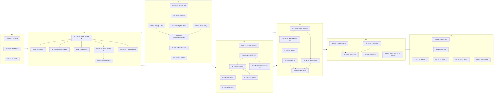

# 07. 구현 작업 프롬프트 (Fable 5 작성 · Sonnet/Opus 실행용)

> 프로젝트 코드네임: **WORLD TYPING** (런칭명 TypeTrip) / 문서 버전: v1.0 (2026-07-21) / 작성: Fable 5 (리드 아키텍트)
> 이 문서는 docs/00 §12.3의 운영 규칙을 구현한 실행 문서다. **각 작업 블록 하나가 Claude Code 세션 하나 = PR 하나**이며, 블록 전체를 그대로 복사해 Sonnet/Opus 세션에 붙여넣으면 실행된다.
> 하위 문서와 상충하는 내용을 발견하면 **docs/00 §11(확정 결정 표)이 항상 우선**한다. 각 프롬프트에는 해당 작업에 걸리는 §11 결정을 인라인으로 박아두었다.

---

## 0. 사용법 가이드

### 0.1 실행 절차 (사람 오퍼레이터용)

1. **순서대로 실행한다.** 작업 ID의 사전순(`WT-M0-01` → `WT-M6-06`)이 곧 의존성 위상 정렬이다. 병렬 실행이 허용되는 구간은 §0.5 의존성 그래프에 명시했다(예: M2와 M3은 M1 완료 후 병렬 가능).
2. 새 Claude Code 세션을 저장소 루트에서 연다. `/model`로 블록에 표기된 **권장 모델**을 선택한다.
3. **§0.4의 공통 프리앰블을 먼저 붙여넣고, 이어서 작업 블록 전체를 붙여넣는다.** 프리앰블은 저장소 전역 규칙이고 작업 블록은 그 작업의 계약이다.
4. 에이전트가 acceptance 명령을 로컬에서 실행해 그린임을 확인한 뒤 PR을 만든다(브랜치명 = 작업 ID 소문자, 예: `wt-m1-01`). PR 본문에 acceptance 실행 로그 요약을 포함시킨다.
5. CI 그린 + 리뷰 통과 후 머지. 마일스톤 경계(M0 끝, M1 끝, …)에서는 리드가 docs/00 §8의 해당 마일스톤 완료조건 전 항목을 통합 검증한다.
6. **작업 중 문서 간 충돌·미정의 사항 발견 시**: 에이전트는 코드에서 임의 해석하지 않고 작업을 멈춘 뒤, PR 코멘트로 docs/00 §11에 추가할 결정 행을 제안하고 리드 승인을 기다린다(프리앰블에 동일 지시 포함).

### 0.2 모델 라우팅 표

| 작업 성격 | 모델 | 근거 |
|---|---|---|
| 동시성·상태머신 (Durable Objects, alarm 다중화, WS 라이프사이클) | **Opus** | 단일 스레드 불변식·경합 조건 추론이 필요. 버그가 조용히 데이터를 오염시킴 |
| 보안·암호·안티치트 (HMAC 토큰, 검증 파이프라인, 레이트리밋 계층) | **Opus** | 공격 표면 추론. 한 줄 실수가 리더보드 전체 신뢰를 붕괴시킴 |
| 한글 IME 입력 파이프라인 (자모 판정, epoch 가드, 브라우저 이벤트 흡수) | **Opus** | 제품 성패 직결(docs/00 §9-R1). 이벤트 순서 비결정성에 대한 방어적 설계 필요 |
| 성능 계약이 걸린 렌더링 (지도 리렌더 0 계약, 명령형 프롬프트 렌더러) | **Opus** | "React 커밋 0회" 같은 계약을 아키텍처 수준에서 지켜야 함 |
| 크로스 패키지 계약 설계 (shared 타입/매처가 클라·서버 양쪽에 번들) | **Opus** | 계약 파손 시 전 패키지 파급 |
| wasm·저수준 (workers-og satori/resvg, CDP IME 재현) | **Opus** | 문서화 빈약 영역, 시행착오 추론 필요 |
| REST CRUD 라우트, 스키마 전사(문서에 DDL/타입 전문이 이미 존재) | **Sonnet** | 기계적 전사 + 검증. 스펙이 완결되어 있음 |
| UI 컴포넌트·페이지·스타일 (와이어프레임 존재) | **Sonnet** | 선언적 UI, 스펙 기반 조립 |
| 테스트 작성 (테스트 케이스 표가 문서에 존재) | **Sonnet** | 표 → 코드 전사 |
| 설정·CI·빌드 보일러플레이트 | **Sonnet** | 정형 작업 |
| i18n·모더레이션 데이터·정적 페이지 | **Sonnet** | 콘텐츠 작업 |

경계 사례 규칙: 하나의 작업에 두 성격이 섞이면 **상위(Opus) 기준**으로 배정했다. Sonnet 배정 작업이 진행 중 예상 밖의 설계 판단을 요구하면, 그 판단만 리드에게 에스컬레이션하고 나머지를 계속한다(모델 중도 교체보다 빠름).

### 0.3 각 작업 블록의 구조

모든 블록은 다음 8요소를 포함한다: **[작업 ID]** / **권장 모델과 이유** / **선행 작업(deps)** / **참고 문서(정확한 섹션 좌표)** / **목표** / **산출물(파일 경로, 생성·수정 구분)** / **구현 세부 지시** / **제약·금지** / **완료 조건(acceptance — 실행할 명령과 통과 기준)**.

### 0.4 공통 프리앰블 (모든 세션 첫 메시지에 이 블록을 먼저 붙여넣는다)

````text
[WORLD TYPING 공통 계약 — 이 세션의 모든 작업에 적용]

너는 WORLD TYPING(런칭명 TypeTrip) 모노레포의 구현 에이전트다. 아래 규칙은 이어서 주어질
작업 블록보다 하위이지만, 참조 문서(docs/01~06)보다는 상위다.

1. 권위 순서: docs/00 §11(확정 결정 표) > 이번 작업 블록 > 각 도메인 담당 문서(docs/01~06).
   담당 밖 문서가 타 영역을 언급한 내용은 참고 정보일 뿐이다(예: docs/04의 리더보드 스키마는
   폐기됨 — docs/06이 canonical, docs/00 §11-D9).
2. 충돌·미정의 발견 시: 코드에서 임의 해석하지 말고 작업을 멈추고, "발견한 충돌 / 제안하는
   결정 / 근거"를 정리해 보고하라. 리드 승인 전에는 해당 부분을 TODO 주석 없이 구현하지 말 것
   (그 부분을 제외한 나머지는 계속 진행).
3. 모노레포 좌표: docs/00 §6 트리가 유일한 경로 원천이다. 하위 문서의
   `packages/data/src/match.ts` 류 경로는 `packages/shared/src/country-matcher/`로,
   `apps/worker`는 `workers/api`로 치환해 읽는다(§11-D19). npm 스코프는 @wt/*.
4. 절대 금지:
   - packages/shared, packages/engine 에 React/DOM 의존 도입 (input-controller.ts만
     DOM 타입 허용 — eslint 규칙으로 강제되어 있음)
   - 매 키스트로크 단위로 변하는 값(입력 버퍼, 실시간 CPM, 콤보, 경과시간)을 React state /
     Zustand에 넣는 것 (docs/03 §4.5 불변식)
   - D1 마이그레이션 파일의 수정·삭제 (append-only)
   - 시크릿을 코드/wrangler.toml에 기재
   - 정답 매칭·점수 로직을 shared 밖에 중복 구현 (클라·서버는 반드시 같은 코드를 번들)
   - 런타임 외부 네트워크 의존 추가 (데이터 빌드는 npm 패키지 + 저장소 내 파일만)
5. 커밋·PR: 이 작업 블록 = PR 1개. acceptance 명령을 로컬에서 전부 실행해 통과를 확인한 뒤
   PR 본문에 결과를 요약하라. 커버리지 게이트: packages/shared·data·engine line 95%+,
   그 외 60%+.
6. 코드 스타일: TypeScript strict, 에러를 조용히 삼키지 말 것(빌드 파이프라인은 누락 시 throw),
   주석은 "왜"만. 파일 상단에 관할 문서 좌표를 주석으로 남겨라
   (예: // spec: docs/05 §5, docs/00 §11-D7).
7. 테스트 파일을 패키지의 src/ 밖(예: content/, test/)에 추가할 때는 루트 vitest.config.ts의
   해당 projects include에도 그 글롭을 추가하라 — 루트 `pnpm test`와 `--filter` 실행이 항상
   같은 테스트 집합을 돌아야 한다(거짓 그린 방지, M1 교훈).
````

### 0.5 의존성 그래프



- **병렬 허용**: M1 내부 B02·B03·B04·B07은 B01 이후 동시 진행 가능. M2의 C01~C03 트랙과 C04, C05는 상호 독립. M3-01~02는 M2와 병렬 가능(클라 연동 D06만 M2 완료 필요). M4-01과 M4-03은 protocol(B03) 기반으로 부분 병렬.

---

## 1. M0 — 스캐폴드

### WT-M0-01 · 모노레포 스캐폴드

````text
[작업 ID] WT-M0-01 — pnpm 모노레포 스캐폴드
[권장 모델] Sonnet — 정형 보일러플레이트. 설계 판단 없음.
[선행 작업] 없음 (저장소 최초 커밋)
[참고 문서] docs/00 §6(트리 전체·의존 방향 규칙), §5(스택 버전), docs/03 §1.1(프론트 스택), §9(경계 규칙)

[목표]
빈 모노레포가 typecheck/test/build를 통과하는 상태를 만든다. 이후 모든 작업의 지반.

[산출물 — 전부 생성]
- /pnpm-workspace.yaml            # apps/*, workers/*, packages/*, tooling/*, e2e
- /package.json                   # 루트 스크립트: build:data, typecheck, test, build, lint, e2e
- /tsconfig.base.json             # strict: true, moduleResolution bundler, paths 없음(workspace 참조)
- /.eslintrc.cjs                  # import/no-restricted-paths 경계 규칙 (아래 지시 4)
- /.gitignore /.npmrc(engine-strict) /.nvmrc(Node 22)
- /apps/web/{package.json, tsconfig.json, vite.config.ts, index.html, src/main.tsx, src/app/AppShell.tsx}
- /workers/api/{package.json, tsconfig.json, src/index.ts}   # 빈 껍데기(WT-M0-02에서 채움)
- /packages/{shared,data,engine,i18n,moderation}/{package.json, tsconfig.json, src/index.ts}
- /tooling/scripts/.gitkeep  /tooling/ops/.gitkeep  /tooling/ci/.gitkeep
- /e2e/package.json (playwright 의존만)
- 각 패키지 vitest 설정(vitest.workspace.ts 루트 1개로 통합)

[구현 세부 지시]
1. 패키지명: @wt/web, @wt/api, @wt/shared, @wt/data, @wt/engine, @wt/i18n, @wt/moderation.
2. 버전 고정: react ^18.3, typescript ^5, vite ^5, zustand ^4, tailwindcss ^3.4, zod ^3,
   hono ^4, vitest 최신, wrangler 최신. pnpm-lock.yaml 커밋.
3. apps/web은 "Hello WORLD TYPING" 한 줄을 렌더하는 최소 SPA + Tailwind 세팅
   (tailwind.config.ts에 screens { sm:'640px', lg:'1024px' }와 darkMode:
   ['selector','[data-theme="dark"]'] 미리 선언 — docs/03 §7.1, §8.1).
4. eslint import/no-restricted-paths:
   - packages/* → apps|workers 참조 금지
   - packages/shared, packages/engine 내 react|react-dom import 금지
     (engine의 input-controller.ts는 lib.dom 타입만 허용 — tsconfig lib 설정으로 처리)
   - apps/web/src/features/* 상호 직접 참조 금지 (stores/lib 경유)
5. 루트 스크립트가 pnpm -r 필터로 동작하는지 확인. build:data는 아직
   "echo 'not implemented'"로 두되 스크립트 키는 지금 만든다.

[제약/금지]
- 실제 게임 로직 코드 작성 금지. 이 작업은 뼈대만.
- CI 워크플로 작성 금지(WT-M0-03 소관).

[완료 조건 / acceptance]
- `pnpm install --frozen-lockfile=false && pnpm typecheck && pnpm test && pnpm build` 전부 성공
  (test는 각 패키지 더미 테스트 1개 이상으로 그린).
- `pnpm --filter @wt/web dev` 실행 시 localhost:5173에서 SPA 렌더.
- eslint 경계 규칙 위반을 고의로 만든 파일(packages/shared에서 react import)이
  `pnpm lint`에서 에러로 잡히는 것을 확인 후 해당 파일 삭제.
````

### WT-M0-02 · Worker 골격 + wrangler 환경

````text
[작업 ID] WT-M0-02 — workers/api Hono 골격 + wrangler.toml 3환경
[권장 모델] Sonnet — wrangler.toml 전문이 docs/04 §7에 존재. 전사 + 경로 치환.
[선행 작업] WT-M0-01
[참고 문서] docs/04 §1.2(토폴로지), §2.4(Hono 골격), §7(wrangler.toml 전문),
           docs/00 §7(환경/바인딩/시크릿 — D18, D19, D25 반영본), §11-D8(WS 경로 /ws/room/:code)

[목표]
단일 Worker가 정적 자산(SPA)과 /api/v1/health를 서빙하고 dev/staging/prod 3환경 설정을 갖춘다.

[산출물]
- 생성: workers/api/wrangler.toml
- 생성: workers/api/src/index.ts, src/routes/health.ts, src/env.ts (Env 인터페이스)
- 생성: workers/api/src/mw/security-headers.ts, src/mw/cors.ts
- 수정: workers/api/package.json (wrangler dev/deploy 스크립트)

[구현 세부 지시]
1. wrangler.toml은 docs/04 §7을 기반으로 하되 docs/00 §7로 오버라이드:
   - name = "typetrip" (env별 typetrip-staging / typetrip-prod)
   - [assets] directory="../../apps/web/dist", binding="ASSETS",
     not_found_handling="single-page-application",
     run_worker_first = ["/api/*", "/ws/*", "/r/*", "/og/*"]   # docs/00 §7.2
   - 바인딩: DB(D1 wt-main-{env}), KV(단일 네임스페이스 wt-kv-{env}),
     BUCKET(R2 wt-{env}), EVENTS(Queue wt-events-{env}), AE(analytics_engine wt_telemetry),
     MATCH_ROOM/MATCHMAKER(DO, new_sqlite_classes — 클래스는 빈 스텁으로 export),
     RL(rate limiting binding — 주석으로 자리만)
   - crons: "0 15 * * *", "*/1 * * * *", "30 16 * * *"  # docs/00 §7.4 (1분 refresher — §11-D24)
   - [observability] enabled = true
   - database_id 등 실 ID는 "<placeholder>"로 두고 README 주석으로 발급 절차 기재.
2. src/env.ts: docs/04 §2.4의 Env를 기반으로 하되 SCORE_QUEUE→EVENTS, LOBBY→MATCHMAKER로
   개명(§11-D8, D25). 시크릿 키 이름: SESSION_HMAC_SECRET, RUN_HMAC_SECRET, DAILY_SALT,
   SENTRY_DSN, TURNSTILE_SECRET.
3. src/index.ts: Hono app + `GET /api/v1/health` (D1 `SELECT 1` + KV read 시도, 바인딩 부재 시
   해당 체크 skip 플래그로 응답 { ok, checks: {...} }) + `app.all('*', ASSETS.fetch)` 방어 라우트
   + export default { fetch, queue: 스텁, scheduled: 스텁 } + DO 클래스 2개 빈 스텁 export.
4. 미들웨어: security-headers(docs/04 §10.1의 CSP/헤더 — connect-src의 도메인은
   환경변수화하지 말고 'self' + wss: 'self' 원칙으로), cors(ENVIRONMENT==='dev'일 때
   localhost:5173만 반사, staging 도메인 허용 — docs/04 §7 CORS 항).

[제약/금지]
- 게임 API 라우트 작성 금지(M3 소관). DO 본문 작성 금지(M4 소관).
- 시크릿 값을 어디에도 쓰지 말 것. wrangler secret put 명령만 README에.

[완료 조건 / acceptance]
- `pnpm --filter @wt/web build && pnpm --filter @wt/api exec wrangler dev` 실행 후:
  GET localhost:8787/ → SPA HTML, GET /api/v1/health → 200 JSON,
  GET /api/v1/unknown → 404 JSON(에러 포맷 docs/04 §2.1), GET /some/spa/route → index.html.
- `pnpm typecheck` 그린. wrangler.toml이 `wrangler deploy --dry-run --env staging` 파싱 통과.
````

### WT-M0-03 · CI/CD 파이프라인

````text
[작업 ID] WT-M0-03 — GitHub Actions CI/CD (preview → staging → prod 게이트)
[권장 모델] Sonnet — docs/04 §8.1에 요지 YAML 존재. 전사 + 보강.
[선행 작업] WT-M0-02
[참고 문서] docs/04 §8.1(파이프라인), docs/00 §7.1(배포 순서 불변식), §10(테스트 게이트)

[목표]
PR마다 CI + preview 배포, main 머지 시 staging 자동 배포, Release 발행 시 prod 수동 게이트 배포.

[산출물 — 생성]
- .github/workflows/ci.yml       # PR·push: install → build:data(diff 검사) → typecheck → lint → test → build
- .github/workflows/deploy.yml   # preview(versions upload) / staging / prod(environment: production)
- .github/workflows/backup.yml   # schedule cron(KST 04:00): d1 export → R2 (지금은 스텝 골격 + 조건부 skip)
- .github/pull_request_template.md  # docs/00 §10.2 PR DoD 체크리스트

[구현 세부 지시]
1. ci.yml에 `pnpm build:data && git diff --exit-code apps/web/public/data` 스텝 포함하되,
   build:data 미구현 상태를 고려해 `if: hashFiles('tooling/scripts/build-data.ts') != ''` 가드.
2. deploy 순서 불변식 코드화: staging/prod 잡은 반드시
   `wrangler d1 migrations apply ... --remote` → `wrangler deploy` 순서. 마이그레이션 실패 시
   deploy 스텝 미실행.
3. preview 잡: cloudflare/wrangler-action으로 `wrangler versions upload --env staging`,
   출력 URL을 PR 코멘트로 게시.
4. GH Secrets 요구 목록(CLOUDFLARE_API_TOKEN 최소 권한 스코프 포함)을
   .github/workflows/README.md로 문서화.
5. concurrency 그룹으로 같은 브랜치 중복 실행 취소. Node 22 + pnpm 캐시.

[제약/금지]
- prod 잡에 자동 트리거 금지 — release published + environment protection만.
- 시크릿 값 하드코딩 금지.

[완료 조건 / acceptance]
- PR을 하나 만들어 ci.yml 전 스텝 그린 + preview 코멘트 게시 확인.
- main 머지 시 staging deploy 잡이 실행됨(Cloudflare 계정 미연결 시 dry-run 모드로 검증하고
  README에 활성화 절차 기재).
- `actionlint` (없으면 npx로) 통과.
````

---

## 2. M1 — 데이터 파이프라인 + shared 코어

### WT-M1-01 · @wt/shared 타입 + country-matcher (한글 자모 판정기)

````text
[작업 ID] WT-M1-01 — packages/shared: types + country-matcher(normalize/hangul/match)
[권장 모델] Opus — 제품 최대 리스크(한글 IME 판정, docs/00 §9-R1)의 순수 로직 절반.
           자모 분해 정책의 미묘한 예외(쌍자음·ㅐㅔㅒㅖ 미분해)와 EXACT/PREFIX 의미론이
           클라·서버 판정 동일성의 뿌리다.
[선행 작업] WT-M0-01
[참고 문서] docs/02 §3 전체(상태 모델·정규화·자모 분해·매칭 본체·테스트 표 — 코드 전문 수록),
           docs/03 §2.6(matchInputDetail 확장 — 코드 전문 수록),
           docs/00 §11-D19(경로: packages/shared/src/country-matcher/), §11-D4(영어 공백 제거 확정)

[목표]
클라·서버가 동일 번들하는 정답 판정 엔진을 완성한다. 이 코드가 게임 전체의 "진실 함수"다.

[산출물 — 생성]
- packages/shared/src/types/country.ts     # docs/02 §1의 Country/CountriesDataset/Continent/DifficultyTier
- packages/shared/src/types/game.ts        # GameMode('continent'|'tier'|'worldtour'|'daily'|'race'),
                                           # RunStats(docs/01 §6.1), MatchState, verdict 등 공용 타입
- packages/shared/src/country-matcher/normalize.ts  # normalizeEn/normalizeKo — docs/02 §3.2 전문 그대로
- packages/shared/src/country-matcher/hangul.ts     # CHO/JUNG/JONG/COMPOUND/toJamoSeq — docs/02 §3.3 전문 그대로
- packages/shared/src/country-matcher/match.ts      # MatchState, CompiledTarget, compileTargets,
                                                    # matchInput(docs/02 §3.3) + matchInputDetail(docs/03 §2.6)
                                                    # + commonPrefixLen 유틸
- packages/shared/src/index.ts             # 배럴 export
- packages/shared/src/country-matcher/{normalize,hangul,match}.test.ts

[구현 세부 지시]
1. docs/02 §3.2·§3.3의 코드 전문을 그대로 옮기되(개행·테이블 포함), 파일 상단에
   "// spec: docs/02 §3 — 이 파일 수정 시 서버 검증도 함께 변한다. 임의 수정 금지" 주석.
2. matchInputDetail은 docs/03 §2.6 전문. targets가 빈 배열이면 throw(계약 위반 조기 발견).
3. 테스트 (vitest):
   a. docs/02 §3.3 테스트 표 7행 전부 — 입력 시퀀스별 기대 상태(P/EXACT/MISS) 검증.
   b. 복합 중성 분해: toJamoSeq('과') === 'ㄱㅗㅏ', toJamoSeq('의') === 'ㅇㅡㅣ',
      복합 종성: toJamoSeq('닭') === 'ㄷㅏㄹㄱ', 쌍자음 미분해: toJamoSeq('까') === 'ㄲㅏ',
      ㅐㅔ 미분해: toJamoSeq('베') === 'ㅂㅔ'.
   c. matchInputDetail: bestTarget 선택(공통 prefix 최장), matchedLen/inputLen,
      MISS 상태에서 백스페이스로 PREFIX 복귀 시나리오.
   d. es-hangul 교차 오라클: devDependency로 es-hangul 설치,
      한글 문자열 100개(무작위 생성 음절 포함)에 대해 toJamoSeq와 es-hangul disassemble을
      비교하되 정책 차이 항목(쌍자음/ㅐㅔㅒㅖ/복합자모 표현)을 정규화 필터로 흡수한 뒤 일치 검증.
      (198개국 nameKo 전수 오라클은 WT-M1-05에서 데이터 생성 후 추가)
   e. normalizeEn("Côte d'Ivoire") === "cotedivoire", normalizeKo("파푸아 뉴기니") === "파푸아뉴기니".

[제약/금지]
- es-hangul을 런타임 의존으로 넣지 말 것 — devDependency(테스트 오라클) 전용 (docs/03 §1.2).
- 편집거리/퍼지 매칭 도입 금지 (docs/01 §12.1 — 등재된 별칭만 인정).
- React/DOM import 금지. 외부 런타임 의존성 0.

[완료 조건 / acceptance]
- `pnpm --filter @wt/shared test` 그린, line coverage ≥ 95%.
- `pnpm typecheck && pnpm lint` 그린.
- 테스트 파일에 docs/02 §3.3 표의 7케이스가 표의 행 순서대로 존재(리뷰 체크 항목).
````

### WT-M1-02 · @wt/shared scoring

````text
[작업 ID] WT-M1-02 — 점수·등급·제한시간 순수 함수
[권장 모델] Sonnet — 수식 전문이 docs/01 §6.2·§6.3·§7.2에 존재. 전사 + 골든 벡터 검증.
[선행 작업] WT-M1-01
[참고 문서] docs/01 §6.1(RunStats)·§6.2(FinalScore 공식)·§6.3(PI/등급 컷)·§7.2(제한시간 수식),
           docs/00 §11-D4(공백 타수 제거 확정 — CPM 정의는 자모/문자 계상 기준)

[목표]
FinalScore/PI/등급/서바이벌 제한시간을 클라·서버 공용 순수 함수로 확정한다.

[산출물 — 생성]
- packages/shared/src/scoring/score.ts      # computeScore(stats, countries, lang, cfg): RunResult
- packages/shared/src/scoring/grade.ts      # PI 계산 + 등급 컷(cfg 주입: {S:450,A:340,B:230,C:120} 기본값)
- packages/shared/src/scoring/time-limit.ts # timeLimitMs(country, indexInRun, lang, cfg) — docs/01 §7.2
- packages/shared/src/scoring/keystrokes.ts # 국가별 필요 타수 L_i: ko=toJamoSeq(normalizeKo(nameKo)).length,
                                            # en=normalizeEn(nameEn).length (공백 제거 후 — §11-D4)
- packages/shared/src/scoring/*.test.ts + tooling/ci/golden-vectors.json

[구현 세부 지시]
1. score.ts: BaseScore=Σ(60+8·L_i)·w_i (w_i=1+0.15(tier−1)), AccFactor=ACC²,
   ComboFactor=1+0.01·min(maxCombo,40), TimeBonus=max(0,T_par−elapsedSec)·15
   (T_par=Σ_all L_i/3.5, **완주 시에만 지급**), FinalScore=round(Base·Acc·Combo+TimeBonus).
   CPM=floor(correctKeystrokes/(elapsedMs/60000)), ACC=correct/total, PI=floor(CPM·ACC²).
2. 등급: PI 컷 + **미완주 시 상한 B** (docs/01 §6.3). cfg는 GradeConfig 파라미터로 주입
   (KV config:client의 grades가 런타임 원천 — 하드코딩된 기본값은 폴백).
3. time-limit: clamp(3.0, 1.5+L_i×0.40×tierRelax, 15.0)s, tierRelax=1.30−0.075(tier−1),
   **런의 첫 국가는 ×2**. cfg.timeLimit 계수 주입형으로.
4. 골든 벡터: 스프레드시트 대신 수기 계산으로 5세트를 만들어 golden-vectors.json에 커밋.
   각 세트는 {입력 RunStats+국가 목록, 기대 score/pi/grade}를 담고 계산 근거를 주석 필드로.
   반드시 포함: (a) 완주 S등급, (b) ACC 90% 케이스(AccFactor 0.81 확인),
   (c) 미완주 — TimeBonus 0 + 상한 B, (d) 스킵 포함(스킵 국가 타수 오타 가산),
   (e) 등급 경계값 PI 449→A / PI 450→S.

[제약/금지]
- Math 부동소수 누적 오차 방지: 합산은 정수 타수 기반으로 먼저, 나눗셈은 마지막에.
- keystrokes 계산에 WT-M1-01의 normalize/toJamoSeq만 사용(자체 재구현 금지).

[완료 조건 / acceptance]
- `pnpm --filter @wt/shared test` 그린(골든 5세트 + 경계값), coverage 95%+.
- time-limit 테스트: "미국"(L=5,T1) → 4.10s(±0.01), "상투메프린시페"(L=16,T5) → 7.90s
  (docs/00 §11-D27 정정 수치), 첫 국가 ×2 확인.
````

### WT-M1-03 · @wt/shared protocol (메시지 + 시딩)

````text
[작업 ID] WT-M1-03 — WS 메시지 타입·zod 스키마·결정적 시딩
[권장 모델] Sonnet — docs/05 §4.2에 타입 전문, §3에 시딩 코드 전문 존재. 전사 + zod 병기.
[선행 작업] WT-M1-01
[참고 문서] docs/05 §3(seeding 전문)·§4(메시지 카탈로그 전문)·부록A(constants),
           docs/00 §11-D7(05 스키마가 유일 원천 — 03·04의 메시지 정의 폐기),
           §11-D13(mulberry32 확정, 데일리 셔플도 공유), §11-D23(v1 UI는 race-mixed만)

[목표]
클라·서버가 공유하는 프로토콜 단일 원천. 시딩은 데일리/티어/멀티가 같은 함수를 쓴다.

[산출물 — 생성]
- packages/shared/src/protocol/messages.ts   # docs/05 §4.2 전문(C2S/S2C 전 타입)
- packages/shared/src/protocol/schemas.ts    # 위 타입과 1:1 zod 스키마(서버 파싱용, .strict())
- packages/shared/src/protocol/seeding.ts    # mulberry32/rngFromSeedHex/seededShuffle/buildRaceSet 전문
- packages/shared/src/protocol/constants.ts  # docs/05 부록A: TICK_MS=250, PROGRESS_THROTTLE_MS=100,
                                             # GRACE_MS=15000, HARDCAP_MS=180000, PER_COUNTRY_LIMIT_MS=10000,
                                             # REACTION_FLOOR_MS=250, MAX_KPS={ko:14,en:18},
                                             # REMATCH_VOTE_MS=30000, AUTOSTART_WAIT_MS=15000, BOT_OFFER_MS=60000
- packages/shared/src/protocol/*.test.ts

[구현 세부 지시]
1. messages.ts는 docs/05 §4.2를 자구 그대로. import 경로만 @wt/shared 내부로 조정.
2. schemas.ts: 각 ClientMessage 타입에 대응하는 zod 스키마 + parseClientMessage(raw: string)
   디스크리미네이티드 유니온 파서. 문자열 길이 상한(chat 120자, nickname 16자, input 64자) 포함.
   z.infer 결과가 messages.ts 타입과 일치함을 타입 레벨로 검증
   (type Assert<A,B> 유틸로 컴파일 타임 체크).
3. seeding.ts: docs/05 §3 전문. buildRaceSet의 countries 파라미터는 un195 필터 완료 전제
   (주석 명시).
4. 테스트 (docs/05 §3 vitest 필수 케이스): ①동일 seed 1,000회 반복 동일 배열,
   ②상이 seed 불일치 확인, ③race-mixed 15개·중복 없음·티어 분포 6/5/4,
   ④south-america 12개 반환, ⑤zod 파싱 왕복(직렬화→파싱→deepEqual),
   ⑥잘못된 메시지(초과 필드/타입 오류)가 .strict()에서 reject.

[제약/금지]
- xoshiro 등 다른 PRNG 도입 금지(§11-D13). Math.random 사용 금지(시딩 경로 전체).
- 03/04 문서의 commit+inputHash 스키마를 참조하지 말 것 — 폐기됨(§11-D7).

[완료 조건 / acceptance]
- `pnpm --filter @wt/shared test` 그린, coverage 95%+.
- buildRaceSet('0'.repeat(32), 'race-mixed', null, fixtureCountries) 스냅샷 테스트 커밋
  (회귀 시 세트 재현성 파손을 즉시 감지).
````

### WT-M1-04 · @wt/shared auth (HMAC 토큰)

````text
[작업 ID] WT-M1-04 — wt1 세션 토큰 / runToken / WS 티켓 서명·검증
[권장 모델] Opus — 암호 프리미티브 사용. 서명 페이로드 경계·타이밍 세이프 비교·키 용도 격리 등
           보안 판단이 필요.
[선행 작업] WT-M1-01
[참고 문서] docs/04 §5.1~5.3(세션·티켓 전문), §6.1(runToken 페이로드),
           docs/00 §11-D10(device_hash 파생 저장), §11-D11(30일 rolling 확정)

[목표]
Workers(WebCrypto)와 테스트(Node)에서 동작하는 stateless HMAC 토큰 모듈.

[산출물 — 생성]
- packages/shared/src/auth/token.ts      # signToken/verifyToken — "wt1.<payloadB64url>.<sigB64url>"
- packages/shared/src/auth/derive.ts     # derivePlayerId(secret, deviceId): base58(HMAC("pid:"+deviceId))[0:12]
                                         # deriveDeviceHash(secret, deviceId): DB 저장용 (§11-D10)
- packages/shared/src/auth/base64url.ts, base58.ts (의존성 0 구현)
- packages/shared/src/auth/*.test.ts

[구현 세부 지시]
1. token.ts: 제네릭 페이로드 <P extends { exp: number }>. sign은
   HMAC-SHA256(secret, "wt1." + payloadB64) — docs/04 §5.2 포맷 그대로.
   verify는 ①포맷 파싱 ②crypto.subtle.verify(상수 시간) ③exp 검사 ④zod 스키마(호출측 주입) 검사.
   **구/신 2키 병행 검증** 지원: verifyToken(token, [currentSecret, prevSecret?]) —
   로테이션 7일 병행(docs/04 §7).
2. 페이로드 3종 타입 정의: SessionPayload {v:1,pid,iat,exp}(30일),
   RunTokenPayload {rid,pid,mode,modeKey,lang,platform,setHash,seed,startTs,exp}(+30분),
   WsTicketPayload {v:1,pid,room,iat,exp}(+60초).
3. WebCrypto만 사용(Node 22의 globalThis.crypto로 테스트 호환). Buffer 사용 금지.
4. 테스트: 서명 왕복, 변조(페이로드 1바이트 플립) 거부, exp 만료 거부, 2키 병행(구키 서명이
   신키+구키 배열로 통과), base58 왕복, derivePlayerId 결정성(같은 입력 → 같은 12자).

[제약/금지]
- JWT 라이브러리 도입 금지(의존성 0 원칙). 시크릿을 테스트 픽스처 외 어디에도 상수로 두지 말 것.
- 세션 시크릿과 run/티켓 시크릿은 항상 별도 파라미터(키 용도 격리 — docs/04 §7).

[완료 조건 / acceptance]
- `pnpm --filter @wt/shared test` 그린, coverage 95%+.
- 토큰 생성→검증 1,000회 루프의 user CPU < 250ms(성능 스모크, 세션 검증이 병목이 아님을 확인
  — §11-D29: 병렬 vitest 워커에서 벽시계는 비결정이므로 process.cpuUsage().user 기준).
````

### WT-M1-05 · 국가 데이터 빌드 파이프라인

````text
[작업 ID] WT-M1-05 — packages/data overrides + build-data.ts (02 §10 Step 1~8)
[권장 모델] Opus — 8단계 파이프라인의 검증 로직(전역 유일성·자모 유일성·티어 분포·결정적 출력)이
           콘텐츠 정합성 전체를 지킨다. 소스 데이터의 예외(코소보 ccn3 부재 등) 처리 판단 필요.
[선행 작업] WT-M1-01
[참고 문서] docs/02 §1(스키마)·§2(소스/라이선스·한글 확보 절차)·§3.4(별칭 규칙+필수 목록)·
           §4(티어 산식·경계·목표 분포)·§5.1(대륙 배정 규칙)·§7(mapFeatureId 바인딩)·
           §8(flagEmoji 산술)·§10(파이프라인 8단계)·§11(샘플 10개),
           docs/00 §11-D1(un195 확정), §11-D22(nameKo canonical="대한민국")

[목표]
결정적(deterministic) 데이터 빌드: world-countries + overrides → countries.json(198 레코드) +
서버 상수 + 지도 복사 + manifest 해시. 실패는 조용히 넘기지 않고 throw.

[산출물]
- 생성: packages/data/overrides/{names.ko.json, aliases.json, capitals.ko.json,
        recognition.json, tiers.json, content-sets.json, population.json}
- 생성: tooling/scripts/build-data.ts (+ tooling/scripts/seed-capitals-ko.ts — 1회성, 실행은 선택)
- 생성: packages/data/src/schema.ts (zod), packages/data/src/index.ts
- 생성(빌드 산출, 커밋): apps/web/public/data/{countries.json, countries-110m.json, manifest.json},
        packages/data/src/generated/countries.ts
- 생성: packages/data/src/*.test.ts
- 수정: 루트 package.json build:data → `tsx tooling/scripts/build-data.ts`

[구현 세부 지시]
1. npm 의존: world-countries@^5, world-atlas@2.0.2 (packages/data devDependencies).
   빌드는 정적 import만 — 네트워크 0.
2. overrides 초기 데이터:
   - names.ko.json: docs/02 §2-1의 12개 항목 그대로 + 빌드 로그에서 translations.kor 부재국이
     발견되면 추가(부재 시 throw이므로 빌드가 알려줌).
   - aliases.json: docs/02 §3.4 필수 표 전량(KR~SA, NZ의 "신서란"은 미등재) + docs/02 §11 샘플의
     별칭(FR "불란서", CI "아이보리코스트" 등) 일치.
   - capitals.ko.json: seed-capitals-ko.ts(Wikidata SPARQL, 1회성)를 작성하되 CI에서 실행 금지.
     실행이 어려우면 198개국 수도 한국어명을 지식 기반으로 직접 채워 커밋하고
     복수 수도 7개국(ZA/BO/LK/MY/TZ/CI/BI)은 docs/02 §2-2의 확정값 사용.
   - recognition.json: docs/02 §4.1 규칙(G20+40/OECD+20/직항+15/월드컵+15/올림픽+10)으로
     시드 생성하는 헬퍼를 build-data 안에 두고, 산출을 커밋(최종 원천은 override 파일).
   - tiers.json: 빌드 1회 후 분포(목표 T1=20,T2=30,T3=45,T4=55,T5=48 ±5)를 보고 이탈 국가를
     override. docs/02 §4.3 표 30개국의 최종 티어와 일치해야 함.
   - content-sets.json: un195 리스트(193+VA+PS) + extended(TW,XK,EH).
3. 파이프라인은 docs/02 §10 Step 1~8 그대로. 특히:
   - Step 5: ccn3 3자리 문자열 → topojson id 매칭, 코소보는 properties.name==='Kosovo' 수동
     바인딩, 매칭/서클폴백 통계 stdout.
   - Step 7: (a) zod 전체 파싱 (b) acceptedInputs 언어별 전역 유일성("콩고"는 CG에만)
     (c) ko 자모 시퀀스 유일성 (d) routes.ts 검증(WT-M1-06 전이면 파일 부재 시 skip+경고)
     (e) i18n 키 동일성(동일하게 조건부).
   - Step 8: JSON.stringify 공백 없음·id 오름차순, generated/countries.ts는
     `export const COUNTRIES = [...] as const satisfies Country[]`,
     manifest.json에 SHA-256.
4. 대륙 배정: docs/02 §5.1 규칙 함수(RU→europe, TR→asia, CY→europe, GE/AM/AZ→asia,
   TL→asia, EH→africa). 결과 카운트가 asia 47/europe 45/africa 54/NA 23/SA 12/OC 14
   (un195 기준)와 다르면 throw.
5. 테스트: docs/02 §11 샘플 10개 레코드가 산출물과 필드 단위 일치(스냅샷 아닌 명시 비교),
   두 번 연속 빌드 결과 바이트 동일(결정성), es-hangul 교차 오라클을 198개국 nameKo 전수로 확장
   (WT-M1-01 d항의 완성).

[제약/금지]
- REST Countries API 등 런타임/빌드타임 네트워크 호출 금지(Wikidata 시드 스크립트는 별도,
  CI 밖 수동 실행 전용).
- 누락 데이터를 기본값으로 조용히 채우지 말 것 — throw가 계약이다.
- countries.json에 acceptedInputs 이외의 파생 필드 임의 추가 금지(스키마가 곧 API).

[완료 조건 / acceptance]
- `pnpm build:data` 성공, stdout에 mapFeatureId 매칭 통계·티어 분포 표 출력.
- `pnpm build:data && git diff --exit-code apps/web/public/data packages/data/src/generated` 클린.
- `pnpm --filter @wt/data test` 그린(샘플 10개 일치·결정성·전역 유일성·198 전수 오라클),
  coverage 95%+.
- countries.json 레코드 수 198, un195 필터 시 195.
````

### WT-M1-06 · 노선/루트 콘텐츠

````text
[작업 ID] WT-M1-06 — 대륙 6노선 + 세계일주 50 루트 확정 커밋
[권장 모델] Sonnet — 아시아·유럽·세계일주는 docs/02에 전문 존재. 나머지 4개 대륙은
           §5.5 방법론대로 기계적 확장.
[선행 작업] WT-M1-05
[참고 문서] docs/02 §5.2(순서 규칙)·§5.3(아시아 47 전문)·§5.4(유럽 45 전문)·
           §5.5(나머지 방법론+앞 12개)·§6(세계일주 50 전문),
           docs/00 §11-D2(50개국 확정), §11-D3(시작점 KR·PT·EG·CA·CO·AU 확정)

[목표]
런타임 계산 없는 고정 순서 콘텐츠를 id 배열 상수로 확정한다. 순서가 곧 콘텐츠다.

[산출물]
- 생성: packages/data/content/routes.ts
  # ROUTE_ASIA(47), ROUTE_EUROPE(45), ROUTE_AFRICA(54), ROUTE_NORTH_AMERICA(23),
  # ROUTE_SOUTH_AMERICA(12), ROUTE_OCEANIA(14), ROUTE_WORLD_TOUR(50),
  # CONTINENT_ROUTES: Record<Continent, CountryId[]>
- 생성: packages/data/content/routes.test.ts
- 수정: tooling/scripts/build-data.ts — Step 7-(d) routes 검증 활성화

[구현 세부 지시]
1. ROUTE_ASIA/EUROPE/WORLD_TOUR는 docs/02 §5.3·§5.4·§6 전문 그대로 커밋.
2. AFRICA/NORTH_AMERICA/SOUTH_AMERICA/OCEANIA는 §5.5의 방법론(스네이크 경로, 섬나라는
   최근접 본토 뒤 삽입)과 명시된 앞 구간을 지키며 완성. 각 배열 옆에 구간별 주석
   (// 북아프리카 서진, // 카리브 서→동 등).
3. 검증(테스트 + 빌드 Step 7-d 동일 로직): 각 노선이 ①해당 대륙 un195 국가와 정확히 집합 일치
   ②중복 없음 ③명시된 시작점(KR/PT/EG/CA/CO/AU) ④세계일주 50개·중복 없음·6대륙 전부 포함·
   첫 5개 = KR,JP,US,CA,MX.
4. 지리적 자연스러움 리뷰용으로, 인접쌍 수도 간 거리(latlng haversine)의 합과 최장 점프 상위
   5개를 테스트 로그로 출력(assert 아님 — 리뷰 참고).

[제약/금지]
- 런타임 nearest-neighbor 계산 코드 삽입 금지 — 배열이 원천(docs/01 §3.1 규칙 3).
- extended(TW/XK/EH)를 어떤 노선에도 넣지 말 것(§11-D1).

[완료 조건 / acceptance]
- `pnpm --filter @wt/data test && pnpm build:data` 그린(routes 검증 포함).
- ROUTE_WORLD_TOUR.length === 50, 대륙 노선 길이 47/45/54/23/12/14.
````

### WT-M1-07 · i18n 카탈로그 + 모더레이션

````text
[작업 ID] WT-M1-07 — packages/i18n(ko/en) + packages/moderation(금칙어 필터)
[권장 모델] Sonnet — 카탈로그 규약과 필터 알고리즘이 문서에 확정되어 있음. 콘텐츠 작업.
[선행 작업] WT-M1-01
[참고 문서] docs/02 §9(카탈로그 규칙·초기 키), docs/06 §4.2(닉네임 규칙·NICK_RE·필터 파이프라인),
           docs/04 §10.2(예약어), docs/00 §11-D14(2~12자/30일 2회), §11-D20(i18next 확정)

[목표]
UI 문자열 단일 원천(ko/en 키 집합 동일) + 닉네임·채팅 공용 금칙어 필터.

[산출물 — 생성]
- packages/i18n/{ko.json, en.json}         # docs/02 §9 초기 키 전량 + S1~S13 화면에 필요한 키 확장
- packages/i18n/src/index.ts               # 타입 안전 키 유니온 export (json에서 생성)
- packages/i18n/src/keys.test.ts           # ko/en 키 집합 동일성
- packages/moderation/{badwords.ko.txt, badwords.en.txt, allowwords.en.txt}
- packages/moderation/src/filter.ts        # isNicknameAllowed(name), filterChat(text)
- packages/moderation/src/nickname.ts      # NICK_RE(docs/06 §4.2 전문) + normalizeNickname
- packages/moderation/src/*.test.ts

[구현 세부 지시]
1. i18n 키 확장: docs/01 §10 와이어프레임의 모든 사용자 노출 문자열을 키로 승격
   (게임 노출명은 "TypeTrip" — §11-D18. 예: app.title = "TypeTrip"). 키 규약은
   docs/02 §9(영역.의미[.상세], 최대 3단계).
2. 금칙어: ko ~600항목/en ~400항목을 공개 리스트(LDNOOBW 등) 기반으로 큐레이션해 커밋.
   민감 단어가 포함되므로 파일 상단에 용도 주석.
3. filter.ts 파이프라인(docs/06 §4.2): lowercase → leet 치환(1→i,0→o,3→e,5→s,@→a,$→s) →
   구분자(_,-,공백) 제거 → 한글은 @wt/shared toJamoSeq로 자모 분해 후 자모열 부분 문자열 매칭 →
   en allowlist 예외 → 예약어 프리픽스(admin/mod/staff/system/운영자/관리자/worldtyping/
   typetrip/official/GUEST_) 차단.
4. 테스트: "ㅅ1ㅂ", "시-발" 차단 / "assassin" 허용(allowlist) / NICK_RE 경계
   (1자 거부, 12자 허용, 13자 거부, "_kim" 거부, "kim__lee" 거부, "김치워리어" 허용,
   숫자만 "1234" 거부).

[제약/금지]
- i18n 카탈로그에 국가명 수록 금지(countries.json이 원천 — docs/02 §9).
- 필터에서 toJamoSeq 재구현 금지 — @wt/shared import.

[완료 조건 / acceptance]
- `pnpm --filter @wt/i18n test && pnpm --filter @wt/moderation test` 그린.
- ko.json/en.json 키 diff 0(테스트로 강제 — 이 테스트가 곧 CI 게이트).
````

---

## 3. M2 — 싱글 3모드 + 타이핑 엔진

### WT-M2-01 · TypingInputController + KeystrokeAccountant

````text
[작업 ID] WT-M2-01 — IME 입력 컨트롤러(epoch 가드 플러시) + 타수 계상기
[권장 모델] Opus — 제품 성패를 가르는 최고 리스크 코드(docs/00 §9-R1). 브라우저별 IME 이벤트
           순서 비결정성에 대한 방어 설계, epoch 불변식, blur/focus 동기성 등 동시성급 추론 필요.
[선행 작업] WT-M1-01, WT-M1-02
[참고 문서] docs/03 §2 전체(특히 §2.3 value-snapshot 원칙, §2.4 accountant 전문,
           §2.5 플러시 프로토콜, §2.7 컨트롤러 의사코드 전문, §2.9 영문 경로, §2.10 QA 매트릭스)

[목표]
어떤 브라우저·IME 조합에서도 조합 중 글자를 오타로 판정하지 않고, 정답 완성 키스트로크에서
지연 없이 확정하며, 확정 직후 첫 타를 삼키지 않는 입력 계층을 완성한다.

[산출물 — 생성]
- packages/engine/src/accountant.ts        # docs/03 §2.4 전문 (KeystrokeDelta/KeystrokeAccountant)
- packages/engine/src/input-controller.ts  # docs/03 §2.7 전문 (TypingEvent/TypingInputController)
- packages/engine/src/index.ts
- packages/engine/src/accountant.test.ts
- packages/engine/src/input-controller.test.ts   # jsdom + 합성 이벤트

[구현 세부 지시]
1. docs/03 §2.7 의사코드를 완성 코드로. 불변식을 코드 주석으로 박아라:
   "flushIme()만 epoch를 증가시킨다. 모든 비동기 연속은 진입 시 cap=epoch 캡처,
   실행 시 cap!==epoch면 no-op."
2. 판정은 항상 input.value 전체 스냅샷(compositionupdate.data 사용 금지 — §2.3).
   isComposing = event.isComposing || controllerComposing.
3. flushIme: 조합 중이면 blur → value='' → **동기** focus (setTimeout 금지 — iOS 계약).
   blur가 유발한 유령 compositionend/input은 epoch 가드로 폐기.
4. beforeinput에서 insertFromPaste|insertReplacementText|insertFromDrop → preventDefault +
   bulkInsert 이벤트. accountant에서 한 스냅샷 added>8도 bulkInsert.
5. 버퍼 상한: inputLen > bestTarget.key.length+8 초과분은 계상 제외(§2.6).
6. ko 모드 라틴 혼입: 연속 라틴 3자 이상에서 최초 1회 latinInKoMode 신호(TypingEvent에 추가).
7. 테스트 (docs/03 §2.10 매트릭스 중 vitest 대상 #1,2,7,10,11,12 + epoch 가드):
   - 스냅샷 시퀀스 ["ㄱ","가","간","가나"] → delta added [1,1,1,1], addedError 전부 0, 마지막 EXACT.
   - "과테말라"의 "고" 시점 PREFIX.
   - 백스페이스 "간"→"가"→"ㄱ" → removed 계상, 오타 0.
   - EXACT 후 지연 도착 유령 compositionend가 무시됨(가짜 이벤트를 microtask 뒤에 주입해 검증).
   - blur/focus 호출 순서 spy: blur → value='' → focus 순서 + 동기성(같은 tick).
   - 버퍼 +8 상한, 별칭 "한국"(캐노니컬 "대한민국") EXACT + 실입력 6타.
   - 붙여넣기 → bulkInsert emit + 기본동작 차단.

[제약/금지]
- React import 금지(engine 전체). DOM 타입은 이 파일(input-controller)만 허용.
- keydown 기반 타수 카운트 금지(keyCode 229 — §2.4 근거).
- 어떤 키도 preventDefault 하지 말 것(Escape 제외) — IME 파이프라인 보존.
- MISS 시 입력 강제 삭제/조합 강제 중단 금지(docs/02 §3.1).

[완료 조건 / acceptance]
- `pnpm --filter @wt/engine test` 그린, coverage 95%+.
- input-controller.test.ts에 §2.10 매트릭스 케이스 번호가 주석으로 매핑되어 있을 것
  (#1,#2,#4(단위 수준),#7,#8,#10,#11,#12 — #3~6은 WT-M2-08 E2E/실기기 소관 명시).
````

### WT-M2-02 · GameSessionEngine FSM + 모드 규칙 5종

````text
[작업 ID] WT-M2-02 — 세션 상태머신 + ModeRules(continent/tier/worldtour/daily/race)
[권장 모델] Opus — FSM 전이·타이머·라이프·콤보·practice 강등이 얽히는 상태 설계.
           리플레이 로그가 서버 검증(06)과 고스트 모드의 공통 원천이라 계약 정확성이 중요.
[선행 작업] WT-M2-01
[참고 문서] docs/03 §5 전체(FSM·EngineEvent·EngineDeps·ModeRules), docs/01 §5.5(스킵 페널티 표)·
           §6.1(콤보 규칙: 국가 단위, 오타 시 확정 시점 리셋)·§7(모드별 규칙 매트릭스·제한시간),
           §3.3(세계일주 체크포인트 — 50개국 기준 10/20/30/40, docs/00 §11-D2)

[목표]
프레임워크 독립 게임 엔진. now/schedule 주입으로 가상 시계 테스트 가능해야 한다.

[산출물 — 생성]
- packages/engine/src/session.ts           # GameSessionEngine, EngineEvent, EngineDeps, EngineSnapshot
- packages/engine/src/rules/{continent,tier,worldtour,daily,race}.ts + rules/index.ts
- packages/engine/src/replay.ts            # RunLog ring buffer(최대 20k 엔트리)
- packages/engine/src/session.test.ts, rules.test.ts

[구현 세부 지시]
1. FSM은 docs/03 §5.1 다이어그램 그대로: idle→countdown→playing→finished/aborted, retry()는
   finished→countdown(동일 세트 재시작, 2초 내 재개 목표).
2. handleInput 분기(§5 본문): exact→콤보+1(해당 국가 오타 0일 때만)·countryCommitted·다음
   countryShown 또는 finished / miss→해당 국가 확정 시점에 콤보 0 예약 / skipRequested→모드
   규칙 위임 / bulkInsert·blurred(playing 중)→practice 강등 + degradedToPractice 이벤트.
3. 스킵 페널티(docs/01 §5.5): 콤보 0, 해당 국가 필요 타수 전량 오타 계상(scoring의
   keystrokes.ts 사용), 서바이벌/세계일주 라이프 −1, 국가 점수 0.
4. 규칙 5종 (docs/01 §7.1 매트릭스 1:1):
   - continent: lives=null, timeLimit=null, hardCap=null
   - tier: lives=3, timeLimit=@wt/shared time-limit(첫 국가 ×2), 타임아웃=자동 스킵+라이프−1
   - worldtour: lives=3, timeLimit=null, checkpoints=[10,20,30,40], 라이프 0→게임오버
     (체크포인트 이어하기 1회: resumeFromCheckpoint() — 사용 시 RunResult.viaCheckpoint=true,
     랭킹 제출 제외 플래그)
   - daily: lives=1, timeLimit=tier와 동일 수식
   - race: lives=null, timeLimit=10_000 고정, hardCapMs=180_000 (로컬 표시용 — 권위는 서버)
5. statsTick은 500ms 스로틀(deps.schedule 기반). finished 시 computeScore(@wt/shared) 호출해
   RunResult 확정.
6. replay.ts: 모든 TypingEvent+상대 타임스탬프를 축적. toSubmissionPayload()가
   docs/06 §3.2 RunSubmission의 perCountry 배열 + inputDigest(간격 통계 {n,mean,stdev,p10,p50,
   p90,burstMax})를 생성.
7. 테스트(가상 시계): 서바이벌 타임아웃→라이프 차감→라이프 0 종료(부분 점수), 첫 국가 ×2,
   worldtour 체크포인트 이벤트(10번째 확정 시), practice 강등, retry 후 상태 초기화,
   콤보 리셋 타이밍(오타 발생 국가의 "확정 시점"에 0 — 확정 전 콤보 표시는 유지).

[제약/금지]
- Date.now/performance.now 직접 호출 금지 — deps.now() 주입만.
- React/DOM/네트워크 import 금지.
- 점수 공식 재구현 금지 — @wt/shared scoring import.

[완료 조건 / acceptance]
- `pnpm --filter @wt/engine test` 그린, engine 전체 coverage 95%+.
- 5개 규칙 파일 각각에 docs/01 §7.1 표의 해당 행이 주석으로 인용되어 있을 것.
````

### WT-M2-03 · 프롬프트 명령형 렌더러 + HiddenTypingInput + 훅

````text
[작업 ID] WT-M2-03 — 프롬프트 렌더러(직접 DOM)·hidden input·useTypingEngine/useGameClock
[권장 모델] Opus — "핫패스에 React 없음" 계약의 구현 지점. 자모 경계 사전 계산과 음절 상태
           채색이 IME 시각화의 정확성을 결정.
[선행 작업] WT-M2-01, WT-M2-02, WT-M2-05(스토어 — 병렬 진행 시 인터페이스만 합의)
[참고 문서] docs/03 §2.8(렌더러 스펙)·§2.7 말미(hidden input 스펙·포커스 유지 계약)·
           §4.4(훅 시그니처)·§4.5(고빈도 값 규약 — 불변식)

[목표]
키스트로크→프롬프트 채색이 React 렌더 사이클 없이 <16ms에 반영되는 표시 계층.

[산출물 — 생성]
- apps/web/src/features/typing/prompt-renderer.ts   # 명령형 모듈 (클래스 PromptRenderer)
- apps/web/src/features/typing/HiddenTypingInput.tsx # docs/03 §2.7 hidden input 스펙 그대로
- apps/web/src/features/typing/PromptArea.tsx        # FlagIcon + 렌더러 마운트 지점 + TimeLimitGauge 슬롯
- apps/web/src/features/typing/useTypingEngine.ts, useGameSession.ts, useGameClock.ts
- apps/web/src/features/typing/prompt-renderer.test.ts (jsdom)

[구현 세부 지시]
1. PromptRenderer.mount(el, country, lang): 음절 단위 <span data-syllable>를 생성하고 음절별
   data-jamo-start/data-jamo-len을 toJamoSeq로 사전 계산(영어는 문자 단위 span).
2. update(detail: MatchDetail): matchedLen/inputLen으로 음절 상태 4종(done/partial/error/pending)
   className 토글만 수행. 음절 내부 부분 채색 금지(§2.8 — 진행 커서 밑줄로 표현).
   error는 적색+물결 밑줄(색각 이중 부호화).
3. 별칭 입력 중(bestTarget이 캐노니컬 아님): 캐노니컬 채색 동결 + 하단 미니 에코 라인 표시.
4. 스케일 팝(.pop class + CSS animation 60ms)·셰이크(컨테이너 class 토글 120ms)는 transform/
   opacity만. juice level 파라미터로 끌 수 있게.
5. HiddenTypingInput: docs/03 §2.7의 스타일·속성 전문 그대로
   (opacity:0.01, 1px, top:50%, autocomplete/autocorrect/autocapitalize off, spellcheck false,
   enterkeyhint next). document pointerdown 캡처 단계에서 비인터랙티브 요소면 preventDefault +
   controller.focus() — 포커스 유지 계약.
6. useGameClock: rAF 루프에서 bindTimerEl/bindGaugeEl로 넘겨받은 DOM 노드의 textContent/style만
   갱신(CPM 500ms 스로틀). React state 미경유.
7. jsdom 테스트: "몽골" 진행 시나리오에서 음절 class 전이(pending→partial→done), 오타 시
   error class + 물결, 별칭 경로에서 캐노니컬 동결.

[제약/금지]
- 렌더러에서 React state/props 사용 금지 — 엔진 이벤트 구독 → classList 직접 조작만.
- 레이아웃 유발 프로퍼티(width/height/top 변경) 애니메이션 금지 — transform/opacity 한정.
- Enter keydown은 preventDefault(폼 동작/모바일 키보드 닫힘 방지 — docs/03 §7.2).

[완료 조건 / acceptance]
- `pnpm --filter @wt/web test` 그린(렌더러 jsdom 스위트).
- 수동 데모 페이지(임시 라우트 /dev/typing, 프로덕션 빌드 제외)에서 "가나" 도깨비불 입력 시
  오타 표시 없음을 확인하고 스크린샷을 PR에 첨부.
````

### WT-M2-04 · WorldMap 컴포넌트

````text
[작업 ID] WT-M2-04 — GeoIndex + WorldMap SVG(리렌더 0 계약) + 카메라 + 노선 레이어
[권장 모델] Opus — "마운트 후 React 커밋 0회" 계약, 날짜변경선 래핑, path 사전 계산·동결 등
           성능 아키텍처가 걸린 컴포넌트.
[선행 작업] WT-M1-05 (countries.json/countries-110m.json 산출물)
[참고 문서] docs/03 §3 전체(GeoIndex·계층·색상 상태·카메라·노선 라인·성능 가드),
           docs/02 §7(mapFeatureId·초소국 circle·코소보·중립 feature)

[목표]
지도는 1회 렌더 후 명령형 핸들로만 변한다. 국가 확정 초당 수 회에도 입력 프레임을 위협하지 않는다.

[산출물 — 생성]
- apps/web/src/features/map/geo-index.ts    # buildGeoIndex(topojson, countries): GeoIndex (동결)
- apps/web/src/features/map/WorldMap.tsx    # React.memo, 레이어 5종(camera/base/route/solved/target/dots)
- apps/web/src/features/map/map-handle.ts   # WorldMapHandle 인터페이스(docs/03 §3.2 전문)
- apps/web/src/features/map/camera.ts       # computeCamera + WAAPI 전이(800ms, reduced-motion 시 0)
- apps/web/src/features/map/route-layer.ts  # Bézier 세그먼트 + dashoffset 드로잉 + 날짜변경선 2-패스
- apps/web/src/features/map/geo-index.test.ts, camera.test.ts
- 수정: apps/web/src/styles/tokens.css      # 대륙 6색·등급색·지도 상태색 CSS 변수(docs/01 §1.3, §13.2)

[구현 세부 지시]
1. geo-index: 기준 뷰포트 960×500에서 geoNaturalEarth1().fitSize + geoPath로 전 폴리곤 d를
   1회 계산해 Object.freeze. mapFeatureId null 초소국은 circleFallback(latlng projection),
   데이터셋 밖 feature는 neutralFeatureIds. 코소보는 이미 빌드 단계에서 바인딩됨(mapFeatureId
   신뢰). SVG viewBox 고정 + CSS 크기 반응형.
2. WorldMap: props는 마운트 후 불변(className, onReady(handle) 콜백만). 게임 변화는 전부
   WorldMapHandle {setTarget, markSolved, drawRouteSegment, flyTo, reset, setJuiceLevel}.
   전 path에 vector-effect: non-scaling-stroke.
3. 카메라 정책(docs/03 §3.4): 대륙 모드=대륙 fitExtent 고정+25% 이내 미세 팬 / 세계일주=현
   타깃 ±2 bounds 추적 / 티어·데일리·멀티=월드 고정+펄스만.
4. 노선: quadratic Bézier(중점 법선 12% 오프셋), 300ms dash 드로잉. 두 centroid x 거리 >
   뷰포트 절반이면 ±180 래핑 2-패스 분할(GeoIndex 구축 시 인접쌍 래핑 사전 계산).
   완주 리트레이스: 합성 path dashoffset 1.2s.
5. 테스트: geo-index(초소국 circle 개수>0, 코소보 경로 존재, 결정성), camera(k 상한 8,
   패딩 반영), 날짜변경선 래핑 판정(FJ→TO true, FR→DE false).

[제약/금지]
- 게임 상태를 WorldMap props로 흘리지 말 것 — 핸들/구독만(docs/03 §3.2 계약).
- 리사이즈 시 path 재계산 금지(viewBox 스케일만).
- d3-zoom/react-simple-maps 도입 금지.

[완료 조건 / acceptance]
- `pnpm --filter @wt/web test` 그린.
- React DevTools Profiler로 setTarget/markSolved 연속 호출 시 WorldMap 커밋 0회 확인,
  캡처를 PR에 첨부(코드리뷰 계약 항목 — docs/03 §3.6).
````

### WT-M2-05 · 앱 셸 / 라우팅 / 스토어 / 부트로더

````text
[작업 ID] WT-M2-05 — router + AppShell + Zustand 4스토어 + bootLoader + 테마
[권장 모델] Sonnet — 구조가 docs/03 §4에 확정. 조립 작업.
[선행 작업] WT-M0-01, WT-M1-05, WT-M1-07
[참고 문서] docs/03 §4.1(라우터 전문)·§4.3(스토어 4종 전문)·§8.1(i18n/테마)·§8.2(데이터 로딩),
           docs/01 §10.1(화면 목록 S1~S13)

[목표]
화면 골격 전체와 상태 기반. 이후 작업들이 페이지를 채워 넣기만 하면 되는 상태.

[산출물 — 생성]
- apps/web/src/app/{router.tsx, AppShell.tsx, bootLoader.ts, providers.tsx}
- apps/web/src/stores/{settings.ts, session.ts, multiplayer.ts, leaderboard.ts, meta.ts}
- apps/web/src/lib/{platform.ts, hotkeys.ts, format.ts}
- apps/web/src/net/{api-client.ts(fetch 래퍼+ApiError 파싱), swr.ts(~40줄 자체 SWR)}
- apps/web/src/pages/ 스텁: HomePage, ModeSelectPage, TrackSelectPage, RankPage,
  PassportPage, PrivacyPage, multi/{LobbyPage, RoomPage} (각각 제목만 렌더)
- 수정: apps/web/index.html (테마 FOUC 스니펫, Pretendard/JetBrains Mono preload)

[구현 세부 지시]
1. 라우터는 docs/03 §4.1 전문(GamePage/RankPage/multi/passport lazy). S12 설정은
   ?modal=settings 오버레이.
2. bootLoader: /api/v1/config → dataUrl fetch → countries.json zod 파싱 → Object.freeze 모듈
   캐시. config 실패 시 번들 기본값 폴백(grades 등). manifest 해시를 dataVersion으로 보관
   (멀티 hello에서 사용).
3. settings 스토어: docs/03 §4.3 전문 + persist(key 'wt:settings'). guestId/deviceId는 최초
   부팅 시 crypto.randomUUID → localStorage 'wt:did'. platform 휴리스틱(docs/03 §7.1) 1회 판정.
4. session/multiplayer/leaderboard/meta 스토어: §4.3 인터페이스 그대로. **고빈도 값 필드를
   추가하지 말 것** — 파일 상단에 §4.5 불변식 주석.
5. i18next 초기화: @wt/i18n 정적 import, settings.lang ↔ i18n.changeLanguage 단방향 동기화.
6. 테마: <html data-theme> + tokens.css 변수. 기본 다크. LanguageGateOverlay(S2):
   localStorage 'wt:lang' 부재 시 1회 표시, navigator.language로 기본값 추정.

[제약/금지]
- TanStack Query 등 데이터 라이브러리 추가 금지(자체 swr 유틸 — docs/03 §4.3).
- 스토어 5개 이외 신규 전역 스토어 생성 금지.

[완료 조건 / acceptance]
- `pnpm --filter @wt/web build && pnpm --filter @wt/web test` 그린.
- dev 서버에서 전 라우트 내비게이션 동작, 언어 게이트 1회 표시 후 재방문 시 미표시,
  설정 오버레이 열림/닫힘, 다크/라이트 전환.
````

### WT-M2-06 · GamePage + HUD + 결과 화면 (싱글 수직 슬라이스)

````text
[작업 ID] WT-M2-06 — S5(보딩패스)→S6(인게임)→S7(결과) 상태 전환 + HUD/진행바
[권장 모델] Sonnet — 조립 작업. 엔진/렌더러/지도의 계약이 이미 확정되어 배선만 하면 됨.
           단, §4.5 불변식 위반이 생기기 쉬우니 리뷰에서 중점 확인.
[선행 작업] WT-M2-02, WT-M2-03, WT-M2-04, WT-M2-05
[참고 문서] docs/01 §10.2(S5/S6/S7 와이어프레임)·§2.1(코어 루프)·§13.3(juice 체크리스트),
           docs/03 §4.2(컴포넌트 트리)·§4.4(useGameSession)·§4.5(불변식)

[목표]
대륙 모드 1판이 끝까지 돌아가는 수직 슬라이스: 보딩패스 탭 → 카운트다운 → 타이핑 →
지도 채색 → 결과 카드 → R 리트라이.

[산출물 — 생성]
- apps/web/src/pages/GamePage/{index.tsx, BoardingPass.tsx, GameView.tsx, ResultView.tsx}
- apps/web/src/features/hud/{HudBar.tsx, ProgressLine.tsx, TimeLimitGauge.tsx, ComboBadge.tsx}
- apps/web/src/features/result/{ResultCard.tsx}   # 공유 캡처는 M5 소관 — 레이아웃만
- apps/web/src/features/typing/useCountries.ts    # 모드·trackId → 출제 순서(routes.ts 소비)

[구현 세부 지시]
1. GamePage가 세션 소유자: useGameSession으로 엔진 생성, phase 렌더 분기
   (idle=BoardingPass / countdown·playing=GameView / finished=ResultView).
   브라우저 뒤로가기 = useBlocker 포기 확인 모달.
2. BoardingPass: docs/01 §10.2 S5 — 카드 탭/Space → 개찰 애니메이션 200ms → 3·2·1.
   탭 핸들러 안에서 hidden input 동기 focus(iOS 계약 — docs/03 §7.2).
3. GameView: HudBar(⏱/CPM/ACC/콤보/라이프 — bindEl 직접 갱신), WorldMap(배경, handle 연결:
   countryShown→setTarget+flyTo, countryCommitted→markSolved+drawRouteSegment),
   PromptArea, ProgressLine(●─◉─○, 다음 국가 1개 미리보기), ESC 스킵.
4. ResultView: 등급/점수/PI/시간/CPM/ACC/최대콤보 + 완성 노선 썸네일(지도 리트레이스 종료
   프레임) + 최다 오타 국가 + [R 리트라이][랭킹 등록/보기(스텁)][다른 노선][홈].
   R 키 → engine.retry() → 2초 내 재개.
5. juice: docs/01 §13.3의 1(글자 팝)·2(스탬프+폴리곤 채움)·3(콤보 글로우)·4(셰이크)·
   6(완주 리트레이스) 구현. 8번 원칙: 연출 중 입력 비블로킹(연출은 별도 레이어, 입력 경로와
   무관).
6. 서바이벌 게이지·라이프 UI는 이 작업에서 함께(티어/데일리 모드 활성화 — 규칙은 이미 엔진에
   있음). 대륙/티어/세계일주/데일리 4모드가 전부 trackId 라우팅으로 플레이 가능해야 함.

[제약/금지]
- 실시간 CPM/경과시간/게이지를 React state로 올리지 말 것(§4.5 — 리뷰 리젝 사유).
- 결과 점수는 @wt/shared computeScore만 사용.
- 랭킹 제출 API 호출 금지(M3-06 소관 — 버튼은 disabled 스텁).

[완료 조건 / acceptance]
- dev 서버에서: 남미선 12개국 한국어 완주 → 결과 표시 → R 리트라이 재개.
  티어 T1 진입 → 방치 → 타임아웃 라이프 차감 → 라이프 0 부분 점수 결과(상한 B).
- `pnpm --filter @wt/web test && pnpm build` 그린.
- 인게임 중 PerformanceObserver로 long task(>50ms) 0건 로그 확인(수동, PR에 기재).
````

### WT-M2-07 · 홈/모드 선택 UI + 온보딩 + 사운드 골격

````text
[작업 ID] WT-M2-07 — S1 홈(지도 허브)·S3 모드선택·S4 노선선택 + 온보딩 스캐폴딩
[권장 모델] Sonnet — 와이어프레임 존재(docs/01 §10.2). UI 조립.
[선행 작업] WT-M2-06
[참고 문서] docs/01 §10.2(S1/S3/S4 와이어프레임)·§11.1(튜토리얼 없는 튜토리얼)·§13.1(오디오 표),
           docs/03 §8.2(사운드 스프라이트 전략)

[목표]
랜딩→첫 타이핑 3클릭·15초 이내 여정 완성 + 첫 판 스캐폴딩.

[산출물 — 생성]
- apps/web/src/pages/HomePage/ 채움 (히어로 WorldMap 호버 점등, 모드 카드 3, 데일리 뱃지, 티커)
- apps/web/src/pages/{ModeSelectPage, TrackSelectPage}/ 채움 (완주/최고 기록은 meta 스토어)
- apps/web/src/features/onboarding/FirstRunTips.tsx  # 첫 1~3국가 툴팁 + 자동진행 토스트 1회
- apps/web/src/audio/{sound-manager.ts, sprites.ts}  # Web Audio 스프라이트, 첫 제스처 unlock,
                                                     # 정타 피치 ±3% 랜덤, 콤보 ×5 반음 상승(×20 캡)
- apps/web/public/sounds/sprite.webm (+ 무음 폴백)   # 임시 자체 생성 사운드 가능, 라이선스 주석

[구현 세부 지시]
1. 홈 히어로: WorldMap 재사용, 대륙 호버 시 해당 노선색 점등(핸들 setTarget 유사 API 추가 없이
   base 레이어 class 토글로).
2. 온보딩: meta 스토어에 완주 기록 없으면 첫 판 1~3번째 국가에서 "보이는 대로 따라 치면 돼요"
   툴팁, 첫 EXACT 시 "Enter 없이 자동으로 넘어가요!" 토스트 1회(localStorage 플래그).
3. 사운드 매니저: 엔진 이벤트 구독(정타/오타/확정/체크포인트/카운트다운). <audio> 태그 금지.
   settings.keySound/volume 반영.
4. 모든 문자열은 i18n 키 경유(하드코딩 금지 — ko/en 키 추가 시 양쪽 파일 동시).

[제약/금지]
- 사운드 로딩이 첫 입력을 블로킹하지 말 것(lazy + 실패 무음 폴백).
- 멀티/랭킹 카드 링크는 스텁 페이지로.

[완료 조건 / acceptance]
- dev 서버에서 랜딩→언어 선택→싱글→노선→보딩패스 탭까지 3클릭 이내(언어 게이트 1탭 제외)
  15초 스톱워치 확인(PR에 기재).
- `pnpm --filter @wt/i18n test`(키 동일성) 그린 — 신규 키 누락 검출.
````

### WT-M2-08 · IME E2E (Playwright CDP) — E1~E4

````text
[작업 ID] WT-M2-08 — Playwright CDP 한글 IME 재현 헬퍼 + E2E E1~E4 + 실기기 QA 시트
[권장 모델] Opus — CDP Input.imeSetComposition으로 두벌식 조합 시퀀스를 재현하는 저수준 작업.
           자모→조합 스텝 자동 생성 로직이 까다로움.
[선행 작업] WT-M2-06, WT-M2-07
[참고 문서] docs/03 §10.2(E2E 표 E1~E4·CDP 방식)·§2.10(QA 매트릭스 #3,#4가 이 작업의 핵심)

[목표]
실제 OS IME 없이 CI에서 한글 조합 입력을 재현하고, 첫 방문 여정과 IME 정밀 케이스를 자동 검증.

[산출물 — 생성]
- e2e/playwright.config.ts        # Chromium(전체) / WebKit·Firefox(E1·E3만, IME 제외)
- e2e/helpers/ime.ts              # typeHangul(page, text): 문자열→두벌식 keystroke 열→
                                  # imeSetComposition/insertText 스텝 자동 생성
                                  # (도깨비불 중간 상태 "간" 등을 실제 IME처럼 거쳐감)
- e2e/specs/{e1-first-visit.spec.ts, e2-ime-precision.spec.ts,
             e3-miss-skip.spec.ts, e4-survival.spec.ts}
- tooling/ops/ime-qa-sheet.md     # 실기기 수동 시트: §2.10 #5(Safari 순서 역전),
                                  # #6(Gboard 몰아치기) — 기기·브라우저·체크 항목 표
- 수정: .github/workflows/ci.yml  # e2e 잡 추가(Chromium 모든 PR)

[구현 세부 지시]
1. typeHangul: @wt/shared toJamoSeq로 목표 자모열 생성 → 두벌식 조합 시뮬레이션
   (직전 음절 받침이 다음 초성으로 이월되는 중간 상태 포함)으로
   Input.imeSetComposition(selectionStart/End 관리) 호출 열 생성, 음절 확정 시
   Input.insertText. 각 스텝 사이 지연 파라미터(기본 30ms).
2. E1: 랜딩→언어 선택→남미선 12개국 typeHangul 완주→결과 등급/점수 표시→R 리트라이 2초 내
   카운트다운 재개.
3. E2: (a) "가나" 도깨비불 — 오타 카운트 0 + error class 미출현, (b) "몽골" 마지막 ㄹ 입력
   순간 확정(compositionend 미대기 — 확정 후 100ms 내 다음 국가 프롬프트 존재),
   (c) 확정 직후 0ms 다음 국가 첫 타(imeSetComposition을 확정 직후 즉시 발사) 유실 없음.
4. E3: 고의 MISS→적색 표시→백스페이스 회복→ESC 스킵→콤보 리셋+지도 빗금 클래스,
   aria-live 텍스트 검증.
5. E4: 티어 T1 진입→방치→게이지 소진→라이프 차감→라이프 0→부분 점수+등급 상한 B.
6. dev 서버 대상 webServer 설정(playwright가 vite dev 자동 기동).

[제약/금지]
- page.keyboard.type으로 한글 입력 대체 금지(IME 경로를 타지 않음 — 무의미한 테스트).
- flaky 대비 임의 sleep 금지 — expect polling 사용.

[완료 조건 / acceptance]
- `pnpm e2e` (Chromium) E1~E4 그린, 로컬 3회 연속 무 flake.
- CI에서 e2e 잡 그린.
- ime-qa-sheet.md에 iOS Safari / Android Gboard / 삼성키보드 / Windows Chrome / macOS Safari
  행이 존재하고 M2 실기기 스모크 결과가 기입됨(리드가 수행·기입).
````

---

## 4. M3 — 백엔드 API + 점수 제출 + 리더보드

### WT-M3-01 · D1 마이그레이션

````text
[작업 ID] WT-M3-01 — D1 스키마 0001~0004 (06 문서 canonical)
[권장 모델] Sonnet — DDL 전문이 docs/06 §1.3·§3.6, docs/05 §10.1에 존재. 전사 + 통합 정리.
[선행 작업] WT-M0-02
[참고 문서] docs/06 §1.3(users/runs/lb_best/seasons 전문)·§3.6(reports/admin_audit)·
           §4.3(user_unlocks), docs/05 §10.1(matches/match_participants 전문),
           docs/00 §11-D9(06이 canonical — 04 §4의 players/nicknames/scores/
           leaderboard_snapshots 폐기), §11-D10(device_id → device_hash)

[목표]
전 테이블·인덱스를 4개 마이그레이션 파일로 확정. 이후 append-only.

[산출물 — 생성]
- workers/api/migrations/0001_users_runs.sql   # users(단, device_id → device_hash TEXT NOT NULL
                                               # UNIQUE로 개명 — §11-D10), runs, user_unlocks,
                                               # daily_challenges(docs/04 §4에서 채택), shares
- workers/api/migrations/0002_leaderboard.sql  # lb_best(+idx_lb_rank/idx_lb_geo), seasons, kpi_daily
- workers/api/migrations/0003_matches.sql      # docs/05 §10.1 전문(matches, match_participants)
- workers/api/migrations/0004_moderation.sql   # reports, admin_audit
- workers/api/src/db/types.ts                  # 테이블 행 타입(수동, D1 결과 캐스팅용)
- workers/api/test/migrations.test.ts          # vitest-pool-workers: 마이그레이션 적용 후 스키마 검증

[구현 세부 지시]
1. docs/06 §1.3 DDL을 자구 기준으로 하되: users.device_id → device_hash(원문 비저장 주석),
   nickname 길이 주석 2~12(§11-D14).
2. runs.session_id의 재사용 방지는 KV 플래그 방식(docs/06 §3.1)이므로 UNIQUE 제약 걸지 않음 —
   주석으로 근거 명시.
3. idx_lb_rank는 §1.2 랭킹 키와 완전 동일 순서(score DESC, elapsed_ms ASC, acc_milli DESC,
   achieved_at ASC) — 순서 하나라도 다르면 순위 불일치 버그.
4. vitest-pool-workers 테스트: 4개 파일 순차 적용 → 주요 테이블 존재·인덱스 존재
   (`PRAGMA index_list`)·CHECK 제약 동작(잘못된 verdict INSERT 실패) 검증.

[제약/금지]
- docs/04 §4의 scores/leaderboard_snapshots/players/nicknames 테이블 생성 금지(폐기 — §11-D9).
- 기존 마이그레이션 파일 수정 금지(이후 변경은 000N+1 추가).

[완료 조건 / acceptance]
- `pnpm --filter @wt/api exec wrangler d1 migrations apply wt-main-dev --local` 성공.
- `pnpm --filter @wt/api test` (migrations.test.ts) 그린.
````

### WT-M3-02 · 세션/신원 라우트 + 공통 미들웨어

````text
[작업 ID] WT-M3-02 — POST /session, GET /config + auth/ratelimit 미들웨어
[권장 모델] Sonnet — 스키마 전문 존재(docs/04 §2.3). 토큰 로직은 @wt/shared 재사용이라
           조립 작업. (레이트리밋 계층 설계 판단이 필요한 부분은 문서에 확정됨)
[선행 작업] WT-M3-01, WT-M1-04
[참고 문서] docs/04 §2.1(공통 규약)·§2.3-1/2(스키마)·§5(세션 모델)·§6.5(레이트리밋 2계층),
           docs/06 §4.1(bootstrap 의미론), docs/00 §11-D10, §11-D11

[목표]
익명 신원 부트스트랩과 원격 설정 제공, 모든 쓰기 라우트가 공유할 미들웨어.

[산출물 — 생성]
- workers/api/src/routes/session.ts   # POST /api/v1/session {deviceId, prevToken?} →
                                      # device_hash 파생 → users upsert(없으면 생성, GUEST_xxxx) →
                                      # wt1 토큰(30일) + playerId + nickname
- workers/api/src/routes/config.ts    # GET /api/v1/config — KV config:client(edge cache 60s),
                                      # 부재 시 번들 기본값. dataUrl은 manifest 해시 반영,
                                      # data:countries:override 존재 시 /api/v1/data/countries로 전환
- workers/api/src/routes/data.ts      # GET /api/v1/data/countries (KV 핫스왑 서빙, max-age=300)
- workers/api/src/mw/auth.ts          # Bearer 검증(2키 병행) → c.set('pid')
- workers/api/src/mw/ratelimit.ts     # KV 고정윈도(docs/04 §6.5 LIMITS 표 그대로) +
                                      # RL binding 훅 자리(주석)
- workers/api/src/lib/kv-keys.ts      # KV 키 카탈로그 상수(docs/00 §7.4 — 문자열 하드코딩 금지)
- workers/api/test/{session,config}.test.ts (vitest-pool-workers)

[구현 세부 지시]
1. session: deviceId 원문은 응답 후 폐기(로그 금지). prevToken rolling refresh
   (exp−now < 7일). 동일 IP 해시 시간당 신규 pid > 20 → blk:ip:{hash} 24h(docs/04 §10.3).
2. ratelimit: 키 rl:{scope}:{pid|ipHash}:{windowStart}, 초과 429 + retryAfterSec.
   IP는 CF-Connecting-IP의 SHA-256 해시만.
3. 에러 포맷은 docs/04 §2.1 ApiError 전역 통일(Hono onError).
4. 테스트: 토큰 발급→검증 왕복, refresh, 잘못된 prevToken 무시하고 deviceId 재발급 경로,
   레이트리밋 초과 429, config 폴백.

[제약/금지]
- deviceId 원문을 D1/KV/로그 어디에도 저장 금지.
- zod .strict() 없는 바디 파싱 금지.

[완료 조건 / acceptance]
- `pnpm --filter @wt/api test` 그린.
- wrangler dev에서 curl로 session 발급→Bearer로 보호 라우트 접근 확인.
````

### WT-M3-03 · runs/start + runs/submit 검증 파이프라인 (싱글 안티치트)

````text
[작업 ID] WT-M3-03 — 서명 runToken + 10단계 제출 검증 + verdict
[권장 모델] Opus — 안티치트 종단. 검증 순서·시간 봉투·물리 한계·재계산의 빈틈이 곧 리더보드
           오염이다. 공격자 관점 추론 필수.
[선행 작업] WT-M3-02, WT-M1-02, WT-M1-03, WT-M1-05
[참고 문서] docs/04 §6.1(생명주기)·§6.2(검증 파이프라인 표 10단계 — 순서 고정)·§6.4(verdict),
           docs/06 §3.2(RunSubmission·재계산)·§3.3(휴리스틱 표)·§3.4(inputDigest)·§3.5(섀도우밴),
           docs/00 §11-D5(티어=일일 시드)·§11-D12(임계값 통합: ms≥L_i×35ms, 하드캡 ko1100/en1000,
           소프트캡 ko950/en900, 리듬 stdev/mean<0.12)·§11-D16(제출 경로 동기)·§11-D21(서버 salt)

[목표]
클라가 보낸 점수를 절대 믿지 않는 제출 경로. verdict='verified'만 리더보드에 도달한다.

[산출물 — 생성]
- workers/api/src/routes/runs.ts           # POST /runs/start, POST /runs/submit
- workers/api/src/lib/run-verify.ts        # 검증 파이프라인(순수 함수 체인 — 단계별 함수 분리)
- workers/api/src/lib/set-builder.ts       # 모드별 세트 확정: continent/worldtour=routes.ts,
                                           # tier=SHA-256(DAILY_SALT+"tier:"+tierId+":"+dateKST)
                                           # 시드→seededShuffle→20개, daily=daily:{date} KV
- workers/api/src/lib/anticheat-config.ts  # KV config:anticheat 로드 + §11-D12 기본값
- config/anticheat.json                    # 저장소 보관본(KV 푸시 원본)
- workers/api/test/run-verify.test.ts, runs.test.ts

[구현 세부 지시]
1. /runs/start: rid=UUIDv7, 세트 확정(set-builder), setHash=SHA-256(countryIds.join(',')),
   runToken 서명(@wt/shared auth, RUN_HMAC_SECRET, exp=+30분), KV sess:{rid} 미설정
   (사용 플래그는 submit에서). 응답에 countryIds/seed/serverStartTs.
2. /runs/submit 검증 — **docs/04 §6.2 표의 순서 그대로 10단계** + docs/06 §3.3 휴리스틱 병합:
   ①토큰/pid ②KV sess:{rid} 사용 플래그(TTL 2h) — 재사용 즉시 rejected
   ③시간 봉투(elapsedMs ≤ serverElapsed+3000, ≤30min)
   ④세트 일치(prefix 허용 — 중도 탈락) ⑤matchInput 재실행(cleared 전 국가, COUNTRIES 상수)
   ⑥합산 정합(Σms ∈ [elapsed×0.99−500, ×1.01+500], 타수 재계산 일치)
   ⑦물리 한계 ms_i ≥ keystrokes_i × 35ms ⑧CPM 하드캡 ko1100/en1000
   ⑨점수 재계산(@wt/shared computeScore — 서버 값으로 덮어쓰고 클라 차이 ±1 초과 flagged)
   ⑩휴리스틱 flag: 소프트캡 ko950/en900, 개인 성장 점프 +60%(표본≥5), ACC100%&CPM>800&첫
   제출, inputDigest stdev/mean<0.12 또는 p90−p10<25ms, burstMax>3(practice).
3. reject는 HTTP 200 + verdict:'rejected'(docs/06 §3.1 — 공격자에게 4xx 신호 금지).
   verdict_reason 기록. rejected 누적 3회 → users.status='shadowbanned' 자동.
4. INSERT runs(+detail_json 원문 보존)는 verdict와 무관하게 항상. lb_best UPSERT는
   WT-M3-04에서 결합하되 이 작업에서는 verified 판별까지.
5. 데일리 1일 1회: 같은 (uid, daily:{date}) 정식 기록 존재 시 verdict='practice' 강등 +
   스트릭 갱신(첫 정식 제출 시 streak_updated 어제→+1, 아니면 1 — docs/06 §2.3).
6. 테스트(치트 6종의 단위 수준): 토큰 재사용 / 시간 압축(d) / 점수 위조(⑨) / 봇 리듬(digest) /
   붙여넣기(burstMax) / 세트 불일치(④) — 각각 정확한 verdict_reason 반환. 정상 제출은
   verified + 서버 재계산 값 = 골든 벡터.

[제약/금지]
- 검증 단계 순서 변경·생략 금지(표가 계약). 임계값 하드코딩 금지 — anticheat-config 경유.
- 클라 제출 요약값(score/cpm)을 DB에 그대로 쓰지 말 것 — 항상 서버 재계산 값.
- Queue 사용 금지(제출 경로는 동기 — §11-D16).

[완료 조건 / acceptance]
- `pnpm --filter @wt/api test` 그린(치트 6종 + 정상 경로 + 데일리 규칙), 라우트 커버리지에서
  run-verify.ts line 95%+.
- wrangler dev에서 정상 제출 1건이 runs에 verified로 기록됨을 d1 execute로 확인.
````

### WT-M3-04 · 리더보드 (UPSERT·조회·KV 캐시·Cron)

````text
[작업 ID] WT-M3-04 — lb_best 튜플 UPSERT + keyset 조회 + KV top100 + 1분 dirty refresher
[권장 모델] Opus — 튜플 비교 UPSERT·keyset 커서·순위 COUNT의 정합(어떤 경로로 조회해도 동일
           순위) 불변식이 걸린 작업. SQL 미세 실수가 순위 뒤틀림으로 나타남.
[선행 작업] WT-M3-03
[참고 문서] docs/06 §1.1(board_key)·§1.2(랭킹 키)·§1.3(UPSERT 전문)·§1.4(조회 SQL 전문)·
           §1.5(KV+Cron), docs/00 §11-D24(1분 dirty + 단일 KV lb: 프리픽스)

[목표]
제출→보드 반영→캐시 갱신→조회의 전 경로. 순위 튜플이 모든 경로에서 동일해야 한다.

[산출물 — 생성]
- workers/api/src/lib/lb.ts            # boardKeysForRun(periods 4종·daily 예외), upsertBest(배치),
                                       # cursor 인코딩/디코딩(base64url JSON)
- workers/api/src/routes/lb.ts         # GET /api/v1/lb (KV 1페이지/D1 커서·geo), GET /lb/me
- workers/api/src/cron/lb-refresher.ts # dirty:{board_key} list → top100 재조회 → lb:{board_key},
                                       # minute%10===0 콜드 보드 전량
- 수정: workers/api/src/routes/runs.ts # verified 시 upsertBest + dirty 마킹 + 응답에
                                       # rank/total/isPersonalBest 인라인(docs/06 §1.4-③)
- 수정: workers/api/src/index.ts       # scheduled 디스패처에 */1 잡 연결
- workers/api/test/lb.test.ts

[구현 세부 지시]
1. UPSERT는 docs/06 §1.3 SQL 전문(튜플 비교 WHERE). daily 보드는 ON CONFLICT DO NOTHING 분기.
   shadowbanned는 UPSERT 스킵(runs만 기록).
2. periods: ['all', d:KST날짜, w:ISO주차, s:현재시즌] — 단 v1은 시즌 미운영이므로 s:는
   seasons 테이블에 활성 시즌 행이 있을 때만(§11-D15 — 기본 3개).
3. 조회: §1.4 전문 그대로(51개 fetch로 hasNext, keyset only, OFFSET 금지). /lb/me는 COUNT+1 +
   percentile. 제출 직후 요청은 캐시 bypass 헤더.
4. KV 값은 렌더 필드 denormalized(닉네임/커버 포함) JSON + metadata {builtAt, total}.
5. 테스트(vitest-pool-workers): 동일 유저 하위 기록이 베스트를 덮지 않음(튜플 각 요소별 —
   score 동점+elapsed 빠름 → 갱신 / acc 동일+achieved_at 늦음 → 미갱신), keyset 2페이지 연속성
   (경계 중복/누락 0), rank-of-me가 top-N 순서와 일치(무작위 50행 삽입 후 전수 대조),
   daily DO NOTHING, shadowban 미노출.

[제약/금지]
- leaderboard_snapshots 방식 구현 금지(폐기 — §11-D9). 5분 주기 금지(§11-D24).
- 정렬 컬럼·방향을 §1.2와 다르게 쓰는 SQL 금지 — 모든 쿼리에 "// ranking key: docs/06 §1.2"
  주석.

[완료 조건 / acceptance]
- `pnpm --filter @wt/api test` 그린(무작위 50행 전수 대조 포함).
- wrangler dev + `wrangler dev --test-scheduled`로 cron 수동 트리거 → KV lb: 키 생성 확인.
- 제출 응답에 rank/total 인라인 확인.
````

### WT-M3-05 · 데일리 시드 Cron + 닉네임/신고 라우트

````text
[작업 ID] WT-M3-05 — daily 시드 발행·조회 + nickname check/put + report
[권장 모델] Sonnet — 규칙이 전부 확정(docs/06 §2, §4.2, §3.6). 조립.
[선행 작업] WT-M3-02, WT-M1-07
[참고 문서] docs/06 §2(데일리 세트·보드·1일 1회)·§4.2(닉네임)·§3.6(신고),
           docs/04 §2.3-8/9(닉네임 스키마), docs/00 §11-D13(셔플=mulberry32 공유)·§11-D14

[목표]
데일리 챌린지 서버 경로와 닉네임·신고 운영 기능.

[산출물 — 생성]
- workers/api/src/cron/daily-seed.ts    # KST 00:00: seed=SHA-256("wt-daily:"+date+":"+DAILY_SALT)
                                        # → 10개국(T1×3+T2×3+T3×2+T4×1+T5×1, un195, seededShuffle)
                                        # → daily_challenges INSERT + KV daily:{date}
- workers/api/src/routes/daily.ts       # GET /api/v1/daily/today (KV, max-age 60),
                                        # GET /api/v1/daily/me (등재 여부·스트릭)
- workers/api/src/routes/nickname.ts    # POST /nickname/check, PUT /nickname
                                        # (@wt/moderation, 30일 2회, nickname_norm UNIQUE)
- workers/api/src/routes/report.ts      # POST /api/v1/report → Queue EVENTS 적재
- workers/api/src/queue/consumer.ts     # reports INSERT, 동일 대상 5건 → 대상 run flagged + 알림 로그
- workers/api/test/{daily,nickname,report}.test.ts

[구현 세부 지시]
1. 데일리 셔플은 @wt/shared seeding(mulberry32) 사용 — seed hex를 rngFromSeedHex에 투입,
   티어별 스트림 분리(streamId=티어 번호), 최종 10개 재셔플(streamId=9).
2. cron 실행 시 이미 해당 날짜 행이 있으면 no-op(멱등). /daily/today는 cron 미실행 상태
   폴백으로 즉석 생성+저장(레이스는 daily_challenges PK로 흡수).
3. 닉네임: NICK_RE + 필터 + 예약어. 변경 이력은 users.updated_at + 별도 카운터 컬럼 대신
   admin 감사 없이 KV rl:nickname 정책 카운터(30일 윈도 2회).
4. 테스트: 시드 결정성(같은 날짜+salt → 같은 10개), 티어 분포 3/3/2/1/1, 멱등 cron,
   닉네임 경계(중복/금칙어/횟수 초과), 신고 5건 임계.
5. @wt/moderation 단어 목록 로딩(M1 이관 사항): filter.ts는 현재 node:fs로 .txt를 읽는다
   (M1 acceptance가 vitest/Node만 요구했음). Workers 번들에는 node:fs가 없으므로 이 태스크에서
   로더를 주입형으로 리팩터하라 — 권장: filter 생성 함수가 {ko, en, allow} 단어 배열을 파라미터로
   받고, workers/api는 빌드타임 스냅샷(.txt → TS 상수 생성 스텝 또는 esbuild text loader)으로
   주입. toJamoSeq 재사용 원칙 유지, 기존 vitest 테스트는 그대로 통과해야 한다.

[제약/금지]
- 클라가 데일리 세트를 스스로 계산하게 하는 API 설계 금지(salt는 서버 전용 — §11-D21).
- 신고 처리에서 즉시 제재 금지 — flagged 마킹까지만(수동 리뷰가 결정).

[완료 조건 / acceptance]
- `pnpm --filter @wt/api test` 그린.
- --test-scheduled로 daily cron 실행 → d1 execute로 daily_challenges 행·KV 키 확인.
````

### WT-M3-06 · 클라이언트 서버 연동 (제출·랭킹 화면·오프라인 큐)

````text
[작업 ID] WT-M3-06 — 결과 제출 배선 + S8 리더보드 + pendingSubmission 큐
[권장 모델] Sonnet — API 계약이 확정됐고 UI 와이어프레임 존재. 배선 작업.
[선행 작업] WT-M2-06, WT-M3-04, WT-M3-05
[참고 문서] docs/01 §10.2(S8), docs/03 §4.3(leaderboard 스토어)·§8.4(pendingSubmission·IndexedDB),
           docs/06 §1.4(조회 계약)·§2.3(데일리 연습 라벨)

[목표]
"기록이 등재되는 게임"으로 전환. 판 시작 전 start, 종료 시 submit, 결과 화면에 즉시 순위.

[산출물]
- 수정: apps/web/src/net/api-client.ts   # session bootstrap(부팅 시), runs/start·submit, lb, daily
- 수정: apps/web/src/pages/GamePage/     # 보딩패스 탭 시 POST /runs/start(세트를 서버 응답으로
                                         # 교체 — 티어/데일리), finished 시 replay.toSubmissionPayload
                                         # 제출, 결과 화면에 rank/percentile/"검토 중"(rejected)/
                                         # "연습 기록"(practice) 라벨
- 생성: apps/web/src/pages/RankPage/     # S8: [일간|주간|전체]×[모드]×[KO|EN]×[플랫폼] 필터,
                                         # 무한 스크롤(keyset cursor), 내 행 고정 표시
- 생성: apps/web/src/net/pending-queue.ts # idb-keyval 기반, 오프라인/실패 제출 적재 → 온라인
                                         # 복귀·부팅 시 flush(runToken exp 내에서만)
- 수정: apps/web/src/pages/HomePage/     # 데일리 뱃지 실데이터(alreadyPlayed) + 티커(전체 1위)

[구현 세부 지시]
1. start 실패(오프라인) 시: 대륙/세계일주는 로컬 세트로 진행하되 practice 라벨(제출은 큐에 —
   서버가 수용 판단), 티어/데일리는 시작 차단 + 안내(서버 시드 필수).
2. 리더보드 스토어 자체 SWR(stale 60s). 내 순위는 /lb/me.
3. 제출 UI: 닉네임 미설정 시 결과 화면에서 닉네임 입력 유도(check→put→submit에 포함).
4. verdict별 UI 문구는 i18n 키로: verified=순위 표시, flagged=본인에겐 정상 표시(shadow —
   구분 UI 없음), practice="연습 기록", rejected="기록이 검토 중입니다".

[제약/금지]
- 클라 계산 점수를 최종 표시로 유지하지 말 것 — 제출 응답의 서버 값으로 교체.
- flagged를 본인 화면에서 구별되게 표시 금지(shadow 원칙 — docs/04 §6.2).

[완료 조건 / acceptance]
- wrangler dev(프록시 설정) 통합 환경에서: 남미선 완주→제출→결과에 순위/백분위 표시→
  RankPage에 내 기록 노출.
- 네트워크 차단 상태 완주→복귀→큐 flush→기록 반영(수동 검증, PR 기재).
- `pnpm --filter @wt/web test && pnpm e2e --grep E1` 그린(E1에 제출 경로 추가 반영).
````

### WT-M3-07 · 치트 시나리오 E2E

````text
[작업 ID] WT-M3-07 — 치트 6종 종단 E2E (CI 상시)
[권장 모델] Sonnet — 검증 로직은 이미 존재. 공격 시나리오를 스크립트로 전사.
[선행 작업] WT-M3-06
[참고 문서] docs/06 §10-6(무결성 리허설 정의), docs/04 §6.2(기대 reject 코드),
           docs/00 §8-M3 완료조건 ①

[목표]
토큰 재사용/시간 압축/점수 위조/봇 리듬/붙여넣기/세트 불일치 6종이 종단(HTTP)에서 차단됨을
CI가 상시 보증.

[산출물 — 생성]
- e2e/specs/cheat-suite.spec.ts    # Playwright request 컨텍스트로 API 직접 공격
                                   # (브라우저 불필요 — wrangler dev 대상)
- e2e/helpers/forge.ts             # 정상 제출 페이로드 생성기(정상 플레이 시뮬레이터) +
                                   # 변조 유틸(시간 압축, 점수 +1000, 균일 리듬 digest 등)
- 수정: .github/workflows/ci.yml   # wrangler dev --local 기동 후 cheat-suite 실행 잡

[구현 세부 지시]
1. 정상 제출기: /session→/runs/start→물리적으로 타당한 perCountry(국가별 ms=L_i×120ms,
   현실적 digest)→submit→verified 확인(베이스라인).
2. 6종 각각: 베이스라인에서 한 요소만 변조 → 기대 verdict('rejected'|'flagged')와
   verdict_reason 매칭. 붙여넣기는 burstMax>3 digest + 클라 자진신고 플래그.
3. 추가 1종: rejected 3회 반복 → 4번째 제출부터 shadowban 동작(lb 미반영) 확인.

[제약/금지]
- 서버 코드 수정 금지 — 테스트가 실패하면 그것이 버그 리포트다(수정은 별도 PR).

[완료 조건 / acceptance]
- `pnpm e2e --grep cheat` 로컬·CI 그린.
- 각 시나리오가 docs/04 §6.2 표의 정확한 실패 코드와 대응함을 assert.
````

---

## 5. M4 — 멀티플레이

### WT-M4-01 · MatchRoom DO

````text
[작업 ID] WT-M4-01 — MatchRoom Durable Object (상태머신·검증·tick·영속화)
[권장 모델] Opus — 이 저장소에서 가장 어려운 단일 파일 군. 단일 alarm 다중화, Hibernation
           hydrate-on-wake, 멱등 complete, 타이브레이크, 크래시 복구까지 동시성 불변식 다수.
[선행 작업] WT-M3-01, WT-M1-03, WT-M1-01
[참고 문서] docs/05 §1(상태머신·storage 스키마 전문)·§4(메시지·스로틀)·§5(onComplete 전문·
           타이브레이크)·§6(타임싱크 서버측)·§7(grace·재접속·alarm min 패턴)·§9(안티치트 표)·
           §10(종료 처리·D1 batch·재시도)·§11.2(Hibernation 필수)·§13(실패 모드 표),
           docs/00 §11-D7(프로토콜 원천), §11-D12(REACTION_FLOOR/MAX_KPS)

[목표]
방 1개 = 완전 권위 서버. 클라이언트는 어떤 숫자도 신뢰받지 못한다.

[산출물 — 생성]
- workers/api/src/do/room-state.ts     # docs/05 §1.2 전문(RoomPhase/RoomConfig/PlayerRecord)
- workers/api/src/do/MatchRoom.ts      # 본체
- workers/api/src/do/alarms.ts         # 후보 셋 {autoStart, graceDeadlines, hardcap, voteDeadline,
                                       # idleCleanup, persistRetry} → storage 'alarms' + min setAlarm
- workers/api/test/match-room.test.ts  # vitest-pool-workers

[구현 세부 지시]
1. WS는 Hibernation API(ctx.acceptWebSocket + serializeAttachment({playerId})).
   setWebSocketAutoResponse로 ping/pong(20s) — DO 미기상. 모든 핸들러 앞단 ensureHydrated():
   인메모리 캐시는 storage에서 항상 재수화 가능.
2. 메시지 처리: parseClientMessage(@wt/shared schemas). 타입별 rate limit(docs/05 §4.4 —
   progress 11Hz 초과 폐기, chat 2s/3건, BAD_MESSAGE 10회 close 4400).
3. onComplete는 docs/05 §5 코드 전문 그대로: phase 가드 → 인덱스 권위(idx===nextIndex,
   idx===nextIndex−1은 멱등 무시) → matchInput 재실행(compileTargets는 방 생성 시 캐시) →
   최소 소요시간(REACTION_FLOOR_MS=250 + ks/MAX_KPS, 위반 TOO_FAST+suspicion, 레이스당 3회
   누적 flagged) → 승인·combo·finishCounter 순위. start 직후 500ms 내 첫 complete 전부 거부.
4. 250ms tick: 이벤트 코얼레싱 + setTimeout 체인(RACING에서만, 종료 시 반드시 해제 —
   미해제 시 hibernation 불가). 변화 없으면 스킵. 10초 국가 제한 자동 스킵(tick 루프에서
   검사, 본인에게 country-accepted{combo:0} + "시간 초과" 통지 — docs/05 §5 말미 규칙).
5. 상태 전이 전부 서버 실행 + room-state 브로드캐스트. COUNTDOWN 진입 시 seed 발급 +
   buildRaceSet + storage 'race'. 하드캡 alarm → §5.1-2 타이브레이크(진행수→ks→correct→
   lastAcceptAt).
6. FINISHED: docs/05 §10.1 순서(지표 서버 계산 → results 방송 → D1 batch → 실패 시
   pendingPersist + alarm 재시도 ×5). 리매치: 과반 투표 → 새 seed·raceId, roomCode/연결 유지,
   거부·무응답 퇴장.
7. grace/이탈: docs/05 §7.1 표. 같은 playerId 신규 WS가 구 WS close(4001). RACING 40초 무
   메시지 → left + close(4408).
8. 테스트(vitest-pool-workers): 멱등 complete(같은 idx 2회 → 승인 1회), WRONG_INDEX 거부 +
   authoritative payload, NOT_EXACT, TOO_FAST 3회 → suspicion flagged, 하드캡 타이브레이크
   순위(4인 시나리오), grace 만료 → left → 최하위군, COUNTDOWN 중 인원<2 → WAITING 복귀 +
   seed 폐기, alarm 후보 min 선택, D1 batch 실패 주입 → pendingPersist 재시도, CLOSED 시
   deleteAll.

[제약/금지]
- Date.now 외 클라 ct를 판정에 사용 금지(저장·CLOCK_DRIFT 플래그만 — docs/05 §6.3).
- 상대 입력 문자열·키 타이밍을 브로드캐스트에 싣지 말 것(docs/05 §8-1).
- setInterval 사용 금지(tick은 setTimeout 체인 — hibernation 계약).
- ksPct는 표시 전용 — 순위 계산은 하드캡 타이브레이크 ②에서만, 필요 타수로 클램프.

[완료 조건 / acceptance]
- `pnpm --filter @wt/api test` 그린(위 테스트 전부), MatchRoom.ts 관련 coverage 90%+.
- 대기실 유휴 시나리오 테스트에서 auto-response 외 wake 0회(로그 assert).
````

### WT-M4-02 · Matchmaker DO + 방 REST + WS 티켓

````text
[작업 ID] WT-M4-02 — 퀵매치 큐 DO + POST /rooms·/match/quick + WS 업그레이드 라우팅
[권장 모델] Opus — openRoom 좌석 회수·레이스 컨디션(F6)·티켓 1회용 보장 등 분산 조정 로직.
[선행 작업] WT-M4-01, WT-M1-04
[참고 문서] docs/05 §2(매치메이킹 전문·방 코드·자동 시작·봇 오퍼)·§13-F6,
           docs/04 §5.3(WS 티켓), docs/00 §11-D8(REST 퀵매치 + WS 경로 /ws/room/:code 확정,
           LobbyDO 폐기), §11-D17(방 코드 31자 알파벳), §11-D23(v1 race-mixed만)

[목표]
퀵매치·비공개 방·공개 방 목록의 전체 흐름. 클라가 WS 한 번으로 방에 도달한다.

[산출물 — 생성]
- workers/api/src/do/Matchmaker.ts     # docs/05 §2.3 절차 그대로(queue, openRoom, 15s alarm,
                                       # 60s bot-offer 신호, 좌석 30s 회수)
- workers/api/src/routes/multi.ts      # POST /api/v1/match/quick, DELETE 동경로(취소),
                                       # POST /api/v1/rooms, POST /api/v1/rooms/:code/join,
                                       # GET /api/v1/rooms/public (KV publicroom:* list, 3s 캐시)
- workers/api/src/lib/room-code.ts     # 31자 알파벳 6자 생성 + claim 재시도 ×5 + 정규화
                                       # (하이픈/공백 제거·대문자화)
- 수정: workers/api/src/index.ts       # GET /ws/room/:code → 티켓 검증 →
                                       # MATCH_ROOM.idFromName('room:'+code) 프록시 (§11-D8)
- workers/api/test/{matchmaker,multi-routes}.test.ts

[구현 세부 지시]
1. 티켓: WsTicketPayload(RUN_HMAC_SECRET, 60s, 1회용). Worker에서 1차 검증 후 DO fetch로
   전달, DO가 재검증 + storage usedTickets(만료분 lazy 정리) — 변조·재사용 이중 방어.
2. 퀵매치: idFromName('mm:'+lang+':race-mixed'). openRoom 좌석 배정/회수, 만석·카운트다운
   진입 시 MatchRoom→Matchmaker internal/room-status로 openRoom 비움. F6 레이스(배정받은 방이
   이미 시작): join WRONG_PHASE 시 클라 자동 재요청 1회를 응답 계약에 명시.
3. 공개 방: MatchRoom이 WAITING 진입/인원 변화 시 KV publicroom:{code} TTL 60s 갱신
   (WT-M4-01에 훅 추가 — 이 작업에서 수정).
4. 테스트: 4인 즉시 성사, 2인+15s 성사, 1인 60s bot-offer, 취소 후 풀 제거, 좌석 30s 회수,
   방 코드 충돌 재생성, 티켓 재사용 거부, LANG_MISMATCH/ROOM_FULL/ROOM_IN_PROGRESS 에러.

[제약/금지]
- LobbyDO(docs/04 §3.2) 방식·WS 퀵매치 엔드포인트 구현 금지(폐기 — §11-D8).
- v1 큐는 race-mixed만 노출(프로토콜의 continent/tier 큐 키는 예약 — §11-D23).

[완료 조건 / acceptance]
- `pnpm --filter @wt/api test` 그린.
- wrangler dev에서 curl→quick→ticket→wscat으로 /ws/room/:code 접속→hello/welcome 왕복 확인
  (절차를 PR에 기재).
````

### WT-M4-03 · 클라 WS 매니저 + 낙관 렌더/롤백 + 타임싱크

````text
[작업 ID] WT-M4-03 — WsManager + 멀티 세션 배선(complete/accepted/rejected/race-sync)
[권장 모델] Opus — 낙관 진행과 서버 권위 롤백의 정합, 재연결 상태 복원, epoch성 seq 처리 등
           분산 클라 상태 관리.
[선행 작업] WT-M4-02, WT-M2-02
[참고 문서] docs/05 §4(메시지·스로틀 클라 의무)·§5(낙관 렌더 계약)·§6(타임싱크 클라 계산)·
           §7.2(재접속 절차)·§13-F12, docs/03 §6(연결 관리자·재연결 백오프·서버 권위 원칙 §6.6)

[목표]
내 타이핑은 0ms 로컬, 서버는 백그라운드 확인. 거부·재연결·데이터버전 불일치를 견디는 클라.

[산출물 — 생성]
- apps/web/src/net/ws-manager.ts        # 백오프(0.5s→1s→2s, 5회), 송신 큐(32), 상태머신,
                                        # zod 파싱, pagehide close(1000)
- apps/web/src/features/multiplayer/race-client.ts
                                        # 엔진 TypingEvent 구독→ complete{idx,input원문,ct,errThis}
                                        # / progress 100ms 스로틀 / accepted·rejected 처리
                                        # (rejected → engine.rollbackTo(nextIdx) + 버퍼 flush,
                                        #  3연속 rejected → race-sync 재동기 — F12)
- apps/web/src/features/multiplayer/timesync.ts
                                        # 연결 직후 5회(200ms)+10s 주기, 최소 RTT 표본 offset,
                                        # 30ms 미만 변화 유지
- apps/web/src/features/multiplayer/useMultiplayer.ts  # join/quickMatch/leave/ready/chat/rematch
- 수정: packages/engine/src/session.ts  # rollbackTo(index) 추가(프롬프트 되감기·통계 보정)
- apps/web/src/net/ws-manager.test.ts, race-client.test.ts (모의 WS)

[구현 세부 지시]
1. hello에 dataVersion(부트 manifest 해시 앞 8자). DATA_VERSION 에러(4426) 수신 →
   "새 버전" 강제 리로드.
2. countdown.startAt − offset으로 로컬 출발(±80ms 목표). 입력 활성화는 정확히 localStart.
3. 결승 연출 게이트: 마지막 complete의 accepted 수신 후에만 폭죽(낙관은 "완주!" 텍스트까지 —
   docs/03 §6.3).
4. resumeKey/playerId를 세션 스코프 보관, 재연결 시 resume → race-sync로 nextIdx부터 UI 복원.
5. 모의 WS 테스트: seq 역전 폐기, rejected 롤백 시 엔진 인덱스·프롬프트 일치, 재연결 백오프
   타이밍, 송신 큐 초과 폐기, timesync 최소 RTT 선택.

[제약/금지]
- socket.io류 도입 금지(표준 WebSocket).
- 클라가 점수·경과시간을 서버로 보내는 코드 작성 금지(ct 참고값 제외 — docs/05 §9-A4).
- progress를 매 키스트로크마다 보내지 말 것(100ms 스로틀 + 변화 시).

[완료 조건 / acceptance]
- `pnpm --filter @wt/web test && pnpm --filter @wt/engine test` 그린(rollbackTo 포함).
- wrangler dev 통합: 탭 2개로 방 생성→참가→레이스→완주 순위 일치(수동, PR 기재).
````

### WT-M4-04 · 멀티 UI (로비/대기실/레이스/결과)

````text
[작업 ID] WT-M4-04 — S9 로비 · S10 대기실 · S11 레이스+결과 UI
[권장 모델] Sonnet — 와이어프레임(docs/01 §10.2)과 클라 배선(WT-M4-03)이 준비됨. 조립.
[선행 작업] WT-M4-03
[참고 문서] docs/01 §8(멀티 UX 계약 전체)·§10.2(S9/S10/S11), docs/03 §6.5(OpponentTracks 보간),
           docs/05 §8-2(지수 스무딩 0.25/frame)

[목표]
GameView를 재사용하는 레이스 화면. 상대 진행은 부드럽게, 결과는 서버 값만.

[산출물 — 생성]
- apps/web/src/pages/multi/LobbyPage/  # 퀵매치(대기 표시·취소), 방 만들기, 코드 입력(3-3 하이픈
                                       # 자동), 공개 방 목록
- apps/web/src/pages/multi/RoomPage/   # WaitingRoom(슬롯·레디·채팅·호스트 시작·초대 링크 복사)
                                       # → RaceView(GameView variant="race" + OpponentTracks +
                                       # 하드캡 타이머) → RaceResult(순위표·리매치 30s 투표)
- apps/web/src/features/multiplayer/OpponentTracks.tsx
                                       # 트랙별 개별 셀렉터 구독, idx+ksPct/100 지수 스무딩,
                                       # combo 0 리셋 tick에서 0.5s 셰이크, grace 반투명/left 회색,
                                       # 선두 왕관, 포토피니시 슬로모 트리거
- apps/web/src/features/multiplayer/BotOfferModal.tsx

[구현 세부 지시]
1. GameView 재사용 — 타이핑 파이프라인 코드 1벌 유지(docs/03 §4.2 계약). race variant는
   OpponentTracks + 하드캡 카운트다운 + 내 진행바에 서버 ack 고스트(반투명) 이중 표시.
2. 결과 화면 수치는 전부 results 페이로드(§6.6 서버 권위 — 레이스 중 표시값 대체).
   레이턴시 뱃지(<80 초록/<150 노랑/≥150 빨강).
3. 초대 링크 /multi/{roomCode} 딥링크: 미인증이면 bootstrap 후 자동 join.
4. 리매치: 투표 상태(rematch-state) 렌더, 과반 성사 시 WaitingRoom 스킵하고 카운트다운.

[제약/금지]
- OpponentTracks 갱신이 프롬프트/입력 경로 리렌더를 유발하지 말 것(부분 구독 — 렌더 카운터
  테스트로 검증).
- v1 방 생성 UI에 mode 선택 노출 금지(race-mixed 고정 — §11-D23).

[완료 조건 / acceptance]
- RTL 테스트: 다른 플레이어 tick 갱신 시 내 트랙 외 컴포넌트 리렌더 0(렌더 카운터).
- 통합 수동: 2탭 레이스 전체 흐름 + 리매치 1회(PR에 기재).
- `pnpm --filter @wt/web test && pnpm build` 그린.
````

### WT-M4-05 · 재연결/관전/고스트 봇 완결

````text
[작업 ID] WT-M4-05 — grace/race-sync 종단 + 관전 전환 + 고스트 봇 재생/수집
[권장 모델] Opus — 끊김·복귀·중복 연결·관전의 상태 조합이 많고, 고스트 재생이 tick 루프와
           엮인다.
[선행 작업] WT-M4-04
[참고 문서] docs/05 §2.3-5(봇 채우기·KV ghost)·§7(재접속 전문)·§13-F1/2/3/11,
           docs/00 §11 오픈퀘스천 Q4(콜드 스타트 프로필: PI 250/350/450을 파 타임 역산 —
           기본값 채택)

[목표]
레이스 중 끊겨도 15초 내 복귀하면 이어서 친다. 상대가 없으면 GHOST와 달린다.

[산출물]
- 수정: workers/api/src/do/MatchRoom.ts  # bot-accept 처리: KV ghost:{lang}:race-mixed:{piBucket}
                                         # 로드(1~3개), miss 시 내장 프로필 3종 폴백(F11) —
                                         # 스플릿 타임표를 tick 루프에서 재생(nextIndex 자동 증가)
- 생성: workers/api/src/lib/ghost.ts     # GhostProfile 타입, 내장 프로필 상수(PI 250/350/450을
                                         # 15개국 파 타임에서 역산한 국가별 ms 배열), 수집기:
                                         # 클린 완주자(results 시) 스플릿을 Queue EVENTS 경유
                                         # KV/R2 적재
- 수정: apps/web/src/pages/multi/RoomPage/ # 끊김 스피너·자동 재연결, left 후 재접속 관전 모드
                                         # (입력 채널 없음, 트랙만), GHOST 라벨 정직 표기
- workers/api/test/ghost.test.ts, reconnect.test.ts

[구현 세부 지시]
1. 고스트 재생: RACING tick마다 raceStart+스플릿 누적 ≤ now인 인덱스까지 nextIndex 갱신.
   봇은 suspicion/리더보드 반영 없음, is_bot_match=1(docs/05 §2.3-5).
2. 수집: verified·클린·비봇 매치 완주자의 국가별 serverElapsed 스플릿을 piBucket
   (100 단위 반올림)별 KV에 최대 20개 링 버퍼로.
3. 재연결 테스트(vitest-pool-workers): grace 중 resume → connected 복원 + race-sync 정확성
   (nextIdx/serverElapsedMs/combo), 만료 후 resume → 관전, 구 WS 4001 대체,
   중복 complete(재접속 직후 idx−1) 멱등.

[제약/금지]
- 고스트를 리더보드·업적·MMR에 반영 금지.
- 관전자에게 입력 메시지 수신 허용 금지(서버에서 거부).

[완료 조건 / acceptance]
- `pnpm --filter @wt/api test` 그린(재연결·고스트 스위트).
- 수동: 레이스 중 탭 새로고침 → 10초 내 복귀 → 이어치기 성공(PR 기재).
````

### WT-M4-06 · 멀티 테스트 종합 (mock 서버 + E6/E7 + 부하 시뮬)

````text
[작업 ID] WT-M4-06 — mock-do-server + Playwright E6/E7 + 500방 tick 부하 스모크
[권장 모델] Opus — 프로토콜 전체를 재현하는 모의 서버 작성은 프로토콜 이해가 곧 코드.
[선행 작업] WT-M4-05
[참고 문서] docs/03 §10.2(E6/E7 정의), docs/05 §12(시퀀스 4종 — mock의 행동 명세)·§4.4(대역폭),
           docs/00 §8-M4 완료조건

[목표]
멀티 회귀를 CI에서 상시 보증. 실서버 없이 결정적으로.

[산출물 — 생성]
- e2e/mock-do-server.ts            # Node ws 기반, docs/05 프로토콜 구현(고정 seed·결정적 타이밍,
                                   # 시나리오 스크립트 주입: 상대 봇 진행 스케줄·강제 절단 명령)
- e2e/specs/e6-race.spec.ts        # 컨텍스트 2개: 동시 출발(offset 검증), 상대 트랙 보간,
                                   # 완주 순위=서버 results 일치, 레이스 중 표시값이 결과에서
                                   # 서버 값으로 대체
- e2e/specs/e7-reconnect.spec.ts   # 레이스 중 WS 강제 절단→백오프 재연결→race-sync 복원,
                                   # 중복 seq 폐기, grace 만료 후 관전
- tooling/ops/loadtest/room-sim.ts # workerd(wrangler dev) 대상 500 동시 방 시뮬레이터
                                   # (Node에서 방당 2봇 WS, tick 수신 E2E 지연 히스토그램)

[구현 세부 지시]
1. mock 서버는 packages/shared protocol의 zod 스키마로 자기 메시지를 검증(드리프트 방지).
2. 클라가 mock에 붙도록 VITE_WS_BASE 환경변수 지원(테스트에서만).
3. room-sim: p50/p95/p99 tick 지연 출력. 목표 p95 <400ms(docs/00 §1.4 SLO). 결과를
   tooling/ops/loadtest-report.md 초안에 기록.

[제약/금지]
- mock에 프로토콜 외 편의 메시지 추가 금지(실서버와 1:1).

[완료 조건 / acceptance]
- `pnpm e2e --grep "E6|E7"` 로컬 3회 연속 그린, CI 그린.
- room-sim 500방 p95 <400ms 리포트 커밋.
````

---

## 6. M5 — 폴리시 / i18n / a11y / 모바일

### WT-M5-01 · PWA + 코드 스플리팅 + 성능 예산

````text
[작업 ID] WT-M5-01 — vite-plugin-pwa(오프라인 싱글) + manualChunks + size-limit CI
[권장 모델] Sonnet — 전략이 docs/03 §8.3·§8.4에 확정. 설정·튜닝 작업.
[선행 작업] WT-M3-06 (pendingSubmission 큐 존재)
[참고 문서] docs/03 §8.3(청크 구성)·§8.4(캐싱 전략·업데이트 UX)·§8.5(예산 표)

[목표]
entry <170KB gzip, 오프라인에서 싱글 플레이 가능, 인게임 중 업데이트 토스트 유예.

[산출물]
- 수정: apps/web/vite.config.ts   # manualChunks(vendor-react/vendor-motion/d3-geo+topojson/
                                  # game/multi/rank/passport), vite-plugin-pwa(generateSW):
                                  # precache 앱셸·폰트·사운드, runtime: countries*=CacheFirst,
                                  # /api/*=NetworkOnly, lb=NetworkFirst(3s→캐시+뱃지)
- 생성: tooling/ci/size-limit.json + ci.yml 스텝
- 수정: apps/web/src/app/AppShell.tsx  # SW 업데이트 프롬프트(playing 중 유예 — session phase 구독)
- 수정: 홈 렌더 후 game 청크 수동 prefetch

[구현 세부 지시]
1. registerType 'prompt'. 오프라인 기록은 practice가 아니라 pendingSubmission 큐(기존) 경유 —
   서비스워커는 제출 재시도에 관여하지 않음(클라 큐가 담당).
2. rollup-plugin-visualizer 리포트를 PR에 첨부, 초과 시 원인 청크 분석 기재.

[제약/금지]
- 멀티/랭킹 쓰기를 캐시하지 말 것. Sentry SDK 추가 금지(reportError 추상화 유지 — docs/03 §8.6).

[완료 조건 / acceptance]
- size-limit CI 통과(entry <170KB gzip). Lighthouse CI(모바일 프리셋) LCP <2.5s assert.
- E9 사전 수동 검증: SW 설치→오프라인→대륙 모드 완주→온라인 복귀 큐 flush.
````

### WT-M5-02 · 접근성 + 모바일 대응

````text
[작업 ID] WT-M5-02 — a11y 일괄(wcag2aa) + visualViewport/소프트 키보드 대응
[권장 모델] Sonnet — 항목별 구현 표가 docs/03 §7.3에 존재.
[선행 작업] WT-M2-07
[참고 문서] docs/03 §7(브레이크포인트·모바일 입력·접근성 표), docs/01 §11.2·§11.3

[목표]
키보드 온리 내비게이션, 스크린리더 낭독, reduced-motion, 고대비, 모바일 키보드 위 프롬프트.

[산출물]
- 생성: apps/web/src/lib/useLayoutMode.ts   # 뷰포트+visualViewport 합성
- 수정: apps/web/src/styles/globals.css     # --vv-height/--vv-offset-top, :root[data-reduced] 규칙
- 수정: 전 페이지 — focus-visible ring, 라우트 전환 h1 포커스, 모달 inert+ESC+복귀
- 수정: GameView — aria-live polite(국가 전환 낭독 "다음: 몽골, 12번째, 45개 중"),
        결과 assertive 1회, progressbar role, 지도 aria-hidden
- 수정: 모바일 — 스킵 고정 버튼(우하단), 보딩패스 탭 동기 focus 재확인, 세로 1열 레이아웃,
        interactive-widget=resizes-content 메타, 장시간 모드 경고(세계일주)
- 생성: tooling/ci/contrast-check.ts        # 토큰 조합 WCAG AA 4.5:1 정적 검사

[구현 세부 지시]
1. reducedMotion 'auto' = prefers-reduced-motion 합성, 예외 화이트리스트(서바이벌 게이지 등
   정보성 모션).
2. fontScale 0/1/2 → 프롬프트 clamp 기준 ×1/×1.25/×1.5.
3. 매 키스트로크 낭독 금지 — 국가 전환 단위만.

[제약/금지]
- 인게임 입력 경로에 포커스 트랩/aria 갱신을 끼워 넣어 지연을 만들지 말 것(낭독은 국가 전환
  이벤트 구독).

[완료 조건 / acceptance]
- `pnpm e2e --grep E10` (@axe-core/playwright, wcag2aa 위반 0 — 전 페이지) 그린.
- contrast-check CI 통과. Pixel 7 에뮬레이션에서 키보드 위 프롬프트 중앙 정렬 스크린샷 PR 첨부.
````

### WT-M5-03 · 메타 시스템 (여권/스탬프/업적 24종)

````text
[작업 ID] WT-M5-03 — user_unlocks 서버 판정 + 여권 화면 + 업적/커버/스탬프
[권장 모델] Sonnet — 목록·조건이 docs/01 §9에 확정. 판정 지점만 주의(서버 재계산 기준).
[선행 작업] WT-M3-04, WT-M4-01(멀티 업적 훅)
[참고 문서] docs/01 §9.2(업적 24종 표)·§9.3(언락 트리)·§9.4(커버 12종), docs/06 §4.3(unlocks
           스키마·서버 권위 판정)

[목표]
완주가 여권에 쌓이는 메타 루프. 판정은 전부 서버.

[산출물]
- 생성: workers/api/src/lib/achievements.ts  # 24종 판정기: runs 제출 핸들러(verified 시)와
                                             # MatchRoom results 처리에서 호출, user_unlocks INSERT
                                             # (멱등 — PK 충돌 무시)
- 생성: workers/api/src/routes/users.ts      # GET /api/v1/users/:id/passport (KV 60s 캐시)
- 생성: apps/web/src/pages/PassportPage/     # S13: 펼침 여권(커버/닉네임/스트릭/최고 PI +
                                             # 스탬프 그리드), 커버 선택(획득분만)
- 수정: apps/web/src/stores/meta.ts          # 서버 unlocks 동기화 + 로컬 표시 캐시
- 수정: 결과 화면 — 신규 업적/커버 획득 토스트, 첫 완주 "여권 발급" 연출
- workers/api/test/achievements.test.ts

[구현 세부 지시]
1. 업적 id·조건은 docs/01 §9.2 표 그대로(first_flight, six_continents, around_the_world
   (50개국 논스톱 — §11-D2), perfect_run, speed_demon_500, grade_s_all, tier5_clear,
   no_life_lost, first_win, win_streak_5, photo_finish, daily_7/30/100, alias_master 등 24종
   채움 — 표에 예시만 있는 칸은 같은 카테고리 결로 보완하고 목록을 코드 상수 + 테스트로 고정).
2. 티어 언락: T(n) 완주(라이프≥1) → unlock_type='tier'. "언락 건너뛰기"는 플레이 허용·랭킹
   등재는 정식 언락자만(runs 제출 시 검사).
3. 커버 12종 지급 조건: 기본 그린/대륙 6색(각 대륙 완주)/골드(올 S)/홀로그램(세계일주 완주)/
   스트릭 30·100/시즌 한정 1종(v1 미지급 — 예약).
4. 테스트: 대표 업적 8종 판정(경계 포함 — photo_finish 1000ms, win_streak 끊김), 멱등 지급.

[제약/금지]
- 클라 "업적 달성" 신호를 서버가 신뢰하지 말 것 — 서버 계산 결과에서만 판정(docs/06 §4.3).

[완료 조건 / acceptance]
- `pnpm --filter @wt/api test` 그린. 완주→여권 스탬프 노출 통합 확인(PR 기재).
````

### WT-M5-04 · 공유 카드 + 고스트 모드 + 마무리 juice

````text
[작업 ID] WT-M5-04 — 결과 카드 클라 캡처·Web Share + 고스트 모드 + 데일리 공유 텍스트
[권장 모델] Sonnet — 조립. html-to-image·Web Share는 정형 패턴.
[선행 작업] WT-M5-03
[참고 문서] docs/03 §8.3(캡처 dynamic import), docs/06 §9.1(공유 UTM)·§9.3(데일리 텍스트),
           docs/01 §9.1(이모지 그리드 포맷)·§9.3(고스트 모드 언락)

[목표]
결과가 밖으로 나가는 경로(이미지+텍스트)와 자기 기록 대결.

[산출물]
- 생성: apps/web/src/features/result/{ShareCard.tsx, capture.ts}
        # html-to-image toBlob(공유 시점 dynamic import), 모바일 navigator.share /
        # 데스크톱 클립보드+다운로드+X·Threads 인텐트, URL에 utm 자동 부착
- 수정: 데일리 결과 — 서버 shareText(docs/06 §2.3) 복사 버튼
- 생성: apps/web/src/features/typing/ghost.ts  # RunLog 기반 자기 최고 기록 고스트: 인게임
        # 진행바에 고스트 마커 재생(노선 완주 1회 후 언락)
- 수정: ResultView — 공유 버튼 배선

[구현 세부 지시]
1. 공유 URL은 서버 share_id(/r/:shareId — M6-02에서 라우트 생성, 이 작업에서는 runs/submit
   응답의 shareId 필드 소비. M6-02 전에는 홈 URL 폴백).
2. 고스트: 국가별 확정 상대시각을 localStorage 최고 기록에서 로드, 진행바에 반투명 마커.
   싱글 옵션 토글.

[제약/금지]
- 캡처 라이브러리를 entry 청크에 포함 금지(공유 시점 import).

[완료 조건 / acceptance]
- 캡처 이미지(다크/라이트)가 결과 카드와 일치 — 수동 스크린샷 PR 첨부.
- `pnpm --filter @wt/web test && size-limit` 통과 유지.
````

### WT-M5-05 · 폴리시 E2E (E8/E9/E10) + Lighthouse CI

````text
[작업 ID] WT-M5-05 — 모바일/PWA/a11y E2E + 성능 게이트 CI 편입
[권장 모델] Sonnet — 시나리오 정의 존재(docs/03 §10.2).
[선행 작업] WT-M5-01, WT-M5-02, WT-M5-04
[참고 문서] docs/03 §10.2(E8/E9/E10), §8.5(예산), docs/00 §8-M5 완료조건

[목표]
M5 완료조건의 자동 검증 전부를 CI에 상시화.

[산출물 — 생성]
- e2e/specs/{e8-mobile.spec.ts, e9-pwa-offline.spec.ts, e10-a11y.spec.ts}
- .github/workflows/ci.yml 수정: Lighthouse CI(assert LCP<2.5s), e2e 확장
- e5 붙여넣기 스펙(e2e/specs/e5-paste.spec.ts — clipboard 정답 삽입 → bulkInsert 차단 +
  "연습 기록" 라벨)도 이 작업에서 함께

[구현 세부 지시]
1. E8: Pixel 7 에뮬레이션 — 보딩패스 탭→키보드 유지(pointerdown 트릭)→완주, visualViewport
   레이아웃, 스킵 버튼.
2. E9: SW 설치→context.setOffline(true)→대륙 모드 완주→온라인 복귀→pendingSubmission flush
   확인(모의 API).
3. E10: 키보드 온리 홈→설정→랭킹 순회 + axe 전 페이지.

[완료 조건 / acceptance]
- `pnpm e2e` 전체(E1~E10 + cheat) 그린, CI 그린, Lighthouse assert 통과.
````

---

## 7. M6 — 런칭

### WT-M6-01 · 프라이버시 (정책 페이지 + 열람/삭제 API)

````text
[작업 ID] WT-M6-01 — /privacy(ko/en) + GET /users/me/export + DELETE /users/me
[권장 모델] Sonnet — 아웃라인·처리 항목 표가 docs/06 §6에 확정. 전사 + 구현.
[선행 작업] WT-M3-04
[참고 문서] docs/06 §6 전체(설계 원칙·인벤토리·권리 구현·국외 이전·아웃라인 11항),
           docs/04 §10.4

[목표]
셀프서비스 프라이버시: 즉시 열람·즉시 삭제. 방침 페이지 ko/en.

[산출물]
- 생성: apps/web/src/pages/PrivacyPage/{privacy.ko.md, privacy.en.md, index.tsx}
        # docs/06 §6.5 아웃라인 11항 전부 실문안으로 집필(운영 주체·연락처는
        # {PLACEHOLDER} 마커 — 리드가 확정)
- 생성: workers/api/src/routes/me.ts   # export: users/runs(요약)/unlocks JSON 즉시 응답
        # delete: 트랜잭션 — detail_json 삭제, nickname='탈퇴한 여행자',
        # nickname_norm='deleted:{uid}', lb_best 전행 삭제, unlocks 삭제, status='deleted',
        # device_hash 매핑 해제
- 수정: 설정 오버레이 — "내 데이터 내려받기"/"데이터 초기화 및 삭제"(확인 2단계) +
        localStorage 삭제
- workers/api/test/me.test.ts

[구현 세부 지시]
1. 삭제 후 KV 캐시는 다음 refresher 사이클 자연 반영 — 삭제 응답에 "최대 10분" 고지 문구.
2. 크레딧 섹션에 notice.disputed(i18n) + ODbL/Natural Earth/flag-icons 고지 링크(본문은
   M6-06 크레딧 페이지).
3. 테스트: 삭제 후 lb 미노출·export 필드 완전성·재부트스트랩 시 신규 유저.

[완료 조건 / acceptance]
- `pnpm --filter @wt/api test` 그린. 삭제→리더보드 소거(리프레시 후) 통합 확인.
- privacy 페이지가 ko/en 병기로 렌더, 11항 전부 존재.
````

### WT-M6-02 · OG 공유 인프라 (/r/:shareId + /og/:shareId.png)

````text
[작업 ID] WT-M6-02 — workers-og(satori+resvg-wasm) 결과 카드 서버 렌더 + 공유 랜딩
[권장 모델] Opus — Workers에서 wasm 렌더링·폰트 서브셋·CPU 예산 관리는 문서 밖 시행착오가
           많은 영역.
[선행 작업] WT-M5-04
[참고 문서] docs/06 §9.1(전체 스펙: shares 테이블·랜딩·이미지 구성·캐시·p95<350ms)·
           §9.2(방 초대 OG)·§9.4(frame-ancestors 예외)

[목표]
링크 미리보기가 곧 마케팅이다. share_id당 1회 렌더 + 불변 캐시.

[산출물]
- 생성: workers/api/src/og/{render.ts, og-maps.json, fonts/}  # og-maps.json은 build-data에
        # 대륙별 단순 SVG path 사전 추출 스텝 추가(tooling/scripts/build-data.ts 수정)
- 생성: workers/api/src/routes/share.ts  # GET /r/:shareId(OG 메타 HTML 셸 + CTA 리다이렉트),
        # GET /og/:shareId.png(캐시 miss 시 렌더 → immutable + CF 캐시), 방 초대
        # /multi/:code OG(SSR로 방 상태 — 만료 시 대체 랜딩)
- 수정: runs/submit — share_id(8자 base58) 발급 + shares INSERT, 응답에 shareId
- 수정: security-headers — /r/* 는 X-Frame-Options 미적용, 게임 라우트는
        frame-ancestors 'self' 유지
- workers/api/test/og.test.ts

[구현 세부 지시]
1. 1200×630: 대륙 지도(완성 노선 path)+등급 스탬프+닉네임/PI/CPM/ACC/시간+로고. 폰트는
   Pretendard 필요 글리프 서브셋 TTF(~180KB) 번들.
2. 렌더 실패 시 정적 기본 OG 이미지 폴백(500 금지).
3. 테스트: 렌더 왕복(PNG 시그니처·크기), 캐시 헤더, 존재하지 않는 shareId 404 셸.

[제약/금지]
- 런타임 topojson 파싱 금지(og-maps.json 사전 추출 — docs/06 §9.1).
- 렌더 경로에서 D1 조회 1회 초과 금지(runs 조인 1쿼리).

[완료 조건 / acceptance]
- `pnpm --filter @wt/api test` 그린. wrangler dev에서 /og/:id.png 실렌더 p95 <350ms
  (10회 측정, PR 기재).
- X Card Validator·카카오 디버거 스크린샷(staging 배포 후 — M6-06 체크와 연동).
````

### WT-M6-03 · 텔레메트리 (AE + /api/t + Queue 소비)

````text
[작업 ID] WT-M6-03 — Analytics Engine 이벤트 전 배선 + 클라 배칭 수집 + kpi_daily
[권장 모델] Sonnet — 스키마·이벤트 표가 docs/06 §5.2에 확정.
[선행 작업] WT-M3-04, WT-M4-01
[참고 문서] docs/06 §5(도구·스키마·퍼널·KPI), docs/03 §8.6(클라 에러 리포터),
           docs/00 §11-D25(바인딩 AE / Queue wt-events)

[목표]
핵심 지표 전부 서버 트리거(광고차단 무손실) + 클라 보조 이벤트 배칭.

[산출물]
- 생성: workers/api/src/lib/telemetry.ts  # writeDataPoint 고정 레이아웃(docs/06 §5.2 —
        # blobs/doubles 슬롯 주석), 이벤트 헬퍼(visit/game_start/game_finish/daily_play/
        # mp_*/share_click/retention_ping)
- 생성: workers/api/src/routes/t.ts       # POST /api/v1/t — 클라 배치(10개/5초) 수신,
        # client_error 포함(스택 상위 3프레임)
- 수정: 각 핸들러에 이벤트 훅(session bootstrap=visit+retention_ping, runs=start/finish,
        MatchRoom=mp_*, /r/:id=share_click)
- 수정: workers/api/src/cron/retention.ts  # 30 16 잡에 game_abandon 집계 + AE SQL 스냅샷 →
        # kpi_daily INSERT + 보존 정리(detail_json 90일 NULL, lb_best d: 90일/w: 180일)
- 수정: apps/web/src/net/telemetry.ts      # 클라 배칭 송신 + window.onerror 연결
- workers/api/test/telemetry.test.ts

[구현 세부 지시]
1. userIdHash = SHA-256(uid) 앞 16자 — 원 id를 AE에 쓰지 말 것.
2. AE SQL API 조회는 계정 토큰 필요 — cron에서는 실패 허용(스킵 로그), 수동 실행 스크립트를
   tooling/ops/에.
3. GA4는 구현하지 않음(오픈퀘스천 Q3 — 기본 OFF). Consent 배너 자리만 featureFlag.

[완료 조건 / acceptance]
- `pnpm --filter @wt/api test` 그린(이벤트 레이아웃 스냅샷 — blobs/doubles 인덱스 회귀 방지).
- wrangler dev에서 한 판 종료 시 AE write 호출 로그 확인.
````

### WT-M6-04 · 관측성 / 알림 / 백업 / 런북

````text
[작업 ID] WT-M6-04 — 헬스체크·알림·Sentry(서버)·D1 백업·런북 커밋
[권장 모델] Sonnet — 표·런북 초안이 docs/06 §8에 존재.
[선행 작업] WT-M3-04
[참고 문서] docs/06 §8 전체(알림 표·SLO·런북·백업), docs/04 §8.2(도구 표·핵심 알람 3종)

[목표]
런칭 주에 사람이 잠들 수 있는 상태.

[산출물]
- 수정: workers/api/src/routes/health.ts  # D1 SELECT 1 + KV read + (선택) DO ping 포함 심층화
- 생성: workers/api/src/lib/reporter.ts   # toucan-js Sentry(tracesSampleRate 0.05),
        # Hono onError + DO 최상위 catch 연결
- 수정: workers/api/src/cron/retention.ts # 부정 급증 자체 체크(flagged+rejected>5% → Slack
        # webhook — URL은 KV config), 주간 D1 리포트
- 수정: .github/workflows/backup.yml      # 일 1회 d1 export → gzip → R2 wt-backups 업로드
        # (35일 보존), 복구 리허설 절차 문서화
- 생성: tooling/ops/runbook.md            # docs/06 §8.4 표 5개 시나리오 + wrangler tail 명령 +
        # KV 핫스왑 절차(config:anticheat/banner/data override) + rescore 스크립트 사용법
- 생성: tooling/ops/queries/{review.sql, actions.sql}, tooling/ops/scripts/rescore.ts
- 생성: tooling/ops/alerts.md             # Cloudflare Notifications 수동 구성 체크리스트
        # (5xx>1%/5min, run_rejected>10%/15min, DO 예외>10/5min, Health Check 구성)

[구현 세부 지시]
1. 구조화 로그 컨벤션 강제: console.log(JSON.stringify({evt,...})) 헬퍼 log(evt, fields) 도입
   후 기존 산발 로그 치환. 원 userId/입력 내용 로그 금지.
2. rescore.ts: 기간·모드 지정 → runs 재검증 → verdict 일괄 갱신 → dirty 마킹(런북 치트 웨이브
   대응).

[완료 조건 / acceptance]
- `pnpm --filter @wt/api test` 그린. backup.yml dry-run 성공.
- 강제 실패 주입(health에 falut 플래그)으로 알림 경로 발화 테스트 절차 문서화 + staging에서
  1회 수행(PR 기재).
````

### WT-M6-05 · k6 부하 테스트

````text
[작업 ID] WT-M6-05 — k6 3종(제출 200rps / LB 1,000rps / 멀티 500방) + 리포트
[권장 모델] Sonnet — 시나리오·목표가 docs/06 §10-5에 확정.
[선행 작업] WT-M6-04, WT-M4-06(room-sim 재사용)
[참고 문서] docs/06 §10-5(완료 기준), docs/00 §1.4(SLO 표), docs/04 §9(비용 모델 — 결과 대조)

[목표]
staging에서 SLO를 숫자로 증명하고, 병목을 런칭 전에 안다.

```text
[산출물 — 생성]
- tooling/ops/loadtest/{submit.js, leaderboard.js, multi.md}
  # submit.js: 정상 페이로드 생성기(WT-M3-07 forge 로직 이식) 200rps 5분
  # leaderboard.js: GET /api/v1/lb 1,000rps (KV 히트 경로 + 커서 페이지 혼합 10%)
  # multi.md: WT-M4-06 room-sim 실행 절차(k6 WS 대신 room-sim 재사용 근거 명시)
- tooling/ops/loadtest-report.md   # 결과·병목·비용 관측(D1 지연, KV 히트율, DO duration)

[구현 세부 지시]
1. 대상은 staging(실 Cloudflare). 제출용 세션·runToken은 사전 워밍 스크립트로 대량 발급
   (레이트리밋과 충돌하므로 테스트 전용 KV 플래그 config:loadtest로 rl 완화 — 종료 후 원복
   절차를 리포트에 명기).
2. 합격선: 제출 p95 <250ms, LB p95 <100ms(KV 히트) + 히트율 >95%, 멀티 tick p95 <400ms.
3. 실패 시 원인 분석(더티 마킹 폭주/D1 batch 크기 등)과 조치 제안을 리포트에.

[제약/금지]
- prod 대상 실행 금지. 테스트 데이터는 종료 후 정리 스크립트로 삭제(runs verdict='practice'
  마킹 후 보존 정리 크론이 소거).

[완료 조건 / acceptance]
- 3종 전부 합격선 충족한 loadtest-report.md 커밋(그래프/히스토그램 포함).
- 레이트리밋 완화 플래그 원복 확인.
```

### WT-M6-06 · 런칭 마감 (체크리스트 12항)

````text
[작업 ID] WT-M6-06 — SEO/OG·sitemap·에러 페이지·크레딧·도메인 마감 + 소프트 런치 준비
[권장 모델] Sonnet — docs/06 §10 체크리스트를 항목별로 소거하는 마감 작업.
[선행 작업] WT-M6-01 ~ WT-M6-05 전부
[참고 문서] docs/06 §10(체크리스트 12항 — 이 작업의 명세 그 자체), docs/02 §2(라이선스 고지 의무),
           docs/00 §2(TypeTrip·PUBLIC_ORIGIN)·§11 오픈퀘스천 Q1/Q6

[목표]
docs/06 §10의 12항목 중 코드로 해결되는 전부를 소거하고, 수동 항목은 절차 문서로 남긴다.

[산출물]
- 수정: apps/web/index.html + 라우트별 메타  # title/description/OG/Twitter Card
        # (홈·/daily·/rank·/r/:id), hreflang ko/en. 노출명 전부 "TypeTrip"
- 생성: apps/web/public/{robots.txt, sitemap.xml}  # /api/·/multi/* Disallow, /og/ Allow
- 생성: apps/web/src/pages/{NotFoundPage(항로 이탈 콘셉트), ErrorPage}
        # + KV config:banner 장애 배너 컴포넌트(AppShell)
- 생성: apps/web/src/pages/CreditsPage  # ODbL(world-countries)·"Made with Natural Earth"·
        # flag-icons(MIT)·notice.disputed 고지 — 설정에서 링크
- 수정: workers/api — www→apex 301, HSTS 헤더(preload 신청 절차는 문서로)
- 생성: tooling/ops/launch-checklist.md  # docs/06 §10의 12항 각각에
        # [자동/수동] 구분·담당·완료 증빙 링크 칸. 수동 항목(도메인/SSL, 링크 미리보기 3종
        # 스크린샷, 복구 리허설, 부하 리포트, GA4 결정)은 절차와 명령을 구체 기재
- 수정: 전 코드에서 오리진 하드코딩 검사 → PUBLIC_ORIGIN/VITE_PUBLIC_ORIGIN 경유 확인
        (grep 결과를 PR에 첨부)

[구현 세부 지시]
1. worldtyping.gg 문자열이 코드에 남아있으면 전부 치환(플레이스홀더 — §11-D18).
2. sitemap은 정적 라우트만. /r/:id·/multi/*는 미포함.
3. 배너: KV config:banner 존재 시 AppShell 상단 표시(장애 공지 런북과 연동).
4. launch-checklist.md의 자동 항목(4·6·7·8·9·10·11)은 해당 작업 PR 링크로 증빙.

[제약/금지]
- 이 작업에서 게임 로직·스키마 변경 금지(마감 전용 — 회귀 표면 최소화).
- 도메인 확정 전 특정 도메인을 코드에 굽지 말 것.

[완료 조건 / acceptance]
- `pnpm build && pnpm e2e && pnpm --filter @wt/api test` 전체 그린(전 회귀 통과).
- launch-checklist.md 12항 중 자동 항목 전부 "완료+증빙", 수동 항목 전부 "절차 기재" 상태.
- staging 전체 배포 후 홈/데일리/랭킹/공유 랜딩의 OG 메타를 curl로 검증한 로그 PR 첨부.
````

---

## 8. 부록

### 8.1 작업 총괄표 (실행 순서 = 표 순서)

| # | 작업 ID | 제목 | 모델 | 병렬 가능 그룹 |
|---|---|---|---|---|
| 1 | WT-M0-01 | 모노레포 스캐폴드 | Sonnet | — |
| 2 | WT-M0-02 | Worker 골격 + wrangler | Sonnet | — |
| 3 | WT-M0-03 | CI/CD | Sonnet | — |
| 4 | WT-M1-01 | shared 타입 + country-matcher | **Opus** | — |
| 5 | WT-M1-02 | scoring | Sonnet | M1 병렬 A |
| 6 | WT-M1-03 | protocol/seeding | Sonnet | M1 병렬 A |
| 7 | WT-M1-04 | auth 토큰 | **Opus** | M1 병렬 A |
| 8 | WT-M1-05 | 데이터 빌드 파이프라인 | **Opus** | M1 병렬 A |
| 9 | WT-M1-06 | 노선/루트 콘텐츠 | Sonnet | — |
| 10 | WT-M1-07 | i18n + moderation | Sonnet | M1 병렬 A |
| 11 | WT-M2-01 | IME 입력 컨트롤러 | **Opus** | M2 병렬 B (11→12→13 트랙) |
| 12 | WT-M2-02 | 세션 엔진 FSM | **Opus** | — |
| 13 | WT-M2-03 | 프롬프트 렌더러 | **Opus** | — |
| 14 | WT-M2-04 | WorldMap | **Opus** | M2 병렬 B (독립 트랙) |
| 15 | WT-M2-05 | 앱 셸/스토어 | Sonnet | M2 병렬 B (독립 트랙) |
| 16 | WT-M2-06 | GamePage/HUD/결과 | Sonnet | — |
| 17 | WT-M2-07 | 홈/선택 UI/온보딩 | Sonnet | — |
| 18 | WT-M2-08 | IME E2E (CDP) | **Opus** | — |
| 19 | WT-M3-01 | D1 마이그레이션 | Sonnet | M3 병렬 C (M2와 병렬 가능) |
| 20 | WT-M3-02 | 세션/미들웨어 | Sonnet | M3 병렬 C |
| 21 | WT-M3-03 | 제출 검증(안티치트) | **Opus** | — |
| 22 | WT-M3-04 | 리더보드 | **Opus** | — |
| 23 | WT-M3-05 | 데일리/닉네임/신고 | Sonnet | 22와 병렬 |
| 24 | WT-M3-06 | 클라 서버 연동 | Sonnet | — |
| 25 | WT-M3-07 | 치트 E2E | Sonnet | — |
| 26 | WT-M4-01 | MatchRoom DO | **Opus** | — |
| 27 | WT-M4-02 | Matchmaker/티켓 | **Opus** | — |
| 28 | WT-M4-03 | 클라 WS/롤백 | **Opus** | 27과 부분 병렬 |
| 29 | WT-M4-04 | 멀티 UI | Sonnet | — |
| 30 | WT-M4-05 | 재연결/고스트 | **Opus** | — |
| 31 | WT-M4-06 | 멀티 테스트 종합 | **Opus** | — |
| 32 | WT-M5-01 | PWA/스플리팅 | Sonnet | M5 병렬 D |
| 33 | WT-M5-02 | a11y/모바일 | Sonnet | M5 병렬 D |
| 34 | WT-M5-03 | 메타/업적 | Sonnet | M5 병렬 D |
| 35 | WT-M5-04 | 공유카드/고스트모드 | Sonnet | — |
| 36 | WT-M5-05 | 폴리시 E2E | Sonnet | — |
| 37 | WT-M6-01 | 프라이버시 | Sonnet | M6 병렬 E |
| 38 | WT-M6-02 | OG 렌더러 | **Opus** | M6 병렬 E |
| 39 | WT-M6-03 | 텔레메트리 | Sonnet | M6 병렬 E |
| 40 | WT-M6-04 | 관측성/백업/런북 | Sonnet | M6 병렬 E |
| 41 | WT-M6-05 | k6 부하 | Sonnet | — |
| 42 | WT-M6-06 | 런칭 마감 | Sonnet | — |

집계: 총 42작업 — Opus 15 / Sonnet 27. Opus는 리스크 순서상 M1-01(매처), M2-01(IME), M4-01(MatchRoom), M3-03(안티치트)이 최우선 정독 대상이다.

### 8.2 마일스톤 경계에서 리드가 수행할 통합 검증 (요약)

| 경계 | 통합 검증 명령/행위 |
|---|---|
| M1 완료 | `pnpm build:data && git diff --exit-code` + shared/data coverage 95% 리포트 확인 + docs/00 §8-M1 완료조건 ①~⑤ 대조 |
| M2 완료 | `pnpm e2e --grep "E1|E2|E3|E4"` + 실기기 IME QA 시트(tooling/ops/ime-qa-sheet.md) 5행 전부 통과 기입 + 입력 지연 p95 <16ms 계측 로그 |
| M3 완료 | `pnpm e2e --grep cheat` + k6 스모크 50rps 제출 p95 <250ms + 데일리 자정 롤오버 리허설(시계 mock) |
| M4 완료 | `pnpm e2e --grep "E6|E7"` + room-sim 500방 p95 <400ms + 대기실 hibernation wake 0 로그 |
| M5 완료 | `pnpm e2e` 전체 + size-limit + Lighthouse assert + 업적 24종 테스트 목록 대조 |
| M6 완료 | launch-checklist.md 12항 전 소거 + 복구 리허설 1회 + staging 소프트 런치 1주 SLO 관찰 |

### 8.3 프롬프트 유지보수 규칙

- 상위 문서(docs/00~06)가 개정되면 **해당 작업 블록의 [참고 문서] 좌표와 인라인 수치를 이 문서에서 함께 갱신**한다(문서-코드 드리프트 방지 — docs/00 §9-R9). 갱신 없이 구버전 블록을 실행하지 말 것.
- 작업 실행 중 에이전트가 §11 결정 행 추가를 제안해 승인된 경우, 리드는 docs/00 §11과 이 문서의 관련 블록을 같은 PR에서 갱신한다.
- 작업 분할이 필요해지면(예: WT-M4-01이 한 세션에서 과대) `WT-M4-01a/b`로 쪼개되, 각 분할 블록에 동일한 8요소를 유지하고 acceptance를 분할 경계에 맞게 재정의한다.